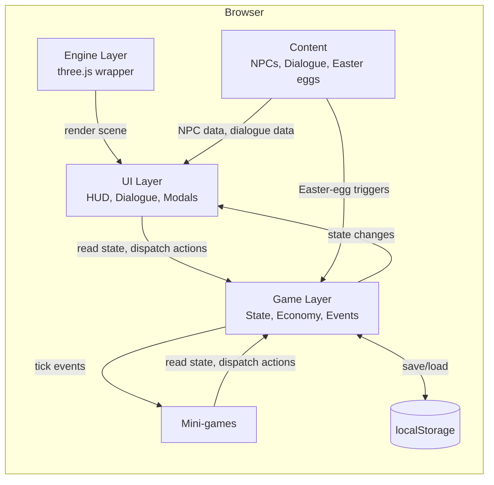
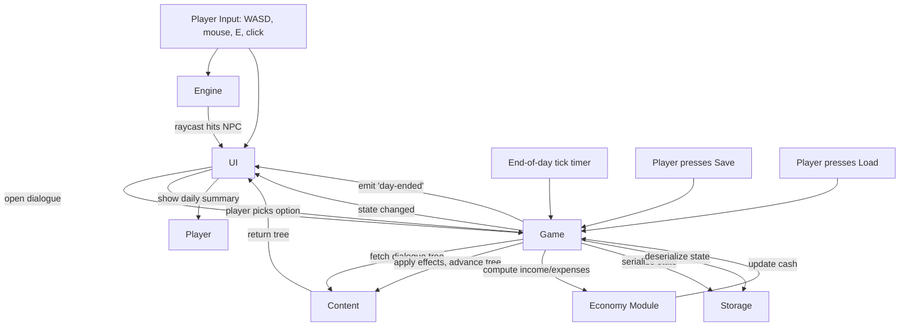
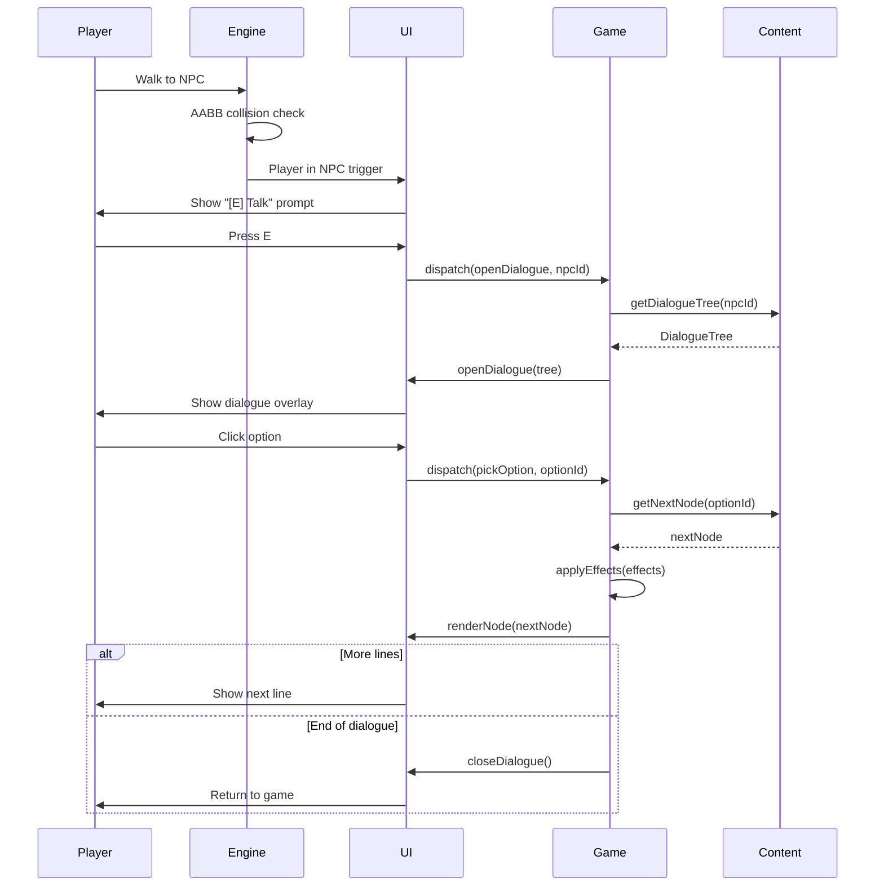
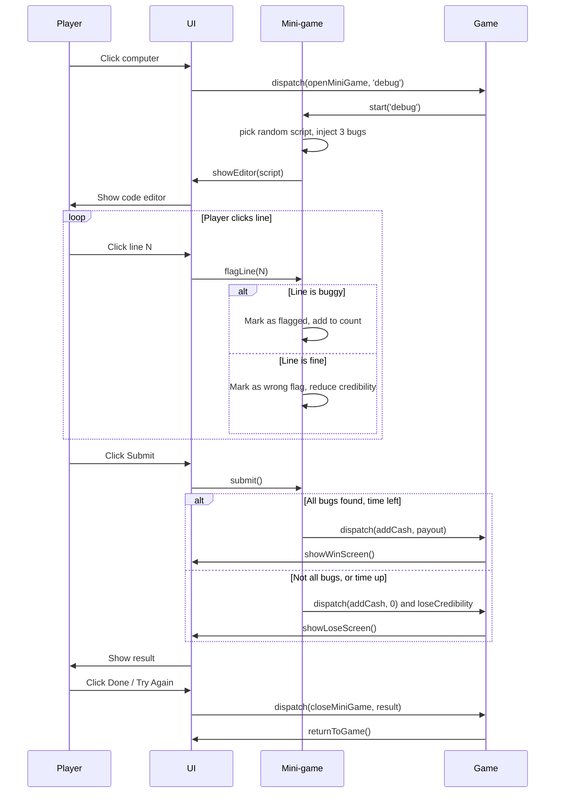

# ADR-000: AI Trainer Simulator — Main Architecture

**Date:** 2026-08-29
**Status:** Accepted
**PRD:** `docs/PRD.md`

---

## 1. Overview

This ADR captures the technical decisions for the AI Trainer Simulator MVP. It is intentionally narrow: one location, one mini-game, one dialogue, the full economic loop, full comedy / Easter-egg density. The goal is a public-facing, browser-based, retro pixel-art game that Lucas can iterate on for months.

The user (Lucas) explicitly asked for the orchestrator to consult subagents and CLI agents instead of asking him clarifying questions. Two delegates were consulted for this ADR:
- **agy** (Gemini Flash) — engine research (three.js vs Babylon.js). Report: `.agent-briefs/agy-research-report.md`.
- **GLM 5.3** (opencode) — comedy / naming / NPC brainstorm. Report: `.agent-briefs/glm-comedy-report.md` (in flight; see section 12 for fallback if it does not return).

The orchestrator (Opus 5 / Claude) overrides agy's engine recommendation; reasoning in section 8.

---

## 2. Context7 Library References

These handles are for the implementing agent (and any future agents) to use with `npx ctx7@latest` to fetch current docs. Do not re-resolve.

| Library | Context7 Handle | Used for |
|---|---|---|
| three.js | `/mrdoob/three.js` | 3D rendering, WebGL renderer, cameras, controls |
| Vite | `/vitejs/vite` | Dev server, HMR, production build |
| TypeScript | `/microsoft/typescript` | Type checking |

(Libraries may be added in later iterations: `cannon-es` or `rapier3d` if/when physics is needed, but the MVP needs neither.)

---

## 3. System Architecture

### Pattern
Single-page browser app, fully client-side, no server, no API, no database. All state lives in `localStorage`. The game is a single static build that can be hosted on any static file host (Coolify, Vercel, GitHub Pages, S3).

### Repository structure
```
ai-trainer-simulator/
├── docs/
│   ├── PRD.md
│   └── ADR/
│       └── 000-main-architecture.md
├── src/
│   ├── main.ts                  # Vite entry, scene init, game loop
│   ├── engine/
│   │   ├── renderer.ts          # three.js renderer, render target, pixel-art upscale
│   │   ├── scene.ts             # office scene, lighting, camera
│   │   ├── controls.ts          # WASD + mouse orbit + camera clamp
│   │   └── collision.ts         # AABB collision with walls / furniture / NPCs
│   ├── content/
│   │   ├── npcs.ts              # NPC definitions, dialogue trees
│   │   ├── dialogues.ts         # all dialogue lines + response options
│   │   ├── eastereggs.ts        # one-time gags, hidden interactions
│   │   └── daily-memes.ts       # "Daily Meme" line pool
│   ├── game/
│   │   ├── state.ts             # global game state, save/load to localStorage
│   │   ├── economy.ts           # income, expenses, daily tick
│   │   ├── career.ts            # specialization, traits, stats
│   │   └── events.ts            # event bus for in-game events
│   ├── ui/
│   │   ├── hud.ts               # cash counter, day counter, prompt
│   │   ├── dialogue.ts          # dialogue overlay
│   │   ├── character-create.ts  # character creation modal
│   │   ├── daily-summary.ts     # end-of-day modal
│   │   └── game-over.ts         # game over screen
│   ├── minigames/
│   │   └── debug-script.ts      # "Debug the Script" mini-game
│   ├── assets/
│   │   ├── textures/            # hand-authored pixel-art PNGs
│   │   ├── sprites/             # NPC portraits, UI icons
│   │   └── data/                # any non-code data (e.g. randomized scripts for the mini-game)
│   ├── style.css                # global styles, pixel font
│   └── types.ts                 # shared types
├── public/
│   └── index.html               # Vite root, mounts the canvas + UI
├── tests/
│   ├── unit/                    # state, economy, dialogue engine (vitest)
│   └── e2e/                     # Playwright smoke tests
├── .agent-briefs/               # historical briefs for delegates (not shipped)
├── package.json
├── tsconfig.json
├── vite.config.ts
└── README.md
```

### Technology stack

| Layer | Technology | Reason |
|---|---|---|
| 3D rendering | three.js | Pixel-art post-processing examples are abundant; ~150-200KB bundle; orchestrator (Opus) is comfortable writing a WASD controller. |
| Dev server / build | Vite | Sub-second HMR; TypeScript out of the box; small config. |
| Language | TypeScript | Type safety for game state and content; the project's other repos use it. |
| State / save | `localStorage` + plain TS class | No DB needed; saves are small JSON. |
| Tests | Vitest (unit) + Playwright (e2e) | Vitest is fast and Vite-native; Playwright is already approved for this project (Chrome via system binary). |
| Asset format | PNG (textures/sprites) + procedural geometry | Hand-authored or procedurally generated; no third-party 3D models. |
| Hosting | Static file host | The MVP is a single static build. Any static host works. |

---

## 4. Module Structure & Dependencies

Direction: `engine` and `ui` depend on `game` (state). `content` depends on `types` only. `minigames` depends on `game` (read/write state) and `ui` (open panel). Nothing depends on `main` except `main` itself.

- `main.ts` bootstraps everything in order: state load → renderer init → scene build → content injection → UI mount → first frame.
- `engine/` is a thin wrapper around three.js. It exposes `init(canvas)`, `scene`, `camera`, `update(dt)`, `render()`. It does not know about game state.
- `game/` is the single source of truth for player cash, day counter, NPC relationship scores, etc. UI and minigames read/write through it.
- `ui/` and `minigames/` are event-driven: they listen to game events and dispatch state-mutating actions.
- `content/` is pure data: NPC definitions, dialogue trees, Easter-egg definitions. Authored as TS modules, no JSON required for MVP.

No circular dependencies. `types.ts` is the leaf module.

---

## 5. Data Models

### GameState
- `cash: number` (zł, integer; 0 to ~1,000,000)
- `day: number` (integer; starts at 1)
- `timeOfDay: 'morning' | 'afternoon' | 'evening'`
- `character: { name: string; specialization: SpecializationId; trait: TraitId; }`
- `stats: { credibility: number; caffeine: number; patience: number; focus: number; }` (0-100 each)
- `npcRelationships: Record<NpcId, number>` (0-100 each)
- `flags: Record<string, boolean>` (one-time event flags for Easter eggs and dialogue gates)
- `inventory: Item[]` (small array, mostly empty for MVP)
- `saveVersion: number` (1 for MVP)

### NPC
- `id: NpcId`
- `name: string`
- `role: string` (e.g. "Senior Consultant")
- `portrait: string` (path to PNG)
- `position: { x: number; y: number; z: number }`
- `triggerRadius: number` (usually 1.5 units)
- `dialogue: DialogueTree`

### DialogueTree
- `greeting: DialogueNode` (entry point)
- `DialogueNode = { id: string; text: string; portrait?: string; options: DialogueOption[]; next?: string; }`
- `DialogueOption = { text: string; nextNodeId: string; effects?: Effect[]; }`
- `Effect = { type: 'cash' | 'stat' | 'relationship' | 'flag'; target: string; delta: number; }`

### EasterEgg
- `id: string`
- `kind: 'poster' | 'object' | 'console-log' | 'hidden-room' | 'easter-dialogue'`
- `position?: { x: number; y: number; z: number }` (for spatial ones)
- `trigger: 'walk-into' | 'click' | 'flag' | 'console'`
- `gag: string` (the joke content: text, animation, or console log)

### MiniGame
- `id: string`
- `name: string`
- `reward: { min: number; max: number }` (cash)
- `payoutOnLose: number` (cash, often 0; sometimes negative for a "refund")
- `onOpen: () => void`
- `onClose: () => void`

Persistence: `GameState` is JSON-serializable. Saved to `localStorage` under `aitrainer:save:v1`. The save key includes the version so future format changes can coexist.

---

## 6. API / Interface Contracts

No HTTP API. The "contracts" are TypeScript interfaces between modules:

- `Engine.init(canvas: HTMLCanvasElement): { scene, camera, renderer, update, render }`
- `GameState.get(): Readonly<GameState>`
- `GameState.dispatch(action: Action): void` (state mutation goes through one chokepoint)
- `UI.openDialogue(npc: NPC, tree: DialogueTree): void`
- `UI.closeDialogue(): void`
- `UI.openMinigame(minigame: MiniGame): void`
- `UI.closeMinigame(result: 'win' | 'lose' | 'abandon'): void`
- `UI.toast(message: string, type: 'info' | 'success' | 'warning' | 'error'): void`
- `Events.on(event: GameEvent, handler: (payload) => void): () => void` (returns unsubscribe)

Errors: every `UI.open*` call is idempotent (if already open, it replaces the previous). Every event handler must be try/catch-wrapped at the dispatcher level so one bad handler does not crash the game.

---

## 7. Environment Variables

None. The MVP is fully client-side. If a future iteration needs an API key (e.g. for an LLM-driven NPC), it will go in `localStorage` (with explicit user opt-in) or in a build-time env var consumed by Vite.

---

## 8. Technical Decisions

### D-01: three.js over Babylon.js (orchestrator override of agy research)
**Status:** Accepted
**Date:** 2026-08-29
**Context:** Two viable engines for a 3D browser game: three.js (~150-200KB, popular, large ecosystem) and Babylon.js (~500KB-1.5MB, integrated physics and collisions, Microsoft-backed). agy recommended Babylon.js for built-in WASD + collision and stronger backward-compatibility. Three.js is the default for browser 3D.
**Decision:** Use three.js. Override agy.
**Reasoning:**
- Bundle size matters for the AC-G-01 "<3s load" acceptance criterion on slow connections.
- The "bit-rot" risk agy cited for three.js is overstated: the core API has been stable for years; r-number bumps are mostly additive.
- three.js has more pixel-art post-processing examples online (RenderPixelatedPass, postprocessing demos, retro shaders), which is exactly the look this game wants.
- Writing a WASD controller + AABB collision is ~100 lines of code, not a 5-minute task. The orchestrator is comfortable doing it once.
- Pixel-art post-processing is more directly idiomatic in three.js (`THREE.WebGLRenderTarget` with NearestFilter, full-screen quad, done).

**Rejected alternatives:**
- **Babylon.js**: heavier bundle, less idiomatic for pixel-art retro aesthetic, smaller community of pixel-art examples. The "built-in collisions" advantage is real but small for this game scope.
- **Phaser / PixiJS**: 2D engines, not 3D. Wrong tool.
- **Raw WebGL**: would require re-implementing scene graph, materials, post-processing. Insane for the project scope.

**Consequences:**
- (+) Tiny bundle, fast load, public demo runs anywhere.
- (+) Familiar territory for the orchestrator and any future three.js-experienced contributor.
- (-) Need to write a custom WASD controller + AABB collision (one-time, ~100 lines).
- (-) No built-in physics; future games that need physics (rigid body, ragdoll) will need to add cannon-es or rapier3d.
**Review trigger:** If the project grows to a second location with a complex camera, or a third mini-game that needs physics, revisit whether a unified engine would be cheaper.

### D-02: Vite for dev server and build
**Status:** Accepted
**Date:** 2026-08-29
**Context:** Need a dev server with HMR, TypeScript out of the box, and a production build that outputs static files.
**Decision:** Vite.
**Reasoning:** Sub-second HMR, zero-config TS, fast cold start, easy production build, well-supported on the WSL2 box (already used in edukey-payload, DevPowers).
**Rejected alternatives:**
- **esbuild standalone**: requires more config for dev server.
- **webpack**: heavier, slower, more config.
- **Parcel**: less idiomatic, smaller community.
**Consequences:**
- (+) Fast iteration, easy CI, static output.
- (-) None for this project.
**Review trigger:** None. Vite is a safe default.

### D-03: localStorage for save
**Status:** Accepted
**Date:** 2026-08-29
**Context:** Game is single-player, browser-only, no account. Save is a few KB of JSON. Need a simple, persistent, no-backend solution.
**Decision:** `localStorage` under key `aitrainer:save:v1`.
**Reasoning:** Simplest possible. Browser-native. ~5MB quota is plenty.
**Rejected alternatives:**
- **IndexedDB**: overkill for <50KB saves; async API is more complex.
- **File download/upload**: requires user intervention; bad UX.
- **Backend + cloud save**: requires auth, server, costs. Out of scope.
**Consequences:**
- (+) Zero infrastructure.
- (-) Save is per-browser; clearing site data wipes it. (Documented in README.)
**Review trigger:** If save size grows past 1MB, switch to IndexedDB.

### D-04: Pixel-art via low-res WebGLRenderTarget + nearest-neighbor upscale
**Status:** Accepted
**Date:** 2026-08-29
**Context:** The visual target is "PS1/N64 era, very detailed, late 90s pixel-art." Need a technique to render a 3D scene to a small buffer, then upscale to the display canvas with hard pixel edges.
**Decision:** Render the scene to a `THREE.WebGLRenderTarget` of 640x360 (16:9) with `NearestFilter` for both min and mag. Then draw that render target to the display canvas via a full-screen quad with a `THREE.MeshBasicMaterial` that uses the render target's texture. The display canvas is sized to fill the browser window.
**Reasoning:** Standard three.js pixel-art pattern, well-documented, ~3 lines of code, no custom shaders required.
**Rejected alternatives:**
- **Render at native resolution, post-process with a pixelation shader**: gives a different look (more "smooth + post-pixelated") than the "rendered low-res" look the user wants.
- **CSS `image-rendering: pixelated` on a small canvas**: works but creates scaling artifacts and limits the canvas size; not as crisp.
**Consequences:**
- (+) Crisp PS1/PS2 look. 640x360 is small enough to be a perf win on weak GPUs.
- (-) At very high display resolutions, individual "pixels" get large (4-6x scale). For a 1920x1080 display the upscale is 3x. May want to expose the render-target size as a user setting.
**Review trigger:** If the user complains about pixel size on 4K monitors, expose a "render resolution" setting.

### D-05: Hand-authored pixel art + procedural geometry
**Status:** Accepted
**Date:** 2026-08-29
**Context:** The user wants "very detailed" models. Realistic 3D models would take weeks per asset. Pixel-art textures on simple geometry (boxes, cylinders) can give a "detailed and pleasant" PS1 look in days.
**Decision:** All 3D models are composed of three.js primitives (BoxGeometry, CylinderGeometry, etc.) textured with hand-authored pixel-art PNGs (128x128 or 256x256 per asset). NPCs are low-poly humanoid rigs (3-5 boxes for body, head, hat; maybe a chair for the "sitting" NPCs). The art style is "PS1 with personality" — flat colors, no specular highlights, no normal maps.
**Reasoning:** PS1-era games used this exact technique (low-poly models with pre-baked textures). It is achievable in a few weeks of art work for a single location.
**Rejected alternatives:**
- **Realistic 3D models with normal maps**: looks great but takes 5-10x longer per asset; not in scope.
- **Pure 2D pixel art (no 3D)**: would lose the "3D walk-around" feel the user wants.
- **Third-party GLB model packs**: licensing risk, style mismatch.
**Consequences:**
- (+) Authentic PS1 look. Fast art pipeline. No licensing risk.
- (-) Models will not move smoothly (no skeletal animation for MVP; NPCs are static or do simple sine-wave idle motion).
**Review trigger:** If a future iteration wants animated NPCs, the geometry has to be re-modelled for skeletal rigs.

### D-06: Pre-written dialogue, no LLM-driven NPCs
**Status:** Accepted
**Date:** 2026-08-29
**Context:** The game is heavily dialogue-driven. Two paths: (a) hand-write every line, (b) use an LLM to improvise. Hand-writing is more controllable, more "in voice", and has zero API cost; LLM is more dynamic but unpredictable and requires backend.
**Decision:** Hand-write every dialogue line. No LLM.
**Reasoning:** Comedy only works if the punchlines are crafted. LLMs will not deliver the precise IT-Crowd timing we want. Also: no API = no backend = simpler deploy.
**Rejected alternatives:**
- **LLM-driven NPC dialogue**: more dynamic but unpredictable tone, costs money, requires backend.
- **Hybrid: hand-write templates + LLM fills in**: complex, slow, may not work.
**Consequences:**
- (+) Perfectly tuned comedy. Zero recurring cost.
- (-) Lines are fixed; playthroughs feel the same after a few plays. (Mitigation: a LOT of lines, randomized daily memes, Easter eggs gated on flags so second playthroughs differ.)
**Review trigger:** If Lucas wants infinite replayability, revisit a local-LLM approach (e.g. a small model via WebLLM, no backend).

### D-07: Manual save (no auto-save)
**Status:** Accepted
**Date:** 2026-08-29
**Context:** Save/load is a complexity sink. Auto-save can lose progress mid-action; manual save is honest.
**Decision:** Save is manual. Player presses a save button in the menu. The MVP ships with a single save slot.
**Reasoning:** Manual save is honest, predictable, and easy to implement. Auto-save can be added later.
**Rejected alternatives:**
- **Auto-save every minute**: risk of saving during a bad state (mid-dialogue, mid-mini-game).
- **Auto-save on every action**: too frequent; wastes localStorage writes; can confuse the player.
**Consequences:**
- (+) Simple. Honest. Predictable.
- (-) Player can lose progress if they forget to save.
**Review trigger:** If playtesters complain about lost progress, add an "auto-save at end of day" mechanism.

---

## 9. Diagrams

### 9.1 Architecture / Component Diagram



### 9.2 Data Flow Diagram



### 9.3 Sequence Diagram: Talk to NPC



### 9.4 Sequence Diagram: Debug the Script Mini-game



---

## 10. Testing Strategy

### Philosophy
The game is small enough that 100% unit coverage of game logic is achievable and worth it. UI and 3D rendering get smoke tests via Playwright. Comedy is tested by Lucas reading every line and rejecting what isn't funny.

### Test layers

| Layer | Type | Scope | Tools |
|---|---|---|---|
| Unit | State, economy, dialogue tree traversal, mini-game bug generation, save/load | Vitest |
| Integration | Module interactions: state + economy tick, state + dialogue | Vitest |
| E2E | Smoke: page loads, character creation works, walk works, dialogue opens, mini-game opens, save/load round-trips | Playwright |
| Manual | Comedy review | Lucas |

### Key test scenarios

| Scenario | Type | Input | Expected output | Edge cases |
|---|---|---|---|---|
| Save then load | Unit | Save state, load | Restored state matches | Empty state, malformed save (v0) |
| End-of-day tick | Unit | Day counter, cash, expenses | Cash = cash - expenses; day++ | Cash goes negative |
| Mini-game: all bugs found in time | Unit | Click correct lines within time | `result: 'win'`, payout applied | Player clicks faster than time decay |
| Mini-game: wrong click | Unit | Click a non-buggy line | Credibility -10, no win | Multiple wrong clicks |
| Mini-game: timer expires | Unit | Time hits 0 with bugs unflagged | `result: 'lose'` | No clicks at all |
| Dialogue: option with cash effect | Unit | Pick option with `{ type: 'cash', delta: 100 }` | Cash +100, next node loaded | Effect with negative delta |
| Bankruptcy | Unit | Cash < 0 for 30 in-game days | Game over triggered | Cash recovery mid-countdown |
| Page load | E2E | Visit / | Title screen renders, no console errors | Slow network, no JS |

### Technical acceptance criteria

- TAC-01: `pnpm test` exits 0 with at least 80% line coverage on `game/`, `engine/`, `minigames/`.
- TAC-02: `pnpm test:e2e` (Playwright) completes the smoke flow in under 30 seconds.
- TAC-03: `pnpm build` outputs a static bundle under 500KB gzipped.
- TAC-04: Game loads in under 3 seconds on a mid-range laptop in Chrome (measured via Playwright `page.goto` + `page.waitForSelector('#game-canvas')`).
- TAC-05: No `console.error` calls during a 60-second playthrough (Playwright assertion).
- TAC-06: The 3D scene renders at a stable 30+ FPS on integrated graphics (Playwright `page.metrics()` or browser perf API).

---

## 12. Further Notes

### GLM brainstorm (in flight at time of ADR)
The GLM 5.3 comedy brainstorm was launched in parallel with this ADR. If it returns useful titles, NPC names, mini-game ideas, or Easter-egg ideas, those will be incorporated into `content/` directly. If it does not return or returns junk, fallback is: Lucas picks the title, NPCs are named by Lucas, mini-games come from Lucas's own ideas. (No blocking dependency on GLM for the architecture.)

### Future ADRs (if scope expands)
- `001-ai-driven-npc.md` (when an LLM NPC is added)
- `002-multiplayer.md` (if a co-op mode is ever added)
- `003-second-location.md` (when a second location is added)

### Source for the game name
Working title is "AI Trainer Simulator". The real name will come from the GLM brainstorm (see `content/manifest.ts` for the authoritative current name).
