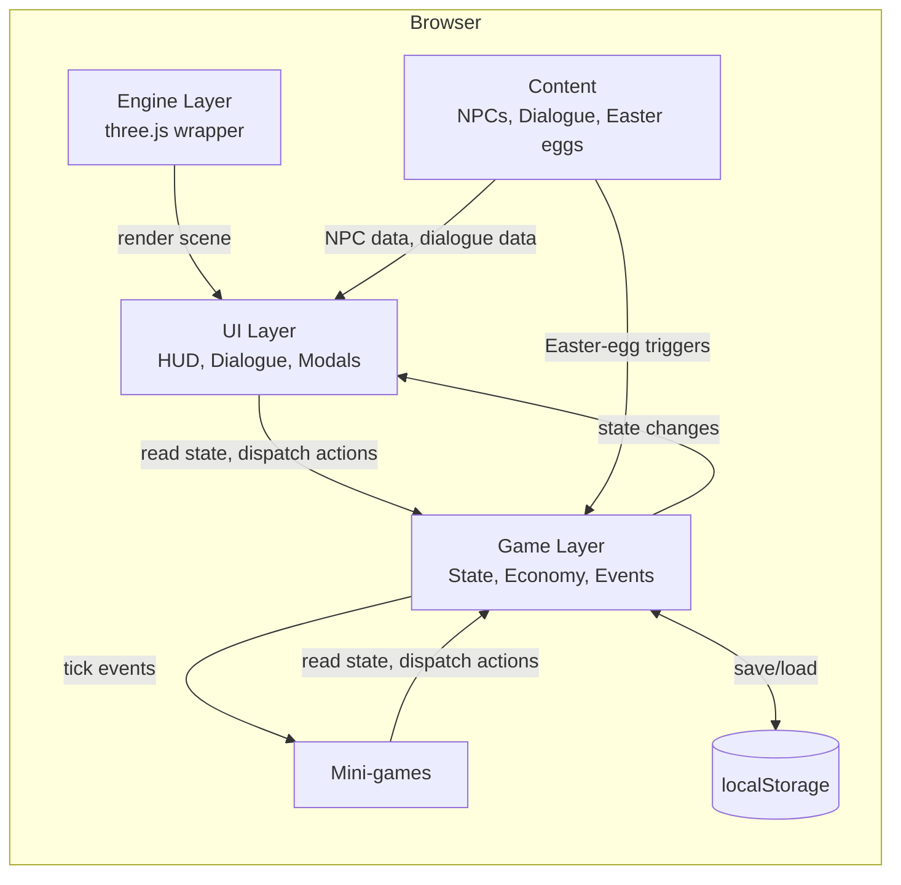
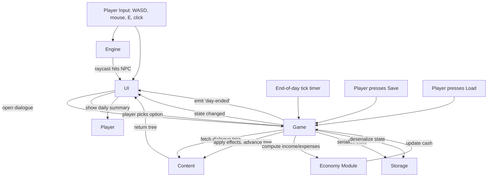
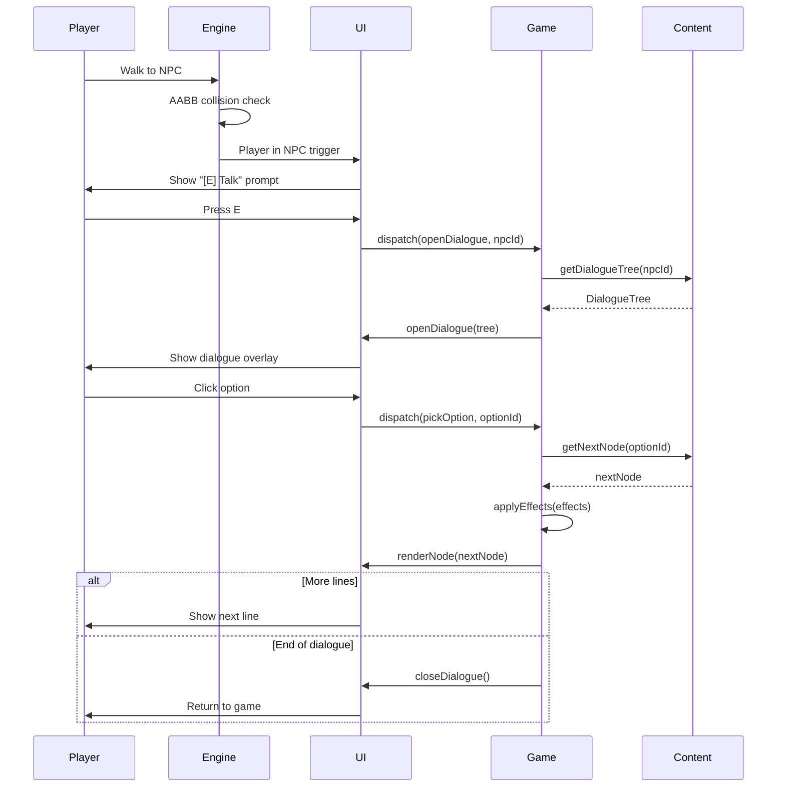
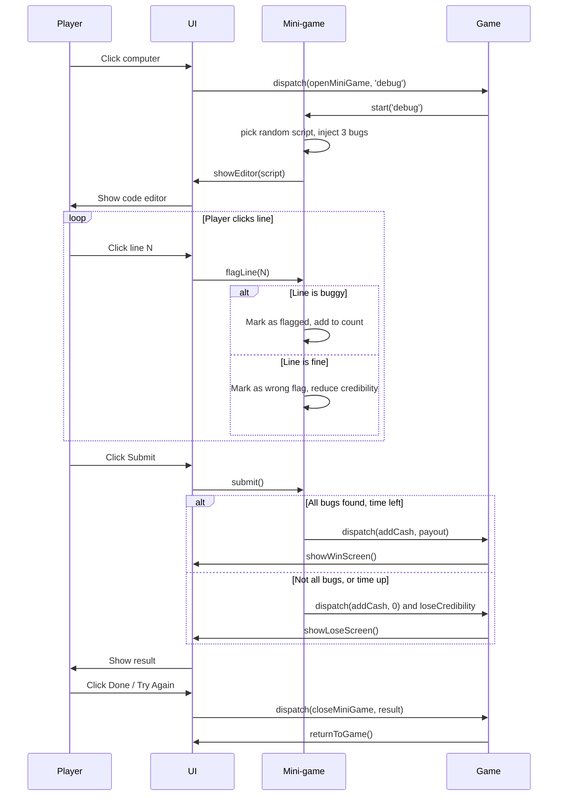

# ADR-000: AI Trainer Simulator — Main Architecture

**Date:** 2026-08-29
**Status:** Accepted
**PRD:** `docs/PRD.md`

---

## 1. Overview

This ADR captures the technical decisions for the AI Trainer Simulator MVP. It is intentionally narrow: one location, one mini-game, one dialogue, the full economic loop, full comedy / Easter-egg density. The goal is a public-facing, browser-based, retro pixel-art game that Lucas can iterate on for months.

The user (Lucas) explicitly asked for the orchestrator to consult subagents and CLI agents instead of asking him clarifying questions. Two delegates were consulted for this ADR:
- **agy** (Gemini Flash) — engine research (three.js vs Babylon.js). Report: `.agent-briefs/agy-research-report.md`.
- **GLM 5.3** (opencode) — comedy / naming / NPC brainstorm. Report: `.agent-briefs/glm-comedy-report.md` (in flight; see section 12 for fallback if it does not return).

The orchestrator (Opus 5 / Claude) overrides agy's engine recommendation; reasoning in section 8.

---

## 2. Context7 Library References

These handles are for the implementing agent (and any future agents) to use with `npx ctx7@latest` to fetch current docs. Do not re-resolve.

| Library | Context7 Handle | Used for |
|---|---|---|
| three.js | `/mrdoob/three.js` | 3D rendering, WebGL renderer, cameras, controls |
| Vite | `/vitejs/vite` | Dev server, HMR, production build |
| TypeScript | `/microsoft/typescript` | Type checking |

(Libraries may be added in later iterations: `cannon-es` or `rapier3d` if/when physics is needed, but the MVP needs neither.)

---

## 3. System Architecture

### Pattern
Single-page browser app, fully client-side, no server, no API, no database. All state lives in `localStorage`. The game is a single static build that can be hosted on any static file host (Coolify, Vercel, GitHub Pages, S3).

### Repository structure
```
ai-trainer-simulator/
├── docs/
│   ├── PRD.md
│   └── ADR/
│       └── 000-main-architecture.md
├── src/
│   ├── main.ts                  # Vite entry, scene init, game loop
│   ├── engine/
│   │   ├── renderer.ts          # three.js renderer, render target, pixel-art upscale
│   │   ├── scene.ts             # office scene, lighting, camera
│   │   ├── controls.ts          # WASD + mouse orbit + camera clamp
│   │   └── collision.ts         # AABB collision with walls / furniture / NPCs
│   ├── content/
│   │   ├── npcs.ts              # NPC definitions, dialogue trees
│   │   ├── dialogues.ts         # all dialogue lines + response options
│   │   ├── eastereggs.ts        # one-time gags, hidden interactions
│   │   └── daily-memes.ts       # "Daily Meme" line pool
│   ├── game/
│   │   ├── state.ts             # global game state, save/load to localStorage
│   │   ├── economy.ts           # income, expenses, daily tick
│   │   ├── career.ts            # specialization, traits, stats
│   │   └── events.ts            # event bus for in-game events
│   ├── ui/
│   │   ├── hud.ts               # cash counter, day counter, prompt
│   │   ├── dialogue.ts          # dialogue overlay
│   │   ├── character-create.ts  # character creation modal
│   │   ├── daily-summary.ts     # end-of-day modal
│   │   └── game-over.ts         # game over screen
│   ├── minigames/
│   │   └── debug-script.ts      # "Debug the Script" mini-game
│   ├── assets/
│   │   ├── textures/            # hand-authored pixel-art PNGs
│   │   ├── sprites/             # NPC portraits, UI icons
│   │   └── data/                # any non-code data (e.g. randomized scripts for the mini-game)
│   ├── style.css                # global styles, pixel font
│   └── types.ts                 # shared types
├── public/
│   └── index.html               # Vite root, mounts the canvas + UI
├── tests/
│   ├── unit/                    # state, economy, dialogue engine (vitest)
│   └── e2e/                     # Playwright smoke tests
├── .agent-briefs/               # historical briefs for delegates (not shipped)
├── package.json
├── tsconfig.json
├── vite.config.ts
└── README.md
```

### Technology stack

| Layer | Technology | Reason |
|---|---|---|
| 3D rendering | three.js | Pixel-art post-processing examples are abundant; ~150-200KB bundle; orchestrator (Opus) is comfortable writing a WASD controller. |
| Dev server / build | Vite | Sub-second HMR; TypeScript out of the box; small config. |
| Language | TypeScript | Type safety for game state and content; the project's other repos use it. |
| State / save | `localStorage` + plain TS class | No DB needed; saves are small JSON. |
| Tests | Vitest (unit) + Playwright (e2e) | Vitest is fast and Vite-native; Playwright is already approved for this project (Chrome via system binary). |
| Asset format | PNG (textures/sprites) + procedural geometry | Hand-authored or procedurally generated; no third-party 3D models. |
| Hosting | Static file host | The MVP is a single static build. Any static host works. |

---

## 4. Module Structure & Dependencies

Direction: `engine` and `ui` depend on `game` (state). `content` depends on `types` only. `minigames` depends on `game` (read/write state) and `ui` (open panel). Nothing depends on `main` except `main` itself.

- `main.ts` bootstraps everything in order: state load → renderer init → scene build → content injection → UI mount → first frame.
- `engine/` is a thin wrapper around three.js. It exposes `init(canvas)`, `scene`, `camera`, `update(dt)`, `render()`. It does not know about game state.
- `game/` is the single source of truth for player cash, day counter, NPC relationship scores, etc. UI and minigames read/write through it.
- `ui/` and `minigames/` are event-driven: they listen to game events and dispatch state-mutating actions.
- `content/` is pure data: NPC definitions, dialogue trees, Easter-egg definitions. Authored as TS modules, no JSON required for MVP.

No circular dependencies. `types.ts` is the leaf module.

---

## 5. Data Models

### GameState
- `cash: number` (zł, integer; 0 to ~1,000,000)
- `day: number` (integer; starts at 1)
- `timeOfDay: 'morning' | 'afternoon' | 'evening'`
- `character: { name: string; specialization: SpecializationId; trait: TraitId; }`
- `stats: { credibility: number; caffeine: number; patience: number; focus: number; }` (0-100 each)
- `npcRelationships: Record<NpcId, number>` (0-100 each)
- `flags: Record<string, boolean>` (one-time event flags for Easter eggs and dialogue gates)
- `inventory: Item[]` (small array, mostly empty for MVP)
- `saveVersion: number` (1 for MVP)

### NPC
- `id: NpcId`
- `name: string`
- `role: string` (e.g. "Senior Consultant")
- `portrait: string` (path to PNG)
- `position: { x: number; y: number; z: number }`
- `triggerRadius: number` (usually 1.5 units)
- `dialogue: DialogueTree`

### DialogueTree
- `greeting: DialogueNode` (entry point)
- `DialogueNode = { id: string; text: string; portrait?: string; options: DialogueOption[]; next?: string; }`
- `DialogueOption = { text: string; nextNodeId: string; effects?: Effect[]; }`
- `Effect = { type: 'cash' | 'stat' | 'relationship' | 'flag'; target: string; delta: number; }`

### EasterEgg
- `id: string`
- `kind: 'poster' | 'object' | 'console-log' | 'hidden-room' | 'easter-dialogue'`
- `position?: { x: number; y: number; z: number }` (for spatial ones)
- `trigger: 'walk-into' | 'click' | 'flag' | 'console'`
- `gag: string` (the joke content: text, animation, or console log)

### MiniGame
- `id: string`
- `name: string`
- `reward: { min: number; max: number }` (cash)
- `payoutOnLose: number` (cash, often 0; sometimes negative for a "refund")
- `onOpen: () => void`
- `onClose: () => void`

Persistence: `GameState` is JSON-serializable. Saved to `localStorage` under `aitrainer:save:v1`. The save key includes the version so future format changes can coexist.

---

## 6. API / Interface Contracts

No HTTP API. The "contracts" are TypeScript interfaces between modules:

- `Engine.init(canvas: HTMLCanvasElement): { scene, camera, renderer, update, render }`
- `GameState.get(): Readonly<GameState>`
- `GameState.dispatch(action: Action): void` (state mutation goes through one chokepoint)
- `UI.openDialogue(npc: NPC, tree: DialogueTree): void`
- `UI.closeDialogue(): void`
- `UI.openMinigame(minigame: MiniGame): void`
- `UI.closeMinigame(result: 'win' | 'lose' | 'abandon'): void`
- `UI.toast(message: string, type: 'info' | 'success' | 'warning' | 'error'): void`
- `Events.on(event: GameEvent, handler: (payload) => void): () => void` (returns unsubscribe)

Errors: every `UI.open*` call is idempotent (if already open, it replaces the previous). Every event handler must be try/catch-wrapped at the dispatcher level so one bad handler does not crash the game.

---

## 7. Environment Variables

None. The MVP is fully client-side. If a future iteration needs an API key (e.g. for an LLM-driven NPC), it will go in `localStorage` (with explicit user opt-in) or in a build-time env var consumed by Vite.

---

## 8. Technical Decisions

### D-01: three.js over Babylon.js (orchestrator override of agy research)
**Status:** Accepted
**Date:** 2026-08-29
**Context:** Two viable engines for a 3D browser game: three.js (~150-200KB, popular, large ecosystem) and Babylon.js (~500KB-1.5MB, integrated physics and collisions, Microsoft-backed). agy recommended Babylon.js for built-in WASD + collision and stronger backward-compatibility. Three.js is the default for browser 3D.
**Decision:** Use three.js. Override agy.
**Reasoning:**
- Bundle size matters for the AC-G-01 "<3s load" acceptance criterion on slow connections.
- The "bit-rot" risk agy cited for three.js is overstated: the core API has been stable for years; r-number bumps are mostly additive.
- three.js has more pixel-art post-processing examples online (RenderPixelatedPass, postprocessing demos, retro shaders), which is exactly the look this game wants.
- Writing a WASD controller + AABB collision is ~100 lines of code, not a 5-minute task. The orchestrator is comfortable doing it once.
- Pixel-art post-processing is more directly idiomatic in three.js (`THREE.WebGLRenderTarget` with NearestFilter, full-screen quad, done).

**Rejected alternatives:**
- **Babylon.js**: heavier bundle, less idiomatic for pixel-art retro aesthetic, smaller community of pixel-art examples. The "built-in collisions" advantage is real but small for this game scope.
- **Phaser / PixiJS**: 2D engines, not 3D. Wrong tool.
- **Raw WebGL**: would require re-implementing scene graph, materials, post-processing. Insane for the project scope.

**Consequences:**
- (+) Tiny bundle, fast load, public demo runs anywhere.
- (+) Familiar territory for the orchestrator and any future three.js-experienced contributor.
- (-) Need to write a custom WASD controller + AABB collision (one-time, ~100 lines).
- (-) No built-in physics; future games that need physics (rigid body, ragdoll) will need to add cannon-es or rapier3d.
**Review trigger:** If the project grows to a second location with a complex camera, or a third mini-game that needs physics, revisit whether a unified engine would be cheaper.

### D-02: Vite for dev server and build
**Status:** Accepted
**Date:** 2026-08-29
**Context:** Need a dev server with HMR, TypeScript out of the box, and a production build that outputs static files.
**Decision:** Vite.
**Reasoning:** Sub-second HMR, zero-config TS, fast cold start, easy production build, well-supported on the WSL2 box (already used in edukey-payload, DevPowers).
**Rejected alternatives:**
- **esbuild standalone**: requires more config for dev server.
- **webpack**: heavier, slower, more config.
- **Parcel**: less idiomatic, smaller community.
**Consequences:**
- (+) Fast iteration, easy CI, static output.
- (-) None for this project.
**Review trigger:** None. Vite is a safe default.

### D-03: localStorage for save
**Status:** Accepted
**Date:** 2026-08-29
**Context:** Game is single-player, browser-only, no account. Save is a few KB of JSON. Need a simple, persistent, no-backend solution.
**Decision:** `localStorage` under key `aitrainer:save:v1`.
**Reasoning:** Simplest possible. Browser-native. ~5MB quota is plenty.
**Rejected alternatives:**
- **IndexedDB**: overkill for <50KB saves; async API is more complex.
- **File download/upload**: requires user intervention; bad UX.
- **Backend + cloud save**: requires auth, server, costs. Out of scope.
**Consequences:**
- (+) Zero infrastructure.
- (-) Save is per-browser; clearing site data wipes it. (Documented in README.)
**Review trigger:** If save size grows past 1MB, switch to IndexedDB.

### D-04: Pixel-art via low-res WebGLRenderTarget + nearest-neighbor upscale
**Status:** Accepted
**Date:** 2026-08-29
**Context:** The visual target is "PS1/N64 era, very detailed, late 90s pixel-art." Need a technique to render a 3D scene to a small buffer, then upscale to the display canvas with hard pixel edges.
**Decision:** Render the scene to a `THREE.WebGLRenderTarget` of 640x360 (16:9) with `NearestFilter` for both min and mag. Then draw that render target to the display canvas via a full-screen quad with a `THREE.MeshBasicMaterial` that uses the render target's texture. The display canvas is sized to fill the browser window.
**Reasoning:** Standard three.js pixel-art pattern, well-documented, ~3 lines of code, no custom shaders required.
**Rejected alternatives:**
- **Render at native resolution, post-process with a pixelation shader**: gives a different look (more "smooth + post-pixelated") than the "rendered low-res" look the user wants.
- **CSS `image-rendering: pixelated` on a small canvas**: works but creates scaling artifacts and limits the canvas size; not as crisp.
**Consequences:**
- (+) Crisp PS1/PS2 look. 640x360 is small enough to be a perf win on weak GPUs.
- (-) At very high display resolutions, individual "pixels" get large (4-6x scale). For a 1920x1080 display the upscale is 3x. May want to expose the render-target size as a user setting.
**Review trigger:** If the user complains about pixel size on 4K monitors, expose a "render resolution" setting.

### D-05: Hand-authored pixel art + procedural geometry
**Status:** Accepted
**Date:** 2026-08-29
**Context:** The user wants "very detailed" models. Realistic 3D models would take weeks per asset. Pixel-art textures on simple geometry (boxes, cylinders) can give a "detailed and pleasant" PS1 look in days.
**Decision:** All 3D models are composed of three.js primitives (BoxGeometry, CylinderGeometry, etc.) textured with hand-authored pixel-art PNGs (128x128 or 256x256 per asset). NPCs are low-poly humanoid rigs (3-5 boxes for body, head, hat; maybe a chair for the "sitting" NPCs). The art style is "PS1 with personality" — flat colors, no specular highlights, no normal maps.
**Reasoning:** PS1-era games used this exact technique (low-poly models with pre-baked textures). It is achievable in a few weeks of art work for a single location.
**Rejected alternatives:**
- **Realistic 3D models with normal maps**: looks great but takes 5-10x longer per asset; not in scope.
- **Pure 2D pixel art (no 3D)**: would lose the "3D walk-around" feel the user wants.
- **Third-party GLB model packs**: licensing risk, style mismatch.
**Consequences:**
- (+) Authentic PS1 look. Fast art pipeline. No licensing risk.
- (-) Models will not move smoothly (no skeletal animation for MVP; NPCs are static or do simple sine-wave idle motion).
**Review trigger:** If a future iteration wants animated NPCs, the geometry has to be re-modelled for skeletal rigs.

### D-06: Pre-written dialogue, no LLM-driven NPCs
**Status:** Accepted
**Date:** 2026-08-29
**Context:** The game is heavily dialogue-driven. Two paths: (a) hand-write every line, (b) use an LLM to improvise. Hand-writing is more controllable, more "in voice", and has zero API cost; LLM is more dynamic but unpredictable and requires backend.
**Decision:** Hand-write every dialogue line. No LLM.
**Reasoning:** Comedy only works if the punchlines are crafted. LLMs will not deliver the precise IT-Crowd timing we want. Also: no API = no backend = simpler deploy.
**Rejected alternatives:**
- **LLM-driven NPC dialogue**: more dynamic but unpredictable tone, costs money, requires backend.
- **Hybrid: hand-write templates + LLM fills in**: complex, slow, may not work.
**Consequences:**
- (+) Perfectly tuned comedy. Zero recurring cost.
- (-) Lines are fixed; playthroughs feel the same after a few plays. (Mitigation: a LOT of lines, randomized daily memes, Easter eggs gated on flags so second playthroughs differ.)
**Review trigger:** If Lucas wants infinite replayability, revisit a local-LLM approach (e.g. a small model via WebLLM, no backend).

### D-07: Manual save (no auto-save)
**Status:** Accepted
**Date:** 2026-08-29
**Context:** Save/load is a complexity sink. Auto-save can lose progress mid-action; manual save is honest.
**Decision:** Save is manual. Player presses a save button in the menu. The MVP ships with a single save slot.
**Reasoning:** Manual save is honest, predictable, and easy to implement. Auto-save can be added later.
**Rejected alternatives:**
- **Auto-save every minute**: risk of saving during a bad state (mid-dialogue, mid-mini-game).
- **Auto-save on every action**: too frequent; wastes localStorage writes; can confuse the player.
**Consequences:**
- (+) Simple. Honest. Predictable.
- (-) Player can lose progress if they forget to save.
**Review trigger:** If playtesters complain about lost progress, add an "auto-save at end of day" mechanism.

---

## 9. Diagrams

### 9.1 Architecture / Component Diagram



### 9.2 Data Flow Diagram



### 9.3 Sequence Diagram: Talk to NPC



### 9.4 Sequence Diagram: Debug the Script Mini-game



---

## 10. Testing Strategy

### Philosophy
The game is small enough that 100% unit coverage of game logic is achievable and worth it. UI and 3D rendering get smoke tests via Playwright. Comedy is tested by Lucas reading every line and rejecting what isn't funny.

### Test layers

| Layer | Type | Scope | Tools |
|---|---|---|---|
| Unit | State, economy, dialogue tree traversal, mini-game bug generation, save/load | Vitest |
| Integration | Module interactions: state + economy tick, state + dialogue | Vitest |
| E2E | Smoke: page loads, character creation works, walk works, dialogue opens, mini-game opens, save/load round-trips | Playwright |
| Manual | Comedy review | Lucas |

### Key test scenarios

| Scenario | Type | Input | Expected output | Edge cases |
|---|---|---|---|---|
| Save then load | Unit | Save state, load | Restored state matches | Empty state, malformed save (v0) |
| End-of-day tick | Unit | Day counter, cash, expenses | Cash = cash - expenses; day++ | Cash goes negative |
| Mini-game: all bugs found in time | Unit | Click correct lines within time | `result: 'win'`, payout applied | Player clicks faster than time decay |
| Mini-game: wrong click | Unit | Click a non-buggy line | Credibility -10, no win | Multiple wrong clicks |
| Mini-game: timer expires | Unit | Time hits 0 with bugs unflagged | `result: 'lose'` | No clicks at all |
| Dialogue: option with cash effect | Unit | Pick option with `{ type: 'cash', delta: 100 }` | Cash +100, next node loaded | Effect with negative delta |
| Bankruptcy | Unit | Cash < 0 for 30 in-game days | Game over triggered | Cash recovery mid-countdown |
| Page load | E2E | Visit / | Title screen renders, no console errors | Slow network, no JS |

### Technical acceptance criteria

- TAC-01: `pnpm test` exits 0 with at least 80% line coverage on `game/`, `engine/`, `minigames/`.
- TAC-02: `pnpm test:e2e` (Playwright) completes the smoke flow in under 30 seconds.
- TAC-03: `pnpm build` outputs a static bundle under 500KB gzipped.
- TAC-04: Game loads in under 3 seconds on a mid-range laptop in Chrome (measured via Playwright `page.goto` + `page.waitForSelector('#game-canvas')`).
- TAC-05: No `console.error` calls during a 60-second playthrough (Playwright assertion).
- TAC-06: The 3D scene renders at a stable 30+ FPS on integrated graphics (Playwright `page.metrics()` or browser perf API).

---

## 12. Further Notes

### GLM brainstorm (in flight at time of ADR)
The GLM 5.3 comedy brainstorm was launched in parallel with this ADR. If it returns useful titles, NPC names, mini-game ideas, or Easter-egg ideas, those will be incorporated into `content/` directly. If it does not return or returns junk, fallback is: Lucas picks the title, NPCs are named by Lucas, mini-games come from Lucas's own ideas. (No blocking dependency on GLM for the architecture.)

### Future ADRs (if scope expands)
- `001-ai-driven-npc.md` (when an LLM NPC is added)
- `002-multiplayer.md` (if a co-op mode is ever added)
- `003-second-location.md` (when a second location is added)

### Source for the game name
Working title is "AI Trainer Simulator". The real name will come from the GLM brainstorm (see `content/manifest.ts` for the authoritative current name).

---

## 13. Decisions from user corrections (2026-08-29) — cross-references

These decisions came from Lucas during playtesting. They are captured fully in `docs/PRD.md` §13 (Corrections Log). This section is the technical / architectural summary so the implementing agent (or any future agent) knows exactly what each correction means for the codebase. The PRD's C-NN IDs are the canonical references.

### D-08: First-person camera (PRD C-01) — REPLACES the early D-04 framing

- **Decision:** The gameplay camera is first-person. `camera.position = player.position + (0, EYE_HEIGHT, 0)`. The mouse moves `yaw` and `pitch` directly; the camera does not orbit around the player.
- **Was previously:** Over-the-shoulder (CAMERA_BACK_OFFSET = 4.0, CAMERA_UP_OFFSET = 2.2, looking at the player's chest, FOV 42). The early `src/engine/controls.ts` shipped with this setup.
- **Reason:** The user: "Now I see the character and when I move mouse I rotate around the character. I want to simulate that I'm moving the direction of the character and then I can use WSAD to move, with W to move in the direction when mouse is pointing." Plus the over-the-shoulder camera could clip through walls (PRD C-04).
- **Consequences:**
  - `src/engine/controls.ts` is rewritten: the per-frame camera block becomes `camera.position.copy(player.position).y += EYE_HEIGHT; camera.rotation.set(pitch, yaw, 0);`. The over-shoulder back/forward vectors and offsets are removed.
  - The `playerGroup` mesh in `src/engine/scene.ts` is kept (so the avatar exists for cutscenes) but is hidden during FPS play (`visible = false`) and shown in cinematic mode (`visible = true`).
  - `EYE_HEIGHT` = 1.65m (1.7m is too tall for 480x270 — the player's head would clip the ceiling at most desks).
- **Rejected alternatives:** "tank controls" (mouse does not rotate view; arrow keys do) — feels sluggish in a 3D RPG with many rooms. "Both modes toggle" — adds complexity without benefit; the user wants the standard FPS-RPG scheme.

### D-09: Free-mouse default + RMB-hold for mouse-look (PRD C-02)

- **Decision:** Default state is free mouse (OS cursor visible, mouse does NOT rotate the view). Right-mouse-button (RMB) hold engages mouse-look (cursor hidden, mouse moves rotate yaw/pitch). The cursor is also hidden during cutscenes and the intro cinematic.
- **Reason:** The user: "Mouse should be blocked after click on the game area maybe? To let me move without getting out of the screen?" The user's mouse "got out of the screen" because the early controls rotated the view on every mouse move. The research is in PRD §4.2 (C-02): best practice for 3D RPG with economy/simulation is the Deus Ex / Skyrim model — free mouse for UI, RMB-hold for view rotation. The roster panel is the primary way to choose NPCs from a distance; RMB is for looking around while standing.
- **Implementation:**
  - `mousedown` with `button === 2` → `mouseLookActive = true`, `canvas.style.cursor = 'none'`, apply mouse-look.
  - `mouseup` (any button) with `mouseLookActive` true → release, `canvas.style.cursor = ''`.
  - `contextmenu` is `preventDefault`-ed.
  - The custom pixel-art cursor (D-10) replaces the OS cursor in all states; RMB-hold additionally hides the custom cursor.
- **Consequences:** The keyboard fallback for view rotation is arrow keys (left/right = yaw, up/down = pitch). WASD is purely for movement. E is interact. Tab is roster. Esc is menu/close.

### D-10: Custom pixel-art cursor (PRD C-03)

- **Decision:** Replace the OS cursor with a pixel-art sprite cursor. Four states: default (crosshair/arrow), hover-NPC (speech bubble), hover-object (hand), busy (spinning).
- **Reason:** The user: "Use some nice cursor inside the game, retro Amiga style maybe? Or other retro style. Not normal cursor, that should be hidden."
- **Implementation:** An HTML `<canvas>` overlay (or absolutely positioned `<div>` with `pointer-events: none`) on top of the game canvas. Position follows `mousemove`. The game canvas has `cursor: none`. The overlay renders one of 4 hand-drawn pixel-art sprites. The hover-target is determined by a raycast from the cursor (run on `mousemove` throttled to ~10Hz).
- **Consequences:** The cursor is a UI component, not a CSS `cursor: url(...)` (which gets blurred at 480x270). Sprites are 16x16 or 32x32 with `image-rendering: pixelated` for crispness. The cursor hides itself when an overlay (menu, dialogue) is open.

### D-11: No camera-through-walls (PRD C-04) — solved by D-08

- **Decision:** First-person by construction. The camera is the player's eyes; the player cannot go through walls; the camera cannot either.
- **Reason:** The user: "camera can get out from the office right now, and we can't see through the walls so very often I don't see the character when we are in above the sholder view."
- **Rejected alternative:** "Camera collision" (raycast from the player to the desired camera position; if the ray hits a wall, shorten the distance). Adds complexity for no benefit. First-person is the right call.
- **Consequences:** No new code. The existing `applyWithCollision` in `src/engine/collision.ts` already prevents the player from crossing walls; the camera follows.

### D-12: Cinematics in 3rd person (PRD C-05)

- **Decision:** During the intro cinematic, the end-of-day cinematic, and any future cutscene, the camera is detached from the player and orbits / dollies around the player avatar (3rd person). At the end of the intro cinematic, the camera animates from the 3rd-person end position to the 1st-person player-eye position (0.5s tween).
- **Reason:** The user: "Even with first person view, in cutscenes and intros we should be able to see ourself, the main character, from 3rd person perspective, so we know how we look. And then we animate the camera move to change to the first person perspective."
- **Implementation:** `src/engine/controls.ts` exposes `setMode(mode: 'fps' | 'cinematic' | 'free')`. In `cinematic` mode, the per-frame block does NOT touch the camera; the cinematic module (`src/engine/cinematic.ts`) drives the camera directly. The end of the intro calls `setMode('fps')` and lerps camera position over 0.5s to the FPS spawn position.

### D-13: Readable roster / prompts (PRD C-06)

- **Decision:** Roster card font 16-18px (was 12px). Card padding ~50% larger. The interaction prompt "[E] Talk to Bartek" is 14-16px, always visible when the player is in a trigger volume. Card height ~64px.
- **Reason:** The user: "position next to person name is too small, hard to read."
- **Implementation:** Update CSS in `src/ui/office-roster.ts` (and any inline styles in `index.html`). The trigger prompt is a new component `src/ui/interaction-prompt.ts`.

### D-14: Day-1 intro cinematic (PRD C-07)

- **Decision:** The intro is a real 8-stage cinematic (fade in, exterior establishing shot, dolly to door, walk through, fade in inside, first message, quest log, roster slide-in). Exterior meshes (sky, trees, birds, neighboring buildings, road with cars) are loaded for the intro only and disposed immediately after.
- **Reason:** The user: "we should make nice intro, animation, people getting to the building through doors, and other buildings, trees, sky, birds etc. outside the building when we start animation (they can disapear when we are inside after the cut scene for intro to save memory and don't keep these objects in memory all the time, we do not need it when we are inside and we don't see them)."
- **Implementation:** `src/engine/cinematic.ts` is a new module. The exterior scene is built on demand at cinematic start and disposed in `scene.remove(...)` + `geometry.dispose()` + `material.dispose()` calls. The exterior scene includes: a skybox shader or a single sky color, 4-6 procedural trees (cones + cylinders), 3-4 neighboring buildings (boxes with different colors and roof shapes), 3-4 birds on a loop (small sprites with a `Vector3` lerp), 2-3 cars on the road (boxes with `position.x` lerp). Total: maybe 50-100 meshes — well within budget for the 4-5 seconds the cinematic runs.
- **Consequences:** Memory is reclaimed before gameplay starts. The intro is one-shot per save (subsequent day-starts use the 3-second "morning pan" instead).

### D-15: NPC sitting, idle animations, procedural variation (PRD C-08)

- **Decision:** NPCs sit AT the chair (behind the desk, facing the monitor), not in the middle of the desk. Each NPC has a per-tick idle animation: type, stretch, sip coffee, look around, lean back. Each NPC's position is offset by a small random XZ amount. Each desk has a random wood tint, a random mug color, and a random set of items. NPCs rotate to face their monitor (or schedule target).
- **Reason:** The user: "People are still sitting in the middle of the desks, not next to the desk working. It's strange. We also should add some animations, now they sit like robots/objects, not like humans, and they should to sit all in exact same position. Desks also should not be exact clones, add some variations."
- **Implementation:**
  - `src/engine/scene.ts:makeNpcMarker` is rewritten to position the NPC at the chair (0.4m behind the desk surface), facing the monitor.
  - `src/engine/npc-idle.ts` (new) holds the per-NPC idle state (which animation, when it started, when it ends). Updated in the main loop.
  - `src/engine/scene-variation.ts` (new) generates per-NPC variations at scene-build time (deterministic, seeded by NPC id, so it doesn't change on reload).
- **Consequences:** This is a content/visuals change; no architectural impact. The animation system uses the same AABB-collision `updatables` array the player uses; the new module exports an `update(dt)` function that the main loop calls.

### D-16: Walk-to-face before every dialogue (PRD C-09)

- **Decision:** When the player initiates a conversation (E, click, or roster card), the player avatar auto-walks to a "stand in front of the NPC" position (1.5m in front of the NPC's facing direction). The NPC rotates to face the player. The dialogue opens only when both are in position and facing each other.
- **Reason:** The user: "When we talk to somebody we should simulate that we walk to this person and this person should move also in our direction, like it would look on us when we talk. now I talk to the back..."
- **Implementation:** `src/engine/walk-to-face.ts` (new) exposes a pure function `planWalkToFace(player, npc): { target: Vector3, npcTargetYaw: number }`. The dialogue system calls `planWalkToFace`, then animates the player toward the target (using the same AABB-collision path as WASD) and lerps the NPC's yaw to face the player. Both must reach their target before the dialogue overlay opens. If the player cancels (Esc) mid-walk, the walk aborts and the player is left standing.
- **Consequences:** A new `WalkToFaceController` is wired into the main loop. The dialogue system's `open(npc)` becomes async-ish (it returns when both are in position) or uses a state machine with `idle | walking | ready | open` states.

### D-17: Multi-turn dialogues (PRD C-10)

- **Decision:** Each NPC conversation is 4-8 player turns minimum. Each option leads to a different NPC follow-up. NPCs remember past conversations (last topic, last met, relationship, key flags). Greetings vary by "how many times talked today" and "last topic." Multi-NPC conversations (meetings, classroom, standups, client calls) are supported as a first-class dialogue mode.
- **Reason:** The user: "after I provide answer to the question in the dialogue it's the end of the conversation.... WHAT???? WTF???? Only one question and one answer? thats it? Is it how it looks like in any real office?????? SIMULATION!!! Remember!!! Not only simulation of the in-work life, but also meetings with clients, daily standups, courses where we are a trainer and we are in a class and people are listening (or not... ;) we can have funny situations with challenges)"
- **Implementation:** `src/ui/dialogue.ts` is rewritten. The dialogue data model in `src/content/dialogues.ts` is upgraded to:
  - `DialogueNode = { id, speakerId, line, options: DialogueOption[] }`
  - `DialogueOption = { text, nextNodeId, condition?: Condition, effects?: Effect[] }`
  - `Conversation = { id, mode: '1on1' | 'meeting' | 'classroom' | 'client-call', participants: NpcId[], root: nodeId, ... }`
  - `Effect = { type: 'cash' | 'stat' | 'relationship' | 'flag' | 'memory', target, delta, value? }`
  - Each NPC has a `memory: { lastTopic, lastMetDay, conversationCount, ... }` field on `GameState`.
  - The dialogue system reads/writes the memory to vary greetings and unlock conditional branches.
- **Conversation modes:**
  - **1-on-1**: player + one NPC. The standard. 4-8 turns. The user mentioned this in their original brief.
  - **Meeting**: multiple NPCs in a structured agenda. Triggered when the player walks into the meeting room during a scheduled meeting, or when the player clicks "attend standup" on the roster. NPCs speak in turn; the player picks "OK" or "Reply." Affects all present NPCs' relationships.
  - **Standup**: a special meeting where each NPC says what they did yesterday, what they'll do today, and any blockers. The player can intervene ("wait, that bug you mentioned — I'll take it"). Fast-paced; each NPC gets 1-2 lines, total 3-5 minutes of real time.
  - **Classroom**: the player is the trainer; NPCs are students. Triggered by quests like "deliver the 9am React course." The player stands at the lectern; 5-8 NPC students sit in chairs; questions pop up; the player picks how to answer. Wrong answers reduce engagement. Right answers + a "bored student" event = funny. The "we are trainer and we are in a class and people are listening (or not... ;) we can have funny situations with challenges" scenario.
  - **Client call**: a phone-call dialogue where one NPC is a "client" and the player handles their demands. Triggered by quests like "demo to Acme Corp." Goes through phases: intro, requirements, pushback, pricing, close. Wrong moves lose the deal.
- **Consequences:** The dialogue system becomes a small state machine + tree walker. The data model is bigger (~5x the JSON-size of the current one) but the runtime is small. Tests in `tests/unit/dialogue-tree.test.ts` (new) cover tree traversal, gated options, memory lookups.

### D-18: Multi-room world — open plan with 3-4 adjoining rooms (PRD C-12)

- **Decision:** The world is a single continuous floor with the existing 20x20 main office plus 3-4 adjoining rooms connected by open doorways (no real doors). The rooms are: Training Room, Kitchen/Coffee Room, Meeting Room, CTO's Office. The CTO office has a glass wall facing the main office using three.js `MeshPhysicalMaterial` with `transmission` and `ior` for the glass look. Behind the CTO's desk is a HUGE Batman sign.
- **Reason:** The user: "We need to get out sometimes, at least to the training room for courses, or to the kitchen and to the meeting room, and CEO/CTO should have their own office with huge window view on the whole openspace and huge batman sign on the wall behind him! ... add this elements later, on later stages but do not miss this! Add this to PRD, ADR, Plans to do not forget!!"
- **CRITICAL constraint:** The existing 20x20 main office MUST NOT be broken. New rooms are added by extending the world east / north of the main office, removing one or two walls to create open doorways (≥ 2.5 units wide). NPC positions, obstacle AABBs, the player spawn, the intro cinematic — all stay valid.
- **Implementation:**
  - `src/content/world-layout.ts` (new) is the data layer: a list of rooms with their floor polygons, wall AABBs, and connecting doorways. The world is one continuous floor with different room "zones" marked by rugs, different floor colors, or low walls.
  - `src/engine/scene.ts` extends the existing office build with the new rooms. The existing main office code path is unchanged — it builds the 20x20 office and then the new rooms are added after.
  - `src/engine/glass.ts` (new) creates the CTO office's glass wall: a `THREE.Mesh` with `MeshPhysicalMaterial({ transmission: 0.9, thickness: 0.5, roughness: 0.1, ior: 1.5, transparent: true })`. Falls back to `MeshStandardMaterial({ transparent: true, opacity: 0.25 })` if the GPU doesn't support transmission.
  - The Batman sign is a `THREE.Sprite` with a `CanvasTexture` (or a billboarded plane) on the wall behind the CTO's desk. Hand-drawn, 4-6 colors, ~2m x 2m.
- **Consequences:** The world is now ~50x50 units. The static geometry count roughly triples. The AABB collision test suite gets a new test for "open doorway wider than 2 * PLAYER_RADIUS" and "glass wall is non-blocking for player movement but blocks raycast line-of-sight." The new room meshes stay in memory during gameplay (they are visible from the main office, so unloading per-room is not viable).
- **Phasing:** The new rooms are NOT in the next phase. They are in Phase 4 (revised: "More rooms, glass effect, Batman sign"). The plan file has the updated phasing.

### D-19: HR-1..HR-5 hard rules from `~/AGENTS.md` apply to this project

- The agent MUST stop on STOP / wait / before-continue. The agent MUST update the PRD / plan / ADR before any code change. The agent MUST verify delegated work. The agent MUST surface blockers.
- See `~/AGENTS.md` and the project-local `AGENTS.md` for the full text.

### Future ADRs (renumbered)
- `001-multi-room-world.md` — full architecture for the multi-room world (D-18). Created when Phase 4 starts.
- `002-classroom-mode.md` — classroom dialogue mode. Created when the training room is wired.
- `003-ai-driven-npc.md` — when an LLM NPC is added.
- `004-multiplayer.md` — if a co-op mode is ever added.
- `005-webmcp.md` — WebMCP tool definitions and protocol shim (D-22). Created when Phase 7 starts.
- `006-devpowers-edukey-branding.md` — brand assets pipeline (D-20). Created when the soft rebrand starts.

---

## Decisions from user corrections, second wave (2026-08-29)

This section covers the corrections C-13..C-24 added to the PRD after the first wave (D-08..D-19). The first wave is about HOW the player interacts; the second wave is about WHAT the world contains and WHO populates it.

### D-20: DevPowers + Edukey two-brand identity (PRD C-13)

- **Decision:** The game world is the **DevPowers Group** floor. Two sub-brands: **DevPowers** (engineering) and **Edukey** (training). Each sub-brand has a logo (a `CanvasTexture` sprite), a tagline, and a color palette. The two palettes are tuned to coexist: DevPowers is cool blue, Edukey is warm orange.
- **Where the brand shows up:**
  - Wall poster / whiteboard in the main office: "DevPowers Group — DevPowers (engineering) + Edukey (training)."
  - CEO/CTO office (added in D-18): DevPowers logo on the desk.
  - Training manager's office (Zosia, added with the new rooms): Edukey logo.
  - Classroom mode: "Edukey Training — [course name]" title card. The lecturer is associated with Edukey.
  - Debug-script minigame: "DevPowers Engineering — 2026 Sprint 14" header.
  - Intro cinematic and end-of-day cinematic: building's exterior signage.
  - Day-end summary: two KPIs — "DevPowers revenue: $X" and "Edukey enrollments: Y."
- **Implementation:** All brand assets are `CanvasTexture` sprites drawn at startup. No external image files. The two palettes are constants in `src/ui/branding.ts`. Existing "underflow" mentions in dialogue are **NOT** swept (soft rebrand) unless Lucas confirms a hard rebrand. The default is the soft rebrand.
- **Status:** Soft rebrand. Implementation: a single commit, "Add DevPowers + Edukey brand assets (logos, palettes, summary KPIs)." Phase 1 or Phase 2 (whichever delivers the wall poster first).

### D-21: WebMCP tool layer (PRD C-14)

- **Decision:** The game exposes a set of MCP tools to external agents via the WebMCP protocol. The tools are:
  - `get_game_state() -> { day, timeOfDay, cash, currentScreen, playerPosition, playerYaw, playerPitch, currentNpc, ... }`
  - `move(direction: 'w'|'a'|'s'|'d', durationMs: number) -> { success, newPosition }`
  - `look(yawDelta: number, pitchDelta: number) -> { newYaw, newPitch }`
  - `interact() -> { triggered: 'npc'|'object'|'none', targetId?: string }`
  - `pick_dialogue_option(optionIndex: number) -> { nextNode: DialogueNode }`
  - `advance_period() -> { newPeriod: Period, newTime: number }`
  - `end_day() -> { summary: DaySummary }`
  - `get_roster() -> Array<{ id, name, role, room, relationship, lastTopic }>`
  - `get_quests() -> Array<{ id, title, status, objective }>`
  - `set_quest_active(questId: string) -> { success }`
  - `teleport(x: number, y: number, z: number) -> { success }` (for tests only; off in production)
- **Architecture:** The tools are registered via `navigator.modelContext.addEventListener` (the WebMCP browser shim) on game start. The tools call into the same code paths as the player actions: `controls.movePlayer`, `controls.look`, `dialogue.open`, `dialogue.pickOption`, `state.advancePeriod`, etc. The WebMCP layer is a thin adapter, not a parallel implementation.
- **Toggle:** An in-game settings toggle "Allow external agents" (default ON for the public demo) controls whether the WebMCP listener accepts connections. When OFF, `navigator.modelContext.removeEventListener` is called. The toggle persists in `localStorage`.
- **Security:** A future iteration may gate the listener behind a per-page token (e.g. `?token=...`) so only an authorized agent can connect. For the demo, the listener is open.
- **Status:** Plan only. Implementation in Phase 7 (post-MVP). The OpenAI WebMCP challenge entry deadline is the natural launch date for this layer.

### D-22: NPC schedule is deterministic + per-day stochastic (PRD C-15)

- **Decision:** Each NPC has a **deterministic per-period schedule** as the backbone (the position, face, and state for morning / afternoon / evening). On top of that, a **per-day random seed** (the day number) controls the stochastic layer: who arrives late, who apologises, who goes to the kitchen for coffee, who stays late to play video games.
- **Why this and not "fully random":** Fully random is hard to test (you can't write a regression test for "what did Klaudia do today") and gives a noisy experience. Fully deterministic is boring. The deterministic backbone with stochastic flavor is the right level for 13 NPCs in a 20x20 (now 50x50) room.
- **Seeded RNG:** `mulberry32(dayNumber ^ npcIdHash)`. The same day always replays the same stochastic decisions, so the QA can write a regression test for "on day 3, Marek is late and apologises."
- **The stochastic layer is bounded:** max 2-3 late arrivals per day, max 0-1 staying late, max 1-2 in the kitchen in the evening. The player should not see more than 5 stochastic events per day across the whole office.
- **Implementation:** A new `src/engine/npc-stochastic.ts` with a pure function `getStochasticState(npcId, dayNumber): { isLate, isLateReason, isStayingLate, goesToKitchenEvening, ... }`. Easy to test.
- **Status:** Phase 3. Already in plan.

### D-23: Time = 5 real minutes per period (300s) (PRD C-16)

- **Decision:** The constant `SECONDS_PER_PERIOD = 300`. Three periods per in-game day = 15 real minutes per in-game day. This is the default for the public demo. A "speed run" mode (Phase 6+ future) can lower it.
- **Tunable:** The constant is exported from `src/main.ts` (or a `src/game/time.ts` once extracted) and is the single source of truth. No magic numbers in the frame loop.
- **Dialogue pause:** `if (!dialogue?.isOpen())` already gates period-advance in `frame()`. This is a hard rule (D-11's "camera never goes through walls" cousin): time NEVER advances while a dialogue is open. The user can read 8 lines of dialogue and only 8 lines of dialogue of game time will pass.
- **Status:** Phase 0 (already implemented). Logged here for traceability.

### D-24: Stuck-dialogue state must reset on screen transition (PRD C-17)

- **Decision:** Two rules in the dialogue controller:
  1. `dialogue.close()` sets `state = null` (and removes the DOM). The current `close()` only sets `display: none`; the fix sets `state = null`.
  2. `setScreen()` calls `dialogue?.close()` before transitioning to `summary` / `minigame` / `gameover`, so the dialogue state is always clean when the new screen mounts.
- **Regression test:** `tests/unit/dialogue-state.test.ts` (new) covers three cases:
  1. open, close, open again → success.
  2. open, setScreen('summary'), open again → success.
  3. open, setScreen('minigame'), setScreen('office'), open again → success.
- **Status:** Phase 0 (already implemented). Logged here for traceability. The regression test is the only new artifact.

### D-25: Onboarding = first-day quest chain + help modal + ? icon (PRD C-18)

- **Decision:** Three UI elements ship in Phase 1:
  1. **Quest log panel** — bottom-right, ~320px wide, pixel-art styled. Shows the current quest's title, objective, and reward. Click to expand for description.
  2. **Help button** — top-right HUD, `?` icon. Opens a modal listing: WASD to move, click NPC or roster to talk, [E] for proximity-interact, [Esc] to close dialog, [End Day] button location, stat explanations, game goal. Styled like the quest log.
  3. **? key** — opens the same help modal (Shift+/).
- **First-day quest chain:** "Talk to Bartek" → "Accept the training assignment" (already in Bartek's tree at `tutorial-yes`) → "Survive your first sprint review" (new, Phase 1). The chain advances on quest completion via the orchestrator in `main.ts`.
- **Status:** Phase 1. Already in plan.

### D-26: NPC sitting, idle animations, procedural variation (PRD C-19, enhances C-08)

- **Decision:** Three changes on top of C-08:
  1. NPCs sit AT the chair, not at the desk center. The chair is 0.4m behind the desk surface, the NPC's position is at the chair. The desk's "front" (where the NPC faces) has the monitor; the NPC's body faces the monitor.
  2. NPCs have per-tick idle animations: type, stretch, sip coffee, look around, lean back. The state is held in `src/engine/npc-idle.ts`. Each animation has a duration and a cooldown; the next animation is picked from the remaining pool.
  3. Procedural variation: each NPC's position is offset by a small random XZ amount, each desk has a random wood tint, each NPC has a random mug color (5-color palette), each NPC has a random item set on the desk (mug, laptop, notebook, sticky notes, plant, family photo).
- **Determinism:** The random seed is the NPC's id, so the same NPC always has the same variation. The player can learn "Zosia has a yellow mug and a plant on her desk" and that's stable.
- **Status:** Phase 3. Already in plan (C-08 / D-15).

### D-27: Audio scope is text-only dialogue + intro/chapter/event TTS + no-lyric music (PRD C-20)

- **Decision:** The audio pipeline has three channels:
  1. **TTS / speech audio** — generated only for the intro cinematic, chapter intros, the day-end summary voice-over, and major random events. All other dialogue is text-only.
  2. **Background music** — instrument-only (no lyrics). Chiptune or similar retro style. One track per period (morning, afternoon, evening) plus a "night" track for the loading screen. Tracks loop seamlessly.
  3. **SFX** — footstep, door, click, toast, achievement, "ding" for quest complete, etc. Each SFX is a short procedural sample generated in JS (no external audio files).
- **TTS manifest:** The existing TTS manifest structure exists; it is NOT expanded to cover every dialogue line. The manifest has one entry per important moment: `bartek_greeting`, `bartek_after_tut_greeting`, `bartek_after_contract`, `day_end_summary_<dayNumber>`, `chapter_intro_<chapterId>`, `event_<eventId>`. Future expansion is opt-in per line, not by default.
- **Status:** Phase 1+ (intro TTS already generated). Phase 5+ (chapter intros, event TTS). No code change for now; this is a scope rule.

### D-28: Camera never shows the building from the top during gameplay (PRD C-21)

- **Decision:** During gameplay (FPS mode), the camera is locked to the player's eye position. The player cannot move through walls (AABB collision), so the camera cannot either. The "view from the top" only happens in the intro cinematic, before the player takes control.
- **Consequence for the intro cinematic:** the establishing shot (the "we see the building from above" beat) is fine. The moment the player takes control, the camera is FPS and stays FPS. There is no "free camera" / "fly" mode in the game.
- **Implementation:** A new constant `CAMERA_MODE: 'fps' | 'cinematic' | 'cutscene'`. The renderer checks this every frame. `'fps'` is the default; the cinematic timeline sets it to `'cinematic'` during the intro; once the player takes control, it returns to `'fps'` and never leaves. The over-the-shoulder mode (deprecated) is removed entirely.
- **Status:** Phase 1 (intro cinematic) + Phase 2 (FPS rewrite). Already in plan.

### D-29: Quests are a first-class content model (PRD C-22)

- **Decision:** `Quest` is a first-class content type, not a string in `GameState`. The shape:
  ```ts
  type Quest = {
    id: string;
    title: string;
    objective: string;
    description: string;  // shown when the quest log is expanded
    who: NpcId | null;     // the NPC to talk to (null = no specific NPC)
    reward: { cash?: number; xp?: number; relationshipDelta?: number; statBuff?: Stat };
    chainsTo: string | null;  // the next quest id
    completionFlag: string;   // the flag set on quest completion
    triggersOn: 'day-start' | 'after-quest' | 'after-flag' | 'manual';
  };
  ```
- **Orchestrator:** A new `src/game/quests.ts` (the orchestrator) holds the quest chain. On day start, it activates the quest that has `triggersOn: 'day-start'`. On quest completion, it activates the next quest in the chain. The orchestrator is a pure function over `GameState`; easy to test.
- **Quest authoring:** New quests are written by GLM (opencode CLI) per `.agent-briefs/quest-storyline.md` brief. The orchestrator accepts quest data at runtime; no compile-time chain.
- **Status:** Phase 1 (first 7 days) + Phase 5 (days 8-30). Already in plan.

### D-30: The existing visual style and 20x20 office are approved and must be preserved (PRD C-23)

- **Decision:** The current pixel-art style (Amiga-inspired) and the existing 20x20 office layout are **approved by the user**. Any future work that touches the visual style or the office layout must (a) keep the existing look, (b) extend it (not replace it), and (c) get explicit Lucas approval before merging a regression.
- **Consequence for the multi-room work (D-18):** the new rooms match the existing style. Same character pipeline, same lighting setup, same wood-tint palette, same pixel-art aesthetic. No style drift. A visual regression test (agy describes the screenshot and flags "no NPCs visible" / "looks like a roof" / "lighting off" / "style drift") is the gate.
- **Consequence for new features:** a new feature that changes the office layout (e.g. a new wall, a new piece of furniture, a new lighting rig) must be reviewed against the existing style. The visual QA (agy) is the gate.
- **Status:** Cross-cutting rule. Already implicit in the visual QA workflow (project AGENTS.md PR-2). Logged here for traceability.

### D-31: Delegation model — the agent orchestrates a "team" of CLI agents (PRD C-24)

- **Decision:** The agent orchestrates a "team" of CLI agents and subagents. Each has a clear role:
  - **Codex (gpt-5.6 Sol)** — workhorse for implementation, bulk code, refactors, backend. `codex exec --sandbox workspace-write "<brief>"`.
  - **agy (Gemini)** — research (best Google data access), image/screenshot description, independent second opinion. `agy --mode accept-edits --add-dir <workdir> --print-timeout 15m -p "..."`.
  - **opencode (GLM 5.2)** — taste work (UI, GUI, copy, dialogue humor, marketing). `opencode run "..."` (no `--auto` without explicit authorization).
  - **grok (Grok 4.5)** — fast mechanical batches, overflow, second-best taste fallback.
  - **Claude (this session)** — architecture, plans, final review, judgment.
  - **Subagents within Claude** — only for tasks where Claude does the substantive work; never as a thin wrapper around a CLI.
- **Workflow:**
  1. The agent identifies the next sub-task.
  2. The agent writes a self-contained brief to `.agent-briefs/<task>.md`.
  3. The agent calls the appropriate CLI via Bash.
  4. The agent verifies the result.
  5. The agent commits. The delegate does not commit.
  6. The agent reports to Lucas and shows the user-visible artifact.
- **Roles for this game that need external help:** character designer (agy or opencode), storyline writer (opencode), dialogue writer (opencode, then agy for review), comedy reviewer (opencode), QA reviewer (Codex or agy), visual QA (agy).
- **Status:** Cross-cutting rule. Already in project AGENTS.md PR-5/PR-6/PR-7. Logged here for traceability.

### Out-of-scope (explicit, from C-12)
- No "leave the building" gameplay. The player never goes outside during normal play; the exterior is only visible during the intro cinematic.
- No real doors. The world is openspace; doorways are gaps in the walls.
- No second floor / multi-story building. The world is one floor.
