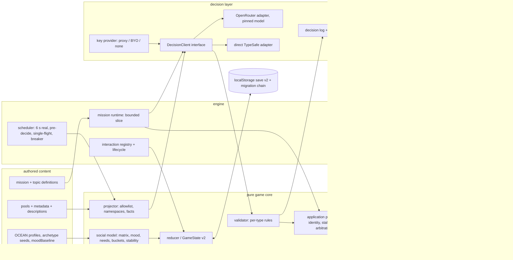
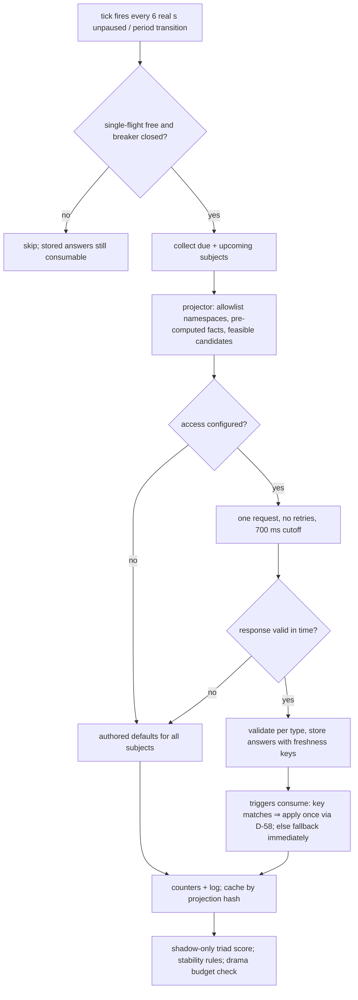

# ADR-0009: Jev NPC Decision Steering, Social Simulation & World Content Systems

**Date:** 2026-09-28 (rev 2 — incorporates the independent review findings from
[`docs/reviews/2026-09-28-jev-review-triage.md`](../reviews/2026-09-28-jev-review-triage.md);
Codex/gpt-6-astra verdict *reject-as-was* and Claude/Opus verdict
*approve-with-changes* were both honored; all blockers and majors are fixed here)
**Status:** Accepted (PoC scope — mechanics and playability first, per C-75)
**Relates to:** `docs/ADR/000-main-architecture.md` (decision numbering continues at
**D-45**), `docs/ADR/0008-webmcp-browser-bridge-and-agent-companion.md` (agent
coexistence), **PRD:** [`docs/PRD-jev-npc-steering.md`](../PRD-jev-npc-steering.md)
(v2.1, C-75). Research basis: `docs/research/2026-09-28-jev-*.md`.

---

## 1. Scope

Covers: the Jev decision layer (client, routes, batching, pre-decision, fallback,
application protocol), the social simulation model (personality, all-pairs NPC
relationships, mood, needs, stability rules, escalation), state projection with a
per-subject allowlist, persistence schema v2 with a migration chain, the content
schema extension enabling 10× authored content, physical/equipment interactions with
a bounded action lifecycle, the bounded conference-speech slice, and observability
(strict mode, counters, perceptibility gate).

Does NOT cover: WebMCP tool API (frozen, ADR-0008), multiplayer (C-25 vision),
triad-driven *events* (computed in shadow only this PoC — see D-50), production
proxy deployment hardening (review triggers below).

---

## 2. Technology Documentation References

No Context7 IDs were used; all references are official documentation read on
2026-09-28 and recorded in the research files.

| Library / Service | Official docs | Used for |
|---|---|---|
| TypeSafe System One (Jev) | https://docs.typesafe.ai/llms.txt (primitives, state, confidence, api, models, jaggedness) | Judgment semantics; **Noul has no confidence field**; Score = 2–10 levels; batched questions cannot see each other's answers |
| TypeSafe JavaScript SDK | https://docs.typesafe.ai/sdk/javascript | Client shape for the direct comparison route |
| OpenRouter Decisions API | https://openrouter.ai/docs/guides/community/jev-tutorial | Primary route; **browser CORS for the decisions endpoint must be verified before BYO mode ships** |
| three.js | https://threejs.org/docs/ | Existing rendering (audience/prop meshes) |
| Vite | https://vite.dev/guide/ | Dev-server middleware (local proxy), `VITE_*` env exposure |
| Vitest | https://vitest.dev/guide/ | Unit tests (PR-3/PR-8/PR-11) |

---

## 3. Component Design

1. **Decision client interface** (`src/jev/`) — injectable `request(state,
   questions) → answers` + `isConfigured()`. Implementations: OpenRouter Decisions
   API adapter (pinned `typesafe/jev-1.13`, timeout, **retries only on the dialogue
   path** — the ambient path never retries), direct-TypeSafe adapter (calibration
   comparison), **fake client** (scripted answers for tests), unconfigured client.
   WS1 also owns **adapter contract tests** (representative request/response
   fixtures, primitive normalization, retry/deadline, partial/malformed responses —
   no network).
2. **Access/key provider** — proxy URL (`VITE_JEV_PROXY_URL`, a URL, not a secret)
   or personal key (localStorage, bound to the approved provider origin); owns the
   BYO test call; **Clear key** action; memory-only mode when localStorage is
   denied; typed key errors never include the key. WS1 owns `vite.config.ts`
   middleware (local proxy) and `src/ui/jev-settings.ts`.
3. **World projector** (pure) — builds the compact projection from `GameState` +
   runtime state for the tick's due subjects, with a **per-subject allowlist**
   (D-59): state is namespaced (`npcs.<id>`, `pairs.<a>_<b>`), each question's
   instructions reference only its subtree. Facts are pre-computed as named bands
   (relationship band, "met N times today", needs bands, event names).
4. **Answer validator** (pure) — **per-type rules** (D-49): Choice/Score require
   `confidence` and a known id/level; **Noul requires `noul ∈ [0,1]` and is gated
   on distance from 0.5, never on a confidence field**. Rejects unknown ids,
   duplicate ids, out-of-cardinality subsets, non-finite numbers, malformed
   distributions. Per-subject accept/reject.
5. **Fallback registry** (pure) — every surface maps to its **deterministic
   authored default**: the preserved legacy picker for pre-existing surfaces;
   `replyCandidates[0]`, `priority`-ordered top-4 options, authored `baseScore`,
   authored pool order, "no action" for new surfaces (D-47).
6. **Social model** (pure core) — profiles, 105-pair NPC matrix, mood, needs,
   stability rules, bucket→delta mapping table (D-50).
7. **World-tick scheduler** — every **6 real seconds of unpaused simulation**
   (scaled by the speed multiplier, frozen under blocking overlays, no catch-up) +
   period transitions; **pre-decides** upcoming decisions; single-flight; 700 ms
   hard cutoff; **circuit breaker** (D-56).
8. **Steered call-site wrappers** — thin: hard filter → (try Jev → validate →
   apply per D-58) → fallback default. Installed via the **WS0 `DecisionHooks`
   seam** so workers never edit `npc-controller.ts` concurrently.
9. **Interaction-point registry** — props, use animations (existing clips), sfx
   with **registered assets + manifest-resolution test** (N2/m6), fault states,
   bounded **action lifecycle** (D-53).
10. **Conference mission system** — bounded first slice (D-54), then crowd.
11. **Observability** — decision log (safe ids), reason-coded counters
    (requested/applied/legacy/rejected/stale/skipped), debug panel, `?jev=off`,
    `?jev=shadow`, `?jev=strict` (dev toast per fallback), startup mode line (D-55).

**Dependency direction:** as rev 1, with `decision-log.ts` inside `src/jev/` owned
by WS1 (not WS8). Shared/integration files (`types.ts`, `state.ts`, `main.ts`,
`hud.ts`, `npc-controller.ts`, `version.ts`) are **orchestrator-owned after WS0**;
workers submit patches that the orchestrator applies serially.

---

## 4. Data Structures (conceptual)

- **DecisionRequest** — `{ decisionId, generation, surface, subjects: [{ id,
  candidates: [{ id, description, priority?, requiredForProgress?, baseScore? }],
  facts }], projection }` where `projection` is per-subject namespaced state.
- **DecisionAnswer (discriminated)** — keyed `(decisionId, subjectId, surface,
  questionId)`; exactly one of: `choice {id, confidence, probabilities}` |
  `score {level, confidence, probabilities}` | `noul {p}` | `subset {ids[],
  confidences}` (ordered, for curation). **No numeric deltas cross the model
  boundary**: social reaction is a **Choice over authored buckets**
  (`offended/annoyed/neutral/pleased/delighted`); code maps bucket → (relDelta,
  moodDelta) from a table in the social model.
- **PersonalityProfile** — Big Five traits authored (0–100) + `moodBaseline
  {valence, energy}`. PoC wires only extraversion (chatter), agreeableness (delta
  scaling), neuroticism (mood volatility); the other two stay data (dead-data rule).
- **RelationshipMatrix** — `Record<pairKey, number>` 0–100 for **NPC↔NPC only
  (105 pairs)**. **Player↔NPC values remain `GameState.npcRelationships`** — one
  authority; the projector reads both. Burek: matrix row (others' fondness),
  excluded from argument eligibility, fixed mood.
- **Mood** — `{valence, energy}` per NPC with authored `moodBaseline`; returns to
  baseline in finite time (bounded exponential decay per in-game hour).
- **NpcNeeds** — `{caffeine, social}` 0–100, runtime-only, decays per in-game hour,
  reset daily; projector emits named bands only (`caffeine: low` etc.).
- **WorldDiary** — ring buffer (~30) of notable events; plus per-pair bounded
  interaction history for reciprocity summaries.
- **Content schema v2** — `replyCandidates` (each with `description` for Jev and
  `priority`), option `requiredForProgress`, option `priority`, pool `topic`,
  relationship bands, `requiresFlags`, argument/question/audience pool types (all
  defined with the WS3 schema, before WS5 authors start). Content files live in
  `src/content/npc-content/<npc>.ts`, imported by a **pre-created registry** (WS0).
- **Save schema v2** — `saveVersion: 2`; `social: {relationships, mood, needs? no —
  needs are runtime, memory, diary}`; **equipment fault states and mission
  completion/reward markers persist**; in-flight mission progress resets on reload.
  Migration is a **chain** (`migrate(raw)` v1→v2; later versions append); `Set`s
  serialize as sorted arrays at the memory API boundary; the first v2 write keeps
  the untouched v1 blob under a backup key; missing matrix pairs lazy-fill on load;
  a `profilesVersion` bump re-seeds only pairs never touched by a delta. A v2 save
  opened by a pre-v2 build is treated as its stored version dictates (v1 rules) —
  branch switching never silently destroys data beyond the existing v1 semantics.

---

## 5. Interface Contracts

- **DecisionClient.request(payload)** — as rev 1, plus: the adapter normalizes
  provider answers into `DecisionAnswer` per type; no answer crosses without a
  valid `decisionId`.
- **Application protocol (D-58)** — every decision carries `decisionId`,
  `generation` (dialogue/session), subject revision, candidate-set version. Apply
  **once**, after rechecking relevant preconditions against current state; a stale
  decision is discarded and, if the opportunity still exists, the fallback is
  recomputed from current state. Deterministic arbitration reserves actors and
  equipment (existing event/quest/player/agent priorities outrank ambient Jev
  actions). Effects apply in one accepted transition, **separate from rendering**.
- **FallbackRegistry.pick(surface, context)** — returns the authored default;
  never touches the network; synchronous so **rng consumption order is unchanged**
  (tests inject seeded rng; m8).
- **SocialModel** — `applyReactionBucket(matrix, pair, bucket)` (clamped, one
  aggregated transaction per action, witness deltas ≤ ±2); `decayMood`,
  `decayNeeds`, `regressNightly` (10% toward archetype seed),
  `detectImbalancedTriads` (shadow-only projection fact this PoC).
- **WorldTickScheduler** — pre-decides upcoming decisions (pairs approaching,
  greetings/goodbyes due within the next tick, idle NPCs) and stores answers with
  **freshness keys** (subject ids, period, relevant flags, relationship band);
  consumers use a stored answer if the key still matches, else fallback
  **immediately** — triggers never await a request. No ambient retries; circuit
  breaker after 3 consecutive provider failures stops ambient calls for 60 s.
- **InteractionRegistry** — lifecycle states `reserved → in-use → done | failed |
  interrupted`; reservation arbitration per D-58; cleanup releases actors/props
  when scenes close or the agent takes control.
- **MissionRuntime** — bounded slice semantics (D-54); `submitAnswer` applies
  `baseScore ± bounded Jev Score adjustment`; persisted completion/reward marker
  prevents duplicate payouts.
- **BYO key test call** — minimal judgment; typed result; key never persisted
  outside localStorage, never logged; Clear-key action; memory-only fallback.

---

## 6. Environment Variables

| Variable | Purpose | Required | Example |
|---|---|---|---|
| `OPENROUTER_API_KEY` | Server/local proxy access to Jev | Proxy path: yes | `sk-or-v1-…` (never committed) |
| `TYPESAFE_API_KEY` | Direct TypeSafe comparison route | No | `ts-…` |
| `VITE_JEV_PROXY_URL` | Browser-facing proxy endpoint (URL only — `VITE_` prefix required to reach the browser) | Deployed default mode: yes | `https://play.devpowers.com/api/jev` |
| `JEV_MODEL` | Pinned model override (default `typesafe/jev-1.13` in code) | No | `typesafe/jev-1.13` |

No `VITE_*` variable ever carries a secret. Proxy review triggers before any
public deploy: origin allow-list, per-IP rate limit, model pinned server-side,
payload size cap.

---

## 7. Technical Decisions

### D-45 — Jev is selection-only; all text stays authored — **unchanged (rev 1)**
Both reviewers endorse. Candidates are authored; Jev selects among them and its
social reaction is a **bucket Choice**, not a number.

### D-46 — OpenRouter Decisions API primary, pinned model — **unchanged (rev 1)**
Plus (Claude M13): verify browser CORS for the decisions endpoint **before** BYO
mode ships; if absent, BYO goes through the dev proxy too. `VITE_JEV_PROXY_URL`
replaces the mis-scoped `JEV_PROXY_URL` for the browser.

### D-47 — Fallback = deterministic authored default per surface — **revised**
**Context:** rev 1 claimed "exactly today's game", impossible for new surfaces
(10× content, curation, mission, arguments have no legacy picker) and wrong after
content migration. **Decision:** fallback is the deterministic authored default:
preserved legacy picker for pre-existing surfaces (with unchanged rng consumption
order); for new surfaces, authored defaults (`replyCandidates[0]`, top-4 by
`priority`, `baseScore`, pool order, "no action"). TAC-01 applies to pre-existing
surfaces with pre-existing content; **TAC-01b** requires every new surface to have
a network-free unit-tested default. A **content kill-switch** flag loads only
pre-C-75 content so TAC-01 remains verifiable after WS5. Ordinary provider failure
changes the selection source, never feature availability. **Rejected:** keeping the
absolute "byte-for-byte" claim (false after migration). **Review trigger:** if
authored defaults diverge from what Jev would pick in most cases, the fallback is
no longer representative — recalibrate.

### D-48 — World-tick batching in real seconds, with pre-decision and namespaced state — **revised**
**Decision:** ambient rounds every **6 real seconds of unpaused simulation**
(scaled by speed multiplier, frozen under blocking overlays, no catch-up) + period
transitions — matching the existing 6–12 s chatter gap so the world never feels
slower than today. The tick **pre-decides** upcoming decisions (M2); stored answers
carry freshness keys and are consumed at the trigger moment or replaced by
fallback **immediately** — triggers never await a request. State is namespaced per
subject to avoid context rot; questions reference only their subtree. No retries
on the ambient path. The measurement harness compares tick vs per-subject on
**labeled accuracy** (shadow agreement on the evaluation set), not just latency.
Single-flight remains; the 700 ms cutoff is a hard ceiling (target p95 ≤ 300 ms).
**Rejected:** 6 *in-game* seconds (= 0.1 real s, 10 req/s — contradicts
single-flight); whole-state dumps (context rot); output-token pricing as the
deciding metric. **Review trigger:** labeled accuracy of tick batching below
per-subject ⇒ split per domain.

### D-49 — Pure projection + per-type validation + staleness protocol — **revised**
**Decision:** projector and validator stay pure and TDD'd. Validation is per
primitive type (see §4). **Freshness** is defined: a decision applies only if its
(generation, subject revision, candidate-set version, freshness key) still match
current state; otherwise it is stale — discarded, with fallback recomputed if the
opportunity persists (D-58). **Rejected:** trusting request-time validity;
post-hoc mutation of invalid answers. **Review trigger:** stale-reject rate high
under normal play ⇒ widen freshness keys only with labeled evidence.

### D-50 — Social model with explicit stability rules — **revised**
**Decision:** all-pairs **NPC↔NPC** matrix (105) + player map (one authority);
symmetric pair values are a declared PoC simplification. Stability rules:
deadbands (friend ≥ 65, enemy ≤ 35, else neutral; triads count only non-neutral
edges); **nightly 10% regression toward the archetype seed**; **drama budget ≤ 2
arguments per in-game day** with per-pair cooldown ≥ 1 day; witness deltas ≤ ±2;
one aggregated relationship transaction per action (authored effect + judged
bucket mapped through one clamped path). Mood decays to authored `moodBaseline` in
finite time. **NpcNeeds** `{caffeine, social}` added (player stats and NPC needs
are distinct). OCEAN: all five authored, three wired (extraversion, agreeableness,
neuroticism). `detectImbalancedTriads` ships as a **shadow-only projection fact**;
triad-driven events are deferred until pair-level dynamics prove flat in
multi-day playtests. Burek: matrix row, no arguments, fixed mood. A unit test
simulates 30 in-game days of random deltas and asserts the distribution stays off
the clamps. **Review trigger:** if playtests read as random rather than motivated,
add authored per-NPC relationship goals before touching the math.

### D-51 — Save schema v2 with a migration chain — **revised**
**Decision:** `migrate(raw)` chains v1→v2 (the loader never resets a v2 save, and
a v2 save under a pre-v2 build degrades to v1 semantics rather than a wipe);
`NpcMemory` serializes as arrays/records at the API boundary with reset-on-load
semantics; untouched v1 blob kept under a backup key on first v2 write; missing
pairs lazy-fill; `profilesVersion` re-seeds only untouched pairs; **equipment
faults and mission completion/reward markers persist** (prevents duplicate
payouts and stuck errands); in-flight mission progress resets. **Rejected:**
version check + fresh game (silently wipes); persisting `Set`s directly.

### D-52 — Content schema v2, registry-first, typed argument/question pools — **revised**
**Decision:** as rev 1, plus: the content **registry is pre-created by WS0** so
the four authors never share a file; argument, plant-question, and audience pool
types are defined **with the WS3 schema in Wave 2** (before WS5 authors and WS7
need them); content lives in `src/content/npc-content/<npc>.ts`; every candidate
carries a Jev-facing `description` (authoring cost counted in the WS5 estimate,
M10). **Review trigger:** unchanged (dead metadata).

### D-53 — Interaction points with a bounded action lifecycle — **revised**
**Decision:** registry as rev 1 plus lifecycle states `reserved → in-use →
done | failed | interrupted`, deterministic reservation arbitration (D-58), and
cleanup on scene close/agent takeover — a small shared contract, not an activity
engine. Sound feedback requires **registered sfx assets** (source stated in the
WS6 brief) + a test asserting every interaction sfx id resolves in the manifest +
a manual audible check (the loader's silent no-op otherwise hides missing audio).
**Review trigger:** a needed interaction that cannot be expressed ⇒ extend the
registry deliberately.

### D-54 — Conference mission: bounded speech-loop slice first — **revised**
**Decision:** first playable = **1 topic, 5 talking points, 2 plants × 2
questions, panel-only engagement meter**; answers score as authored `baseScore` ±
a bounded Jev Score adjustment (never Jev-only — the outcome moves cash); unlock/
entry/room-reservation rules, abort/reload semantics, persisted completion/reward
marker; mission presentation animates while the economy clock and ordinary NPC
scheduling pause. The **crowd** (8 seated bodies, 4 reactions) is a separate
follow-up deliverable. Question-pool delivery from WS5-Author-D is a **dependency
of WS7 integration**, with fixture pools provided first. **Rejected:** the rev-1
scope as a first playable (unbounded rounds/crowd/duration).

### D-55 — Observability: strict mode, counters, live-path proof, perceptibility gate — **revised**
**Decision:** rev 1 plus `?jev=strict` (dev toast on every fallback), reason-coded
counters (requested/applied/legacy/rejected/stale/skipped) in the debug panel
header, a startup console mode line, and **key scenario 11**: with the fake client
returning non-legacy answers, every wrapper applies the Jev answer — proving the
live path, not only the off path. **Perceptibility gate (Wave 4):** one 10-minute
in-game day with ≥ 30 applied steered decisions, fallback rate < 20%, ≥ 1 visible
NPC↔NPC relationship effect, and a side-by-side `?jev=off` vs live log/screenshot
pair shown to Lucas under PR-2. **Review trigger:** production launch — retention/
telemetry policy.

### D-56 — Latency: pre-fetch, session memo, budgeted dialogue, circuit breaker — **revised**
**Decision:** ambient path never waits for or retries a request (pre-decided
answers, consume-or-fallback, 700 ms hard cutoff, p95 target ≤ 300 ms). Dialogue:
tree + curation are requested **when walk-to-face starts** (the walk hides the
latency); when options render, one batched request pre-judges the reply for
**every** visible option so the click applies a stored answer instantly; the 1200
ms dialogue deadline starts at input acceptance, with immediate input feedback and
one-shot pick acceptance. Dialogue surfaces use a **session-scoped memo** keyed by
(surface, subject, normalized projection hash, question/policy version, resolved
model); ambient uses the tick cache; failures are not cached. Interactive
judgments cancel/discard ambient work and take priority. Circuit breaker: after 3
consecutive provider failures, ambient calls stop for 60 s. Time-scale semantics
documented for 2x/4x and overlays. **Rejected:** per-click serial request chains
(up to 3 × 1.2 s per conversation); tick-scoped-only caching (violates session
determinism).

### D-57 — Testing, calibration gate, and coverage — **revised**
**Decision:** rev 1's TDD layers plus: **adapter contract tests** in WS1;
**calibration gate** — production certification is deferred, but **local
consequential activation requires the per-surface evaluation gate** (D-60 table,
labeled held-out scenarios, thresholds); cosmetic surfaces (greeting, chatter
exchange, reply flavor, audience reaction) run **live** without calibration;
consequential ones (mission scoring, argument veto, destination) run live with a
conservative threshold and authored-default clamp. The debug panel's counters are
an acceptance gate: a demo where every request fell back has failed even if all
smoke tests pass. **Review trigger:** any surface failing its labeled evaluation
stays in shadow.

### D-58 — Decision application protocol (new)
**Status:** Accepted · **Date:** 2026-09-28 (review B2)
**Context:** rev 1 had no identity, staleness, arbitration, or exactly-once rule;
while a request runs the player can switch NPCs, end the day, reset/load, switch
keys, or occupy equipment; two valid answers could double-book an actor or
double-apply effects (node effects fire in `render()`, option effects in
click/programmatic paths).
**Decision:** every decision carries `decisionId`, conversation/session
`generation`, subject revision, and candidate-set version; it applies **once**,
only after rechecking preconditions on current state; stale ⇒ discard (+ fallback
recompute if the opportunity persists); deterministic arbitration reserves actors
and equipment with event/quest/player/agent priorities above ambient Jev; effects
apply in one accepted transition separated from rendering. Tests: close/switch/
reset/load mid-flight, double pick, late reply after timeout, conflicting batch
actions.
**Rejected:** optimistic application at response time; replaying expired
opportunities. **Consequences:** (+) no double-apply, no ghost actions; (−) one
more contract for every wrapper. **Review trigger:** any duplicate-effect bug
report ⇒ tighten the transition boundary.

### D-59 — Projection data-boundary allowlist (new)
**Status:** Accepted · **Date:** 2026-09-28 (review M8/M13/M14)
**Context:** the player types a real name at character creation; WebMCP agent
text is untrusted; "local-only" refers to code, while minimized fictional requests
to the approved provider are intentional and must be stated.
**Decision:** the projector includes **fictional actor ids only** — never
`character.name`, never agent-authored strings (agent turns appear as safe ids);
stable fictional ids replace user-entered names everywhere in state; negative
fixtures assert absence of player/agent text and synthetic secrets from every
projection; BYO credentials bind to the fixed approved provider origin; the proxy
separates its own auth from BYO mode; a server URL never receives a personal key.
**Rejected:** redacting at the adapter layer only (too late — state shape must be
safe by construction). **Review trigger:** any new projected field without an
allowlist entry.

### D-60 — Per-surface policy table (new)
**Status:** Accepted · **Date:** 2026-09-28 (review M1/B1)
**Context:** "consequential vs cosmetic" was undefined; literal reading of the
shadow rule would make the PoC show zero steering.
**Decision:** this table is frozen before activation and updated only with
labeled evidence:

| Surface | Primitive | Consequential | Threshold | PoC mode | Fallback default |
|---|---|---|---|---|---|
| Tree opening | Choice | no | confidence ≥ 0.3 | live | hardcoded flag chain |
| Option curation | Score × option | no | top-4 by score, `priority` tie-break | live | priority top-4 |
| Reply selection | Choice | no | confidence ≥ 0.3 | live | `replyCandidates[0]` |
| Reply social reaction | Choice (bucket) | yes | distance from `neutral` ≥ 1 level | live, conservative | `neutral` bucket |
| Chatter exchange | Choice | no | confidence ≥ 0.3 | live | legacy `pickExchange` |
| Greeting / goodbye | Choice | no | confidence ≥ 0.3 | live | legacy pool pick |
| Destination | Choice | yes | confidence ≥ 0.5 | live, conservative | legacy weighted rng |
| Purposeful action | Choice | yes | confidence ≥ 0.5 | live, conservative | no action |
| Argument trigger | Noul (veto only) | yes | veto if p < 0.7 | live, conservative | code threshold alone |
| Mission question pick | Choice | no | confidence ≥ 0.3 | live | authored pool order |
| Mission answer score | Score | yes | bounded ±1 level | live, conservative | `baseScore` |
| Triad tension | shadow only | — | — | shadow | no event |

Default URL mode: live if configured, `off` otherwise. **Review trigger:** any
change to stakes/thresholds requires a labeled re-evaluation.

### D-61 — WebMCP coexistence (new)
**Status:** Accepted · **Date:** 2026-09-28 (Claude §5)
**Decision:** the agent companion character is excluded from judgment subjects;
agent↔NPC dialogue follows ADR-0008 (agent-authored turns); Jev steers only
non-agent surfaces. `pickOption`-style programmatic paths route through the same
eligibility/one-shot checks as DOM picks (M4), with defined behavior while a
judgment is pending (pick accepted once; stored answer applied or fallback at the
deadline). **Review trigger:** any WebMCP tool contract change (frozen post-deadline).

---

## 8. Diagrams

### 8.1 Component diagram



### 8.2 Data flow — one ambient world tick (rev 2)



### 8.3 Sequence — steered dialogue turn (rev 2: prefetch + instant apply)

```mermaid
sequenceDiagram
    participant P as Player
    participant UI as Dialogue panel
    participant W as Wrapper (dialogue)
    participant PR as Projector
    participant JC as DecisionClient (OpenRouter)
    participant V as Validator
    participant AP as Application protocol (D-58)
    participant FB as Fallback (authored default)
    participant R as Reducer

    P->>UI: approach NPC (walk-to-face starts)
    W->>PR: project tree set + eligible options
    W->>JC: request: tree choice + per-option relevance Scores
    JC-->>W: answers stored (session memo keyed by projection hash)
    UI->>P: show curated top-4 (priority tie-break) — click never awaits a request
    P->>UI: pick option (accepted once)
    alt stored reply answer fresh for this state
        W->>V: validate stored reply + reaction bucket
        V-->>W: ok
        W->>AP: apply (generation + revision recheck)
        AP->>R: one accepted transition: authored effects + clamped bucket delta
        W->>UI: authored reply text
    else stale / missing / low confidence / provider error
        W->>FB: authored default for surface
        FB-->>W: legacy nextNodeId or replyCandidates[0]
        W->>R: authored effects only
        W->>UI: default reply (fallback logged, strict mode toasts)
    end
    UI->>P: reply shown; clock never ticked (dialogue pauses it)
```

### 8.4 Sequence — BYO key test call — unchanged from rev 1

---

## 9. Testing Strategy

### Philosophy

Unchanged: TDD per PR-8/PR-11 (failing test first for every pure function and data
file; mutation checks before each feature commit); `pnpm typecheck && pnpm test`
green at every commit; Playwright screenshots + vision descriptions per PR-2/PR-5
with Lucas as visual QA; **the per-wave phase QA verdict runs on `codex exec`**
(different model family — PR-4.6), while per-workstream code judges may be GLM.

### Test layers

| Layer | Type | Scope | Tools |
|---|---|---|---|
| Unit (node) | pure functions | projector + allowlist, validator (per type), fallback registry, application protocol (staleness/arbitration), social model (buckets, clamp, decay, regression, 30-day stability, triads), mission scoring, save migration chain, content shape/volume/reachability | vitest |
| Unit (jsdom) | input/UI state | interaction prompts, mission options, debug panel, BYO key form incl. denied storage | vitest + jsdom |
| Adapter contract | fixtures | request/response normalization, per-primitive shapes, retry/deadline, partial/malformed — no network | vitest |
| Integration | wrapper flow | fake client: happy / timeout / malformed / unknown-id / partial-batch / low-confidence / unconfigured / **live-path proof (key scenario 11)** / stale-mid-flight / reset-load-mid-flight / double pick | vitest |
| E2E | Playwright | smoke + **WS9 playable harness**: autonomous playthrough, `?jev=off` vs live A/B, mission slice start→results, BYO failure path | Playwright |
| Calibration | labeled datasets | per-surface evaluation gate (D-60) before consequential activation; shadow logs accumulate | jev skill `evaluate.mjs` |

### Key test scenarios (additions marked)

1. Fallback equivalence — `?jev=off` == pre-feature behavior, same seeded rng (TAC-01).
1b. **New-surface defaults** — every new surface's authored default never touches the network (TAC-01b).
2. Projection allowlist — no `character.name`, no agent text, no synthetic secrets in any projection.
3. Partial batch — 4 of 5 applied, 1 legacy, counters show both.
4. Bucket mapping + clamp — `delighted` on a hostile pair still ≤ +5 after scaling; one transaction per action.
5. Argument trigger — threshold + cooldown + **daily drama budget**; no loops.
6. Mood/needs decay — finite return to baseline within the day.
7. Save migration chain — v1→v2 (Sets intact), backup key written, lazy pair fill, double migration idempotent, **v2 save never silently wiped**.
8. Content volume/reachability — distinct normalized strings, Jaccard > 0.8 rejected, per-NPC ≥ 7× and roster ≥ 10× vs the frozen `42000fd` baseline; every pool reachable from a registered root under representative flags; one completion trace per batch.
9. Mission determinism — same option sequence + fake judgments ⇒ same outcome math.
10. Key hygiene — BYO key absent from save, logs, projections.
11. **Live-path proof** — non-legacy fake answers are applied by every wrapper (counters prove applied > 0).
12. **Staleness** — NPC switch / day end / reset / load mid-request ⇒ discard + recompute-or-fallback; no double effects; reservation arbitration resolves conflicting batch actions deterministically.
13. **Stability** — 30 simulated days of random deltas keep the matrix off the clamps; regression pulls extremes home.
14. **Audio** — every interaction sfx id resolves in the manifest (loader no-op is a failure).

### Technical acceptance criteria

- TAC-01: scoped per D-47 (pre-existing surfaces, pre-existing content, `?jev=off`).
- TAC-01b: every new surface has a network-free unit-tested authored default.
- TAC-02: single-flight + circuit breaker honored (fake client call log).
- TAC-03: session memo + tick cache keyed as specified (D-56); identical normalized projections hit the cache.
- TAC-04: per-type validation (Choice/Score confidence; Noul probability only); unknown ids/duplicates/cardinality rejected per subject.
- TAC-05: 105-pair matrix (< 10 KB) + player map single-authority read path.
- TAC-06: migration chain passes v1→v2→re-save and never wipes a v2 save.
- TAC-07: content volume/shape/reachability per scenario 8.
- TAC-08: `pnpm typecheck` + `pnpm test` green every commit; Playwright smoke green per phase.
- TAC-09: logs/counters contain safe ids only; startup mode line present; strict toasts fire on fallback.
- TAC-10: labeled evaluation exists per surface before its consequential activation (D-60).
- TAC-11: **perceptibility gate** — Wave 4 A/B day: ≥ 30 applied decisions, fallback < 20%, ≥ 1 visible NPC↔NPC effect, evidence shown to Lucas.
- TAC-12: **staleness/exactly-once** — scenario 12 passes for every wrapper.
- TAC-13: **stability** — scenario 13 passes.
- TAC-14: **performance** — projection+serialization adds < 2 ms p95 per tick on the reference scene; no dropped-frame regression from audience/speech slice (performance meter).

---

## 10. Implementation sequencing note (rev 2)

**WS0 seam commit (exclusive worker, before any fan-out):** `DecisionHooks`
injection into `createNpcController` (greeting, goodbye, pair, starter, exchange,
destination, override-install) defaulting to today's functions; extension points in
`main.ts`; pre-created `src/content/npc-content/` registry; shared contract types.
Then: (1) WS1 decision core + adapter contract tests + settings UI + local proxy
middleware, WS2 social model + save v2 (now owning `dialogue-memory.ts`,
`initial.ts`), WS9a robot collision fix — parallel; (2) WS3 dialogue steering +
content schema, WS4 world-tick (generalizes WS1's greeting wrapper — no re-wrap);
(3) WS5 content authors (4, registry disjoint) + WS7 mission slice (fixture pools
first) + WS8 observability/calibration fixtures; (4) integration, judge sweep,
perceptibility gate, playtest report. Shared files (`types.ts`, `state.ts`,
`main.ts`, `hud.ts`, `npc-controller.ts`, `version.ts`) are orchestrator-owned
after WS0; workers submit patches applied serially. Gate order: implement (+ version
bump) → verify → independent judge → commit → visual phase review.
