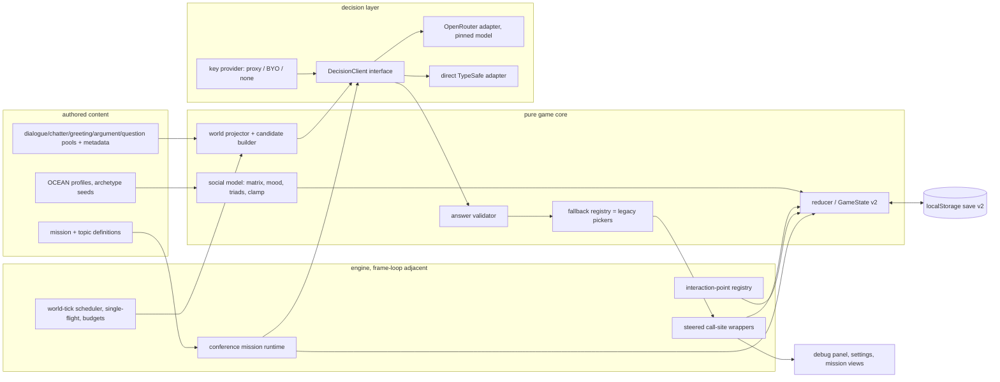
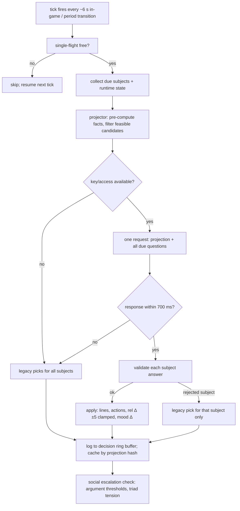
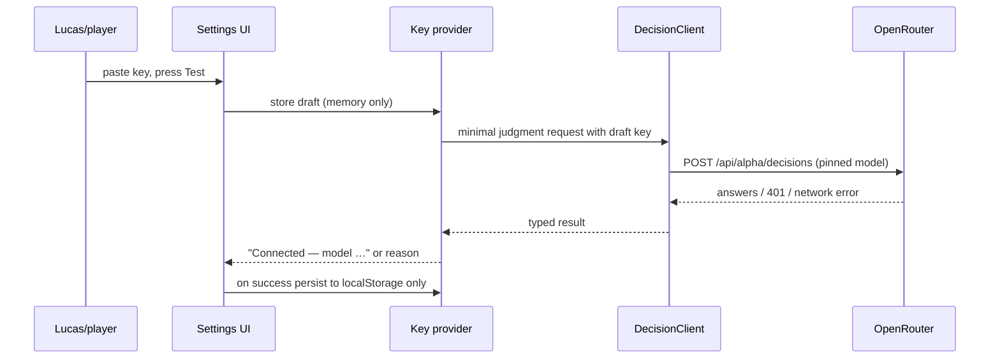

# ADR-0009: Jev NPC Decision Steering, Social Simulation & World Content Systems

**Date:** 2026-09-28
**Status:** Accepted (PoC scope — mechanics and playability first, per C-75)
**Relates to:** `docs/ADR/000-main-architecture.md` (decision numbering continues at
**D-45**), `docs/ADR/0008-webmcp-browser-bridge-and-agent-companion.md` (agent
coexistence), **PRD:** [`docs/PRD-jev-npc-steering.md`](../PRD-jev-npc-steering.md)
(v2, C-75). Research basis: `docs/research/2026-09-28-jev-*.md`.

**Scope note:** PoC decisions optimize for testable mechanics, not production
hardening. Every decision carries a review trigger for the production pass.

---

## 1. Scope

Covers: the Jev decision layer (client, routes, batching, fallback), the social
simulation model (personality, all-pairs relationships, mood, escalation), state
projection/compaction, persistence schema v2, the content schema extension that
enables 10× authored content, physical/equipment interactions, the conference-speech
mission architecture, and observability (debug panel, shadow mode).

Does NOT cover: WebMCP tool API (frozen, ADR-0008), multiplayer (C-25 vision), the
main-architecture decisions already recorded in `000-main-architecture.md`, and
production deployment hardening (proxy infrastructure, calibration sign-off — review
triggers below).

---

## 2. Technology Documentation References

No Context7 IDs were used; all references below are the official documentation read
on 2026-09-28 during research (fresh from source, recorded in the research files).

| Library / Service | Official docs | Used for |
|---|---|---|
| TypeSafe System One (Jev) | https://docs.typesafe.ai/llms.txt (index; primitives, state, confidence, api, models, jaggedness pages) | Judgment model semantics, limits, jaggedness mitigations |
| TypeSafe JavaScript SDK | https://docs.typesafe.ai/sdk/javascript | Client shape if direct route is used |
| OpenRouter Decisions API | https://openrouter.ai/docs/guides/community/jev-tutorial | Primary route (endpoint, auth, request/response) |
| OpenRouter TypeSafe SDK guide | https://openrouter.ai/docs/guides/community/typesafe-sdk | SDK-over-OpenRouter alternative surface |
| three.js | https://threejs.org/docs/ | Existing rendering (unchanged; audience/prop meshes) |
| Vite | https://vite.dev/guide/ | Dev server middleware for the local proxy |
| Vitest | https://vitest.dev/guide/ | Unit tests (project standard, PR-3/PR-8/PR-11) |

---

## 3. Component Design

New modules (naming follows the existing `src/engine` / `src/content` / `src/game`
split; the implementing agent owns final file layout within these responsibilities):

1. **Decision client interface** (`jev` area) — an injectable, framework-free
   interface: `request(state, questions) → answers`, plus `isConfigured()`.
   Implementations: (a) OpenRouter Decisions API adapter (`fetch`, pinned
   `typesafe/jev-1.13`, retries 429/529 with backoff, timeout), (b) a **fake client**
   for unit tests (scripted answers), (c) an "unconfigured" client that always
   reports unavailable (drives fallback paths in tests).
2. **Access/key provider** — resolves the access mode per PRD Flow D: server proxy
   URL (default when deployed) or personal key (browser local storage). Owns the
   BYO-key test call. Never exposes the key to decision-state or logs.
3. **World projector** (pure) — given `GameState`, runtime NPC state (positions,
   conversations, mood), and the tick's *due* subjects, emits the compact projection
   object and per-subject candidate sets. This is where facts are pre-computed
   (relationship bands, "met N times today", "caffeine: low", event names) and
   feasibility filtering happens. Pure ⇒ fully TDD-able per PR-8/PR-11.
4. **Answer validator** (pure) — checks each returned answer against its question
   (known candidate id? delta within −5…+5? probability/confidence present?).
   Returns per-subject accept/reject; rejects feed the fallback for that subject
   only (AC-09).
5. **Fallback registry** (pure) — maps every judgment surface to its preserved
   legacy picker (fixed `nextNodeId`, uniform pool pick, weighted destination, no-op
   action). The wrappers call this on any reject — this *is* the invisible-fallback
   mechanism (PRD Flow C; C-75 A4).
6. **Social model** (pure core + persistence) — personality profiles (authored),
   all-pairs relationship matrix, mood (valence/energy) with daily decay, delta
   clamping (±5), argument-threshold checks, Heider triad imbalance detection over
   the matrix (455 triads at 15 NPCs — cheap). Pure functions; reducer owns writes.
7. **World-tick scheduler** — decides *when* a decision round runs (cadence +
   event-driven triggers), enforces single-flight (never two concurrent requests),
   and the ambient timeout budget (700 ms). Lives beside the existing 1 Hz chatter
   scheduler in the engine layer; does not touch the frame loop's synchronous path.
8. **Steered call-site wrappers** — thin replacements at the surveyed decision
   points (dialogue open/reply/options, chatter, greetings, destinations): hard
   filter → (try Jev → validate) → fallback. Signature-compatible with today's
   functions so existing tests keep passing except where they assert the exact
   random pick (PRD AC-18-of-v1 note).
9. **Interaction-point registry** — props with positions, use animations (existing
   clips + prop manipulation), sfx via the existing audio manifest, fault states,
   and the repair interaction hook. NPCs execute uses as schedule overrides (same
   mechanism as today's overrides); the player uses the existing prompt/interaction
   UI pattern.
10. **Conference mission system** — quest-layer feature: mission definitions
    (topic unlock, payment, outcome flags), speech state machine (talking points →
    plant question → answer → score), audience crowd (seated background NPCs with
    gesture/walk reactions), planted question pools, and score accumulation feeding
    the existing credibility/cash systems.
11. **Observability** — decision log ring buffer (safe ids: subject, surface,
    chosen id, confidence, latency, fallback flag, deltas), debug panel UI, shadow
    mode (`?jev=shadow` runs Jev and logs both picks but applies legacy), off switch
    (`?jev=off`).

**Dependency direction (no cycles):** `content` (pools, profiles, pools metadata) →
`game` (social model, reducer, projector inputs) ← `engine` (scheduler, wrappers,
registry) → `jev` (client interface + adapters) ; `ui` (panel, mission views,
settings) depends on engine/game interfaces only. The WebMCP bridge remains a leaf
that consumes engine interfaces; it is not modified by this feature.

---

## 4. Data Structures (conceptual)

- **DecisionRequest** — `{ surface, subjects: [{ id, candidates: [{ id, text?, description, tags? }], facts }], projection }`. Projection fields are named per the TypeSafe state guidance (objects with descriptive names; backtick-path references from instructions).
- **DecisionResponse** — per subject: chosen candidate id, confidence, probabilities; optional `relDelta` (−5…+5), `moodDelta {valence, energy}`; `usage`, resolved model id.
- **PersonalityProfile (authored, static per NPC)** — Big Five-style traits: `extraversion`, `agreeableness`, `conscientiousness`, `neuroticism`, `openness`, each 0–100; plus retained existing flavors (chattiness weight, topic affinities) folded in as derived views.
- **RelationshipMatrix** — `Record<pairKey, number>` 0–100 (pairKey sorted id pair); seeded from archetype slots (`manager↔assistant: +20`, `sales↔engineering: −15`…) over the neutral 50. Player pairs included. Persisted.
- **Mood** — per NPC `{valence: −100..100, energy: 0..100}`; decays toward the profile baseline each in-game hour; events/judgments shift it within bounds.
- **WorldDiary** — ring buffer (last ~30 entries) of notable world events with day/period stamps; included in projections as "what happened today" context. Persisted.
- **Content metadata extension** — dialogue options/nodes gain optional `replyCandidates` (≥1 required for steered nodes) and pools gain `topic`, `minRelationship`/`maxRelationship` bands, `requiresFlags`, `mood` hints. All new content files validate against these shapes in unit tests (PR-11 data-file rule).
- **Save schema v2** — `saveVersion: 2`; adds `social: { relationships, mood, profilesVersion }`, moves `NpcMemory` into persisted state, adds `worldDiary`. Migration from v1 fills defaults (neutral matrix, archetype seeds, empty memory/diary). Exact reducer actions (`set-relationship-pair`, `shift-mood`, `append-diary`) follow the existing action style.

**Social-model grounding (C-75 A5):** Big Five (OCEAN) for stable personality →
baseline behavior weights; **Heider structural balance** for triads — code enumerates
imbalanced triangles (friend-of-friend/enemy patterns) and offers them to the
scheduler as tension events (argument seeds, alliance nudges); **social exchange**
for reciprocity — the projector summarizes each pair's last few interactions so Jev
judges the *streak*, not a single step; mood as simplified **PAD** (valence + energy
only) with daily decay. The math (weights, thresholds) lives in code, is unit-tested,
and is tuned by play, not by Jev.

---

## 5. Interface Contracts

- **DecisionClient.request(payload)** — in: projection + questions (model id
  pinned server-side of the adapter); out: typed answers map + usage + resolved
  model; errors: timeout, auth (401), rate limit (429/529 → retry then surface),
  validation (422). The adapter never throws past the wrapper; wrapper converts any
  failure to "no judgment".
- **FallbackRegistry.pick(surface, context)** — in: surface + the context the legacy
  picker needs; out: exactly the pre-Jev selection. Must not consult the network.
- **SocialModel.applyDelta(matrix, pair, delta)** — clamped ±5, returns new matrix
  (immutable update, reducer-style). `detectImbalancedTriads(matrix)` → list of
  triads with tension scores.
- **WorldTickScheduler.onTick** — emits one round or nothing (single-flight
  respected); consumers: chatter pairing, greetings, destinations, purposeful
  actions.
- **InteractionRegistry.use(pointId, actorId)** — validates proximity/ability,
  plays animation + sfx, applies effect, marks fault state where applicable.
- **MissionRuntime** — `start(missionId)`, `submitAnswer(optionId)`,
  `currentAudienceMood()`, `finish() → outcome`; judgments consumed internally;
  outcomes emitted as standard game events.
- **BYO key test call** — one minimal judgment request; returns connected/model or
  a typed reason (invalid key / no network). Key never persisted outside
  localStorage, never logged.

---

## 6. Environment Variables

| Variable | Purpose | Required | Example |
|---|---|---|---|
| `OPENROUTER_API_KEY` | Server proxy / local dev access to Jev via OpenRouter | Proxy path: yes | `sk-or-v1-…` (never committed; `.env*` is gitignored per C-74) |
| `TYPESAFE_API_KEY` | Direct TypeSafe route (comparison/fallback path) | No | `ts-…` |
| `JEV_PROXY_URL` | Browser-facing proxy endpoint in production | Deployed default mode: yes | `https://play.devpowers.com/api/jev` |
| `JEV_MODEL` | Pinned model id override (default `typesafe/jev-1.13` in code) | No | `typesafe/jev-1.13` |

No `VITE_*` variable may ever carry a key. The proxy holds the secret; the browser
holds at most the user's own BYO key in localStorage.

---

## 7. Technical Decisions

### D-45 — Jev is selection-only; all text stays authored
**Status:** Accepted · **Date:** 2026-09-28
**Context:** C-75 demands 10× authored content *and* real-world-feeling simulation; Jev's documented weakness is generation ("forced generation via chained choices is poor and slow") and its strength is calibrated selection.
**Decision:** Every line is authored; Jev only selects among supplied candidates and returns bounded social deltas. "More dialogue options" = authoring richer pools that code filters and Jev curates (show ≤4).
**Rejected alternatives:** generative NPC dialogue (contradicts authored-identity C-74/C-75, adds moderation/latency/cost risks, and Jev is explicitly not a generator); string-templated assembly (context rot + adversarial-input risk).
**Consequences:** (+) no hallucinated text possible, content reviewable in diffs, Jev failures degrade to authored behavior. (−) variety is bounded by authoring effort — hence the 10× content deliverable.
**Review trigger:** if authored-pool variety measurably plateaus, revisit a supervised generative *drafting* pipeline (human-edited before commit), not runtime generation.

### D-46 — OpenRouter Decisions API primary, pinned model; direct TypeSafe as comparison path
**Status:** Accepted · **Date:** 2026-09-28
**Context:** Edukey's `jev-decision-routing` skill mandates OpenRouter as the default eligible route (centralized observability) with a pinned model; BYOK billing caveats documented.
**Decision:** Primary route `POST https://openrouter.ai/api/alpha/decisions` with model pinned to `typesafe/jev-1.13` (no `jev-latest` in calibrated workflows). The `DecisionClient` interface keeps a direct-TypeSafe adapter available for the calibration comparison the skill requires. PoC local development may use BYO-key mode; production default is the server proxy.
**Rejected alternatives:** direct-TypeSafe-only (loses centralized request observability); `jev-latest` alias (silently changes calibrated behavior).
**Consequences:** (+) per-request latency/cost/model logging; thresholds stable. (−) OpenRouter account dependency; BYOK fee caveats.
**Review trigger:** provider outage pattern, pricing change, or jev 1.14 release (re-run labeled evaluation before switching).

### D-47 — The invisible fallback is the preserved legacy picker, not a new tree
**Status:** Accepted · **Date:** 2026-09-28
**Context:** Lucas asked how invisible mode works (decision trees? hardcoded chains?) — C-75 A4. Building a second decision system would double maintenance and diverge.
**Decision:** Each steered call site keeps today's logic as the fallback inside a `FallbackRegistry`. Flow: hard filter → try Jev (timeout/confidence bounded) → validate → fallback pick. No judgment ever blocks gameplay; per-subject fallback in batch responses (AC-09/10/12).
**Rejected alternatives:** a parallel "offline AI" heuristic tree (duplicated logic, new failure modes); queuing/waiting UX (breaks the invisible contract and the clock rules).
**Consequences:** (+) offline == today's shipped game byte-for-byte in behavior; trivially testable; legacy pickers stay unit-tested. (−) call sites carry one extra branch each.
**Review trigger:** if wrappers accumulate surface-specific logic beyond filtering+fallback, extract per-surface strategy objects.

### D-48 — Two batching shapes behind one interface; world-tick is the ambient default, per-turn for dialogue
**Status:** Accepted · **Date:** 2026-09-28
**Context:** Lucas: Jev "can produce full object of decisions … for all game/npc/objects at once … but something to test and decide" (C-75 A2). Research: batching is cheap and fast, but irrelevant state degrades accuracy ("context rot") — so whole-world *state* is wrong, whole-world *questions over a compact projection* is right.
**Decision:** Implement both shapes behind `DecisionClient`: (a) **ambient world-tick** — every ~6 in-game seconds and on period transitions, one request carries the compact projection and all due ambient judgments (chatter pairs, greetings due, purposeful actions, tension checks), defaults on; (b) **dialogue-turn** — one request per player pick (reply + relDelta), inherently sequential. A measurement harness (debug panel latency counts + shadow logs) compares per-surface vs tick batching; defaults are revisited from data, not preference.
**Rejected alternatives:** per-NPC-per-second fan-out (request count grows with headcount for no accuracy gain); sending full `GameState` raw (context rot + leaks runtime keys into prompts).
**Consequences:** (+) free output tokens exploited; one request amortizes state cost. (−) one large request's latency gates a whole tick — mitigated by the 700 ms budget and per-subject fallback.
**Review trigger:** if p95 tick latency > budget under load, or validation-reject rate rises with batch size, split the tick into per-domain requests.

### D-49 — Projection and validation are pure, pre-computed, and feasibility-filtered
**Status:** Accepted · **Date:** 2026-09-28
**Context:** Jev must not compute (jaggedness §2–3) and must never see infeasible options; PR-8/PR-11 require pure functions under TDD.
**Decision:** The world projector pre-computes named facts (relationship bands, counts, needs), filters candidates by hard rules, and emits named-field state. The validator checks every answer (id ∈ candidates, |Δ| ≤ 5, confidence present) and rejects per subject. Both are pure functions with table-driven tests including adversarial/unknown-id cases.
**Rejected alternatives:** sending raw numbers/dates for Jev to compare (documented failure mode); post-hoc mutation of invalid answers (silent corruption).
**Consequences:** (+) deterministic, fully unit-testable judgment boundary. (−) projection code must be maintained as content grows.
**Review trigger:** projection payload doubling without accuracy gain → tighten per-surface field selection.

### D-50 — Social model: OCEAN profiles + all-pairs matrix + valence/energy mood; Heider triads and reciprocity as code-owned dynamics
**Status:** Accepted · **Date:** 2026-09-28
**Context:** C-75 A5 asks for NPC↔NPC relations, programmatic −5…+5 deltas, arguments/fights, and theory-grounded rules.
**Decision:** Authored Big Five profiles per NPC (fold the existing chattiness/topic-affinity data in as views); relationship matrix for **all pairs** seeded by archetype slots over neutral 50; mood `{valence, energy}` decaying to baseline within the day. Jev judgments return the bounded deltas; code clamps, applies via the reducer, persists. Two code-owned dynamics on top: **Heider imbalance detection** over triads (tension events offered to the scheduler: arguments, alliance nudges) and **reciprocity summaries** (recent pair-interaction streaks) fed into projections. Arguments trigger on code thresholds (low pair value + adverse mood + trigger event + both present + cooldown) and play authored verbal pools + movement choreography; fights are a later milestone.
**Rejected alternatives:** free-form LLM "social director" (opaque, untestable, drifts); per-pair bespoke scripting (does not scale to 105 pairs); storing mood as text.
**Consequences:** (+) emergent-but-bounded drama; every rule is a tested pure function; the matrix is one persisted map. (−) authored seed values need a pass per NPC pair class; argument content pools are new authoring.
**Review trigger:** if playtests feel random rather than motivated, add explicit relationship *goals* per NPC (authored) before touching the math.

### D-51 — Save schema v2: social block, persisted NpcMemory, world diary
**Status:** Accepted · **Date:** 2026-09-28
**Context:** NpcMemory is currently runtime-only (lost on reload) — Jev steering would then be amnesiac across sessions; the matrix and mood must persist; v1 save is `saveVersion: 1` with localStorage round-trip.
**Decision:** Bump to `saveVersion: 2` with `social: {relationships, mood, profilesVersion}`, relocated `NpcMemory`, and a bounded `worldDiary` ring buffer. One-time v1→v2 migration (defaults: archetype-seeded matrix, neutral mood, empty memory/diary). Version identifiers follow C-68 build rules; save-schema integer is technical metadata.
**Rejected alternatives:** separate localStorage keys outside the save (breaks save/load round-trip and export); not persisting memory (amnesiac world).
**Consequences:** (+) coherent persistence, save/load tests per PR-8. (−) migration code + tests are mandatory before any steering ships.
**Review trigger:** save size growth (matrix is 105 pairs — trivial; diary is ring-bounded).

### D-52 — Content schema v2 with metadata-enriched pools; per-NPC-group content files
**Status:** Accepted · **Date:** 2026-09-28
**Context:** 10× content (AC-27/28) will be authored in parallel batches; untyped growth already produced dormant gating data once (the unused `available` predicates).
**Decision:** Extend content types with `replyCandidates`, option/line metadata (`topic`, relationship bands, flags, mood hints), and argument/audience/question pools. Content is organized in **per-NPC-group files** so parallel authors own disjoint files (no shared-file races, PR-6). Every data file gets shape tests; a counted volume test enforces the 10× target (AC-27).
**Rejected alternatives:** one giant dialogues file (merge conflicts, unreviewable); free-form JSON without typed validation (PR-11 violation).
**Consequences:** (+) parallel authoring, validated references, dead-data impossible by test. (−) schema migration of existing 48 trees into the new shapes.
**Review trigger:** if metadata fields go unused by any consumer for a full phase, delete them (dead-data rule).

### D-53 — Physical interactions as a registry of interaction points reusing existing animation/sfx infrastructure
**Status:** Accepted · **Date:** 2026-09-28
**Context:** C-75 A2 wants equipment use/repair/coffee with simulation and sounds; the game already has prop meshes, gesture clips, an audio manifest, schedule overrides, and the copier-errand pattern.
**Decision:** An interaction-point registry (position, prompts, use animation set from existing clips + prop manipulation, sfx id, effect, optional fault state + repair interaction). Player use follows the existing prompt/interaction UI pattern; NPC use is a purposeful action installed as a schedule override (walk → use → return), initiated by Jev decisions or scripts. Sounds reuse the existing audio pipeline; no new engine subsystems.
**Rejected alternatives:** a new generic "activity" engine (over-engineering for PoC); per-prop bespoke code (duplicates the pattern Renata's errand already proves).
**Consequences:** (+) cheap to add props; testable registry. (−) animation expressiveness limited to existing clips for PoC (accepted; C-75 allows movement-based animation).
**Review trigger:** if a needed prop interaction cannot be expressed by registry+clips, extend the registry deliberately (not per-prop hacks).

### D-54 — Conference mission as a quest-layer feature with a speech state machine and judgment-scored audience
**Status:** Accepted · **Date:** 2026-09-28
**Context:** C-75 A1 names the speech-to-audience scenario as the playability anchor; the game already has quests, the conference room, minigame overlay patterns, and credibility/cash systems.
**Decision:** Mission definitions live with quest content; the speech runs in a state machine (talking points → plant question → answer options → audience score → reaction → next), rendered in-world in the conference room. The audience is a seated crowd of background NPCs (simple bodies reusing the NPC mesh factory; no AI schedule, no dialogue) with reaction animations (lean, murmur, phone-check, applause, walk-out) reusing gesture/movement clips; 2–3 seated **plant** questioners draw from authored hard-question pools selected by Jev against topic/credibility/mood; answers are option-based; the answer judgment returns audience mood shifts and per-answer reactions; outcomes flow through the existing economy/credibility/reducer systems. The clock pauses during the speech sequence like any blocking overlay.
**Rejected alternatives:** free-text answers (Jev can't judge open text reliably; option-based keeps the authored contract); a separate scene (breaks world continuity).
**Consequences:** (+) replayable high-stakes mission with visible stakes; reuses nearly everything. (−) crowd rendering + reaction choreography is the largest new visual work item.
**Review trigger:** if crowd rendering hurts the frame budget (performance meter, PR guard), reduce headcount before adding LOD work.

### D-55 — Observability and shadow mode are part of the PoC, not an afterthought
**Status:** Accepted · **Date:** 2026-09-28
**Context:** The `jev-decision-routing` skill requires shadow/dry-run before automation and human-reviewable decision traces; Lucas QA's visually (PR-2).
**Decision:** Decision log ring buffer (safe ids only) + debug panel (AC-30) + URL modes: `?jev=shadow` (Jev runs, logs both picks, applies legacy), `?jev=off` (legacy only). Shadow logs include what Jev *would* have chosen per subject, enabling comparison without risk.
**Rejected alternatives:** console-only logging (Lucas QA's from screenshots); persistent telemetry (local-only mandate).
**Consequences:** (+) calibration data accumulates during normal play; QA-visible. (−) small surface area to maintain.
**Review trigger:** production launch — decide retention/telemetry policy then.

### D-56 — Latency, caching, and single-flight policy
**Status:** Accepted · **Date:** 2026-09-28
**Context:** ~100 ms-class typical latency; 1 s chatter cadence; dialogue already pauses the clock; local-only PoC but must feel instant.
**Decision:** Ambient budget 700 ms (fallback after), dialogue-turn budget 1200 ms (clock paused, but UI feedback still bounded); **single-flight** (at most one in-flight decision request at any time; ticks during flight are skipped, decisions resume next tick); **cache** judgments by projection-hash per surface (identical state ⇒ identical cached answer within the same tick); never re-judge state that did not change.
**Rejected alternatives:** per-surface parallel requests (no accuracy gain, more moving parts — revisit via D-48 measurement); awaiting stale answers (freshness rule from the typesafe-ai skill: do not apply judgments to changed situations).
**Consequences:** (+) bounded, predictable load; no request pileups. (−) skipped ticks under latency spikes (acceptable: legacy picks cover them).
**Review trigger:** p95 > budget on the measurement harness → split ticks (D-48) or tighten projection.

### D-57 — Testing strategy follows PR-8/PR-11 with a fake client; calibration before live consequential branches
**Status:** Accepted · **Date:** 2026-09-28
**Context:** Project TDD rules; the jev skill's evaluation mandate; the PoC must not ship uncalibrated consequential automation.
**Decision:** (1) All pure boundaries (projector, validator, fallback registry, social model, mission scoring, migration) are TDD'd with vitest, including the mutation-check step. (2) The `DecisionClient` fake enables deterministic wrapper tests (happy, timeout, malformed, unknown-id, partial-batch, low-confidence). (3) jsdom tests for input handlers (interaction prompts, mission options). (4) Playwright screenshots per PR-2 for every phase; e2e smoke for mission start→finish. (5) Labeled evaluation (the jev skill's `evaluate.mjs` harness) on authored datasets per surface **before** any consequential branch applies Jev results live; until then, new surfaces run in shadow. (6) Data-shape tests enforce all content metadata (AC-29).
**Rejected alternatives:** mocking `fetch` directly in game tests (couples tests to adapter internals); skipping mutation checks (explicitly forbidden by PR-11.2).
**Consequences:** (+) mechanics provable without network; regressions visible. (−) upfront harness work.
**Review trigger:** calibration accuracy below threshold on a surface → that surface stays in shadow until data improves.

---

## 8. Diagrams

### 8.1 Component diagram



### 8.2 Data flow — one ambient world tick



### 8.3 Sequence — steered dialogue turn (happy path + fallback)

```mermaid
sequenceDiagram
    participant P as Player
    participant UI as Dialogue panel
    participant W as Wrapper (dialogue)
    participant PR as Projector
    participant JC as DecisionClient (OpenRouter)
    participant V as Validator
    participant FB as Fallback (legacy)
    participant R as Reducer

    P->>UI: pick option (of curated ≤4)
    UI->>W: submit pick
    W->>PR: build facts + reply candidates
    PR-->>W: projection (rel band, memory, mood, events)
    W->>JC: request: reply + relDelta question
    alt answer valid & confident
        JC-->>W: answers (choice id, confidence, relDelta)
        W->>V: validate
        V-->>W: ok
        W->>R: dispatch effects + clamped rel Δ
        W->>UI: authored reply text (chosen candidate)
    else timeout / error / invalid / low confidence
        W->>FB: pick(surface, context)
        FB-->>W: legacy fixed nextNodeId
        W->>R: dispatch authored effects only
        W->>UI: legacy reply (fallback logged)
    end
    UI->>P: show reply; clock never ticked (dialogue pauses it)
```

### 8.4 Sequence — BYO key test call



---

## 9. Testing Strategy

### Philosophy

TDD per PR-8/PR-11: every new pure function gets a failing test first; every data
file gets shape tests; every commit passes `pnpm typecheck` + `pnpm test`; visual
work is verified by Playwright screenshots described by the vision model (PR-2/PR-5)
and acknowledged by Lucas. Mutation checks (revert → test fails → restore) before
each feature commit.

### Test layers

| Layer | Type | Scope | Tools |
|---|---|---|---|
| Unit (node) | pure functions | projector, validator, fallback registry, social model (clamp/decay/triads), mission scoring, save migration, content shape/volume tests | vitest |
| Unit (jsdom) | input/UI state | interaction prompts, mission option handling, debug panel toggle, BYO key form | vitest + jsdom |
| Integration | wrapper flow | wrappers with fake client: happy / timeout / malformed / unknown-id / partial-batch / low-confidence / unconfigured | vitest |
| E2E | Playwright | smoke: dialogue turn, world tick with `?jev=off` and shadow, mission start→results, BYO key failure path | Playwright |
| Calibration | labeled datasets | per-surface accuracy/calibration before live consequential steering; shadow-mode logs accumulate data | jev skill `evaluate.mjs` |

### Key test scenarios

1. **Projection correctness** — given a scripted state, emitted facts are the named bands/counts (no raw math left to the model); infeasible candidates absent.
2. **Fallback equivalence** — with the unconfigured client, every wrapper output equals the legacy picker's output for the same rng seed (this *proves* invisible mode).
3. **Partial batch** — 5-subject response with one unknown id ⇒ 4 applied, 1 legacy, log shows both.
4. **Delta clamping** — ±5 bound, matrix immutability, pair-key normalization.
5. **Argument trigger** — threshold + cooldown: fires once, not in loops; witnesses logged.
6. **Mood decay** — returns to baseline within one simulated day across periods.
7. **Save round-trip v2** — social block, memory, diary survive serialize/deserialize; v1 save migrates with defaults.
8. **Content volume** — counted test asserts ≥10× baseline across all 15 NPCs (AC-27) and shape-validity of every pool (AC-29).
9. **Mission determinism-of-contract** — same option sequence + fake judgments ⇒ same outcome math; different judgment ⇒ different outcome path (AC-26 behavior at unit level).
10. **Key hygiene** — BYO key never appears in save, logs, or decision payloads (string-absence assertions).

### Technical acceptance criteria

- TAC-01: With `?jev=off` or unconfigured client, all steered surfaces produce outputs identical (same rng seed) to the pre-feature implementation.
- TAC-02: No decision request is in flight while another starts (single-flight), verified by the fake client's call log.
- TAC-03: Every cached judgment is keyed by projection hash; identical projections within a tick produce exactly one request.
- TAC-04: Validator rejects unknown ids, out-of-range deltas, and missing confidence with per-subject granularity.
- TAC-05: All-pairs matrix covers n·(n−1)/2 pairs for the 15-NPC roster; serialized size < 10 KB.
- TAC-06: A v1 save migrates to v2 without data loss and re-saves as v2.
- TAC-07: Content volume test passes with the 10× target and zero shape violations.
- TAC-08: `pnpm typecheck` and `pnpm test` exit 0 at every commit; Playwright smoke green per phase.
- TAC-09: Shadow mode logs contain surface, subject, chosen id, confidence, latency, fallback flag, deltas — and never raw state text or keys.
- TAC-10: Labeled evaluation exists for every surface before its consequential branches apply live; results recorded in the Beads issue.

---

## 10. Implementation sequencing note (feeds the parallel plan)

PoC order that respects dependencies: (1) decision client + fake + fallback
registry + wrappers on **one** low-risk surface (greetings) → shadow-prove the
plumbing; (2) social model + save v2; (3) dialogue steering (reply/options/tree);
(4) world-tick batching for chatter/destinations; (5) content schema + parallel 10×
authoring; (6) interaction points + sounds; (7) conference mission; (8) debug panel
hardening + calibration readout. Each numbered step is independently committable
and revertable (PR-4).
