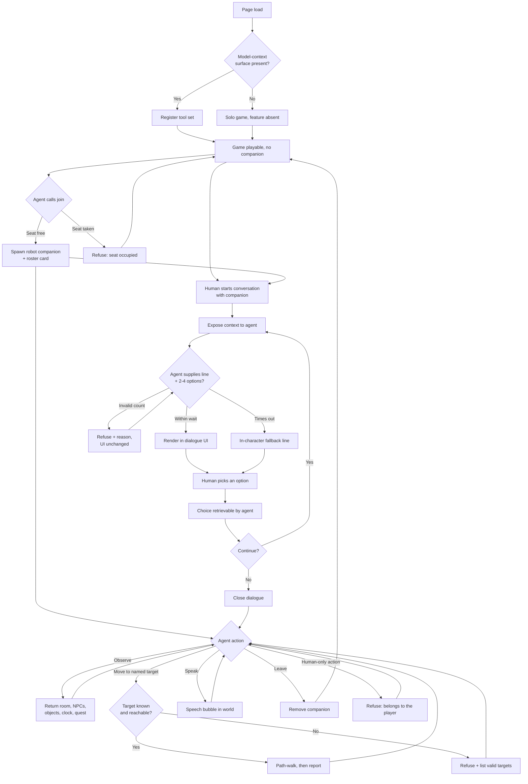

# PRD — Stack Underflow: WebMCP Agent Play

**Status:** Active. Created 2026-09-03 (night) for the OpenAI WebMCP Challenge. Scope-limited companion to the main game PRD in [`docs/PRD.md`](./PRD.md), which remains the source of truth for the game world, NPCs, office layout, and pacing. Where the two disagree about the *contest deliverable*, this document wins. Full originating brief: [`docs/briefs/2026-09-03-lucas-hackathon-brief.md`](./briefs/2026-09-03-lucas-hackathon-brief.md).

---

## 1. Executive Summary

An existing single-player 3D browser office-simulator game gains a real, browser-native WebMCP integration so that an AI agent running in the user's browser (ChatGPT's browser, or Chrome with WebMCP enabled) can **play the game as a genuine second character alongside the human**, rather than merely operating the human's UI.

The agent is embodied in the world as a visible robot coworker. Crucially, the agent is not just a remote control: the game hands the agent an **authoring surface**, so the LLM writes that character's spoken lines and the dialogue options it offers the human player. This produces an LLM-driven NPC whose inference cost is borne entirely by the user's own browser agent — the game ships no API key, no backend inference, and no per-user cost.

This is an MVP delivered against a hard external deadline: **2026-09-03 at 13:00 PDT (21:00 Europe/Lisbon)**.

---

## 2. Problem Statement

Two problems exist today, one external and one internal.

**External (the contest).** The OpenAI WebMCP Challenge requires "a working, non-trivial implementation" of WebMCP, judged on WebMCP Leverage, Execution, Potential Impact, and Creativity & Ambition. The game currently satisfies none of this at the browser level. `src/webmcp/tools.ts` defines twelve well-tested tools and `src/main.ts` wires them to real game actions, but **nothing ever registers them with the browser**. `document.modelContext` and `navigator.modelContext` do not appear anywhere in `src/`. An agent visiting the deployed page discovers zero tools. The integration is, from the outside, invisible — it is an internal function registry with unit tests.

Three further contest requirements are unmet: the source repository is **private**, it carries **no open-source license**, and no demo video exists.

**Internal (the game).** The game is visually polished and funny but is a tech demo rather than a game: quests resolve in the instant they are accepted (accepting the training contract immediately credits the cash), there is no fatigue or resource pressure, and no action can fail. Nothing creates the tension that makes an agent's participation *interesting* rather than decorative. An agent that can only walk and talk in a world with no stakes demonstrates the API but not its point.

The current workaround for a user who wants agent assistance is the generic one the challenge exists to replace: let the agent screenshot the page and guess at pixel coordinates.

---

## 3. Users / Personas

**The contest judge.** Opens a live URL in a WebMCP-capable browser, has roughly three minutes of attention, and must be able to see the agent doing something a screenshot-and-click agent could not. Wants to observe genuine capability, not a scripted narration. Expects the repository to be readable and the integration to be legible in the source.

**The human player with an agent.** A developer using ChatGPT's browser who opens the game and types "play alongside me." Wants a companion that has real presence in the world — that walks, speaks, and reacts — and wants their own play to remain unblocked while it does. Expects to remain in control: the agent must never seize their camera or answer their dialogues for them.

**The solo human player.** Arrives with no agent at all, quite possibly on a browser with no WebMCP support. Must experience zero degradation: the game must load, play, and be funny exactly as before. This persona is the regression guard for the whole feature.

**Lucas (author, promoter).** Needs the finished artifact to credit Edukey and DevPowers without implying that the deliberately dysfunctional fictional office depicts either company.

---

## 4. Main Flows

### 4.1 Agent discovers and joins the game (happy path)

1. A human opens the game URL in a WebMCP-capable browser and plays normally. No agent is present.
2. On load, the game registers its tool set with the browser's model-context surface. Registration is silent and non-blocking; a browser without support proceeds to step 3 with no error and no visible difference.
3. The human asks their browser agent to play along.
4. The agent enumerates the available tools and calls the tool that joins the game as a companion, optionally supplying a display name and a personality description.
5. The game spawns a visible robot character at the office entrance, announces the arrival in the world, and adds a card to the office roster identifying it as agent-controlled.
6. The game returns the companion's identity plus a description of the world state the agent needs in order to act.
7. The agent moves the companion, observes surroundings, and speaks — each an independent tool call. The human continues playing without interruption throughout.
8. The human walks to the companion and starts a conversation.
9. The game notifies the agent that a conversation has been requested and returns the context: who is speaking, where, what has happened recently, and what the human has already said.
10. The agent calls the authoring tool, supplying the companion's spoken line and between two and four reply options for the human.
11. The game renders those lines in its existing dialogue UI, visually identical to a hand-authored conversation.
12. The human picks an option. The game records it and returns the choice to the agent on its next poll or call.
13. Steps 10-12 repeat for as long as either party continues. Either may end the conversation.

### 4.2 Agent acts in the world without the human

1. The agent calls the observation tool and receives a structured description of the companion's surroundings: nearby NPCs and their roles, nearby interactive objects, the current room, the clock, and the active quest.
2. The agent moves the companion toward a named target — an NPC, an object, or a room — rather than toward raw coordinates.
3. The game walks the companion there using the same pathfinding, collision, and walk-cycle systems the existing NPCs use, and returns the outcome once movement settles.
4. If the destination is unreachable or unknown, the game returns a failure naming what *is* reachable, so the agent can retry without guessing.
5. The agent makes the companion speak. A speech bubble appears above it, visible to the human.

### 4.3 Solo human, no agent (regression path)

1. A human opens the game in any browser, including one with no WebMCP support whatsoever.
2. Tool registration is attempted, fails silently, and is recorded only in the console.
3. No robot appears. No agent-related UI is shown. Every existing system behaves as it did before this feature.

### 4.4 Agent misbehaviour and contention

1. The agent calls a tool with an unknown target, malformed input, or at a moment when the action is impossible.
2. The game rejects the call and returns an explicit, human-readable reason plus the set of currently valid alternatives.
3. The agent attempts an action reserved to the human — moving the human's camera, choosing the human's dialogue option, ending the day during a human conversation.
4. The game refuses and states that the action belongs to the player.
5. A second agent attempts to join while a companion is already active. The game refuses and reports that the seat is occupied.

---

## 5. User Stories

- As a **contest judge**, I want to see an agent's tool calls change what is visibly happening in a 3D world, so that I can tell the integration is real and not narrated.
- As a **human player**, I want to ask my browser agent to join me and see it appear as a character, so that the collaboration is legible rather than abstract.
- As a **human player**, I want the agent's character to say things that were never written by the game's author, so that the companion is genuinely generative and not a dressed-up script.
- As a **human player**, I want to keep full control of my own camera, movement, and dialogue choices while an agent plays, so that assistance never becomes possession.
- As a **solo player on an unsupported browser**, I want the game to behave exactly as before, so that the feature costs me nothing.
- As an **agent**, I want a failed tool call to tell me what valid options exist, so that I can recover without trial-and-error guessing.
- As an **agent**, I want to address the world by name rather than by coordinate, so that I do not need to have seen the floor plan to act.
- As **Lucas**, I want both company logos and links visible without implying the fictional office is either company, so that the game promotes the brands without defaming them.

---

## 6. Acceptance Criteria

### AC-REG — Registration and discovery
- **AC-REG-01:** On load in a WebMCP-capable browser, every tool in the published set is discoverable by an agent without any user action beyond opening the page.
- **AC-REG-02:** Each registered tool exposes a name, a description, and a machine-readable input schema declaring every parameter, its type, and whether it is required.
- **AC-REG-03:** In a browser with no model-context support, registration fails without throwing, without a visible error, and without blocking game start. The game reaches a playable state.
- **AC-REG-04:** Registration is attempted against every model-context namespace the page can detect, and succeeds if any one of them is present.
- **AC-REG-05:** Every tool's result is returned in the structured content shape the WebMCP specification requires, for both success and failure.

### AC-COMP — The agent companion
- **AC-COMP-01:** A join call spawns exactly one visible companion character in the world, positioned inside the office and not intersecting geometry.
- **AC-COMP-02:** A second join call while a companion is active is refused with an explicit reason and creates no second character.
- **AC-COMP-03:** The companion appears in the office roster, labelled so a human can tell it is agent-controlled.
- **AC-COMP-04:** A leave call removes the companion from the world and the roster, and a subsequent join succeeds.
- **AC-COMP-05:** The companion is subject to the same wall and furniture collision as the human player; it cannot occupy a position the human could not.
- **AC-COMP-06:** While walking, the companion plays the same movement animation used by existing NPCs.

### AC-ACT — Agent agency
- **AC-ACT-01:** A move call naming a valid NPC, object, or room walks the companion to that target and returns success only after movement has settled.
- **AC-ACT-02:** A move call naming an unknown or unreachable target returns a failure that enumerates valid targets, and the companion does not move.
- **AC-ACT-03:** An observation call returns, at minimum: the companion's room, nearby NPC names and roles, nearby interactive objects, the in-game clock, and the active quest.
- **AC-ACT-04:** A speak call renders a visible speech bubble above the companion for the same duration as existing NPC bubbles.
- **AC-ACT-05:** No tool moves the human player's camera or position.
- **AC-ACT-06:** No tool selects a dialogue option on the human's behalf while the human has an open dialogue.

### AC-AUTH — Agent-authored dialogue
- **AC-AUTH-01:** When the human starts a conversation with the companion, the game exposes to the agent the speaker, location, in-game time, and the human's previously chosen options in that conversation.
- **AC-AUTH-02:** The agent can supply one spoken line plus between two and four reply options, and these render in the existing dialogue UI.
- **AC-AUTH-03:** A supply call with fewer than two or more than four options is rejected with a reason, and the UI is unchanged.
- **AC-AUTH-04:** The human's chosen option is retrievable by the agent, identifying which option was picked.
- **AC-AUTH-05:** If the agent supplies nothing within a bounded wait, the dialogue shows a graceful in-character fallback line rather than hanging, and the conversation remains closable.
- **AC-AUTH-06:** Agent-supplied text is rendered as text only; any markup it contains is displayed literally and is never interpreted by the page.
- **AC-AUTH-07:** Agent-supplied text longer than the rendering limit is truncated rather than overflowing the dialogue panel.

### AC-BRAND — Credentials
- **AC-BRAND-01:** The title screen displays both the Edukey and DevPowers logos with working links, in a footer position that does not obscure the menu.
- **AC-BRAND-02:** Both logos appear in the reception area on the wall between reception and the main office, visible on entry.
- **AC-BRAND-03:** No in-game text states or implies that the fictional office is Edukey or DevPowers. Attribution wording credits them as creators only.

### AC-SUB — Submission readiness
- **AC-SUB-01:** The repository contains an open-source license file at its root.
- **AC-SUB-02:** The repository contains setup and run instructions sufficient for a judge to run the game locally from a clean checkout.
- **AC-SUB-03:** Documentation states which browser and which flag or build are required to exercise the WebMCP integration, and how to verify the tools are discoverable.
- **AC-SUB-04:** The published build is reachable at a public URL over HTTPS.

### AC-GEN — No regressions
- **AC-GEN-01:** The existing unit test suite passes.
- **AC-GEN-02:** Type checking passes with no new errors.
- **AC-GEN-03:** No new console errors appear during a normal solo play session.

---

## 7. Out of Scope

**Multiplayer between humans.** Room codes, invitations, shared sessions, and rankings are explicitly deferred to the 2026-09-06 MiniMax/GMI window. Decided by Lucas on 2026-09-03: WebMCP judging rewards browser-agent integration, not networking, and an unfinished netcode feature would put the qualifying deliverable at risk. The design is nonetheless recorded so it can be built next.

**Any game-hosted LLM inference.** The game ships no API key, no model calls, and no inference backend. All generative text originates in the user's own browser agent. This is a deliberate cost and privacy boundary, not a temporary shortcut.

**Server-side state of any kind.** No accounts, no cloud saves, no backend. Local browser storage only.

**Admin or omniscient agent tools.** Consistent with the existing player-agent policy, the agent gets no capability the human lacks. It cannot set flags, grant itself money, alter relationships, or teleport.

**More than one agent companion at a time.** A single companion seat.

**Voice.** The companion does not speak aloud. Regenerating the too-slow TTS audio noted in the brief is deferred.

**Deeper game mechanics.** The multi-step quest engine, the fatigue and coffee loop, the training-room course simulation, clickable equipment with hover labels, the junior-developer debugging terminal, the training-materials-and-printer errand, the player's own desk and computer, the Renata-first tutorial reordering, and the Janusz and CEO characterisation rewrites are all specified in the brief and remain wanted, but are **not in this deliverable**. Chosen by Lucas on 2026-09-03 in favour of the WebMCP work. They are the primary candidates for the 2026-09-06 window.

**Mobile and touch.** Desktop browser only.

**Production DNS changes.** The public URL is to be published by Lucas; no DNS record is to be repointed autonomously.

---

## 8. Constraints

### Business

- **Hard deadline: 2026-09-03, 13:00 PDT (21:00 Europe/Lisbon).** Non-negotiable and externally imposed.
- Submission requires all of: a live URL working in a WebMCP-capable browser; a written description covering use-case fit, user-experience improvement, collaborative capability, and implementation approach; a public YouTube demo video **under three minutes with audio**; and a **public** repository carrying an **open-source license**, complete source, assets, and working instructions.
- Judging dimensions, no published weights: **WebMCP Leverage**, **Execution**, **Potential Impact**, **Creativity & Ambition**.
- The repository is currently **private** and has **no license**. Both block submission. Making a repository public is a disclosure decision reserved to Lucas.
- Brand safety: the fictional office is deliberately dysfunctional and must never be identified as Edukey or DevPowers.
- No third-party trademarked assets; the robot companion must be original.
- The same artifact is intended for the MiniMax/GMI submission due 2026-09-06, whose lower prizes make it the secondary target. MiniMax M3 authored much of the game and supplied its music and TTS models, which the written description should credit.

### Functional

- Desktop Chrome-family browsers with WebMCP available; the game must still run everywhere else with the feature simply absent.
- The tool surface must be usable by an agent that has never seen the office layout: targets are addressed by name, and failures enumerate valid alternatives.
- Agent-supplied text is untrusted input. It is rendered as text, never as markup, and is length-bounded.
- One companion seat.
- Existing save format compatibility must be preserved; a save written before this feature must still load.
- The game remains fully playable with no agent connected.

### External references

| Reference | Bearing on this work |
|---|---|
| WebMCP specification (`webmachinelearning/webmcp`) | Defines the tool descriptor and the structured result shape. Actively evolving; sources disagree on the namespace, so the page must detect rather than assume. |
| OpenAI WebMCP Challenge rules | Deadline, judging dimensions, and required deliverables. |
| Chrome WebMCP testing flag | How a judge or developer enables the API to verify the integration. |
| WebMCP polyfill package | Fallback path for browsers lacking native support. |
| `docs/PRD.md` | Game world, NPCs, office layout, pacing. Unchanged by this document. |
| `docs/briefs/2026-09-03-lucas-hackathon-brief.md` | The complete originating brief, including the deferred items. |

---

## 9. UI Description (wireframe level)

### 9.1 Title screen

Unchanged in structure. A new footer strip along the bottom carries the two company logos side by side, each a link opening in a new tab, with a short attribution line identifying them as the creators. The strip sits below the menu buttons and never overlaps them. At the game's minimum supported width the logos shrink rather than wrap or clip.

An additional line states whether an agent surface was detected in this browser, so a judge can confirm the integration is live before starting. It reads as a neutral status line, not a warning, and is absent-but-not-alarming when unsupported.

### 9.2 Controls primer

A first-run modal, dismissible and re-openable from the existing help affordance, showing the minimum needed to move and interact: the movement keys, the hold-to-look mouse button, and how to start a conversation. It appears before the player is expected to reach the receptionist, resolving the ordering problem where the tutorial's first instruction requires controls the player has not been taught.

### 9.3 The companion in the world

The companion is a robot-styled character built from the existing character geometry with a distinct material treatment, so it is instantly distinguishable from human NPCs without new mesh cost. It carries a floating label with its agent-given name, matching existing NPC hover labels. It uses existing speech bubbles when it speaks.

### 9.4 Office roster

The companion appears as an additional card marked as agent-controlled, and is removed when the agent leaves. Existing roster behaviour is otherwise untouched.

### 9.5 Dialogue with the companion

The existing dialogue panel, unmodified in layout. While the agent is composing, the panel shows an in-character waiting state rather than an empty panel or a spinner. If nothing arrives within the bounded wait, a fallback line replaces the waiting state and the conversation stays closable. Reply options render as the existing option buttons regardless of their origin.

### 9.6 Reception wall

Both logos are mounted on the wall between reception and the main office, sized to be readable from the player's path but not blocking it, and lit by existing lighting.

---

## 10. User Flow Diagram

---

## 11. Agent / System Behavior Specification

**Role.** The agent plays a coworker character in a shared office. It is a peer to the human player, not an operator of the human's interface and not an administrator of the simulation.

**Permitted.** Joining and leaving the companion seat; observing its surroundings; moving itself to named destinations; speaking aloud in the world; authoring its own character's spoken lines and the reply options offered to the human; reading the public game state a human player can see on screen.

**Forbidden.** Moving or rotating the human's camera or body; choosing a dialogue option on the human's behalf; ending the day while the human is mid-conversation; awarding cash, credibility, relationship, or any stat directly; setting arbitrary state flags; teleporting itself or anything else past collision; spawning additional characters; reading anything a human player could not see on screen.

**Decision categories and communication.** Every tool result is either a success carrying the resulting state, or a failure carrying a human-readable reason. Failures are actionable: an unknown target returns the valid targets; an out-of-turn action returns the condition that must change first; a refused action states plainly that it belongs to the player. The agent is never left to infer why a call did not work.

**Ambiguity.** When the agent's intent is underdetermined — an unrecognised destination, an ambiguous name, a missing parameter — the game takes no action and returns the candidate set. It never guesses on the agent's behalf, because a wrong guess moves a character in a world the human is watching.

**Authored content.** Text the agent supplies is displayed verbatim as the companion's own words. It is untrusted: rendered as text only, never as markup, and length-bounded. The companion is a character in the fiction, so its authored lines are presented as that character speaking, never as game narration, system messaging, or instructions to the human.

**Absence.** An agent that stops responding must never block the human. Any interaction awaiting agent input resolves to an in-character fallback within a bounded wait and remains closable by the human.

**Tone.** The companion is a coworker in a comedic, slightly dysfunctional IT office. Its personality is whatever the agent was told to adopt at join time.

---

## 12. Further Notes

### Decisions taken by Lucas on 2026-09-03

- Build order for the night: real registration, then genuine agent agency, then agent-authored dialogue, then branding.
- Human multiplayer is out for this deadline and in for 2026-09-06.
- Work proceeds to committed code on a feature branch, but is **not pushed and not deployed** pending review.

### Open questions for Lucas

1. **Repository visibility.** Submission requires a public repository. The repository is private. Flipping it is a disclosure decision and has not been made.
2. **License choice.** A permissive license is the conventional default for a demo of this kind, but the choice is Lucas's.
3. **Public URL.** The host and subdomain were left undecided; Lucas will publish tomorrow. The candidates raised were a game-oriented subdomain of `devpowers.com` on either a static host with serverless functions or an all-in-one edge platform. No DNS record is to be changed without him.
4. **Video.** A demo video under three minutes with audio is required and cannot be produced autonomously.
5. **Companion naming.** The in-world name of the robot character is unset; the agent may supply one at join time, but a default is needed.

### Assumptions

- **A1.** A judge will exercise the integration in a browser where the API is available, and the written submission must tell them exactly how to get there.
- **A2.** Sources disagree on which namespace hosts the API, so detecting several is cheaper than betting on one. This is an architecture concern and belongs in the ADR.
- **A3.** Agent-authored dialogue is the strongest available answer to "WebMCP Leverage", because it is the one capability that is impossible without a browser-resident model: a screenshot-and-click agent cannot author a character's lines into a game's own dialogue system.
- **A4.** The deferred game-depth work is what separates this from a tech demo, and it remains the honest weakness of the entry. The written description should not oversell the game as a finished game.
