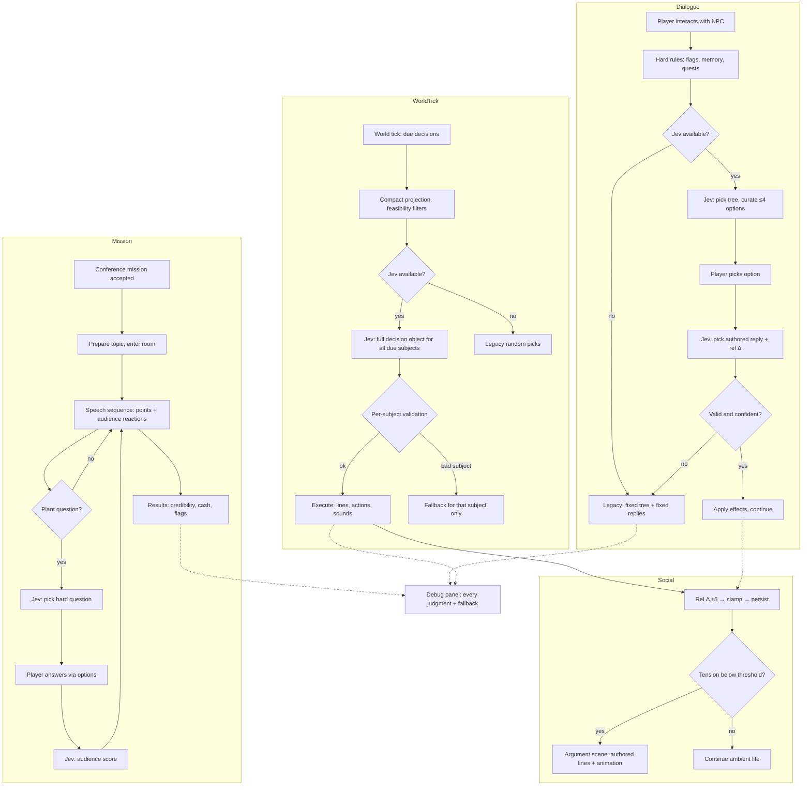

# PRD — Jev: AI-Steered NPC Decisions, Social Simulation & World Content for Stack Underflow

**Status:** Active — v2, 2026-09-28. Lucas's decisions on the v1 assumptions are
applied and recorded as CHANGELOG **C-75** (feedback L-2026-09-28-02). v1 history
(C-74, L-2026-09-28-01) remains in the changelog. Feature-level companion to the main
game PRD in [`docs/PRD.md`](./PRD.md) and to
[`docs/PRD-hackathon-webmcp.md`](./PRD-hackathon-webmcp.md). Research basis:
[`docs/research/2026-09-28-jev-typesafe-platform.md`](./research/2026-09-28-jev-typesafe-platform.md)
and
[`docs/research/2026-09-28-jev-npc-steering-analysis.md`](./research/2026-09-28-jev-npc-steering-analysis.md).

> **Development constraint:** all work stays on the local branch `feat/jev-npc-decision-steering`
> and **nothing is pushed** until Lucas explicitly approves (hackathon window closed;
> forking is the agreed fallback route if pushing ever becomes necessary).
>
> **Posture:** this is a **PoC of mechanics and playability, not a production build**
> (Lucas, C-75). Systems are built to be testable and replaceable; polish and
> hardening follow once the mechanics feel right.

---

## 1. Executive Summary

Stack Underflow gains three interlocking systems, all steered by the **Jev** judgment
layer (TypeSafe System One model):

1. **AI-steered decisions.** NPCs keep making every decision in-fiction; Jev only
   selects among **human-authored candidates** — reply lines, dialogue options,
   chatter exchanges, greetings, destinations, physical actions — using live game
   state. Jev can judge **many things at once**: one request may carry the relevant
   world state and return a full decision object covering every NPC and object due a
   decision in that tick (output tokens are free; input is compacted by the game).
   The batching shape (per-NPC vs whole-world) is built both ways and decided by
   measurement.
2. **Group social simulation.** Every character pair has a relationship value —
   not only player↔NPC but **NPC↔NPC** — moved by programmatic, bounded deltas
   (−5…+5 per judged action, dialogue or physical). Personalities, mood, and the
   relationship web drive visible outcomes: warm chats, cold shoulders, loud
   arguments, and (later) fights — grounded in established social-dynamics theory
   (Big Five traits, Heider balance, social-exchange reciprocity, valence/energy
   mood), so the world behaves like a group, not a set of independent scripts.
3. **A 10× content expansion** for **all 15 NPCs** — dialogues, story lines,
   missions, events, jokes, miseries — plus **non-dialogue interactions** (go
   somewhere, use equipment, repair, make coffee, with simulation and sounds) and a
   **conference-speech mission**: the player trains a room of mostly-background
   audience NPCs while planted questioners ask hard questions and put the trainer in
   uncomfortable spots. Jev steers reactions — verbal and physical — on both sides.

Every line remains authored. The game with Jev unavailable plays exactly as today.

---

## 2. Problem Statement

- **NPC replies never vary** and ignore history: one hardcoded reply per option, on
  every day, for strangers and best friends alike.
- **Relationships are a dead lever** (player↔NPC exists, influences nothing) and
  **NPC↔NPC relationships do not exist at all** — coworkers who chat every day have
  no opinion of each other, so no dynamics can emerge.
- **Ambient speech ignores the world** (uniform random pool picks) and **NPCs never
  act on needs or moods** — no one gets coffee because they need it, no one reacts
  to the firedrill that just fired.
- **Events are one-and-done visuals**; the 43 random events change state around NPCs
  without a single NPC visibly responding.
- **The world has no group dynamics**: no alliances, grudges, or drama; nothing can
  escalate into an argument because there is nothing to escalate.
- **Interaction is dialogue-only.** The office is full of equipment (coffee machine,
  dishwasher, printer, whiteboard) that cannot be used, and NPC "actions" are
  movement noise rather than purposeful behavior with feedback.
- **The content volume is placeholder-grade**: ~48 dialogue trees and ~210 options
  across 15 NPCs cannot carry a real game; missions beyond the tutorial are absent,
  and the game's core fantasy — training a real room of people — has no mission.
- **"More options" naively means UI clutter**: there is no mechanism to author a
  rich option pool and show only the situationally right few.

---

## 3. Users / Personas

**The solo player (primary).** Plays without any external agent, several in-game days
in a row. Wants the office to feel inhabited: coworkers who remember yesterday, gossip
about today, like and dislike each other, occasionally argue, and treat the player
differently as relationships evolve. Expects every line to stay as written.

**The returning player deep in the story.** Finished the tutorial arc, signed the
ACME contract, learned secrets. Expects warmer greetings from friends, guarded ones
from rivals, new options a first-day player never sees, and **missions** — go
somewhere, do something, interact, and eventually **give a speech to a conference
audience** that can be won or lost.

**Lucas (author, visual QA).** Needs to see the steering working per decision, tune
the social model from visible behavior, confirm the no-Jev game is exactly today's
game, and watch content volume grow without regressions. Requires the PR-2
screenshot/QA loop per phase.

**The WebMCP agent player (secondary).** Plays via the browser agent companion. When
the agent drives its own character, Jev must not fight it; for everyone else the
agent player gets the same livelier world.

---

## 4. Main Flows

### Flow A — Player dialogue with Jev steering

1. Walk-to-face plays as today. Hard rules (flags, first-meeting, quest state) narrow
   the plausible **dialogue trees**; the Jev judgment picks one.
2. The node's options are hard-filtered (flag-locked, already-picked removed); if
   more than 4 remain eligible, the Jev judgment curates which **up to 4** to show.
3. Player picks; the game collects the **authored reply candidates** for that pick;
   the Jev judgment selects one, conditioned on relationship, memory, period, mood,
   and today's events.
4. Effects apply exactly as authored; the conversation continues or ends as today.
5. If the picked option carries social weight, the judgment also returns a
   **relationship delta (−5…+5)** toward the player, applied by code through the
   existing reducer.

### Flow B — Ambient world tick (batched decisions)

1. Every few in-game seconds (and on every period transition), the game builds one
   compact **world projection**: who is present, who is due a decision, active
   conversations, today's fired events, current needs/mood of each NPC.
2. **One Jev request** returns a full decision object covering all due judgments at
   once — e.g. for each chatting pair: which exchange; for each idle NPC: whether to
   start a purposeful action; for any due greeting/goodbye: which line. (A per-NPC
   request shape also exists for comparison; the better shape per decision type is
   decided by measurement — Lucas's "test and decide".)
3. Each answer is validated individually; any invalid/missing answer falls back for
   **that NPC only**, without discarding valid answers for the others.
4. Code executes every decision: feasibility, cooldowns, animations, sounds, effects
   — exactly as any other game logic.

### Flow C — Jev unavailable (no key, offline, error, timeout, low confidence)

1. There is no separate offline decision system: **the fallback is today's code,
   preserved verbatim** — the historical fixed `nextNodeId` reply, the
   uniform-random pool pick, the weighted-random destination, the pre-Jev default
   action. Every Jev call site wraps that legacy pick as the fallback.
2. Fallback triggers: service unconfigured, unreachable, timed out within the
   ambient budget, rate-limited after retries, malformed/unknown answer, or low
   confidence on a consequential branch (low confidence on a cosmetic preference may
   still apply).
3. No UI change, no waiting, no frame stalls. In-game time never advances because a
   judgment is pending (dialogue already pauses the clock; ambient judgments run
   outside blocking overlays). Every fallback is marked in the debug panel.

### Flow D — Bringing your own access key (fallback access mode)

Unchanged from v1: Settings → "AI decisions (Jev)" → Server (default) or Personal
key; masked input, test call, status line; key stored only in browser local storage,
never displayed, logged, or exported again. Mode switch takes effect on the next
judgment without a reload.

### Flow E — Observing the steering (QA)

Debug panel (developer toggle, off by default, not persisted): newest-first rows with
time, subject (NPC/pair/object), surface ("reply", "options", "tree", "chatter",
"greeting", "destination", "action", "mission", "social"), chosen candidate
identifier, confidence, latency, fallback flag, and — for social judgments — the
applied relationship/mood deltas. Identifiers and numbers only (screenshots safe).

### Flow F — Physical and environmental interactions

1. Interactive points exist in the world (coffee machine, dishwasher, printer,
   whiteboard, supply shelf, and other existing props). The player gets a use prompt
   when near; NPCs can be steered to use them too.
2. Using equipment produces **feedback**: animation (reusing existing
   walk/gesture/movement clips plus simple prop interactions), **sound**, and a
   state effect (coffee restores caffeine; a broken printer blocks Renata's errand
   until repaired).
3. Some props can enter a **fault state** (jam, empty, broken); an NPC or the player
   must fix them — a small repair interaction (hold/press sequence or minigame hook).
4. Jev steers *who does what, when* (an NPC with low caffeine heads for the coffee
   machine; the janitor's robots keep their own logic); code owns feasibility,
   timing, and effects. NPC-initiated actions play a visible walk → use → return
   sequence with sounds.

### Flow G — Conference-speech mission (the trainer's core fantasy)

1. A mission becomes available through the quest layer (e.g. client training day):
   the player prepares (chooses a topic from unlocked material) and enters the
   **conference room**, where an **audience of background NPCs** is seated.
2. Audience members are mostly non-interactive atmosphere (fill seats, react,
   murmur, leave). A **few are plants**: during the speech they raise hard questions
   — authored pools of uncomfortable questions, chosen by Jev to fit the player's
   topic, credibility, and audience mood — putting the trainer on the spot.
3. The speech itself is a playable sequence: the player advances talking points and
   answers questions via **options** (never free text). The Jev judgment scores each
   answer for this audience (engagement / hostility / boredom) and the crowd reacts
   both verbally (murmur lines, applause, a sharp remark) and physically (leans,
   phone-checks, walks out, applauds — movement/gesture animations).
4. Mission outcome (credibility, cash, relationship effects, follow-up flags) is
   computed by the existing quest/economy systems from the accumulated scores.
5. The mission is replayable with variation: Jev varies which questions get asked
   and which reactions play, so no two speeches are identical.

### Flow H — Group social dynamics (NPC↔NPC)

1. Every character pair (including NPC↔NPC) has a relationship value; the game
   seeds plausible starting values (role/archetype: manager↔assistant warm,
   sales↔engineering rivalrous) instead of flat 50s.
2. Judged actions — dialogue picks between NPCs, player actions affecting a
   witness, shared events — move the relevant values by bounded deltas. Code clamps,
   applies, persists.
3. Each NPC has a small authored **personality profile** (Big Five-style traits) and
   a short-term **mood** (valence/energy) that decays to baseline within the day.
4. When tension accumulates (low relationship + adverse mood + a trigger), the game
   escalates: a **loud argument** — a verbal exchange from authored argument pools
   plus physical animation (face-off, gestures, storming off), heard by nearby NPCs
   (bubbles) and remembered by witnesses. Physical fights are a later animation
   milestone; arguments ship first.
5. The relationship web also feeds positive dynamics: friends seek each other at
   lunch, friends-of-friends warm up, a colleague may defend another in a dialogue
   option.

---

## 5. User Stories

- **As a solo player,** I want NPCs to pick different authored replies based on our
  history, my stats, and their mood, so that conversations feel like talking to a
  person.
- **As a returning player,** I want warmer greetings, new dialogue options, and new
  missions a stranger never sees, so that my past choices visibly matter.
- **As a player who watches the office,** I want coworkers to chat about what
  actually happened today, get coffee when they need it, and sometimes argue loudly
  with each other, so that the world feels alive when I am not interacting.
- **As a player who likes systems,** I want to sense who likes whom and steer it —
  befriend one clique without offending another — so that the office is a sandbox of
  relationships, not a wallpaper.
- **As a player who wants to *do* things,** I want to use the office — make coffee,
  fix the printer, use the whiteboard — with feedback and sounds, so that the
  simulator part of "simulator business game" is real.
- **As the trainer,** I want to give a conference speech to a room that listens,
  gets bored, asks hard questions, and applauds or walks out, so that the game's
  core fantasy has stakes and replay value.
- **As a player without an AI key (or offline),** I want the game to behave exactly
  as today, so that nothing I rely on breaks or waits.
- **As Lucas doing visual QA,** I want a toggleable panel showing every judgment
  with confidence, latency, fallbacks, and applied social deltas, so that I can
  verify the simulation from screenshots.

---

## 6. Acceptance Criteria

**Dialogue steering (v1 set, unchanged)**

- **AC-01:** Every line an NPC says comes from the authored candidate set; no
  judgment ever introduces text that is not authored content.
- **AC-02:** For an NPC with multiple authored replies to the same player choice,
  replaying that choice across different relationship buckets produces different
  reply selections in a 20-trial run for at least two buckets.
- **AC-03:** With story flags and memory held constant, the steered selection is
  stable within a session for identical state.
- **AC-04:** The dialogue panel never shows more than 4 options; the curated subset
  is deterministic for the same state.
- **AC-05:** Flag-locked and already-picked options remain hard-gated.

**Ambient and batched decisions**

- **AC-06:** Chatter/greeting/goodbye selections draw only from authored pools and
  respect period gating.
- **AC-07:** On a day when a major event has fired, event-aware candidate exchanges
  are selected when they exist for the pair.
- **AC-08:** Steered destinations and actions are always within the feasible set for
  that NPC and period.
- **AC-09:** One request may return decisions for multiple subjects; an invalid or
  missing answer causes fallback **only for its own subject** — valid answers for
  other subjects in the same response are still applied.

**Fallback and resilience**

- **AC-10:** With no key, no network, provider error, or timeout beyond the ambient
  budget, every judgment point uses the preserved pre-Jev behavior with no visible
  difference from the current release.
- **AC-11:** No judgment blocks or freezes the game; in-game time never advances
  due to a pending judgment.
- **AC-12:** A malformed or unknown judgment result is treated as "no judgment" and
  logged as a fallback.

**Key management**

- **AC-13:** The personal key field masks input, validates with a test call, and is
  never displayed in clear text again, never written to the save, and never included
  in logs, exports, or panel content.
- **AC-14:** Switching access modes takes effect on the next judgment without a
  page reload.

**Social simulation**

- **AC-15:** Every character pair has a relationship value; starting values are
  seeded by archetype and differ across pairs (not flat 50).
- **AC-16:** A single judged action moves a relationship by at most ±5; values are
  clamped and persist through save/load.
- **AC-17:** NPC mood (valence/energy) decays to the NPC's baseline within one
  in-game day.
- **AC-18:** When a pair's relationship is below the argument threshold and an
  adverse trigger occurs while both are present, an argument scene plays: authored
  verbal exchange plus physical animation, visible/audible to nearby NPCs, with a
  cooldown preventing loops.
- **AC-19:** NPC↔NPC relationship values measurably influence at least one visible
  behavior (chatter/greeting selection or destination choice) before any argument
  logic fires.

**Physical interactions**

- **AC-20:** At least three usable equipment points exist (e.g. coffee machine,
  printer, whiteboard) with a use prompt, animation, **and sound feedback**.
- **AC-21:** At least one equipment fault state exists (e.g. printer jam) that an
  NPC or the player can trigger interaction on to repair; while faulted, the
  dependent behavior is visibly blocked.
- **AC-22:** NPCs can be steered to use equipment as a purposeful action (walk →
  use → return) initiated by a judgment, not only by script.

**Conference mission**

- **AC-23:** A conference mission exists in the quest layer with preparation and a
  speech sequence in the conference room, with a seated **audience of background
  NPCs**.
- **AC-24:** During the speech, at least 2 planted questioners ask questions from
  authored hard-question pools, selected to fit topic/credibility/audience mood.
- **AC-25:** Player answers are given via options; each answer produces a visible
  verbal and physical audience reaction; mission outcome affects credibility, cash,
  and flags through the existing systems.
- **AC-26:** Two runs of the same mission with different answers produce different
  question sequences and reactions.

**Content volume (10× expansion)**

- **AC-27:** Total authored dialogue volume (nodes + options + candidate replies)
  for the NPC roster is at least 10× the C-74 baseline (~218 nodes / ~210 options),
  verified by a counted unit test, spread across **all 15 NPCs**.
- **AC-28:** Every NPC owns: multiple dialogue trees with candidate reply pools,
  topic-specific chatter lines, morning/evening line pools, at least one personal
  story arc (mission or multi-day storyline), jokes, and at least one misery/complaint
  thread.
- **AC-29:** All new content passes the data-shape unit tests (types, ids, effect
  references, flag references) and contains no unauthored text.

**Observability**

- **AC-30:** The debug panel shows surface, subject, chosen candidate id,
  confidence, latency, fallback flag, and applied relationship/mood deltas;
  identifier-only content; off by default.

---

## 7. Out of Scope

**Machine-generated dialogue.** Jev never writes lines; no generative model joins NPC
speech. (Agent-authored companion lines via WebMCP remain the one co-authorship path,
unchanged.)

**New skeletal art.** Arguments, audience reactions, and equipment use reuse the
existing rigs: walking, gestures, facing, prop manipulation, particle/sound. New
authored *animations* are limited to recombinations and simple movement choreography
("people moving somewhere"), not new character rigs.

**Multiplayer / MMORPG (C-25).** Still vision-only.

**Mobile, localization, non-English dialogue.** Unchanged.

**WebMCP tool API changes.** The agent contract stays frozen.

**Voice/TTS changes.** Existing audio scope rule (C-20) still applies.

**Physical fights.** Explicitly a later animation milestone after arguments prove
the escalation pipeline (Flow H ships with arguments only).

**ADR-level technical choices.** Provider routing, batching measurement design,
calibration harness, and save-schema mechanics are decided in ADR-0009, not here.

---

## 8. Constraints

### Business

- **Local-only development** until Lucas approves a push; nothing leaves this
  machine (hackathon window closed, L-2026-09-28-01).
- **Authored-content identity.** All dialogue remains authored; the feature is
  presentable as "AI steers, humans write".
- **PoC posture.** Mechanics and playability first (C-75); production hardening
  (proxy deployment, calibration sign-off) follows later.
- **Data boundary (Edukey SACS).** Only fictional game state is sent to the external
  judgment service. No real user identity, machine details, or credentials.

### Functional

- **Display limit:** at most 4 dialogue options visible at once.
- **Relationship deltas:** at most ±5 per single judged action; clamped to the
  0–100 scale; persisted.
- **Mood:** bounded valence/energy per NPC; decays to baseline within the in-game
  day.
- **Ambient budget:** the world-tick decision round resolves or falls back within
  the tick budget (target ≤ 700 ms) so the chatter cadence is never visibly delayed.
- **Batching:** both per-surface and world-tick request shapes must be implementable
  behind the same decision interface; the shipped default is chosen from measurement,
  not preference (C-75).
- **Content:** authored in English; all content validates against typed schemas;
  candidate coverage guaranteed (at least one fallback candidate per judgment).
- **External service limits (Jev via OpenRouter, jev-1.13):** ~1,200 requests/minute,
  64k-token request context, input-only pricing at $0.042/Mtok. Compaction of world
  state is mandatory ("context rot": irrelevant state degrades accuracy); batching
  exploits free output tokens, but input size per tick is the cost to watch in PoC.

### External document / data references

| Document | Path | When used |
| --- | --- | --- |
| Platform research (Jev) | `docs/research/2026-09-28-jev-typesafe-platform.md` | ADR; limits, jaggedness, cost |
| Game decision-point analysis | `docs/research/2026-09-28-jev-npc-steering-analysis.md` | ADR; surfaces S1–S9 and seams |
| Main game PRD | `docs/PRD.md` | World/NPC/pacing ground truth |
| WebMCP feature PRD | `docs/PRD-hackathon-webmcp.md` | Agent-companion coexistence |
| Decision records | `docs/CHANGELOG.md` C-74, C-75; `docs/LUCAS-FEEDBACK-INDEX.md` L-2026-09-28-01/02 | Origin and decisions |
| Edukey skills | `jev-decision-routing`, `typesafe-ai` | Judgment-design rules, calibration harness |

---

## 9. UI Description (wireframe level)

### Settings → "AI decisions (Jev)" (unchanged from v1)

Two-mode selector (Server default / Personal key), masked key input, test button,
status line ("Connected — model jev-1.13" / error reason). No reload on switch.

### Decision debug panel (extended)

Right-side column, newest first, one row per judgment: `time · subject · surface ·
chosen: id · conf · ms · fallback?` plus, when a social judgment applied,
`rel Δ±n (pair) · mood Δ`. Cap ~20 rows. Identifiers/numbers only; off by default.

### Dialogue panel (behavioral change only)

Same layout; still ≤4 options; difference is only *which* authored reply/options
appear.

### Interaction prompt (new)

When near a usable prop: a single-line prompt ("E — Use coffee machine" / "E — Fix
printer"). While an NPC uses equipment, a small status label may appear ("Klaudia is
making coffee"). Faulted props show a distinct prompt ("E — Fix printer (jammed)").

### Conference mission screens (new)

- **Preparation card** (modal): mission title, chosen topic selector (unlocked
  topics only), "Start speech" button, cancel.
- **Speech view** (in-world, conference room): the audience visible in seats; a
  bottom panel shows the current talking point, an audience-mood meter
  (engagement), and up to 4 answer options when a question is raised; plant
  questions appear as a highlighted audience line ("Marcin from Finance: 'Why should
  we trust these numbers?'"). End of mission: results card (credibility change,
  payment, audience quotes) with "Continue".
- **Failure state:** audience disengages (many walk out); results card shows the
  failed outcome; quest remains retryable per its rules.

### HUD

Unchanged in invisible-fallback mode; no badge (C-75 A4).

---

## 10. User Flow Diagram

---

## 11. Agent / System Behavior Specification (Jev as the decision system)

**Role and purpose.** Jev is the bounded judgment layer between hard rules and
authored content. It converts live game state into selections and social deltas. It
is a judge of *given* options, never an author.

**Allowed to do**

- Answer many independent questions in one request over shared state — including a
  full **decision object for multiple NPCs/objects at once** (world-tick batching);
  each answer is validated independently on arrival.
- Select exactly one option from the candidate set supplied per question, or answer
  yes/no/degree questions (audience engagement, "would this NPC react?", "would
  these two argue now?").
- Return **bounded relationship deltas** (−5…+5) as part of a judged action, and
  short-term mood shifts, which code clamps and applies.
- Receive per-NPC compact state: relationship values (as named bands plus the pair
  value), memory summary, Big-Five-style personality profile, current mood, period,
  today's events, candidate definitions with descriptions.

**NOT allowed to do**

- Generate, rewrite, extend, or reword any text; every string is authored.
- Perform arithmetic, counting, or date/time math — the game pre-computes named
  facts ("relationship: strained", "times met today: 3", "caffeine: low").
- See or select infeasible actions: feasibility, cooldowns, periods, permissions are
  filtered by code before candidates are built.
- Directly change game state: cash, stats, flags, saves, clock. Judgments are
  advisory; existing systems apply all effects.
- Override the WebMCP agent's authorship of its companion character, or any
  player-controlled behavior.
- Escalate beyond the configured bound: deltas outside −5…+5 are clamped by code;
  an argument is triggered by *code-owned thresholds*, never declared unilaterally
  by a judgment.

**Decision categories and communication.** Surfaces: tree opening, option curation,
reply selection, chatter exchange, greetings, destinations, purposeful actions
(equipment use), mission question selection, mission answer scoring, social
deltas/mood, argument triggering judgments. Applied silently in-world; visible to
Lucas only via the debug panel (identifiers, confidence, latency, fallbacks, deltas).

**When it cannot decide.** Unconfigured, unreachable, timed out, rate-limited,
malformed, unknown id, or low confidence on a consequential branch → discard that
judgment and run the preserved legacy pick for that subject only. Cosmetic
preference choices may apply at low confidence. Every fallback is logged.

**Off-scope requests and adversarial input.** All candidates are authored; player
and agent text never becomes instructions to Jev. Mission questions come from
authored pools; audience mood is a bounded game state. Crafted text cannot steer
anything outside the authored id space.

**Language and tone.** Questions and criteria authored in English, in the game's
ironic-office tone where the judgment depends on it; all NPC-facing output remains
the authored lines themselves.

---

## 12. Decisions applied from Lucas's review (C-75) and remaining open items

**Resolved (supersede v1 assumptions A1–A6):**

- **A1 → Full roster + 10× content + physical reactions + missions.** Content
  expansion covers **all 15 NPCs** (dialogues, stories, missions, events, jokes,
  miseries) at **≥10× current volume**, plus animation candidates expressed as
  movement/gesture choreography, and the **conference-speech mission** with an
  audience of background NPCs and planted hard questioners. Jev steers verbal *and*
  physical reactions to simulate a living world.
- **A2 → Non-dialogue interactions + whole-world batching to be tested.** Equipment
  use, repair, coffee, sounds (Flow F). Jev may return **full multi-subject decision
  objects** for the whole state at once (free output tokens); the game compacts input
  and validates per-subject. Per-surface vs world-tick shapes both get built behind
  one interface and decided by measurement.
- **A3 → Both access modes.** Server proxy (production path) + personal-key mode
  (local/hackathon path).
- **A4 → Invisible fallback, implemented as preserved legacy code paths** (Flow C):
  no new offline decision trees, no hardcoded chains — the pre-Jev mechanics *are*
  the fallback, wrapped at every call site.
- **A5 → All-pairs relationships, programmatic deltas, social-dynamics grounding.**
  NPC↔NPC matrix seeded by archetype; bounded −5…+5 deltas from judged dialogue and
  physical actions; arguments (then fights) as escalation; theory base for the ADR:
  Big Five (OCEAN) traits, Heider structural balance (triads), social-exchange
  reciprocity, valence/energy mood.
- **A6 → Debug panel ships in MVP** (extended with social deltas).

**Open items for the ADR / PoC (not user decisions):**

- Batching shape default and tick cadence (measured, AC-09/08).
- Argument choreography scope for PoC (which existing clips; storm-off vs face-off).
- Content authoring pipeline tooling (draft → validate → review) and per-NPC batch
  ownership to avoid shared-file races.
- Per-surface confidence thresholds (calibration harness on labeled cases before
  any consequential branch goes live).
- Whether the conference mission is one Beads deliverable or two (mission system vs
  audience simulation) — split at ADR time if implementation order demands.

**Next step per the write-prd process:** this PRD is input to ADR-0009
(`write-adr`), then the parallel implementation plan.
