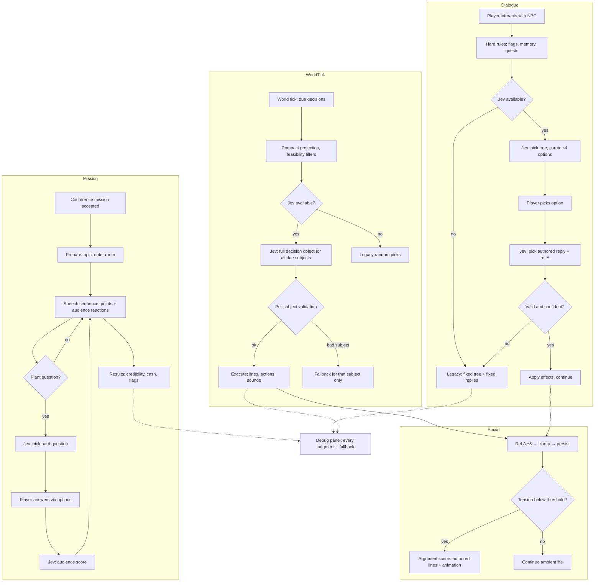

# PRD — Jev: AI-Steered NPC Decisions, Social Simulation & World Content for Stack Underflow

**Status:** Active — **v2.2**, 2026-09-30 (Wave 2 scope: C-77 — dialogue architecture v2, massive-scale chatter selection, positional audio). Lucas's decisions on the v1 assumptions are
applied and recorded as CHANGELOG **C-75** (feedback L-2026-09-28-02); the independent
review findings (Codex/gpt-6-astra, Claude/Opus — see
[`docs/reviews/2026-09-28-jev-review-triage.md`](./reviews/2026-09-28-jev-review-triage.md))
are incorporated. v1 history (C-74, L-2026-09-28-01) remains in the changelog. Feature-level companion to the main
game PRD in [`docs/PRD.md`](./PRD.md) and to
[`docs/PRD-hackathon-webmcp.md`](./PRD-hackathon-webmcp.md). Research basis:
[`docs/research/2026-09-28-jev-typesafe-platform.md`](./research/2026-09-28-jev-typesafe-platform.md)
and
[`docs/research/2026-09-28-jev-npc-steering-analysis.md`](./research/2026-09-28-jev-npc-steering-analysis.md).

> **Development constraint:** all work stays on the local branch `feat/jev-npc-decision-steering`
> and **nothing is pushed** until Lucas explicitly approves (hackathon window closed;
> forking is the agreed fallback route if pushing ever becomes necessary).
>
> **Posture:** this is a **PoC of mechanics and playability, not a production build**
> (Lucas, C-75). Systems are built to be testable and replaceable; polish and
> hardening follow once the mechanics feel right.

---

## 1. Executive Summary

Stack Underflow gains three interlocking systems, all steered by the **Jev** judgment
layer (TypeSafe System One model):

1. **AI-steered decisions.** NPCs keep making every decision in-fiction; Jev only
   selects among **human-authored candidates** — reply lines, dialogue options,
   chatter exchanges, greetings, destinations, physical actions — using live game
   state. Jev can judge **many things at once**: one request may carry the relevant
   world state and return a full decision object covering every NPC and object due a
   decision in that tick (output tokens are free; input is compacted by the game).
   The batching shape (per-NPC vs whole-world) is built both ways and decided by
   measurement.
2. **Group social simulation.** Every character pair has a relationship value —
   not only player↔NPC but **NPC↔NPC** — moved by programmatic, bounded deltas
   (−5…+5 per judged action, dialogue or physical). Personalities, mood, and the
   relationship web drive visible outcomes: warm chats, cold shoulders, loud
   arguments, and (later) fights — grounded in established social-dynamics theory
   (Big Five traits, Heider balance, social-exchange reciprocity, valence/energy
   mood), so the world behaves like a group, not a set of independent scripts.
3. **A 10× content expansion** for **all 15 NPCs** — dialogues, story lines,
   missions, events, jokes, miseries — plus **non-dialogue interactions** (go
   somewhere, use equipment, repair, make coffee, with simulation and sounds) and a
   **conference-speech mission**: the player trains a room of mostly-background
   audience NPCs while planted questioners ask hard questions and put the trainer in
   uncomfortable spots. Jev steers reactions — verbal and physical — on both sides.

Every line remains authored. The game with Jev unavailable plays exactly as today.

---

## 2. Problem Statement

- **NPC replies never vary** and ignore history: one hardcoded reply per option, on
  every day, for strangers and best friends alike.
- **Relationships are a dead lever** (player↔NPC exists, influences nothing) and
  **NPC↔NPC relationships do not exist at all** — coworkers who chat every day have
  no opinion of each other, so no dynamics can emerge.
- **Ambient speech ignores the world** (uniform random pool picks) and **NPCs never
  act on needs or moods** — no one gets coffee because they need it, no one reacts
  to the firedrill that just fired.
- **Events are one-and-done visuals**; the 43 random events change state around NPCs
  without a single NPC visibly responding.
- **The world has no group dynamics**: no alliances, grudges, or drama; nothing can
  escalate into an argument because there is nothing to escalate.
- **Interaction is dialogue-only.** The office is full of equipment (coffee machine,
  dishwasher, printer, whiteboard) that cannot be used, and NPC "actions" are
  movement noise rather than purposeful behavior with feedback.
- **The content volume is placeholder-grade**: ~48 dialogue trees and ~210 options
  across 15 NPCs cannot carry a real game; missions beyond the tutorial are absent,
  and the game's core fantasy — training a real room of people — has no mission.
- **"More options" naively means UI clutter**: there is no mechanism to author a
  rich option pool and show only the situationally right few.

---

## 3. Users / Personas

**The solo player (primary).** Plays without any external agent, several in-game days
in a row. Wants the office to feel inhabited: coworkers who remember yesterday, gossip
about today, like and dislike each other, occasionally argue, and treat the player
differently as relationships evolve. Expects every line to stay as written.

**The returning player deep in the story.** Finished the tutorial arc, signed the
ACME contract, learned secrets. Expects warmer greetings from friends, guarded ones
from rivals, new options a first-day player never sees, and **missions** — go
somewhere, do something, interact, and eventually **give a speech to a conference
audience** that can be won or lost.

**Lucas (author, visual QA).** Needs to see the steering working per decision, tune
the social model from visible behavior, confirm the no-Jev game is exactly today's
game, and watch content volume grow without regressions. Requires the PR-2
screenshot/QA loop per phase.

**The WebMCP agent player (secondary).** Plays via the browser agent companion. When
the agent drives its own character, Jev must not fight it; for everyone else the
agent player gets the same livelier world.

---

## 4. Main Flows

### Flow A — Player dialogue with Jev steering

1. Walk-to-face plays as today. Hard rules (flags, first-meeting, quest state) narrow
   the plausible **dialogue trees**; the Jev judgment picks one.
2. The node's options are hard-filtered (flag-locked, already-picked removed); if
   more than 4 remain eligible, the Jev judgment curates which **up to 4** to show.
3. Player picks; the game collects the **authored reply candidates** for that pick;
   the Jev judgment selects one, conditioned on relationship, memory, period, mood,
   and today's events.
4. Effects apply exactly as authored; the conversation continues or ends as today.
5. If the picked option carries social weight, the judgment also returns a **social
   reaction** — a choice among authored reaction buckets (offended / annoyed /
   neutral / pleased / delighted) — which code maps to a bounded relationship
   delta (at most ±5) and a mood shift through the social model, applied by the
   existing reducer. The judgment never returns raw numbers.

### Flow A2 — Conversation architecture v2 (C-77)

1. A conversation is a **sequence of exchanges built per turn**, not a walk of
   one static tree. Every NPC owns authored pools: **topics**, each with
   **option candidates** (what the player can say) and **reply candidates**
   (what the NPC answers), tagged with context (topic, relationship band,
   stats bands, period, day events, quest flags).
2. Each turn: code hard-filters candidates by context → the Jev judgment
   curates up to **4 player options** and picks the **NPC reply** (plus its
   reaction bucket for the social layer). Lines are always authored; Jev only
   selects among them.
3. **Exhaustion pivots, never loops:** when a thread's pool is spent, the
   option builder switches to the richest available thread (Jev picks which)
   and the "already heard" set is respected per thread. A neutral exit is
   always available.
4. **Tasks:** NPCs offer authored task hooks mid-conversation (funny,
   lore-grounded: Burek duty, coffee emergencies, Janusz's robot maintenance,
   Tomek's push-to-main aftermath). A task offer sets the existing quest/flag
   systems — tasks are content, not a new engine.
   **Flag-vocabulary note (CR fix):** a task's `flagToSet` must reference a
   flag that already exists in the game (see `src/content/quests.ts` and the
   `set-flag` call sites) — when a task needs a NEW flag, name it
   `<npcId>-<kebab-action>` (e.g. `kasia-referral-open`,
   `janusz-knows-the-plug`) so future authors can grep the flag space by
   owner. The pools test verifies ids and spot-checks known flags.
5. Depth grows by adding pool entries (schema-validated data), never by
   touching engine code.

### Flow B — Ambient world tick (batched decisions)

1. Every few **real seconds of unpaused simulation** (the game maps one real minute
   to one in-game hour; the ambient cadence is 6 real seconds, scaled by the speed
   multiplier, frozen while a blocking overlay is open, with no catch-up rounds)
   and on every period transition, the game **pre-decides** upcoming decisions: it
   builds one compact **world projection** (who is present, who will be due a
   decision, active conversations, today's fired events, each NPC's needs and
   mood) and sends the due judgments early, so answers are already stored when a
   trigger fires — a trigger **never waits for a request**.
2. **One Jev request** returns a full decision object covering all due judgments at
   once — e.g. for each chatting pair: which exchange; for each idle NPC: whether to
   start a purposeful action; for any due greeting/goodbye: which line. (A per-NPC
   request shape also exists for comparison; the better shape per decision type is
   decided by measurement on labeled accuracy — Lucas's "test and decide".)
3. Each answer is validated individually against its own subject state (a stored
   answer is applied only if the situation it was decided for still holds;
   otherwise it is discarded and the fallback applies immediately — see Flow C).
   Any invalid/missing answer falls back for **that NPC only**, without discarding
   valid answers for the others.
4. Code executes every decision: feasibility, cooldowns, animations, sounds, effects
   — exactly as any other game logic. Each decision applies **exactly once**; a
   decision made for a situation that changed mid-flight (player switched NPC, day
   ended, save loaded) is never replayed.

### Flow C — Jev unavailable (no key, offline, error, timeout, low confidence)

1. There is no separate offline decision system: **the fallback is the
   deterministic authored default for each surface**. For surfaces that existed
   before this feature that is today's code preserved verbatim (the historical
   fixed `nextNodeId` reply, the uniform-random pool pick, the weighted-random
   destination, with unchanged random-consumption order). For **new** surfaces
   that have no legacy behavior, the default is authored in content: the first
   reply candidate, the top-4 options by authored priority, the authored base
   score for mission answers, the authored order of question pools, and "no
   action" for purposeful actions. Every Jev call site wraps the appropriate
   default as the fallback. A content kill-switch can load only pre-feature
   content, so "the game with Jev off behaves like the shipped game" stays
   verifiable after the 10× content lands.
2. Fallback triggers: service unconfigured, unreachable, timed out within the
   surface's budget (ambient decisions never wait for retries), rate-limited,
   malformed or unknown answer, an answer whose situation changed mid-flight
   (stale — it is discarded, never replayed), or low confidence on a
   consequential branch (low confidence on a cosmetic preference may still
   apply).
3. No UI change, no waiting, no frame stalls. In-game time never advances because a
   judgment is pending (dialogue already pauses the clock; ambient judgments run
   outside blocking overlays). Every fallback is marked in the debug panel.

### Flow D — Bringing your own access key (fallback access mode)

Unchanged from v1: Settings → "AI decisions (Jev)" → Server (default) or Personal
key; masked input, test call, status line; key stored only in browser local storage,
never displayed, logged, or exported again. Mode switch takes effect on the next
judgment without a reload.

### Flow E — Observing the steering (QA)

Debug panel (developer toggle, off by default, not persisted): newest-first rows with
time, subject (NPC/pair/object), surface ("reply", "options", "tree", "chatter",
"greeting", "destination", "action", "mission", "social"), chosen candidate
identifier, confidence, latency, fallback flag, and — for social judgments — the
applied relationship/mood deltas. Identifiers and numbers only (screenshots safe).

### Flow F — Physical and environmental interactions

1. Interactive points exist in the world (coffee machine, dishwasher, printer,
   whiteboard, supply shelf, and other existing props). The player gets a use prompt
   when near; NPCs can be steered to use them too.
2. Using equipment produces **feedback**: animation (reusing existing
   walk/gesture/movement clips plus simple prop interactions), **sound**, and a
   state effect (coffee restores caffeine; a broken printer blocks Renata's errand
   until repaired).
3. Some props can enter a **fault state** (jam, empty, broken); an NPC or the player
   must fix them — a small repair interaction (hold/press sequence or minigame hook).
4. Jev steers *who does what, when* (an NPC with low caffeine heads for the coffee
   machine; the janitor's robots keep their own logic); code owns feasibility,
   timing, and effects. NPC-initiated actions play a visible walk → use → return
   sequence with sounds.

### Flow G — Conference-speech mission (the trainer's core fantasy)

1. A mission becomes available through the quest layer (e.g. client training day):
   the player prepares (chooses a topic from unlocked material) and enters the
   **conference room**, where an **audience of background NPCs** is seated.
2. Audience members are mostly non-interactive atmosphere (fill seats, react,
   murmur, leave). A **few are plants**: during the speech they raise hard questions
   — authored pools of uncomfortable questions, chosen by Jev to fit the player's
   topic, credibility, and audience mood — putting the trainer on the spot.
3. The speech itself is a playable sequence: the player advances talking points and
   answers questions via **options** (never free text). The Jev judgment scores each
   answer for this audience (engagement / hostility / boredom) and the crowd reacts
   both verbally (murmur lines, applause, a sharp remark) and physically (leans,
   phone-checks, walks out, applauds — movement/gesture animations).
4. Mission outcome (credibility, cash, relationship effects, follow-up flags) is
   computed by the existing quest/economy systems from the accumulated scores.
5. The mission is replayable with variation: Jev varies which questions get asked
   and which reactions play, so no two speeches are identical.

### Flow H — Group social dynamics (NPC↔NPC)

1. Every character pair (including NPC↔NPC) has a relationship value; the game
   seeds plausible starting values (role/archetype: manager↔assistant warm,
   sales↔engineering rivalrous) instead of flat 50s.
2. Judged actions — dialogue picks between NPCs, player actions affecting a
   witness, shared events — move the relevant values by bounded deltas. Code clamps,
   applies, persists.
3. Each NPC has a small authored **personality profile** (Big Five-style traits) and
   a short-term **mood** (valence/energy) that decays to baseline within the day.
4. When tension accumulates (low relationship + adverse mood + a trigger), the game
   escalates: a **loud argument** — a verbal exchange from authored argument pools
   plus physical animation (face-off, gestures, storming off), heard by nearby NPCs
   (bubbles) and remembered by witnesses. Physical fights are a later animation
   milestone; arguments ship first.
5. The relationship web also feeds positive dynamics: friends seek each other at
   lunch, friends-of-friends warm up, a colleague may defend another in a dialogue
   option.

---

## 5. User Stories

- **As a solo player,** I want NPCs to pick different authored replies based on our
  history, my stats, and their mood, so that conversations feel like talking to a
  person.
- **As a returning player,** I want warmer greetings, new dialogue options, and new
  missions a stranger never sees, so that my past choices visibly matter.
- **As a player who watches the office,** I want coworkers to chat about what
  actually happened today, get coffee when they need it, and sometimes argue loudly
  with each other, so that the world feels alive when I am not interacting.
- **As a player who likes systems,** I want to sense who likes whom and steer it —
  befriend one clique without offending another — so that the office is a sandbox of
  relationships, not a wallpaper.
- **As a player who wants to *do* things,** I want to use the office — make coffee,
  fix the printer, use the whiteboard — with feedback and sounds, so that the
  simulator part of "simulator business game" is real.
- **As the trainer,** I want to give a conference speech to a room that listens,
  gets bored, asks hard questions, and applauds or walks out, so that the game's
  core fantasy has stakes and replay value.
- **As a player without an AI key (or offline),** I want the game to behave exactly
  as today, so that nothing I rely on breaks or waits.
- **As Lucas doing visual QA,** I want a toggleable panel showing every judgment
  with confidence, latency, fallbacks, and applied social deltas, so that I can
  verify the simulation from screenshots.

---

## 6. Acceptance Criteria

**Dialogue steering (v1 set, unchanged)**

- **AC-01:** Every line an NPC says comes from the authored candidate set; no
  judgment ever introduces text that is not authored content.
- **AC-02:** For an NPC with multiple authored replies to the same player choice,
  replaying that choice across different relationship buckets produces different
  reply selections in a 20-trial run for at least two buckets.
- **AC-03:** With story flags and memory held constant, the steered selection is
  stable within a session for identical state.
- **AC-04:** The dialogue panel never shows more than 4 options; the curated subset
  is deterministic for the same state; options marked as required for quest or
  conversation progress (and the always-available exit) reserve their slots before
  optional options are judged, so curation can never hide required progress.
- **AC-05:** Flag-locked and already-picked options remain hard-gated; dialogue
  options chosen programmatically (WebMCP tool path) pass through the same
  eligibility, visibility, and one-shot checks as UI clicks — a hidden or
  exhausted option cannot be selected by either path.

**Ambient and batched decisions**

- **AC-06:** Chatter/greeting/goodbye selections draw only from authored pools and
  respect period gating.
- **AC-07:** On a day when a major event has fired, event-aware candidate exchanges
  are selected when they exist for the pair.
- **AC-08:** Steered destinations and actions are always within the feasible set for
  that NPC and period.
- **AC-09:** One request may return decisions for multiple subjects; an invalid or
  missing answer causes fallback **only for its own subject** — valid answers for
  other subjects in the same response are still applied.

**Fallback and resilience**

- **AC-10:** With no key, no network, provider error, timeout, or a stale answer,
  every judgment point uses its deterministic authored default (pre-existing
  surfaces: the preserved pre-Jev behavior; new surfaces: their authored default)
  with no visible waiting and no blocked interaction — feature availability never
  depends on the service.
- **AC-11:** No judgment blocks or freezes the game; in-game time never advances
  due to a pending judgment.
- **AC-12:** A malformed or unknown judgment result is treated as "no judgment" and
  logged as a fallback.

**Key management**

- **AC-13:** The personal key field masks input, validates with a test call, and is
  never displayed in clear text again, never written to the save, and never included
  in logs, exports, or panel content.
- **AC-14:** Switching access modes takes effect on the next judgment without a
  page reload.

**Social simulation**

- **AC-15:** Every NPC↔NPC pair has a relationship value (105 pairs, archetype-
  seeded, not flat 50); player↔NPC values remain the existing relationship map —
  one source of truth per pair; both are read by steering.
- **AC-16:** A single judged action moves a relationship by at most ±5 through one
  aggregated transaction (authored effect + judged reaction combined); witness
  deltas are capped at ±2; values are clamped and persist through save/load.
- **AC-17:** NPC mood (valence/energy) returns to the NPC's authored baseline in
  finite time within the in-game day.
- **AC-18:** When a pair's relationship is below the argument threshold and an
  adverse trigger occurs while both are present, an argument scene plays: authored
  verbal exchange plus physical animation, visible/audible to nearby NPCs, with a
  per-pair cooldown and a daily drama budget (≤ 2 arguments per in-game day)
  preventing loops.
- **AC-19:** NPC↔NPC relationship values measurably influence at least one visible
  behavior (chatter/greeting selection or destination choice) before any argument
  logic fires.
- **AC-19b:** Simulating 30 in-game days of random relationship deltas keeps the
  distribution off the 0/100 clamps (nightly regression toward archetype seeds).

**Physical interactions**

- **AC-20:** At least three usable equipment points exist (e.g. coffee machine,
  printer, whiteboard) with a use prompt, animation, **and sound feedback whose
  asset ids resolve in the audio manifest** (a silently skipped sound is a
  failure).
- **AC-21:** At least one equipment fault state exists (e.g. printer jam) that an
  NPC or the player can trigger interaction on to repair; while faulted, the
  dependent behavior is visibly blocked; fault state survives save/load.
- **AC-22:** NPCs can be steered to use equipment as a purposeful action (walk →
  use → return) initiated by a judgment, not only by script; NPCs act on their own
  **needs** (an authored per-NPC needs model decaying during the day), not on
  player stats.

**Conference mission (bounded first slice)**

- **AC-23:** A conference mission exists in the quest layer with preparation and a
  speech sequence in the conference room: **one topic, five talking points, a
  panel-only engagement meter**, and a bounded audience; the full seated crowd is
  a separate follow-up deliverable.
- **AC-24:** During the speech, **2 planted questioners ask 2 questions each** from
  authored hard-question pools, selected to fit topic/credibility/audience mood;
  the player answers via options.
- **AC-25:** Each answer scores as its authored base score adjusted by at most one
  bounded judgment level (the judgment never decides the payout alone); mission
  outcome affects credibility, cash, and flags through the existing systems; the
  completion/reward marker persists so the reward cannot be claimed twice.
- **AC-26:** Two runs of the same mission with different answers produce different
  question sequences and reactions; aborting or reloading mid-mission leaves no
  duplicate rewards and no stuck room state; mission presentation animates while
  the economy clock stays paused.

**Content volume (10× expansion)**

- **AC-27:** Total authored dialogue volume counted as **distinct normalized
  authored strings** (near-duplicate candidates with token overlap above the
  gaming threshold fail the count) is at least 10× the baseline **frozen by the
  same counting tool at commit `42000fd`**; the roster reaches ≥ 10× overall and
  **every NPC reaches ≥ 7× its own baseline**, spread across all 15 NPCs
  (Burek gets species-appropriate coverage), verified by a counted unit test.
- **AC-28:** Every NPC owns: multiple dialogue trees with candidate reply pools,
  topic-specific chatter lines, morning/evening line pools, at least one personal
  story arc (mission or multi-day storyline), jokes, and at least one misery/complaint
  thread; every authored pool is **reachable** from a registered dialogue root
  under representative flags (no unreachable dead content), with at least one
  full branch-to-completion trace per content batch.
- **AC-29:** All new content passes the data-shape unit tests (types, ids, effect
  references, flag references) and contains no unauthored text.

**Feature proof and boundaries**

- **AC-30:** The debug panel shows surface, subject, chosen candidate id,
  confidence, latency, fallback flag, and applied relationship/mood deltas, plus
  reason-coded counters (requested / applied / legacy-fallback / rejected / stale /
  skipped); identifier-only content; off by default; a startup console line states
  the active mode.
- **AC-31 (live-path proof):** With a judgment source returning non-default
  answers, every steered surface demonstrably applies those answers (the applied
  counter rises above zero on each enabled surface) — the feature is proven live,
  not only in fallback.
- **AC-32 (perceptibility gate):** In one observed 10-minute in-game day with
  steering enabled, at least 30 steered decisions are applied, the fallback share
  stays below 20%, at least one NPC↔NPC relationship effect is visible, and a
  side-by-side `?jev=off` vs live comparison is shown to Lucas.
- **AC-33 (exactly-once):** A decision whose situation changed mid-flight (NPC
  switched, day ended, save loaded) is discarded, never replayed; no game effect
  ever applies twice from one judgment; two conflicting batch answers are resolved
  by deterministic arbitration.
- **AC-34 (data boundary):** Projections sent for judgment never contain the
  player-typed character name or any agent-authored text — fictional actor ids
  only — verified by negative tests.

---

## 7. Out of Scope

**Machine-generated dialogue.** Jev never writes lines; no generative model joins NPC
speech. (Agent-authored companion lines via WebMCP remain the one co-authorship path,
unchanged.)

**New skeletal art.** Arguments, audience reactions, and equipment use reuse the
existing rigs: walking, gestures, facing, prop manipulation, particle/sound. New
authored *animations* are limited to recombinations and simple movement choreography
("people moving somewhere"), not new character rigs.

**Multiplayer / MMORPG (C-25).** Still vision-only.

**Mobile, localization, non-English dialogue.** Unchanged.

**WebMCP tool API changes.** The agent contract stays frozen.

**Voice/TTS changes.** Existing audio scope rule (C-20) still applies.

**Physical fights.** Explicitly a later animation milestone after arguments prove
the escalation pipeline (Flow H ships with arguments only).

**ADR-level technical choices.** Provider routing, batching measurement design,
calibration harness, and save-schema mechanics are decided in ADR-0009, not here.

---

## 8. Constraints

### Business

- **Local-only development** until Lucas approves a push; nothing leaves this
  machine (hackathon window closed, L-2026-09-28-01).
- **Authored-content identity.** All dialogue remains authored; the feature is
  presentable as "AI steers, humans write".
- **PoC posture.** Mechanics and playability first (C-75); production hardening
  (proxy deployment, calibration sign-off) follows later.
- **Data boundary (Edukey SACS).** Only fictional game state is sent to the external
  judgment service. No real user identity, machine details, or credentials.

### Functional

- **Display limit:** at most 4 dialogue options visible at once; required-for-
  progress options and the exit always reserve their slots.
- **Social reaction:** the judgment returns an authored reaction bucket; code maps
  it to at most ±5 per single action (one aggregated transaction with any authored
  effect), clamped to the 0–100 scale, persisted; witness deltas ≤ ±2; nightly
  regression toward archetype seeds; daily drama budget ≤ 2 arguments.
- **Mood and needs:** bounded valence/energy per NPC returning to an authored
  baseline within the day; a separate authored per-NPC needs model (not player
  stats) drives self-initiated actions.
- **Cadence and latency:** ambient decision rounds run every 6 real seconds of
  unpaused simulation (scaled by speed, frozen under overlays, no catch-up) and
  pre-decide upcoming decisions so triggers never wait for a request; ambient p95
  target ≤ 300 ms with a 700 ms hard cutoff and no ambient retries; the dialogue
  deadline (1200 ms) starts at input acceptance with immediate feedback.
- **Batching:** both per-surface and world-tick request shapes must be implementable
  behind the same decision interface; the shipped default is chosen from labeled
  accuracy and latency measurement, not preference (C-75).
- **Data boundary:** outbound projections contain fictional actor ids and authored
  content only — never the player-typed character name, agent-authored text, or
  credentials (verified by negative tests); "local-only" refers to code; minimized
  fictional requests to the approved provider are intentional.
- **Content:** authored in English; all content validates against typed schemas;
  candidate coverage guaranteed (at least one authored default per judgment).
- **External service limits (Jev via OpenRouter, jev-1.13):** ~1,200 requests/minute,
  64k-token request context, input-only pricing at $0.042/Mtok. State is compacted
  and namespaced per subject ("context rot": irrelevant state degrades accuracy);
  batching exploits free output tokens, but input size per tick is the cost to
  watch in PoC. Browser CORS for the decisions endpoint is verified before the
  bring-your-own-key mode ships.

### External document / data references

| Document | Path | When used |
| --- | --- | --- |
| Platform research (Jev) | `docs/research/2026-09-28-jev-typesafe-platform.md` | ADR; limits, jaggedness, cost |
| Game decision-point analysis | `docs/research/2026-09-28-jev-npc-steering-analysis.md` | ADR; surfaces S1–S9 and seams |
| Main game PRD | `docs/PRD.md` | World/NPC/pacing ground truth |
| WebMCP feature PRD | `docs/PRD-hackathon-webmcp.md` | Agent-companion coexistence |
| Decision records | `docs/CHANGELOG.md` C-74, C-75; `docs/LUCAS-FEEDBACK-INDEX.md` L-2026-09-28-01/02 | Origin and decisions |
| Edukey skills | `jev-decision-routing`, `typesafe-ai` | Judgment-design rules, calibration harness |

---

## 9. UI Description (wireframe level)

### Settings → "AI decisions (Jev)" (unchanged from v1)

Two-mode selector (Server default / Personal key), masked key input, test button,
status line ("Connected — model jev-1.13" / error reason). No reload on switch.

### Decision debug panel (extended)

Right-side column, newest first, one row per judgment: `time · subject · surface ·
chosen: id · conf · ms · fallback?` plus, when a social judgment applied,
`rel Δ±n (pair) · mood Δ`. Cap ~20 rows. Identifiers/numbers only; off by default.

### Dialogue panel (behavioral change only)

Same layout; still ≤4 options; difference is only *which* authored reply/options
appear.

### Interaction prompt (new)

When near a usable prop: a single-line prompt ("E — Use coffee machine" / "E — Fix
printer"). While an NPC uses equipment, a small status label may appear ("Klaudia is
making coffee"). Faulted props show a distinct prompt ("E — Fix printer (jammed)").

### Conference mission screens (new)

- **Preparation card** (modal): mission title, chosen topic selector (unlocked
  topics only), "Start speech" button, cancel.
- **Speech view** (in-world, conference room): the audience visible in seats; a
  bottom panel shows the current talking point, an audience-mood meter
  (engagement), and up to 4 answer options when a question is raised; plant
  questions appear as a highlighted audience line ("Marcin from Finance: 'Why should
  we trust these numbers?'"). End of mission: results card (credibility change,
  payment, audience quotes) with "Continue".
- **Failure state:** audience disengages (many walk out); results card shows the
  failed outcome; quest remains retryable per its rules.

### HUD

Unchanged in invisible-fallback mode; no badge (C-75 A4).

---

## 10. User Flow Diagram

---

## 11. Agent / System Behavior Specification (Jev as the decision system)

**Role and purpose.** Jev is the bounded judgment layer between hard rules and
authored content. It converts live game state into selections and social deltas. It
is a judge of *given* options, never an author.

**Allowed to do**

- Answer many independent questions in one request over shared state — including a
  full **decision object for multiple NPCs/objects at once** (world-tick batching);
  each answer is validated independently on arrival.
- Select exactly one option from the candidate set supplied per question, or answer
  yes/no/degree questions (audience engagement, "would this NPC react?", "would
  these two argue now?").
- Return a **social reaction** — a choice among authored reaction buckets
  (offended / annoyed / neutral / pleased / delighted) — as part of a judged
  action; code maps each bucket to a bounded delta and mood shift. The judgment
  never returns raw numbers (Jev's answer space is Choice/Score/Noul; deltas live
  in code).
- Receive per-NPC compact state: relationship values (as named bands plus the pair
  value), memory summary, Big-Five-style personality profile, current mood, period,
  today's events, candidate definitions with descriptions.

**NOT allowed to do**

- Generate, rewrite, extend, or reword any text; every string is authored.
- Perform arithmetic, counting, or date/time math — the game pre-computes named
  facts ("relationship: strained", "times met today: 3", "caffeine: low").
- See or select infeasible actions: feasibility, cooldowns, periods, permissions are
  filtered by code before candidates are built.
- Directly change game state: cash, stats, flags, saves, clock. Judgments are
  advisory; existing systems apply all effects.
- Override the WebMCP agent's authorship of its companion character, or any
  player-controlled behavior.
- Escalate beyond the configured bound: the reaction bucket's mapped delta is
  clamped and aggregated by code; an argument is triggered by *code-owned
  thresholds* — a judgment may only veto an eligible argument or choose its
  flavor, never declare one unilaterally.

**Decision categories and communication.** Surfaces: tree opening, option curation,
reply selection, chatter exchange, greetings, destinations, purposeful actions
(equipment use), mission question selection, mission answer scoring, social
deltas/mood, argument triggering judgments. Applied silently in-world; visible to
Lucas only via the debug panel (identifiers, confidence, latency, fallbacks, deltas).

**When it cannot decide.** Unconfigured, unreachable, timed out, rate-limited,
malformed, unknown id, or low confidence on a consequential branch → discard that
judgment and run the preserved legacy pick for that subject only. Cosmetic
preference choices may apply at low confidence. Every fallback is logged.

**Off-scope requests and adversarial input.** All candidates are authored; player
and agent text never becomes instructions to Jev. Mission questions come from
authored pools; audience mood is a bounded game state. Crafted text cannot steer
anything outside the authored id space.

**Language and tone.** Questions and criteria authored in English, in the game's
ironic-office tone where the judgment depends on it; all NPC-facing output remains
the authored lines themselves.

---

## 12. Decisions applied from Lucas's review (C-75) and remaining open items

**Resolved (supersede v1 assumptions A1–A6):**

- **A1 → Full roster + 10× content + physical reactions + missions.** Content
  expansion covers **all 15 NPCs** (dialogues, stories, missions, events, jokes,
  miseries) at **≥10× current volume**, plus animation candidates expressed as
  movement/gesture choreography, and the **conference-speech mission** with an
  audience of background NPCs and planted hard questioners. Jev steers verbal *and*
  physical reactions to simulate a living world.
- **A2 → Non-dialogue interactions + whole-world batching to be tested.** Equipment
  use, repair, coffee, sounds (Flow F). Jev may return **full multi-subject decision
  objects** for the whole state at once (free output tokens); the game compacts input
  and validates per-subject. Per-surface vs world-tick shapes both get built behind
  one interface and decided by measurement.
- **A3 → Both access modes.** Server proxy (production path) + personal-key mode
  (local/hackathon path).
- **A4 → Invisible fallback, implemented as preserved legacy code paths** (Flow C):
  no new offline decision trees, no hardcoded chains — the pre-Jev mechanics *are*
  the fallback, wrapped at every call site.
- **A5 → All-pairs relationships, programmatic deltas, social-dynamics grounding.**
  NPC↔NPC matrix seeded by archetype; bounded −5…+5 deltas from judged dialogue and
  physical actions; arguments (then fights) as escalation; theory base for the ADR:
  Big Five (OCEAN) traits, Heider structural balance (triads), social-exchange
  reciprocity, valence/energy mood.
- **A6 → Debug panel ships in MVP** (extended with social deltas).

**Open items for the ADR / PoC (not user decisions):**

- Batching shape default and tick cadence (measured, AC-09/08).
- Argument choreography scope for PoC (which existing clips; storm-off vs face-off).
- Content authoring pipeline tooling (draft → validate → review) and per-NPC batch
  ownership to avoid shared-file races.
- Per-surface confidence thresholds (calibration harness on labeled cases before
  any consequential branch goes live).
- Whether the conference mission is one Beads deliverable or two (mission system vs
  audience simulation) — split at ADR time if implementation order demands.

**Next step per the write-prd process:** this PRD is input to ADR-0009
(`write-adr`), then the parallel implementation plan.
