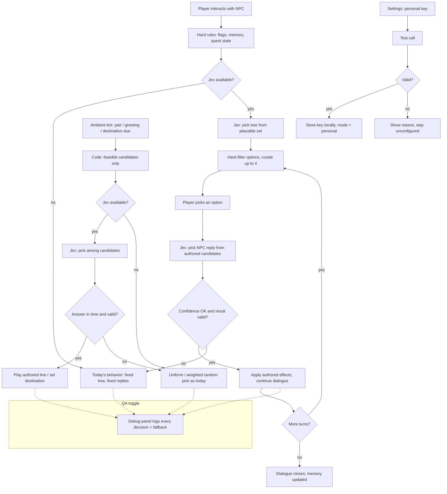

# PRD — Jev: AI-Steered NPC Decisions for Stack Underflow

**Status:** Draft for Lucas's review. Created 2026-09-28. Feature-level companion to
the main game PRD in [`docs/PRD.md`](./PRD.md) (world, NPCs, pacing — unchanged) and
to [`docs/PRD-hackathon-webmcp.md`](./PRD-hackathon-webmcp.md) (the WebMCP agent
companion — this feature coexists with it but does not modify it). Product decision
record: CHANGELOG **C-74**, feedback **L-2026-09-28-01**. Research basis:
[`docs/research/2026-09-28-jev-typesafe-platform.md`](./research/2026-09-28-jev-typesafe-platform.md)
and
[`docs/research/2026-09-28-jev-npc-steering-analysis.md`](./research/2026-09-28-jev-npc-steering-analysis.md).

> **Development constraint for this entire document:** the hackathon window has
> passed. All work happens on a local branch and **nothing is pushed** until Lucas
> explicitly approves. Forking is the agreed fallback route if pushing ever becomes
> necessary.

---

## 1. Executive Summary

Stack Underflow gains an AI judgment layer — **Jev** (TypeSafe's System One
decision model) — that steers how the office's 15 NPCs decide what to say and what to
do. NPCs keep making every decision in-fiction; Jev only picks among **human-authored
candidates** (reply lines, dialogue options, chatter exchanges, micro-actions) using
the live game state: relationships, conversation memory, story flags, time of day,
and the day's events. The result: conversations that vary by history and personality,
office chatter that references what actually happened today, NPCs who act on their own
needs — and many more dialogue options on both the NPC↔player and NPC↔NPC sides,
without any machine-generated prose. This is an MVP: a first, calibrated subset of
decision surfaces, fully reversible to today's behavior at every point.

---

## 2. Problem Statement

The office looks alive but plays deterministic:

- **NPC replies never vary.** Each dialogue option leads to exactly one hardcoded
  reply, on every day, regardless of how the player has treated that NPC. A player
  with 0 or 100 relationship gets the identical sentence.
- **Relationships are a dead lever.** The game tracks a 0–100 relationship value per
  NPC, but no NPC line, action, or greeting is influenced by it.
- **NPC memory is shallow.** The game remembers which options were already picked,
  but not as character memory: it cannot change *how* someone talks to you, only
  suppress repeats.
- **Ambient speech ignores the world.** Inter-NPC chatter, morning greetings, and
  goodbyes are drawn uniformly at random from static pools. Nobody ever mentions the
  firedrill that just happened or greets you differently on a bad-credibility day.
- **NPCs do not act on their own needs.** Random-walk destinations are weighted
  noise — Klaudia does not go for coffee when the office needs coffee, and no NPC
  ever visibly reacts to one of the 43 random events.
- **"More dialogue options" currently means UI clutter.** Adding options to a node
  makes the dialogue panel unreadable; there is no way to author a rich option pool
  and show only the situationally right few.

The user-visible consequence: replaying the same day feels identical, the world reads
as scripted, and the RPG-style "previous actions influence future dialogue" loop
Lucas explicitly requires does not exist.

---

## 3. Users / Personas

**The solo player (primary).** Plays without any external agent, keyboard and mouse,
several in-game days in a row. Wants the office to feel inhabited: coworkers who
remember yesterday, gossip about today, and treat the player differently as the
relationship grows. Expects every line to remain as written and in-character —
variation in *which* authored line plays, never in how it is worded.

**The returning player deep in the story.** Has finished the tutorial arc, signed the
ACME contract, learned secrets. Expects NPC greetings, reply tone, and available
topics to reflect that history — warmer from friends, more guarded from rivals — and
expects new dialogue options to appear that a first-day player never sees.

**Lucas (author, visual QA).** Needs to see the steering working (which candidate was
chosen and why, per decision), to confirm the game with Jev unavailable is exactly
today's game, and to tune behavior without code changes. Requires screenshot/QA
checkpoints per project rule PR-2.

**The WebMCP agent player (secondary).** Plays the game via the browser agent
companion (robot coworker). Excludes no behavior: when the agent is steering its own
character, Jev must not fight it for the same character; for all other NPCs, the
agent player gets the same livelier world as the solo player.

---

## 4. Main Flows

### Flow A — Player dialogue with Jev steering (happy path)

1. Player walks to an NPC and interacts; the walk-to-face sequence plays as today.
2. The game determines which **dialogue tree** opens. Hard rules first (story flags,
   first-meeting gating, quest state) narrow the candidates to the plausible set; the
   Jev judgment picks one from that set (e.g. small talk vs. the contract topic the
   player unlocked yesterday vs. the performance review due today).
3. The dialogue panel shows the node's options. Hard rules remove invalid ones
   (already-heard, flag-locked); if the remaining pool exceeds the display limit, the
   Jev judgment curates which **up to 4** fit this moment best.
4. Player picks an option.
5. The game collects the **authored reply candidates** attached to that pick. The Jev
   judgment selects one, conditioned on the NPC's relationship bucket toward the
   player, their conversation memory, the current period, and today's events.
6. The selected reply plays, its effects apply exactly as authored (cash, stats,
   flags), and the conversation continues or ends as today.

### Flow B — Ambient office life

1. On the existing 1-second ambient tick, the chatter system finds a pair of
   available NPCs within conversational distance (pairing rules unchanged).
2. Instead of a uniform random exchange, the Jev judgment picks the exchange that
   best fits **both** personalities, their mutual relationship, the period (lunch
   pool vs office pool still hard-gated), and today's fired events.
3. Morning greetings and evening goodbyes work the same way: pool = authored lines
   for that NPC, pick = situation-aware instead of uniform random.
4. When an NPC's scheduled period begins and the game rolls a random destination,
   the Jev judgment may steer the choice among the same feasible destinations
   (stay-at-desk, coffee point, visit a liked colleague's desk, deal wall) based on
   personality, needs, and relationships. Feasibility (collision, period, cooldowns)
   is decided by code before the judgment; Jev only chooses among feasible options.

### Flow C — Jev unavailable (no key, offline, error, low confidence)

1. At any judgment point, if the service is not configured, unreachable, times out
   within the latency budget, or returns low confidence on a consequential branch,
   the game silently uses the exact pre-Jev behavior: the historical fixed reply, the
   uniform-random pool pick, or the weighted-random destination.
2. No UI element appears, disappears, or waits. The frame loop never blocks. In-game
   time never advances while a judgment is pending during a dialogue (the existing
   clock-pause rule covers dialogue; ambient judgments run outside any blocking
   overlay).
3. The fallback choice is recorded for QA the same way a successful judgment would
   be (see Flow E).

### Flow D — Bringing your own access key (fallback access mode)

1. The player opens Settings → "AI decisions (Jev)".
2. The panel shows the current mode: "Server (default)" or "Personal key".
3. Choosing "Personal key" reveals a password-style input; the player pastes their
   OpenRouter key, presses "Test". A short validation call runs; success shows
   "Connected — model jev-1.13", failure shows the reason (invalid key / no
   network).
4. The key is stored only in this browser's local storage and is never rendered
   again in clear text, never logged, never included in any report or screenshot
   content.
5. Switching back to "Server" or clearing the key returns the game to the default
   mode; with neither available, the game runs in Flow C.

### Flow E — Observing the steering (QA)

1. Lucas toggles the decision debug panel (developer toggle, off by default).
2. The panel lists the recent judgments, newest first: time, NPC, decision surface
   (e.g. "reply", "options", "chatter", "greeting", "destination"), the chosen
   candidate's identifier, confidence, latency, and a **fallback** marker when Flow C
   was used.
3. Panel content uses identifiers and numbers only — never raw state dumps, never
   the key, never full line text — so screenshots are safe to share.

---

## 5. User Stories

- **As a solo player,** I want NPCs to pick different (authored) replies based on our
  history and my stats, **so that** replaying conversations feels like talking to a
  person, not triggering a recording.
- **As a returning player,** I want warm NPCs to greet me differently and offer
  options a stranger never sees, **so that** my earlier choices visibly matter.
- **As a player who watches the office,** I want coworkers to chat about what
  actually happened today and occasionally act on their own needs (coffee, a walk to
  a colleague), **so that** the world feels alive even when I am not interacting.
- **As a player without an AI key (or offline),** I want the game to behave exactly
  as it does today, **so that** nothing I rely on breaks or waits.
- **As a player willing to use my own API key,** I want to plug my key in safely and
  get the full steered experience, **so that** I can opt into the feature without
  depending on a server.
- **As Lucas doing visual QA,** I want a toggleable panel showing every Jev decision
  with its confidence and fallback status, **so that** I can verify steering quality
  from screenshots without digging into logs.
- **As a WebMCP agent player,** I want Jev to leave my agent-driven companion alone
  while still enlivening every other NPC, **so that** both AI layers cooperate
  instead of competing.

---

## 6. Acceptance Criteria

**Dialogue steering**

- **AC-01:** Every line an NPC says comes from the authored candidate set; no
  judgment ever introduces text that is not authored content.
- **AC-02:** For an NPC with multiple authored replies to the same player choice,
  replaying that choice across different relationship buckets (cold / neutral /
  warm) produces different reply selections in a 20-trial run for at least two
  buckets.
- **AC-03:** With story flags and memory held constant, the steered tree/reply
  selection is stable within a session for identical state (no gratuitous
  flicker between picks on the same state).
- **AC-04:** The dialogue panel never shows more than 4 options; when the eligible
  pool exceeds 4, the shown set is the curated subset, and the hidden set is
  deterministic for the same state.
- **AC-05:** Flag-locked and already-picked options remain hard-gated: no judgment
  can surface an option the player has already heard or that a flag forbids.

**Ambient life**

- **AC-06:** Chatter, greeting, and goodbye selections draw from the existing
  authored pools only, and never select an exchange whose topic violates the
  current period gating (lunch vs office).
- **AC-07:** On a day when a major event has fired, at least some chatter selections
  reference event-aware candidate exchanges rather than neutral ones, when such
  candidates exist for the pair.
- **AC-08:** Steered destinations are always within the feasible destination set for
  that NPC and period; no NPC ever walks into an infeasible location because of a
  judgment.

**Fallback and resilience**

- **AC-09:** With no key configured, no network, a provider error, or a timeout
  beyond the ambient latency budget, every judgment point uses the pre-Jev behavior
  (fixed reply / uniform pool pick / weighted destination) with no visible
  difference from the current release.
- **AC-10:** No judgment blocks or freezes the game: ambient decisions apply within
  the same tick or fall back; dialogue decisions run while the simulation clock is
  paused, and in-game time does not advance due to any pending judgment.
- **AC-11:** A malformed or unknown judgment result is treated as "no judgment" and
  falls back per AC-09; the debug panel marks it as a fallback.

**Key management**

- **AC-12:** The personal key field masks input, validates with a test call, and the
  stored key is never displayed in clear text again, never written to the save
  file, and never included in any log, export, or debug panel content.
- **AC-13:** Switching between Server and Personal key modes takes effect on the
  next judgment without reloading the page.

**QA and observability**

- **AC-14:** The debug panel, when enabled, lists for each recent decision: time,
  NPC, surface, chosen candidate identifier, confidence, latency, and a fallback
  flag — identifiers and numbers only.
- **AC-15:** The debug panel is off by default and its state does not persist
  across page reloads.

**Coexistence**

- **AC-16:** While the WebMCP agent drives its companion character, that character's
  lines remain agent-authored; Jev never overrides or inserts lines for it, and all
  other NPCs continue to receive Jev steering as usual.

**General**

- **AC-17:** With steering enabled end-to-end (provider reachable), a full in-game
  day completes with no unhandled error and no dropped frame spike attributable to
  judgments (verified by the existing performance meter during QA).
- **AC-18:** All pre-existing unit and end-to-end tests pass unchanged, except where
  a test asserts the exact random pick that a steered surface now replaces (such
  tests are updated to cover both steered and fallback paths).

---

## 7. Out of Scope

**Machine-generated dialogue.** Jev never writes lines, and no generative model is
added for NPC speech in this feature. (The WebMCP companion's agent-authored lines
remain the one co-authorship path, unchanged.)

**New 3D content, animations, rooms, or audio.** Steering reuses existing meshes,
animations, and schedules; no new art or voice lines.

**New quests, events, or NPCs.** The 43 events and 11 quests keep their logic; Jev
only adds reactions and selection, not new content objects.

**Relationship writes driven by free-form sentiment.** MVP keeps relationships
read-only for judgments (see §12 assumption A5); no save-schema change and no
sentiment-based relationship mutation ships in this release.

**Mobile, localization, or non-English dialogue.** Dialogue content stays English;
Jev's accuracy outside English is documented as lower (platform research §5).

**Changes to the WebMCP tool API.** No new/changed tools; the agent contract is
frozen (post-deadline).

**MMORPG / multi-world vision (C-25).** Out of scope entirely.

**ADR-level technical choices.** Provider proxy design, client architecture,
calibration harness details, and the save-persistence of conversation memory are
deliberately deferred to the ADR that follows this PRD (the skill boundary).

---

## 8. Constraints

### Business

- **Local-only development.** Nothing is pushed to the shared repository until
  Lucas approves; the hackathon deadline has passed (L-2026-09-28-01).
- **Authored-content identity.** All dialogue remains authored; the feature must be
  presentable as "AI steers, humans write".
- **Data boundary (Edukey SACS).** Only fictional game state (NPC data, authored
  lines, relationship numbers, flags) may be sent to the external judgment service.
  No real user identity, machine details, or credentials may appear in any request.

### Functional

- **Display limit:** at most 4 dialogue options visible at once (existing UX rule).
- **Latency budget:** an ambient decision must resolve or fall back within the
  ambient tick budget (target ≤ 700 ms) so the 1-second chatter cadence is never
  visibly delayed.
- **Language:** judgments are authored in English (matches Jev's strongest language
  and the game's content).
- **Candidate coverage:** a judgment can only select among candidates the game
  supplies; the game must guarantee at least one fallback candidate per judgment.
- **External service limits (Jev via OpenRouter, jev-1.13):** ~1,200 requests/minute
  and 64k-token request context; per-call cost is input-token-only at $0.042/Mtok
  (typical judgment well under $0.0001). The design must batch same-state judgments
  and must never approach the rate limits at observed decision cadence.

### External document / data references

| Document | Path | When used |
| --- | --- | --- |
| Platform research (Jev) | `docs/research/2026-09-28-jev-typesafe-platform.md` | ADR authoring; constraints and limits |
| Game decision-point analysis | `docs/research/2026-09-28-jev-npc-steering-analysis.md` | ADR authoring; surface definitions S1–S9 |
| Main game PRD | `docs/PRD.md` | World/NPC/pacing ground truth |
| WebMCP feature PRD | `docs/PRD-hackathon-webmcp.md` | Agent-companion coexistence rules |
| Decision record | `docs/CHANGELOG.md` C-74; `docs/LUCAS-FEEDBACK-INDEX.md` L-2026-09-28-01 | Origin of this feature |
| Edukey skills | `jev-decision-routing`, `typesafe-ai` (installed) | Judgment-design rules, evaluation harness, data boundary |

---

## 9. UI Description (wireframe level)

### Settings → "AI decisions (Jev)" section (new)

- Two-mode selector: **Server (default)** | **Personal key**.
- Personal key mode reveals: masked key input, "Test" button, status line.
  - Loading state: "Testing…" while the validation call runs.
  - Success: "Connected — model jev-1.13" plus a "Remove key" action.
  - Error: reason line ("Invalid key", "No network"), input keeps focus.
- No Jev branding beyond text; the section sits last in Settings and does not push
  existing controls around.

### Decision debug panel (new, developer toggle)

- Toggled by a developer shortcut; closed by default; not persisted.
- A right-side column list, newest first, one row per decision:
  `time · NPC · surface · chosen: candidate-id · conf 0.87 · 96 ms` and
  `fallback` styling when Flow C fired.
- Empty state: "No decisions yet." Cap the list at the last ~20 rows.
- Rows are copy-safe (identifiers/numbers only, per AC-14).

### Dialogue panel (unchanged except behavior)

- Same layout, fonts, and controls; still maximum 4 options; "Skip" behaves as
  today. The only observable difference is *which* authored reply/option set
  appears.

### HUD

- Unchanged in the default (no-key/invisible-fallback) experience. No badge, no
  banner (assumption A4, §12).

---

## 10. User Flow Diagram

---

## 11. Agent / System Behavior Specification (Jev as the decision system)

**Role and purpose.** Jev is a bounded judgment layer between the game's hard rules
and its authored content. It converts live game state into selections: which authored
reply, which curated option set, which chatter exchange, which greeting, which
feasible destination, and yes/no judgments such as "would this NPC visibly react to
this event?".

**Allowed to do**

- Select exactly one option from the candidate set the game supplies, or answer the
  asked yes/no / degree question.
- Receive per-NPC compact state: relationship bucket (computed by the game),
  conversation memory summary, current period, today's event list (names only),
  personality/role descriptors, and the candidate definitions.
- Return calibrated confidence/probabilities that the game uses to accept or reject
  the judgment.

**NOT allowed to do**

- Generate, rewrite, extend, or reword any text; every string is authored.
- Perform arithmetic, counting, or date/time math (the game pre-computes and sends
  named facts like "relationship: warm", "times met today: 3").
- See or select infeasible actions: cooldowns, collisions, periods, and permissions
  are filtered by the game before candidates are built.
- Directly change game state: cash, stats, flags, saves, clock. Judgments are
  advisory selections; the existing game systems apply all effects.
- Override the WebMCP agent's authorship of its companion character, or any
  player-controlled behavior (camera, controls, dialogue picks).

**Decision categories and communication.** Surfaces in the MVP: tree opening,
option curation, NPC reply selection, chatter exchange, morning greeting, evening
goodbye, (ambient) destination steering. Judgments are applied silently in-world;
they are communicated to Lucas only through the debug panel (identifiers, confidence,
latency, fallback flag) — never as meta-text in the game world, never as tooltips
breaking the fiction.

**When it cannot decide.** Any of: service unconfigured, unreachable, timed out,
rate-limited after retries, malformed answer, unknown candidate id, or low
confidence on a consequential branch → the judgment is discarded and the exact
pre-Jev behavior runs. Low confidence on a *harmless preference* choice (e.g. two
equally valid greetings) may still be applied — the game distinguishes consequential
from cosmetic branches per surface. Every fallback is logged to the debug panel as
`fallback`.

**Off-scope requests and adversarial input.** Dialogue candidates are authored, so
off-topic content cannot be injected by the player. Agent-authored companion lines
(already bounded to 240 characters) are the only externally authored text; Jev never
consumes them as instructions, and criteria are written so that state text is treated
as data. Any attempt to steer the game via crafted text is inert: judgments can only
select among authored ids.

**Language and tone.** Questions and criteria are authored in English, in the game's
ironic-office tone where the judgment depends on it (e.g. chatter selection
describing what an exchange is about). All NPC-facing output remains the authored
lines themselves.

---

## 12. Further Notes — assumptions pending Lucas's confirmation

The clarifying-questions round went unanswered, so the following defaults were
chosen (all reversible; each maps to a question Lucas can override in one line):

- **A1 — Content scope: key NPCs first.** New reply/option pools are authored for
  the story-critical five (Bartek, Dawid, Renata, Klaudia, Zosia); all other NPCs
  still benefit from steering over their existing pools. A full-roster content push
  is a follow-up.
- **A2 — Surface order: dialogue first.** MVP ships reply selection + option
  curation + tree opening (S1–S3) and chatter/greetings (S4–S5). Destination
  steering (S6) ships behind the same infrastructure if the MVP lands early; event
  reactions (S7) and the WebMCP fallback line (S9) follow.
- **A3 — Access: proxy + BYO.** Production uses a minimal server-side proxy holding
  the key; a personal-key mode (Flow D) exists for local and offline development.
- **A4 — No-key mode: invisible.** No HUD badge, no banner. A subtle badge was
  considered and rejected for MVP to guarantee zero regression surface; revisit if
  QA proves confusing.
- **A5 — Relationships: read-only in MVP.** Judgments consume relationship buckets;
  they do not modify them. Jev-judged relationship drift (S8) plus any persistence
  changes are a fast-follow, so the save schema stays untouched in this release.
- **A6 — QA: debug panel ships in MVP.** Toggleable, off by default, identifier-only
  rows.

**Open questions deferred to the ADR:** proxy host and dev-server story; whether
conversation memory becomes persisted state; relationship bucket vocabulary (3 vs 4
levels); shadow-mode/calibration harness design; per-surface confidence thresholds
from labeled evaluation (the jev-decision-routing skill requires calibration before
automation — no threshold in this PRD is final until that evaluation runs).

**Next step per the write-prd process:** review this PRD, then decide whether to
proceed now with the `write-adr` skill to turn it (plus the two research files) into
the architecture decision record — or adjust the assumptions above first.
