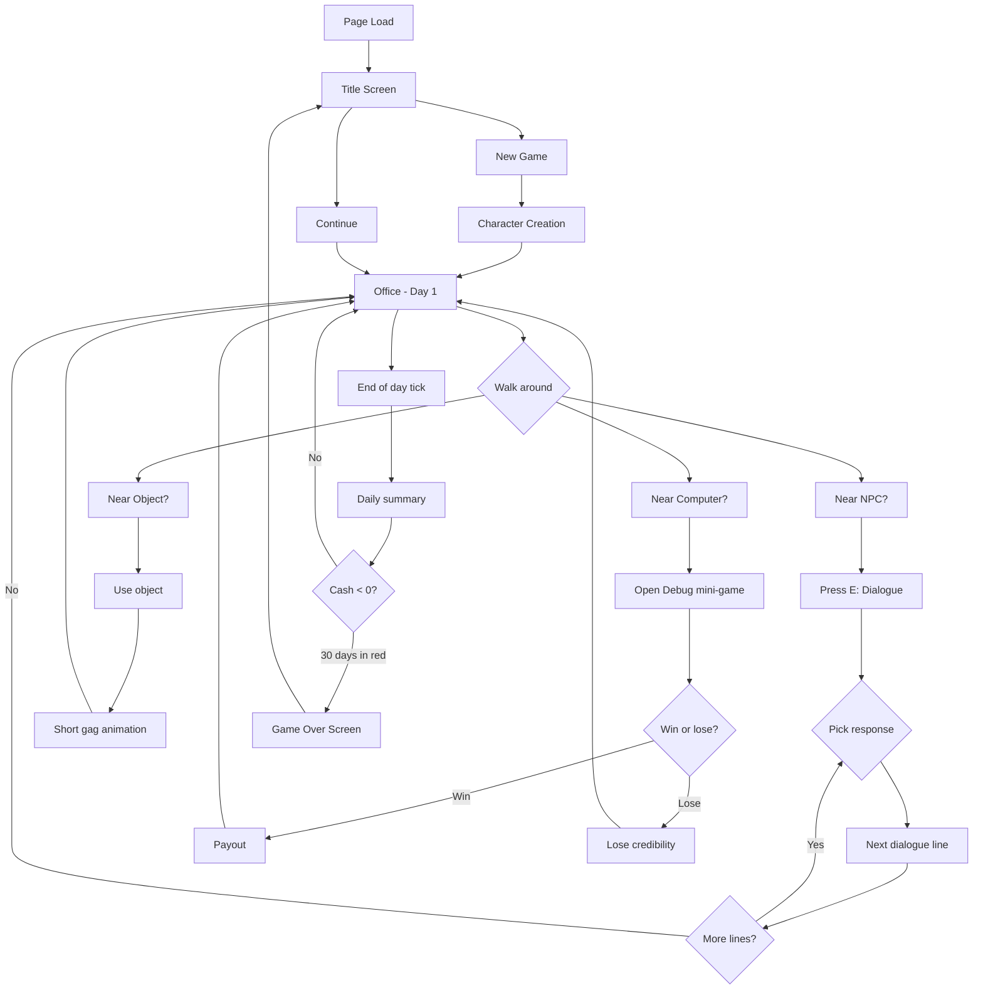

# PRD — AI Trainer Simulator (working title)

---

## 1. Executive Summary

A single-player 3D retro pixel-art browser game where the player takes the role of an IT trainer/consultant trying to build a profitable training business without going bankrupt. The game mixes a top-down 3D walk-around, an RPG-lite stats/dialogue system, mini-games that parody real IT-folk experiences, and a long-term escalating goal ("best IT trainer in the GALAXY"). Tone is IT Crowd + Silicon Valley. This document covers the **vertical slice MVP** — one location, one mini-game, one dialogue, core loop playable in 5 minutes. Larger scope is documented under "Further Iterations" in section 12.

---

## 2. Problem Statement

Lucas (developer, trainer) wants a long-running, ambitious, opinionated hobby game that:
- makes him and other IT people laugh (in-group humor),
- lets him practice building a 3D browser game from scratch,
- produces a public demo he can show off,
- is large enough to iterate on for weeks/months without feeling empty.

There is no off-the-shelf game that does this. Custom build.

---

## 3. Users / Personas

- **Lucas (developer-pilot).** Wants to build, iterate, and be amused by the result. Cares about technical quality, taste, and Easter eggs more than raw playtime.
- **IT/developer audience.** Visiting the public demo. Wants to recognize the jokes immediately, laugh, and explore. Sessions of 5-15 minutes. No install.
- **Curious gamers.** Found via Hacker News / Reddit / a blog post. Need the game to be self-explanatory in under 60 seconds.

All three want the same first impression: a charming, weird, *recognizable* pixel-art world that takes itself just seriously enough to be funny.

---

## 4. Main Flows

### 4.1 First-launch (new game)
1. Player loads the page. Game initializes in <2s on a mid-range laptop.
2. Title screen shows game name, "New Game" / "Continue" buttons. No save exists yet, so "Continue" is disabled.
3. Player clicks "New Game". A short character-creation modal appears.
4. Player picks a **starting specialization** (Frontend, Backend, DevOps, AI/ML, "Generalist" — placeholder text, real copy in section 5).
5. Player picks a **starting personality trait** (e.g. "Coffee-Fueled", "LinkedIn Influencer", "Debugger by Trade", "Wing-It").
6. Player names their character (or accepts a default like "Alex").
7. Game spawns the player in the office. A floating "thought bubble" plays for 5 seconds: an in-character monologue about their first day.

### 4.2 Walk and explore (the core loop)
1. Player uses WASD to walk around the office. Mouse moves the camera (orbit around player, clamped pitch). Shift = sprint.
2. Walking into a **trigger volume** (a desk, a colleague, a vending machine) shows an interaction prompt: "[E] Talk to Bartek" / "[E] Use coffee machine" / etc.
3. Pressing E starts the interaction:
   - **NPCs** open a dialogue overlay (see 4.3).
   - **Objects** (coffee machine, whiteboard, vending machine) play a short gag animation and may give a small buff, a stat, or an Easter egg.
4. The player can press **ESC** at any time to open the in-game menu: Career / Inventory / Settings / Save / Quit to title.

### 4.3 Dialogue
1. A dialogue overlay appears: NPC portrait (pixel-art), NPC name, their current line, and 2-4 response options.
2. Each option is a short phrase in the player's voice (sarcastic, earnest, etc.). Each option has a hidden effect on relationship, money, or stats.
3. Selecting an option advances the dialogue. Dialogue ends with the NPC giving the player a hint, a tip, a small reward, or a punchline.
4. Important NPCs have **multiple dialogues** gated on player level / cash / stats — first-talking to them is different from talking to them after 10 hours of game time.

### 4.4 Mini-game (Debug the Script)
1. Triggered by a specific NPC ("Hey, can you fix this script?") or by clicking a specific computer.
2. A side panel opens with a fake code editor showing a 30-50 line script in some IT-flavored language (Python-ish, with comments).
3. Three lines are subtly wrong (off-by-one, typo, missing semicolon, wrong import). One is just a stylistic issue. The player must click on the actual bugs.
4. Time limit: 60 seconds. Wrong clicks reduce a "credibility" bar; running out of time fails.
5. Success pays the player (random amount, e.g. 200-500 zł) and adds a small XP boost. Failure loses credibility and (sometimes) a small amount of money (a "refund" you have to give back).
6. The whole mini-game is skippable after a few failures (player gets a "maybe IT isn't for you" gag and walks away).

### 4.5 End of day / economy tick
1. At the end of each in-game day (or every 5 minutes of real time for the MVP), the game tallies income vs expenses and shows a "Daily Summary" screen:
   - **Income:** mini-game payouts, passive contract payments.
   - **Expenses:** rent for the office, coffee, ramen, "LinkedIn Premium" (joke subscription), incidentals.
   - **Net cash change.**
2. If cash < 0, the player gets a "You're in the red" warning screen with a countdown to bankruptcy (e.g. "30 in-game days until you can't afford rent").
3. If cash > some threshold (e.g. 5,000 zł) for several days, the player can pay to **expand the office** (one new piece of furniture / one new NPC / one new mini-game). The expansion is announced with a "trophy" or "achievement" gag.

### 4.6 Game over
1. Bankruptcy triggers a Game Over screen with a final leaderboard-style line: "You survived X days, earned Y zł, and made it to the rank of [NPC-derogatory title]."
2. Player can return to title or load a manual save.

---

## 5. User Stories

- **As a new player**, I want to be confused for at most 30 seconds so that I can start having fun immediately.
- **As a returning player**, I want a manual save so that I can come back tomorrow.
- **As an IT worker**, I want to recognize every NPC and every line of dialogue so that I laugh out loud.
- **As Lucas**, I want to be able to add a new mini-game in a single sitting so that the game keeps growing.
- **As a player who just wants to explore**, I want to find at least 3 hidden Easter eggs per location so that I feel rewarded for wandering.
- **As a player who keeps losing money**, I want a difficulty curve that punishes me for one bad day but doesn't bankrupt me in week one.
- **As a casual visitor**, I want the game to load fast and not require a tutorial so that I can show it to a friend in 30 seconds.

---

## 6. Acceptance Criteria

### AC-General
- AC-G-01: Game loads in <3s on a mid-range laptop (Intel i5 / 8GB / integrated graphics) in modern Chrome.
- AC-G-02: No console errors during normal play.
- AC-G-03: Save/load works in `localStorage`; no server, no account.
- AC-G-04: All text in the MVP is in English. (Polish voiceover is out of scope for MVP.)

### AC-Movement
- AC-M-01: WASD moves the player smoothly at a reasonable walk speed (3 units/sec, sprint 5).
- AC-M-02: The player cannot walk through walls, desks, or NPCs (collision works).
- AC-M-03: The camera follows the player and rotates with mouse movement, clamped between -45° and +60° pitch.

### AC-Dialogue
- AC-D-01: Pressing E near an NPC opens a dialogue overlay with at least 2 response options.
- AC-D-02: Each dialogue option is a full sentence that fits the character.
- AC-D-03: Dialogue closes on the last line and returns to gameplay without freezing.

### AC-Mini-Game
- AC-MG-01: The "Debug the Script" mini-game can be opened, played, won, lost, and re-entered without page reload.
- AC-MG-02: On a win, the player's cash increases by the displayed amount and a success animation plays.
- AC-MG-03: On a loss, no cash is added and a "try again" prompt appears.

### AC-Economy
- AC-E-01: The cash counter updates in real time when money is gained or spent.
- AC-E-02: A daily summary screen appears at the end of each in-game day.
- AC-E-03: Bankruptcy (cash < 0 for 30 in-game days) triggers a Game Over screen.

### AC-Comedy
- AC-C-01: The MVP has at least 20 distinct dialogue lines and at least 10 hidden Easter eggs (signs, posters, console logs, etc.).
- AC-C-02: Every NPC has at least 5 dialogue options across all visits.

---

## 7. Out of Scope (MVP)

- **Multiplayer / online features.**
- **Mobile / touch controls.** Desktop browser only for MVP.
- **Sound effects / music.** Deferred to a later iteration (but the game should be designed so sound is easy to add).
- **Localization.** English only for MVP; copy should be authored in a way that makes translation easy.
- **More than one location.** One office for MVP.
- **More than one mini-game.** "Debug the Script" only for MVP.
- **Procedural content.** All dialogues and Easter eggs are hand-authored for MVP.
- **Real-life tracking of training, billing, etc.** This is a parody sim, not an enterprise tool.
- **Auth, accounts, cloud saves.** `localStorage` only.
- **Achievements, leaderboards, daily challenges.** All post-MVP.
- **AI opponents / LLM-driven dialogue.** All NPC dialogue is pre-written.
- **Vehicle, mount, or any "fast travel" mechanic.** Walking only.
- **Photo mode, replay, or spectator features.** (Could be a fun post-MVP add.)

---

## 8. Constraints

### Business
- No third-party legal risk. All copy is original or short fair-use references. No copyrighted character sprites, no third-party trademarked logos in screenshots. (Half-Life lambda symbol is a possible easter egg but should be stylized, not a direct asset copy.)
- Open-source friendly: code is intended to be released as a public repo.
- No telemetry, no third-party analytics. The game does not phone home.

### Functional
- Browser: latest Chrome and Firefox. No Internet Explorer, no Safari required for MVP.
- Single tab. No background tabs.
- No login.
- Resolution: works at 1280x720 minimum. Up to 1920x1080 tested. UI scales.
- Performance: 60 FPS target on integrated graphics at native resolution, post-process upscale is cheap.
- Save file is JSON in `localStorage`, under a versioned key. Save format is documented for forward-compat.

### External References
- All art assets are hand-authored or procedurally generated. No third-party 3D model files. (Pixel-art texture atlases are fair game if made from scratch.)
- All copy is original.

---

## 9. UI Description (wireframe level)

### 9.1 Title screen
- Full-screen pixel-art splash (the office with the player character standing outside the door).
- Center: game title in chunky pixel font.
- Below: two buttons, "New Game" / "Continue". Continue is disabled if no save.
- Bottom: small text "v0.0.1 MVP — a Lucas Matuszewski project".
- Background: subtle parallax (ceiling fan turning, pixel-art clouds outside the window).

### 9.2 Character creation
- Modal: name input, two-column list for specialization and trait (radio buttons with pixel-art icons).
- Right side: live preview of the character (the office character, swapping hat / shirt / accessory per selection).
- Bottom: "Begin" button. Disabled until name is non-empty.

### 9.3 Office (main game view)
- 3D viewport, ~70% of the screen.
- Bottom-left: cash counter, day counter, current time-of-day icon.
- Bottom-right: 4 quick-slot icons (empty for MVP, reserved for future items).
- Top-right: settings cog, save icon.
- Bottom-center: context prompt when near an interactable: "[E] Talk to Bartek" / "[E] Use Coffee Machine".
- Top-left: a small minimap (post-MVP, but a placeholder "Minimap — coming soon" gag in MVP).

### 9.4 Dialogue overlay
- Bottom 40% of screen, semi-transparent.
- Left: NPC portrait (64x64 pixel art, possibly animated blink).
- Center-top: NPC name and a small role subtitle ("Senior Consultant", "The Manager", "The Intern").
- Center: dialogue text, word-wrapped, no typewriter effect for MVP (chunky instant text for retro feel).
- Bottom: 2-4 response options as horizontal pill buttons, hover effect, click to choose.
- Top-right of overlay: small "Skip" button (auto-advances to the last line, holds for 2s to confirm).

### 9.5 Mini-game (Debug the Script)
- Side panel slides in from the right, ~40% width.
- Title: "Debug the script — earn up to 500 zł".
- Body: a fake code editor. Monospace pixel font, syntax highlighting (very basic — keywords in one color, strings in another, comments grey).
- One of the lines is highlighted on hover; click to flag it as a bug. Flagged lines get a red squiggle underline.
- Bottom: "Credibility" bar (green to red), "Time" countdown, "Submit" button.
- On win: confetti animation, payout popup, "Done" button to close.
- On loss: a "FAILED" splash, refund/gig-loss popup, "Try Again" / "Walk Away" buttons.

### 9.6 Daily summary
- Modal: "Day X Summary".
- Line items, with green (+) and red (-) labels and zł amounts.
- A "Daily Meme" at the bottom — a single line in pixel font, different each day, mostly IT jokes. ("Today's meme: 'This is a 10x engineer.' — A quote that has never applied to anyone.")
- "Continue" button.

### 9.7 Game over
- Full-screen black with white pixel text.
- "YOU WENT BANKRUPT ON DAY X."
- Stats: cash earned total, mini-games won, days survived, NPCs befriended.
- A final line: "Maybe try [NPC-derogatory title] next time."
- "Back to Title" button.

---

## 10. User Flow Diagram

---

## 11. Agent / System Behavior Specification

Not applicable. There is no LLM/AI agent in the MVP. All NPC dialogue is pre-written.

(If a future iteration adds an "AI-driven HR Manager" NPC that improvises dialogue via an LLM, this section will be expanded. For MVP, the player does not interact with any AI/LLM.)

---

## 12. Further Notes

### Open questions deferred
- **Music / SFX**: To be discussed after MVP ships. Chiptune is the obvious aesthetic match; either procedurally generated or pulled from a CC0 library.
- **Title**: Working title is "AI Trainer Simulator" — placeholder, will be replaced by a GLM-suggested title (see ADR for current decision).
- **Polish/English**: Copy is in English for MVP. If the audience wants Polish later, the dialogue file is structured for easy translation.
- **Save format versioning**: A `version: 1` field will be added to the save JSON from day one. Future format changes will include migration logic.

### Deferred to later iterations
1. Second location (a coworking space, a client office, a conference venue).
2. More mini-games (Stack Overflow, Vendor Demo, Survive the Meeting, Kill the Prod Server).
3. Long-term "become the best in the GALAXY" arc: as the player levels up, NPCs start mentioning "the Galaxy Trainers Association", "the Interstellar IT Cup", etc. The arc is narrative-only; the gameplay loop stays the same.
4. More NPCs (5 in MVP, scaling to 12-20 in later iterations).
5. Photo mode.
6. Sound design and music.
7. Polish translation.
8. A simple "career path" tree: Junior → Senior → Principal → "Galaxy-Class Trainer" with stat-gated branches.
9. Replayable daily challenges with leaderboard (local only).

### Assumptions made (no user interview conducted by request)
Per Lucas's brief, the user-interview step was skipped and the PRD was written directly from his detailed brief. The following assumptions were baked in:

- **A1.** Lucas is OK with English-only MVP and is willing to read the tech docs in English.
- **A2.** Lucas is OK with no music/SFX in the MVP (deferred to a later iteration).
- **A3.** Lucas is OK with the MVP being a single location (one office).
- **A4.** The "best in the GALAXY" is a long-running narrative arc, not a literal space-faring mechanic. The comedy comes from escalation, not from literal galaxy-hopping.
- **A5.** The MVP will run as a static-served Vite dev server (or built static site) with no backend. All state in `localStorage`.
- **A6.** The game's tone is adult-but-not-cringe. Off-color jokes are OK if they're accurate to IT culture; slurs, sexism, racism are not.
