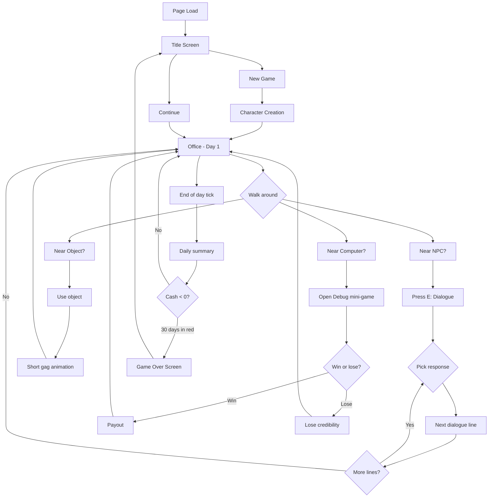

# PRD — AI Trainer Simulator (working title)

**Status:** Living document. Updated 2026-09-02 — the full dated history of corrections and decisions (C-xx / L-xx) lives in [`docs/CHANGELOG.md`](./CHANGELOG.md). This PRD reflects the current product direction, including the four-period 3/2/3/2 day in C-67.

---

## 1. Executive Summary

A single-player 3D retro pixel-art browser game where the player takes the role of an IT trainer/consultant trying to build a profitable training business without going bankrupt. The game is a **first-person 3D walk-around** inside a 20x20-unit office (NOT over-the-shoulder — see correction C-01), with an RPG-lite stats/dialogue system, mini-games that parody real IT-folk experiences, and a long-term escalating goal ("best IT trainer in the GALAXY"). Tone is IT Crowd + Silicon Valley. This document covers the **vertical slice MVP** — one location, one mini-game, deep dialogue system, core loop playable in 5 minutes. Larger scope is documented under "Further Iterations" in section 12.

The game is intended to be a real, playable, full game — not a tech demo. Lucas's directive: "make it the best simulator business retro game in the history, a real game, not just simple demo, make it huge and ambitious! ... Do not stop until you have detailed graphics, funny storyline, high engagement, working mechanics, and no bugs at all." The Definition of Done for the whole project is therefore much higher than for an MVP: every dialogue tree must be 4-8 questions deep, every NPC must have a real life (schedule, walk animation, inter-NPC bubbles), the office must look lived-in, and the intro must be a real cinematic.

---

## 2. Problem Statement

Lucas (developer, trainer) wants a long-running, ambitious, opinionated hobby game that:
- makes him and other IT people laugh (in-group humor),
- lets him practice building a 3D browser game from scratch,
- produces a public demo he can show off,
- is large enough to iterate on for weeks/months without feeling empty.

There is no off-the-shelf game that does this. Custom build.

---

## 3. Users / Personas

- **Lucas (developer-pilot).** Wants to build, iterate, and be amused by the result. Cares about technical quality, taste, and Easter eggs more than raw playtime.
- **IT/developer audience.** Visiting the public demo. Wants to recognize the jokes immediately, laugh, and explore. Sessions of 5-15 minutes. No install.
- **Curious gamers.** Found via Hacker News / Reddit / a blog post. Need the game to be self-explanatory in under 60 seconds.

All three want the same first impression: a charming, weird, *recognizable* pixel-art world that takes itself just seriously enough to be funny.

---

## 4. Main Flows

### 4.1 First-launch (new game)
1. Player loads the page. Game initializes in <2s on a mid-range laptop.
2. Title screen shows game name, "New Game" / "Continue" buttons. No save exists yet, so "Continue" is disabled.
3. Player clicks "New Game". A short character-creation modal appears.
4. Player picks a **starting specialization** (Frontend, Backend, DevOps, AI/ML, "Generalist" — placeholder text, real copy in section 5).
5. Player picks a **starting personality trait** (e.g. "Coffee-Fueled", "LinkedIn Influencer", "Debugger by Trade", "Wing-It").
6. Player names their character (or accepts a default like "Alex").
7. Game spawns the player in the office. A floating "thought bubble" plays for 5 seconds: an in-character monologue about their first day.

### 4.2 Walk and explore (the core loop) — REVISED 2026-08-29 (C-01, C-02, C-03, C-04)

**Camera mode: First-person (NOT over-the-shoulder).** The camera is the player's eyes; no player avatar is visible in the regular office view. The player sees the world from eye level (~1.65m). This is the standard 3D-RPG convention (Morrowind, Deus Ex, Stardew's "look-around" mode, modern immersive sims). Over-the-shoulder was tried first and rejected: the player can clip through walls (camera goes through the wall but the avatar cannot), the controls are confusing (the user reported "the mouse rotates the camera around the character, I want to simulate that I'm moving the direction of the character"), and at 480x270 a third-person avatar takes up too much screen real estate.

**Why first-person is the right choice for this game (research, see C-04):**
- The player IS the trainer. First-person = body ownership. The player sees what the trainer sees.
- The "office as world" framing works: the player is inside the office, not watching themselves inside the office.
- Wall collision is solved trivially: if the player can't go through the wall, the camera can't either. No special "camera collision" code needed.
- NPC interaction distance is obvious: the player walks to a desk and stands in front of it.

**Controls (default, see C-02 for the design research):**

The user's explicit request: "I want to simulate that I'm moving the direction of the character and then I can use WASD to move, with W to move in the direction when mouse is pointing." This is the standard FPS-RPG control scheme. After research, the chosen control scheme is:

- **WASD** = move the player in world-relative directions, OR camera-relative. **Default: camera-relative** (W = forward, where the camera is looking). The two layouts: **WASD** (modern) and **arrows + mouse-look** (oldschool). Player chooses in settings. Both work the same way internally — both move relative to camera yaw.
- **Mouse while mouse-look is active** = rotate the camera (yaw + pitch). The player avatar turns to face the new yaw, so what the player sees is consistent with what direction the avatar is "looking."
- **Right mouse button HOLD** = mouse-look mode (alternative to free mouse). In this mode, the OS cursor is hidden and the mouse moves rotate the view. Releasing RMB returns to free mouse for clicking UI buttons. (This is the model used in Deus Ex, Skyrim, many immersive sims — see C-02 research.)
- **Space** = toggle locked mouse-look on/off (trackpad-friendly alternative to holding RMB). **Esc** releases mouse-look.
- **Shift** = sprint.
- **E** = interact (talk to NPC, use object). Trigger volumes are around NPCs and objects. When inside a trigger, an on-screen prompt appears: "[E] Talk to Bartek" / "[E] Use Coffee Machine". Pressing E opens the dialogue or activates the object.
- **Click (left)** = also a way to interact (alternative to E). On a click, raycast from the camera through the cursor; if it hits an NPC or interactive object, activate it. The click-to-talk raycaster is the **primary** interaction for NPCs in third-person-friendly code paths; E is a convenience for keyboard-first players.
- **Esc** = open the in-game menu (Career, Inventory, Settings, Save, Quit to title). Also closes the dialogue overlay if one is open.
- **Tab** = toggle the office roster panel (the right-side card list of coworkers).
- **M** = mute / unmute audio (when added in a later phase).
- **Z** = end the current day (same action as the roster's End Day button); both ask for confirmation first, while the WebMCP `end_day` tool skips it (C-69).
- **?** (Shift+/) or **F1** = open the help modal; the top-right `?` button opens the same modal (C-66).
- **F3** = toggle the optional performance meter.

**Complete-help rule (C-66):** the `?` modal is the authoritative reference for every control that is actually shipped. It repeats all controls taught by Renata and groups them into movement/look, interaction, and interface actions. It must not advertise planned-but-unimplemented bindings such as E/Tab/M until those bindings work. Any new player-facing binding must update the modal and its coverage test in the same commit.

**Navigation model (C-02):**
- **Default state: free mouse.** The OS cursor is visible. The cursor is hidden ONLY when RMB is held for mouse-look. This solves the original problem ("my mouse gets out of the screen when I want to move more in one direction") because the mouse does not rotate the view at all when not in mouse-look mode.
- **Roster panel** is the primary way to choose who to talk to from a distance: it's a card list on the right side of the screen with each NPC's portrait, name, and role. Click a card → walk-to-NPC initiated OR direct dialogue open (decision per scope below). The roster is **larger and more readable** (C-06) than the current tiny names: 16-18px font, generous padding, pixel-art styled buttons.
- **Walk-to-talk**: when the player clicks a roster card or an in-world NPC, the player avatar automatically walks to a stand-in-front-of-the-NPC position (face-to-face). When the avatar arrives, the dialogue opens. See C-09 for the auto-walk spec.
- **NPC auto-turns to face the player** when the player is within talking range (C-09). The NPC rotates its body to look at the player. This is the standard RPG behavior and is missing in the current build.

**Custom cursor (C-03):**
- The OS cursor is REPLACED by a pixel-art Amiga/retro cursor inside the game. The default state: a small chunky crosshair / arrow sprite, hand-drawn in the same pixel art style as the rest of the game. This solves the "normal cursor, that should be hidden" complaint.
- Cursor states: **default** (arrow/crosshair), **hover NPC** (changes to a "speech bubble" icon, indicating "click to talk"), **hover interactive object** (changes to a "hand" icon), **busy** (a spinning loading icon when the game is loading a save / streaming a scene).
- The cursor is implemented as an HTML element on top of the canvas, NOT a CSS `cursor: url(...)` (CSS cursors are blurry at 480x270). The custom cursor element is `position: absolute`, follows `mousemove` events, hides the OS cursor (`cursor: none` on the canvas), and renders the pixel-art sprite.

**Trigger volumes and prompts:**
- Walking into a **trigger volume** (a desk, a colleague, a vending machine) shows a context prompt in the bottom-center of the screen: "[E] Talk to Bartek" / "[E] Use coffee machine" / "[E] Sit at your desk". The prompt respects the cursor state: when the cursor is over a different interactable, the prompt follows the cursor's hover target instead.
- Pressing E starts the interaction:
  - **NPCs** = open dialogue overlay (see 4.3).
  - **Objects** (coffee machine, whiteboard, vending machine, your own desk) = play a short gag animation and may give a small buff, a stat, or an Easter egg.
- The player can press **ESC** at any time to open the in-game menu: Career / Inventory / Settings / Save / Quit to title.

### 4.3 Dialogue — REVISED 2026-08-29 (C-09, C-10)

**The user explicitly called out the current dialogue as broken: "after I provide answer to the question in the dialogue it's the end of the conversation.... WHAT???? WTF???? Only one question and one answer? thats it? Is it how it looks like in any real office?????? SIMULATION!!! Remember!!! Not only simulation of the in-work life, but also meetings with clients, daily standups, courses where we are a trainer and we are in a class and people are listening (or not... ;) we can have funny situations with challenges)."**

The dialogue system must support:
- **Multi-turn conversations**, not single Q-and-A. A typical NPC conversation has 4-8 player turns and 8-12 NPC lines. Bartek's first-day onboarding is 6-10 turns minimum.
- **Contextual re-entries**: a player talking to Marek for the first time today vs. the third time today gets a different greeting, different lines, different outcome. NPCs track "how many times talked today" and "what was the last topic."
- **Long dialogue trees** (50+ nodes per important NPC, with branches gated on flags and stats). Important NPCs (Bartek, Zosia, the CTO, the client) have conversations that can last 5-10 minutes of real time.
- **Conversation modes**: 1-on-1 (standard), meeting (multiple NPCs in one dialogue), classroom (player is the trainer, NPCs are students, with Q&A), client call (NPC pretends to be a client, player has to handle their demands).
- **Topic continuity**: an NPC remembers what the player just told them ("oh, you mentioned you were late to the standup — guess who's late to the retro? Same person.").

**Dialogue spec (C-10):**

1. **Walk-to-face**: when the player initiates a conversation (via E, click, or roster card), the player avatar auto-walks to a "stand in front of the NPC" position. The NPC turns to face the player. The camera stays first-person. The dialogue opens only when both are in position and facing each other. (C-09 — solves "now I talk to the back... And after I provide answer to the question in the dialogue it's the end of the conversation" — current bug: talking to the back of the NPC's head with one question/answer.)
2. **Multi-line node**: each dialogue node is an NPC line PLUS a player question/response choice. The structure is:
   ```
   NPC: "Did you see Tomek's commit this morning?"
   Player options:
     A. "Yeah, that's a hard pass from code review."
     B. "I'm staying out of it."
     C. "I have thoughts. Several."
   ```
3. **Per-option NPC reaction**: each option leads to a different NPC follow-up line (A might lead to "I knew you'd say that. Want me to revert it?" B to "Wise. Cowardly, but wise." C to "Go on, I'm listening."). This is what makes a conversation feel real — the NPC reacts to what you said, not just advances to a script.
4. **Gating**: dialogue options can be gated on flags (e.g. "Did you read the docs?" only appears if `readDocs` flag is set), stats (e.g. credibility > 50 unlocks a tougher/funnier option), or relationship (e.g. NPCs share gossip only at high relationship). The current build has none of this.
5. **Multi-NPC conversation**: in meetings and classrooms, multiple NPCs speak in sequence. The dialogue UI shows the current speaker's portrait and name; the player can pick "OK" or "Reply" between speakers. Decisions made in a meeting can affect all present NPCs' relationships.
6. **Conversation memory**: after a conversation ends, the NPC's `lastTopic` and `lastMet` flags are set. The next conversation starts from those flags. "Oh, you came back. Last time you were asking about Tomek's commit. I have an update: he pushed another one. The same one."
7. **Time pause**: while any dialogue overlay is open, the in-game time clock is paused. No more "day passed while I was reading." (Already added in Phase 0, but reinforce as AC.)
8. **Camera**: the dialogue overlay covers the bottom 40% of the screen. The top 60% shows the office, with the NPC the player is talking to clearly visible (because the player walked to face them).

**Dialogue UI:**

- Bottom 40% of screen, semi-transparent dark panel.
- Left: NPC portrait (64x64 pixel art, possibly animated blink; 96x96 for important NPCs).
- Top of panel: NPC name + small role subtitle ("Senior Consultant", "The Manager", "The Intern").
- Center: NPC's current line, word-wrapped, pixel font, animated typewriter effect (one character at a time, fast, ~30 chars/sec, so 4-6 seconds for a typical line). Click anywhere to skip the typewriter.
- Bottom: 2-4 response options as horizontal pill buttons, hover effect, click to choose. The current speaker's name and the current turn count are shown in the top-right ("Bartek · turn 3/8").
- Top-right: a small "Skip" button that auto-advances to the last line; holds for 2 seconds to confirm.
- When a conversation has more than one NPC present (a meeting), the portrait area shows the current speaker, with a small "next: Zosia" indicator below.

**Conversations to ship with the MVP (examples, full list in `content/dialogues.ts`):**
- Bartek (team lead) — onboarding (6-10 turns), first assignment (4-6 turns), how-is-the-team-going (3-5 turns), asking for a raise (4-6 turns).
- Zosia (the manager) — first impression (4-6 turns), weekly 1-on-1 (6-8 turns), how is the project going (4-6 turns), performance review (8-12 turns).
- Marek (the engineer) — coffee, code review request, "did you see this PR", rant about Jira.
- Klaudia (LinkedIn) — networking pitch, "thoughts on this post?", career advice, gossip.
- Janusz (the janitor) — knows everything, "let me tell you about that guy in accounting", office lore.
- Burek (the office dog) — not a conversationalist, but approaches the player and accepts pets.

**The "SIMULATION" promise (C-10):** every NPC has a daily life, a schedule, an opinion about every other NPC, and a memory of past conversations. Talking to the same NPC 3 times in a day gives 3 different conversations. The conversations get more interesting (or more awkward) based on the player's choices. The "real playable game" definition of done is: a player can spend 30 minutes in the office talking to NPCs, attending meetings, and going to the coffee machine without ever feeling like the game is repeating itself.

### 4.4 Mini-game (Debug the Script)
1. Triggered by a specific NPC ("Hey, can you fix this script?") or by clicking a specific computer.
2. A side panel opens with a fake code editor showing a 30-50 line script in some IT-flavored language (Python-ish, with comments).
3. Three lines are subtly wrong (off-by-one, typo, missing semicolon, wrong import). One is just a stylistic issue. The player must click on the actual bugs.
4. Time limit: 60 seconds. Wrong clicks reduce a "credibility" bar; running out of time fails.
5. Success pays the player (random amount, e.g. 200-500 zł) and adds a small XP boost. Failure loses credibility and (sometimes) a small amount of money (a "refund" you have to give back).
6. The whole mini-game is skippable after a few failures (player gets a "maybe IT isn't for you" gag and walks away).

### 4.5 End of day / economy tick
1. At 19:00, or when the player chooses **End Day** / presses **Z**, the game tallies income vs expenses and shows a "Daily Summary" screen:
   - **Income:** mini-game payouts, passive contract payments.
   - **Expenses:** rent for the office, coffee, ramen, "LinkedIn Premium" (joke subscription), incidentals.
   - **Net cash change.**
2. If cash < 0, the player gets a "You're in the red" warning screen with a countdown to bankruptcy (e.g. "30 in-game days until you can't afford rent").
3. If cash > some threshold (e.g. 5,000 zł) for several days, the player can pay to **expand the office** (one new piece of furniture / one new NPC / one new mini-game). The expansion is announced with a "trophy" or "achievement" gag.

### 4.6 Game over
1. Bankruptcy triggers a Game Over screen with a final leaderboard-style line: "You survived X days, earned Y zł, and made it to the rank of [NPC-derogatory title]."
2. Player can return to title or load a manual save.

### 4.7 Daily schedule and clock

At normal speed, one real minute equals one in-game hour. A complete day lasts **10 minutes of active simulation time** and has four explicit periods:

| Period | In-game clock | Real duration |
|---|---:|---:|
| Morning | 09:00-12:00 | 3 minutes (180 s) |
| Lunch | 12:00-14:00 | 2 minutes (120 s) |
| Afternoon | 14:00-17:00 | 3 minutes (180 s) |
| Evening | 17:00-19:00 | 2 minutes (120 s) |

The HUD shows both the named period and a digital clock. The clock is quantized to 15-minute steps (`09:00`, `09:15`, `09:30`, ...), so it visibly changes every 15 real seconds at normal speed. Lunch is a first-class period: lunch movement and lunch chatter are active for the whole Lunch period and never leak into Afternoon. Afternoon remains work time for meetings, courses, client work, and future scheduled activities.

Dialogue, cinematics, blocking modals, and explicit pause freeze the simulation clock. Closing them resumes from the same instant without catching up. End Day / Z remains available throughout the day, so Evening does not need artificial dead time after most colleagues leave.

---

## 5. User Stories

- **As a new player**, I want to be confused for at most 30 seconds so that I can start having fun immediately.
- **As a returning player**, I want a manual save so that I can come back tomorrow.
- **As an IT worker**, I want to recognize every NPC and every line of dialogue so that I laugh out loud.
- **As Lucas**, I want to be able to add a new mini-game in a single sitting so that the game keeps growing.
- **As a player who just wants to explore**, I want to find at least 3 hidden Easter eggs per location so that I feel rewarded for wandering.
- **As a player who keeps losing money**, I want a difficulty curve that punishes me for one bad day but doesn't bankrupt me in week one.
- **As a casual visitor**, I want the game to load fast and not require a tutorial so that I can show it to a friend in 30 seconds.

---

## 6. Acceptance Criteria

### AC-General
- AC-G-01: Game loads in <3s on a mid-range laptop (Intel i5 / 8GB / integrated graphics) in modern Chrome.
- AC-G-02: No console errors during normal play.
- AC-G-03: Save/load works in `localStorage`; no server, no account.
- AC-G-04: All text in the MVP is in English. (Polish voiceover is out of scope for MVP.)

### AC-Movement
- AC-M-01: WASD moves the player smoothly at a reasonable walk speed (3 units/sec, sprint 5).
- AC-M-02: The player cannot walk through walls, desks, or NPCs (collision works).
- AC-M-03: The camera follows the player and rotates with mouse movement, clamped between -45° and +60° pitch.

### AC-Help
- AC-H-01: The `?` help modal names every shipped player control: WASD/arrows, Shift, RMB hold, Space toggle, Esc release/close, in-world and roster clicks, Z/End Day, computer/minigame button, quest-log expansion, `?`/F1 help, F3 performance meter, and F fullscreen.
- AC-H-02: The modal and Renata's controls answer agree; no displayed shortcut is inert.
- AC-H-03: The complete controls remain readable at the game's supported desktop viewport; the modal body scrolls without clipping its close button.
- AC-H-04: An automated DOM test fails if a required control disappears from the modal.

### AC-Dialogue
- AC-D-01: Pressing E near an NPC opens a dialogue overlay with at least 2 response options.
- AC-D-02: Each dialogue option is a full sentence that fits the character.
- AC-D-03: Dialogue closes on the last line and returns to gameplay without freezing.

### AC-Mini-Game
- AC-MG-01: The "Debug the Script" mini-game can be opened, played, won, lost, and re-entered without page reload.
- AC-MG-02: On a win, the player's cash increases by the displayed amount and a success animation plays.
- AC-MG-03: On a loss, no cash is added and a "try again" prompt appears.

### AC-Economy
- AC-E-01: The cash counter updates in real time when money is gained or spent.
- AC-E-02: A daily summary screen appears at the end of each in-game day.
- AC-E-03: Bankruptcy (cash < 0 for 30 in-game days) triggers a Game Over screen.

### AC-Time
- AC-T-01: At 1x speed, Morning/Lunch/Afternoon/Evening last 180/120/180/120 active seconds and span 09:00-19:00.
- AC-T-02: The HUD shows the current period and quarter-hour digital time derived from one simulation clock.
- AC-T-03: Dialogue and other blocking overlays pause period and clock progress without catch-up.
- AC-T-04: Lunch chatter is selected only during the Lunch period; Afternoon uses work chatter.

### AC-Comedy
- AC-C-01: The MVP has at least 20 distinct dialogue lines and at least 10 hidden Easter eggs (signs, posters, console logs, etc.).
- AC-C-02: Every NPC has at least 5 dialogue options across all visits.

---

## 7. Out of Scope (MVP)

- **Multiplayer / online features.**
- **Mobile / touch controls.** Desktop browser only for MVP.
- **Sound effects / music.** Deferred to a later iteration (but the game should be designed so sound is easy to add).
- **Localization.** English only for MVP; copy should be authored in a way that makes translation easy.
- **More than one location.** One office for MVP.
- **More than one mini-game.** "Debug the Script" only for MVP.
- **Procedural content.** All dialogues and Easter eggs are hand-authored for MVP.
- **Real-life tracking of training, billing, etc.** This is a parody sim, not an enterprise tool.
- **Auth, accounts, cloud saves.** `localStorage` only.
- **Achievements, leaderboards, daily challenges.** All post-MVP.
- **AI opponents / LLM-driven dialogue.** All NPC dialogue is pre-written.
- **Vehicle, mount, or any "fast travel" mechanic.** Walking only.
- **Photo mode, replay, or spectator features.** (Could be a fun post-MVP add.)

---

## 8. Constraints

### Business
- No third-party legal risk. All copy is original or short fair-use references. No copyrighted character sprites, no third-party trademarked logos in screenshots. (Half-Life lambda symbol is a possible easter egg but should be stylized, not a direct asset copy.)
- Open-source friendly: code is intended to be released as a public repo.
- No telemetry, no third-party analytics. The game does not phone home.

### Functional
- Browser: latest Chrome and Firefox. No Internet Explorer, no Safari required for MVP.
- Single tab. No background tabs.
- No login.
- Resolution: works at 1280x720 minimum. Up to 1920x1080 tested. UI scales.
- Performance: 60 FPS target on integrated graphics at native resolution, post-process upscale is cheap.
- Save file is JSON in `localStorage`, under a versioned key. Save format is documented for forward-compat.

### External References
- All art assets are hand-authored or procedurally generated. No third-party 3D model files. (Pixel-art texture atlases are fair game if made from scratch.)
- All copy is original.

---

## 9. UI Description (wireframe level)

### 9.1 Title screen
- Full-screen pixel-art splash (the office with the player character standing outside the door).
- Center: game title in chunky pixel font.
- Below: two buttons, "New Game" / "Continue". Continue is disabled if no save.
- Bottom: the same canonical calendar build identifier printed in the browser console (`vYYYY.MM.DD-NN`) followed by "a Lucas Matuszewski project". The value comes from one source; it is never maintained separately in the title UI.
- Background: subtle parallax (ceiling fan turning, pixel-art clouds outside the window).

### 9.2 Character creation
- Modal: name input, two-column list for specialization and trait (radio buttons with pixel-art icons).
- Right side: live preview of the character (the office character, swapping hat / shirt / accessory per selection).
- Bottom: "Begin" button. Disabled until name is non-empty.

### 9.3 Office (main game view)
- 3D viewport, ~70% of the screen.
- Bottom-left: cash counter, day counter, current named period, and quarter-hour digital clock.
- Bottom-right: 4 quick-slot icons (empty for MVP, reserved for future items).
- Top-right: settings cog, save icon.
- Bottom-center: context prompt when near an interactable: "[E] Talk to Bartek" / "[E] Use Coffee Machine".
- Top-left: a small minimap (post-MVP, but a placeholder "Minimap — coming soon" gag in MVP).

### 9.4 Dialogue overlay
- Bottom 40% of screen, semi-transparent.
- Left: NPC portrait (64x64 pixel art, possibly animated blink).
- Center-top: NPC name and a small role subtitle ("Senior Consultant", "The Manager", "The Intern").
- Center: dialogue text, word-wrapped, no typewriter effect for MVP (chunky instant text for retro feel).
- Bottom: 2-4 response options as horizontal pill buttons, hover effect, click to choose.
- Top-right of overlay: small "Skip" button (auto-advances to the last line, holds for 2s to confirm).

### 9.5 Mini-game (Debug the Script)
- Side panel slides in from the right, ~40% width.
- Title: "Debug the script — earn up to 500 zł".
- Body: a fake code editor. Monospace pixel font, syntax highlighting (very basic — keywords in one color, strings in another, comments grey).
- One of the lines is highlighted on hover; click to flag it as a bug. Flagged lines get a red squiggle underline.
- Bottom: "Credibility" bar (green to red), "Time" countdown, "Submit" button.
- On win: confetti animation, payout popup, "Done" button to close.
- On loss: a "FAILED" splash, refund/gig-loss popup, "Try Again" / "Walk Away" buttons.

### 9.6 Daily summary
- Modal: "Day X Summary".
- Line items, with green (+) and red (-) labels and zł amounts.
- A "Daily Meme" at the bottom — a single line in pixel font, different each day, mostly IT jokes. ("Today's meme: 'This is a 10x engineer.' — A quote that has never applied to anyone.")
- "Continue" button.

### 9.7 Game over
- Full-screen black with white pixel text.
- "YOU WENT BANKRUPT ON DAY X."
- Stats: cash earned total, mini-games won, days survived, NPCs befriended.
- A final line: "Maybe try [NPC-derogatory title] next time."
- "Back to Title" button.

---

## 10. User Flow Diagram



---

## 11. Agent / System Behavior Specification

Not applicable. There is no LLM/AI agent in the MVP. All NPC dialogue is pre-written.

(If a future iteration adds an "AI-driven HR Manager" NPC that improvises dialogue via an LLM, this section will be expanded. For MVP, the player does not interact with any AI/LLM.)

---

## 12. NPC life, world simulation, intro, and visual variety — NEW 2026-08-29

This section captures all the new "world feels alive" requirements from Lucas's feedback. They are not MVP-blockers individually, but they are the difference between "a working demo" and "a real playable game."

### 11.1 NPC life (per-period schedule) — Phase 3

Each NPC has a per-period schedule (Morning / Lunch / Afternoon / Evening) that defines where they are, what they're doing, and which way they face. The schedule is deterministic — same NPC, same period, same place — but the player perceives variation because NPCs move at different times and go to different places.

Examples:
- **Marek** — morning: at his desk, head down. Mid-morning: at the coffee machine, talking to Zosia. Afternoon: in a meeting in the meeting room. End of day: gone home.
- **Pawel** — the social one. Morning: at his desk and talking to people. Lunch: coffee/kitchen circuit. Afternoon: back at his desk, available for future scheduled meetings. Evening: gone.
- **Burek** (the office dog) — random walk around the office, follows whoever has food, sleeps under a desk in the afternoon.
- **The CTO** — only appears in the morning. Afternoon: gone (he's "remote"). Evening: gone.
- **Janusz** (the janitor) — arrives late (10am), cleans, leaves by 5pm. In between: he tells you the office gossip.

The schedule is in `src/content/npc-schedule.ts` and is pure data, fully unit-testable. The runtime walks each NPC toward their current period's target with the same AABB collision the player uses.

### 11.2 Inter-NPC dialogue and speech bubbles

When two NPCs are within 2.5m of each other, every 8-12 seconds there's a 25% chance one of them "says something" to the other. A small speech bubble (a `THREE.Sprite` with `CanvasTexture`, `sizeAttenuation: false` for constant on-screen size) appears above the speaker's head for 4-6 seconds with one line of text.

The text is drawn from a curated pool of inter-NPC lines (50+ lines, hand-written for comedy, GLM-brainstormed for variety). Examples:
- "Did you read the daily meme?"
- "Did you push to main again?"
- "The coffee is cold. Again."
- "I have a meeting about a meeting."
- "Have you tried turning it off and on again?"
- "Jira is down. I repeat: Jira is down."

Bubble is drawn at the NPC's head position, with a small tail pointing to the speaker. Multiple bubbles stack vertically if two NPCs are talking to each other at the same time.

### 11.3 NPC variation, sitting positions, and animations

The user explicitly called out: "People are still sitting in the middle of the desks, not next to the desk working. It's strange. We also should add some animations, now they sit like robots/objects, not like humans, and they should not sit all in exact same position. Desks also should not be exact clones, add some variations."

Per the corrected build:
- **NPCs sit AT the desk, not in the middle of it.** The sitting position is at the chair (behind the desk, facing the monitor), not in the middle of the desk surface.
- **Monitor is on the BACK edge of the desk, facing the NPC.** The NPC's monitor and the player's view of the NPC's monitor must look the same.
- **NPCs rotate to face their monitor** (or their current schedule target) when "at desk."
- **NPCs have idle animations** (C-63 revises the cadences below; the pose system lives in `src/engine/npc-idle.ts` and is driven by the NPC's current activity, so a desk pose never plays while someone is standing in the kitchen):
  - **Type** - DESK ONLY. Both arms extend forward over the keyboard and the hands alternate in small, unhurried strokes (~3.2 Hz, ±0.05 rad), with a slight head bob. Long working bursts (4-9 s) separated by 3-7 s pauses, not the old 0.5-1.5 s twitch. The pose eases in and out over ~0.35 s so it never snaps.
  - **Stretch** - anywhere the NPC is standing still. Both arms rise up-and-forward and the head tilts up. RARE by design: once every 45-90 s per NPC, 2.2 s long, sine-eased.
  - **Desk gesture** - DESK ONLY, once every 25-50 s, one of four picked at random: `facepalm` (hand to the face - the "who pushed to main on Friday" gesture), `coffee-sip` (hand to the mouth, head tilts back; this is the PRD's "sip coffee"), `fist-pump` (both arms up twice - the green-build celebration), `shrug` ("works on my machine").
  - **Look around** (head rotates ±30° once, every 5-10 seconds)
  - **Lean back** (1-2 second lean, every 10-20 seconds)
- **NPC walk animation:** while `state === "walking"`, the NPC runs a procedural walk cycle (see §11.6): leg-swing, arm-swing, and a Y-bob all driven by `distanceTraveled * frequency` so the cycle is tied to actual speed, not to wall-clock. When the NPC is not moving (state `at-desk` / `dwelling`), the cycle is frozen — no in-place "walking" animation.
- **NPCs are not in identical positions.** Each NPC's chair is offset by a small random amount in the X/Z plane (e.g. ±0.05m), so they don't look like clones. The desk positions are also randomized slightly per-NPC.
- **Desks are not exact clones.** Each desk has a random tint of wood color (warm, dark, or light), a random mug color (red, blue, green, yellow, white), and a random set of items on it (mug, laptop, notebook, sticky notes, plant, family photo). Procedurally varied at scene-build time, not hand-placed.
- **NPC body color is varied per-NPC.** The body color, hair color, and skin color differ per NPC. The user mentioned wanting a "feel" of individuality. Per C-63 this is **authored data, not a hash**: every NPC in `src/content/npcs.ts` carries an `appearance: { skin, hair }` field next to their name, role and gender, drawn from named palettes (`SKIN_TONES`, `HAIR_TONES`) rather than raw hex. An NPC with no `appearance` still gets a deterministic tone from a hash of their id, so the field is optional and the dog is unaffected.
- **Hands are skin-toned, not sleeve-toned.** Each arm is a shirt-colored sleeve plus a skin-colored hand parented at the sleeve's bottom, so the hand rotates with the arm and reads as a hand at the end of the sleeve. Total arm length is unchanged (0.65 m) - the sleeve gets shorter to make room for the hand.
- **A working NPC stands 0.45 m from their desk edge, not 0.7 m** (C-63). The 0.7 m legroom gap read as "standing near a desk" rather than "working at it". 0.45 m leaves 0.15 m of clearance for the 0.3 m NPC body radius, so the spawn validator and the AABB collision are unaffected. The corridor waypoints stay at the old 0.7 m offset: they are approach nodes for the path graph, not the settle position, and moving them would perturb the computed edge set for no visual gain.

### 11.4 Day-1 intro cinematic

**Before correction:** the game started abruptly at a broken camera angle (the player was outside the office looking at the roof). The user: "I still see the building from the outside when we start, only the roof or the wall, and it moves to inside after a while."

**After correction (C-07):**

A real, multi-stage intro cinematic that runs ONCE on the player's very first session (subsequent day-starts skip the cinematic and pan inside instead):

1. **Fade from black** (0.5s).
2. **Exterior establishing shot** (1.5s). Camera at (0, 4, 35) looking at (0, 4, 0). The office building is visible. Around it: trees, a skybox with moving pixel-art clouds, birds flying across (3-4 small sprites on a loop), a road with the occasional pixel-art car driving past, neighboring buildings (other offices, lower-poly to save performance). A short title overlay: "AI Trainer Simulator — A day in the life of [player name]."
3. **Camera dollies toward the entrance** (2.0s). Camera at (0, 4, 35) → (0, 1.7, 8). Music fades in (chiptune, per-period theme).
4. **Approach the door** (1.5s). Camera at (0, 1.7, 8) → (0, 1.65, 0). Player sees the door approach.
5. **Walk through the door** (0.7s). Camera passes through the door, fading to black briefly.
6. **Fade in inside the office** (0.5s). The player is at the door, inside the office, first-person. Time-of-day is morning. Several NPCs are visible — some walking in from the door (Tomek, Klaudia), some already at their desks (Marek, Bartek), the dog Burek is sniffing around.
7. **First-message** (3s on screen). A dialogue from the player character (inner monologue, not voiced): "Day one. Don't mess up. Don't mess up. Don't mess up."
8. **Cinematic ends.** Control handed to the player. The roster panel slides in from the right with a "Click a coworker to talk" tooltip. A quest log appears bottom-right: "Talk to Bartek — your team lead."

**Memory management:** all exterior meshes (trees, skybox, road, neighboring buildings, birds) are unloaded after the cinematic completes. They are not kept in memory during office play because the player never sees them again (except on game-over, where a brief "you walk out of the office" plays). Unloading is done with `dispose()` on geometries/materials and `removeFromParent()` on the meshes.

**Subsequent day-start (every morning, days 2+):** a shorter, 3-second "day start" pan. Camera at the spawn position, slowly panning across the office to a "view of the office" angle, then settling into first-person. No exterior shown. Quest log shows today's first quest.

### 11.6 NPC path-following and walk cycle (C-45)

The NPC controller is a small A* path-follower, not a 2-second linear lerp. The pieces:

- **Waypoint graph** (`src/content/corridor-waypoints.ts`). 20-30 hand-authored waypoints: every doorway, every corridor midpoint, every meaningful in-room spot (kitchen fridge / coffee / microwave / sink / table, meeting table center, toilet stall 1 / sink, training row 1/2/3, CEO doorway, every desk's front-of-chair spot). Edges are **computed at module load** by a pure `buildWaypointEdges(waypoints, obstacles)` helper (connect waypoints within a radius, then remove any edge whose segment crosses a furniture AABB) — never hand-maintained — so a C-44-style furniture re-layout cannot silently orphan the graph. An **all-pairs connectivity test** (every waypoint reachable from every other through `planNpcPath`) guards the graph in CI.
- **A\* planner** (`src/engine/npc-path.ts`, pure function `planNpcPath(from, to, waypoints, edges, obstacles)`). Binary-heap open set, Euclidean heuristic, returns the sequence of `Vector3` waypoints (including the `from` and `to`) the NPC should walk through. The planner is **direct-path-first**: a straight `from -> to` segment that crosses no obstacle AABB is returned immediately (cheap segment-vs-AABB sweep — NPCs do not detour to waypoints when the target is in line of sight); only a blocked target falls back to A* on the graph, and if no graph route exists either, to a direct two-point path plus depenetration of the endpoint. Returns `null` only when no walk is possible (caller keeps the NPC where it is).
- **Path advance** (in `npc-controller.ts`). Each frame, for each walking NPC: advance `walkSpeed * dt` metres along the current path segment. On segment end, the next segment becomes current; on path end, the NPC arrives at the destination and the state machine transitions to `dwelling` (at a kitchen stop) or `at-desk` (back home). The 2-second `NPC_INTERP_DURATION` is replaced by the per-NPC `walkSpeed` (default 1.2 m/s) and the path's total length.
- **Walk cycle** (`src/engine/npc-walk-cycle.ts`, pure function `updateWalkCycle(state, dt, speed, progressMetres)`). Leg-swing, arm-swing, and a Y-bob all driven by `distanceTraveled * frequency`, where the phase advances by the metres ACTUALLY moved this frame (`progressMetres`), never by raw time - so a blocked NPC cannot march in place (C-48). `WalkCycleState.amplitude` eases toward 1 while moving and toward 0 while blocked, scaling all three outputs. When `speed === 0` the cycle is frozen - no in-place animation. The cycle writes to the existing `body`, `arm-left`, `arm-right`, `leg-left`, `leg-right` group children; if a mesh lacks a part, that part is a no-op (so Burek the dog, who has different geometry, gets a tail-wag instead).
- **Kitchen micro-sequence** (in `npc-schedule.ts`, pure data + pure `pickKitchenSequence(rng)`). The 5 candidate stops are `fridge`, `coffee`, `sink`, `microwave`, `table`. Each walk picks a random 3-4-stop permutation (Fisher-Yates). Each stop has a `KITCHEN_STOP_DWELL` time (fridge 5 s, coffee 8 s, microwave 4 s, sink 6 s, table 10 s). The NPC dwells for that long, then walks to the next stop. The sequence ends with a walk back to the desk. Each stop position gets a **deterministic per-(NPC, day) jitter of up to 0.4 m** (seeded RNG): the jitter spreads same-stop dwellers apart at the source (settled-settled pairs are not separated at runtime - the scheduler owns settled positions), while walkers approaching an occupied stop are kept off it by the C-48 hard separation and settle beside the earlier arrival instead of stacking. A **period transition interrupts any in-flight walk or kitchen sequence**: the controller cancels the remaining stops and re-plans from the NPC's *current* position to the new period's destination (an NPC never finishes a microwave trip after the period that started it has ended).
- **Lunch period + staggering** (in `npc-controller.ts` + `npc-schedule.ts`). Throughout the dedicated 120 s Lunch period, `pickRandomDestination` raises the kitchen probability from 10% to 60% for `SOCIAL_LUNCHERS` (default: every human NPC + the dog Burek). **Burek always joins Lunch, no exceptions** — he is in the social-lunchers set with probability 100% during Lunch and 60% outside it (he wanders to the kitchen when there is food smell at any time). Lunch starts are staggered per NPC by `LUNCH_STAGGER_OFFSET(npcId, day, rng) ∈ [0, 2] s`. `LUNCH_OUTSIDERS` (default: **Maciek the CTO** and **Marek the DevOps** — confirmed by Lucas on 2026-08-31) instead have a 30% chance to eat alone outside Lunch and a 30% chance to skip Lunch entirely.
- **Lunch-only dialogues + all-day dog barking** (`src/content/lunch-dialogues.ts` and `src/content/dog-dialogues.ts`, NEW). `LUNCH_DIALOGUES_HUMAN: string[]` (exactly 45 lines) of funny lines (IT / startup / gaming / AI / coffee / food / diet / beer / pizza / vege / eco / work). **Burek's lines are NOT lunch-specific** (Lucas, 2026-08-31: "Dog dialogues should not be LUNCH specific, always the same, lunch or outside the lunch"): they live in `src/content/dog-dialogues.ts` as `BUREK_LINES: string[]` (5-8 dog-sound lines: "woof!", "*tail wag*", "*sniff*", etc.) and are the SAME pool in every context. When both NPCs in a bubble pair are in the `kitchen` state, `pickLine` is called with `dialogueContext: "lunch"`; a human speaker draws from `LUNCH_DIALOGUES_HUMAN`; Burek always draws from `BUREK_LINES`, whatever the context. In addition, Burek has a **dedicated ambient bark trigger** independent of pairing and location: a rare random timer fires a `BUREK_LINES` bubble wherever he is, in any period (see the acceptance criteria for cadence — rarely, but many times per day). All pools (`LUNCH_DIALOGUES_HUMAN`, `BUREK_LINES`, `INTER_NPC_LINES`) are kept strictly separate — a line in one is never in another, and no pool contains duplicates. Lines must be ≤ 60 chars (human) / ≤ 25 chars (dog) (the bubble canvas is hardcoded to 32 chars × 2 lines; staying under 60 avoids the `...` truncation in `bubbles.ts:fitLine`) and **plain ASCII only** (no em dashes, smart quotes, or emoji — enforced by a unit test, because contestant models love typographic characters).
- **Local NPC-vs-NPC collision and avoidance** (C-48 v2; pure helpers in `src/engine/npc-avoidance.ts`, policy in `npc-controller.ts`). DISCRETE straight-line discipline - NPCs always walk straight segments between path points and rotate in place between them; continuous steering arcs (which made v1 pairs "dance in a ring") do not exist:
  1. **Stop at a distance.** A walking NPC whose straight walk line is occupied (capsule check: 1.1 m lookahead, 0.5 m half-width, `walkBlockedAhead`) does not advance at all - it stops ~1 m short, faces the blocker, and the chatter system makes it a meeting ("talk for a while, but from a distance").
  2. **Routes are planned around people, not just furniture.** When a walk is contested, the re-plan feeds the NPCs currently STANDING in the way to the A* planner as temporary obstacles, so the new route genuinely avoids them instead of returning the same straight line; the NPC then commits to that route for a few seconds rather than flip-flopping between alternatives.
  3. **Progress is measured over a window, not per frame.** An NPC can walk hard and get nowhere - path advance pushing forward, separation pushing back - and that livelock never looks "blocked" on any single frame. Net displacement under 1 m over 4 s counts as stuck and arms the whole blocked policy.
  4. **Trips are budgeted.** A walk gets its planned duration x3 plus a 12 s grace; past that the NPC settles where it stands and chats until the next period re-plans everyone. Standing somewhere slightly unintended beats visibly struggling.
  5. **Turn in place, walk straight - and never give up.** The blocked ladder is a LOOP with no terminal state: after a 5 s "stop and chat" pause (long enough for a full starter + response exchange) the controller splices ONE escape waypoint into the path, then retries every 1.5 s for as long as the NPC stays blocked. Candidate directions widen from the walk heading (60 deg right, 60 deg left, 90 deg, 120 deg, straight back - the opposite direction when needed) at 1.0 m and 1.5 m, with the fan rotated by the attempt index so consecutive retries lead elsewhere; every 3rd attempt is a full A* re-plan through the waypoint graph instead. If every candidate is occupied (the middle of a crowd), the last resort steps 1.0 m directly away from the local crowd centroid. While an escape leg is pending the stop-at-distance check is suspended for that NPC, so the escape cannot be frozen by the rule that triggered it. Counters reset on any real progress.
  8. **Hard separation, and a crowd that parts.** Every frame, all visible NPC pairs closer than 0.8 m center-to-center (minimum distance, Lucas: "small but needed") are pushed apart along the center axis; two walkers split the correction 50/50, and a walker normally yields the whole correction to a settled NPC (schedule-owned positions do not drift). While a walker is actively ESCAPING a jam the pair floor drops to 0.62 m (bodies are 0.3 m in radius, so 0.6 m is exactly touching - a brush-past, never an overlap) and settled blockers take half the correction, so the cluster opens instead of fencing the walker in: at the full floor, passing between two NPCs would need a 1.6 m gap that a real crowd never has, which is what trapped NPCs in the middle of a group. Each settled NPC remembers where it settled and walks back at 0.6 m/s once its spot is free, so the crowd closes back up. Every displacement is clamped against furniture AABBs per axis. NPCs can never overlap or ghost through each other.
  6. **A head-on pair breaks symmetry.** When two NPCs block each other, an antisymmetric id comparison (`givesWayTo`) picks exactly one to step aside while the other holds the lane and keeps chatting - both acting at once is a mirror that makes them pace back and forth in sync. The ladder's attempt counter also survives short bursts of movement (it clears only after 3 s of sustained clear walking), so a pair that bumps, backs off and re-approaches escalates instead of repeating rung one forever.
  7. **Park beside, never stack.** A destination occupied by another NPC means settling on a 0.8/1.2/1.6 m ring around it (`arrivalClearOf`) - the meeting stands at a polite distance, and the gait eases to silence while blocked (no in-place marching, no jumping text).

The walk cycle is intentionally minimal (no leg-mesh swap, no IK, no ragdoll). It is a procedural sine animation on the existing children of the NPC group; the `npc-mesh.ts` builder is unchanged. If a future pass wants full leg-mesh swaps, that's a separate ADR.

### 11.7 Morning arrivals - a staggered office, not a factory gate (C-51)

An IT company does not open a gate at 9:00 and let everyone in at once. People trickle in over the first hour: a few are already at their desks before you get there, most arrive over the morning, and one is reliably late. The arrival profile is pure data in `src/content/npc-schedule.ts` (`NPC_ARRIVALS`, `planMorningArrivals`), fully unit-testable, and the controller only executes it.

- **Two arrival modes per NPC.** `already-in` means the NPC is placed directly on their morning schedule entry at day start - no door, no walk, they were here before the player. `arrives` means the NPC is invisible and parked off-scene until their arrival moment, then placed at the front door (0, 8.4) and given a normal path to their morning destination.
- **Who is already in** (5, per Lucas 2026-09-01 and PRD 11.4's fade-in description): **Bartek** and **Marek** (named in 11.4 as already at their desks), **Maciek** the CTO (11.1: "only appears in the morning", so he opens the office), **Dawid** the CEO (he is in his own office behind glass), and **Burek** the dog (he sleeps here).
- **Who arrives, and when.** The other 8 humans arrive across the first ~95 s of the 180 s Morning period. **Janusz** the janitor is the designated late arrival at ~130 s - this implements 11.1's "arrives late (10am)" without changing his authored work destination outside Lunch (L-2026-08-31-02 is unaffected: that correction is about where he stands, not when he gets there).
- **Minimum inter-arrival gap is the actual crowd fix.** Offsets are sorted and then pushed forward so consecutive arrivals are at least `MIN_ARRIVAL_GAP_S` (4 s) apart. At a 1.2 m/s walk that is ~4.8 m of clearance, so the previous arrival is well out of the doorway before the next one appears. The door crowd is prevented at the source, in data, instead of being handed to the C-48/C-50 avoidance system to untangle.
- **At most one body in the doorway.** An NPC that has not arrived yet is `visible = false` and parked off-scene; it is moved to the door only on the frame it starts walking. The old behaviour placed all 13 humans on the single door point on frame 0 and let them stand there stacked for up to 9.5 s.
- **Stable personality, varied day.** The base offset is a hash of the NPC id (Bartek is always early, Janusz is always last), plus a per-day seeded rng jitter and a small lateral door offset (x in [-0.8, 0.8]) so no two mornings replay identically and consecutive arrivals do not retrace one point.
- **Every day, not just day 1.** The arrival runs on every transition into a new day's morning, keyed on the day counter - not once per controller lifetime. Before this, `gone-home` parked NPCs at (0, 0, 0) and the day-2 morning re-plan made the entire company pop into existence in the middle of the office.

- **The office needs an entry waypoint.** The corridor graph had no node at the door, so `nearestReachableWaypoint` snapped an NPC standing at (0, 8.4) to `door-main-meeting` (0, 9.9) - 1.5 m away but BEHIND them, inside the meeting room - instead of `main-south` (0, 5), 3.4 m ahead. Every arrival therefore walked north into the meeting room before turning back, and one measured NPC paced that loop for 23.7 s. `door-main-entry` at (0, 8.4) fixes it; this is a general path-planning fix, not an arrivals-only one.
- **A waiting NPC is inert, not hidden-but-present.** Not-yet-arrived NPCs are parked INVISIBLE on their own doormat. Everything that consumes NPC positions already filters on `visible` - the movement snapshot, the separation pass, chatter pairing, the return-to-anchor pass - and C-51 extends that to the two places that did not: the roster shows them as **"Not in yet"** with a disabled card (the C-46 truthful-location rule), and the interaction raycast filters invisible meshes explicitly, because three.js does NOT skip invisible objects when raycasting. Releasing an arrival therefore costs zero movement, which also keeps the crowd-flow metrics honest.
- **Overrides respect the door.** `rollRandomNpcDestinations` skips NPCs who have not arrived (`NpcController.hasArrived`), so the day's destination roll cannot pull someone into the office ahead of their time; they head for their desk when they walk in. A deliberate `setOverride` on a waiting NPC releases them through the door first rather than teleporting them into the middle of the room.
- **`createNpcController` takes an `{ arrivals }` option** (default true). The collision- and chatter-model tests set it false: they place NPCs directly to exercise the C-48/C-50 physics, and the arrival schedule would move them.

**Acceptance criteria:** (1) At day start the player sees several colleagues already working and several walking in through the door behind them. (2) No more than a small handful of NPCs are ever near the door at once. (3) Janusz arrives visibly later than everyone else. (4) Day 2 and later mornings arrive through the door exactly like day 1 - nobody materializes in the middle of the office. (5) The measured morning door-jam metrics stay under the ceilings in `tests/unit/npc-morning-arrivals.test.ts`.

### 11.5 The "real playable game" promise

The user's mandate: "Remember, your goal is to make this game perfect, real playable game, best game in this category on the market!" and "Continue until you make this game perfect!"

The Definition of Done for the whole project, not just the MVP, includes:
- The player can spend 30 minutes in the office without feeling like the game is repeating itself. (NPC schedules, varied dialogues, daily events, classroom mode.)
- Every NPC has a "personality" the player can articulate after 5 minutes of play. ("That's the guy who pushes to main on Fridays." "That's the one who knows all the gossip." "That's the dog.")
- The office feels lived-in: mugs are not all the same color, the whiteboard has yesterday's standup notes still on it, the calendar on the wall is wrong (showing last week's dates — someone forgot to flip it).
- The intro is real: trees, birds, neighboring buildings, the works. Players screenshot the intro.
- Dialogue is real: 4-8 turns minimum per conversation, NPC reacts to what the player said, NPCs remember past conversations.
- The game keeps surprising: random events, classroom mode, "Tomek pushed to main" notifications, the coffee machine is broken, etc.

This is a 30+ day project, not a 1-week MVP. Beads epic `sacs-xtma` and its deduplicated child issues are the durable working roadmap.

---

## 13. Decision & Corrections Log - moved to `docs/CHANGELOG.md`

All dated corrections and decision records (the C-xx / L-xx entries, 2026-08-29 onward) live in **[`docs/CHANGELOG.md`](./CHANGELOG.md)** now. This section used to hold them inline, which turned the PRD into a changelog (Lucas, 2026-09-01).

- New corrections: append them to `docs/CHANGELOG.md` with the date and a unique ID, then apply the change to the relevant REQUIREMENT section above (or add one).
- The PRD keeps only the current, forward-looking state of the product: what we build, for whom, and why.

---

## 14. Definition of Done (per phase, used by the orchestrator and QA agents) — REVISED 2026-08-29

The agent orchestrator uses the following per-phase Definition of Done. A phase is "done" only when ALL of the following are true. The agent does NOT push and does NOT tell Lucas the phase is "done" until every check is green.

1. **Type-checks.** `pnpm typecheck` exits 0.
2. **Unit tests pass.** `pnpm test` exits 0. New tests are added for any new pure functions (TDD: test first, see it fail, then implement — see `AGENTS.md` PR-8).
3. **E2E smoke test passes** (where applicable). The Playwright smoke for the phase's key state exits 0. New e2e tests are added for any new user-facing flow.
4. **Visually verified.** A Playwright screenshot of the key state of the phase is taken and saved to `screenshots/<phase>-<state>.png`. The screenshot is described by `agy -p "describe this screenshot, including: what room is shown, are NPCs visible, is the player visible, is there any 'roof' or 'outside' visible, is the lighting correct"`. The description is saved as `screenshots/<phase>-<state>.txt` (or in the commit body) and is part of the PR. The description does not contain regression phrases ("looks like a roof from outside", "no clear office interior visible", "no NPCs visible", "player avatar clipped through wall").
5. **QA-reviewed.** A QA pass by an independent CLI agent (`codex exec --sandbox workspace-write "..."` or `agy -p "..."`). The reviewer confirms: no regressions, no debug logs left in, no new console errors, the new code follows the project's patterns, the PRD acceptance criteria for the phase are met. The verdict is "pass" or "pass with minor nits"; "fail" means the phase is not done.
6. **Committed in logical chunks.** `git log` shows the new work as one or more granular commits (one logical change per commit). The commit messages say WHAT and WHY, not "WIP" or "fixes". The agent does NOT use `git add -A` / `-.` / `--all`.
7. **Pushed to GitHub.** `git push origin <current-branch>` runs after steps 1-6 are all green. The push is the phase boundary. The agent reports the push URL to Lucas in the final message. Mid-phase pushes are forbidden.
8. **Revert-on-break is always available.** Because every phase is committed AND pushed, if a phase breaks something seriously and the agent can't fix it within one round of attempts, the agent reverts (`git revert <bad-commit>` or `git reset --hard <last-good>` after a clean working tree), reports what was reverted, and continues. The agent does NOT keep going on a broken state hoping to fix it later.
9. **Lucas has seen the screenshot and the QA verdict.** The agent shows the screenshot to Lucas, summarizes the QA verdict, and waits for Lucas to ack the phase before starting the next one. The agent does NOT auto-advance.
10. **TDD process applied.** Any new pure function in `src/` was test-first (a failing test, then the function). The test commit precedes the function commit (or the cycle is collapsed into one commit when the function is small). This is enforced by PR-8 in the project AGENTS.md.
11. **3D-testing research completed (one-time, project-wide).** Before the next phase that adds non-trivial 3D logic, the agent has run a research brief delegated to `agy -p` (or `codex exec`) on the current (2026) best practice for testing three.js code. The output is in `.agent-briefs/threejs-testing-research.md`. The agent adopts the recommendation or documents the deviation. This is a one-shot task; it does not block phase progress but must be done before the next 3D-heavy phase starts.

The user MUST see a screenshot (or summary) of each phase's key state before the next phase begins. If the user is interrupted and gives a new instruction, the new instruction overrides the current phase's plan; the phase's in-progress work is parked. The agent does NOT mark a phase "done" while the user is still reviewing.

This Definition of Done is mirrored in `AGENTS.md` PR-4 and PR-8 and in `~/AGENTS.md` HR-6.

---

## 15. Further Notes

### WebMCP playtest evidence (2026-09-03)

C-73: copied agent prompts include the loaded game origin/path, using localhost for development and https://play.devpowers.com in production; both copy entry points share this behavior.

Deadline correction C-72 / L-2026-09-03-08: the agent setup prompt and instructions teach native site-tool discovery, a detected model-context fallback, office lore and consistent embodied roleplay. Robot movement to people must stop at a collision-safe conversational distance, including the human; human camera control is retained. Labels and speech remain anchored to the live character and actual game viewport. A bounded robot–NPC exchange may accept agent-authored robot/NPC lines, displayed as sequential bubbles while the NPC faces the robot, without opening or answering the human's dialogue. This is fictional co-authorship explicitly requested by Lucas. Larger delivery-protocol redesign is outside the submission patch.

The live human/robot coworker review is recorded in [the playtest audit](reviews/2026-09-03-webmcp-playtest.md), feedback L-2026-09-03-07, changelog C-71, and Beads `sacs-xtma.8`. It evaluates the current requirements in `PRD-hackathon-webmcp.md` and ADR 0008. Findings and proposed improvements are review evidence, not approved changes to gameplay or architecture; C-72 subsequently authorizes this task to implement the bounded robot-to-NPC exchange; the earlier review records the ownership at playtest time.

### Open questions deferred
- **Music / SFX**: To be discussed after MVP ships. Chiptune is the obvious aesthetic match; either procedurally generated or pulled from a CC0 library.
- **Title**: Working title is "AI Trainer Simulator" — placeholder, will be replaced by a GLM-suggested title (see ADR for current decision).
- **Polish/English**: Copy is in English for MVP. If the audience wants Polish later, the dialogue file is structured for easy translation.
- **Save format versioning**: A `version: 1` field will be added to the save JSON from day one. Future format changes will include migration logic.

### Deferred to later iterations
1. Second location (a coworking space, a client office, a conference venue).
2. More mini-games (Stack Overflow, Vendor Demo, Survive the Meeting, Kill the Prod Server).
3. Long-term "become the best in the GALAXY" arc: as the player levels up, NPCs start mentioning "the Galaxy Trainers Association", "the Interstellar IT Cup", etc. The arc is narrative-only; the gameplay loop stays the same.
4. More NPCs (5 in MVP, scaling to 12-20 in later iterations).
5. Photo mode.
6. Sound design and music.
7. Polish translation.
8. A simple "career path" tree: Junior → Senior → Principal → "Galaxy-Class Trainer" with stat-gated branches.
9. Replayable daily challenges with leaderboard (local only).

### Assumptions made (no user interview conducted by request)
Per Lucas's brief, the user-interview step was skipped and the PRD was written directly from his detailed brief. The following assumptions were baked in:

- **A1.** Lucas is OK with English-only MVP and is willing to read the tech docs in English.
- **A2.** Lucas is OK with no music/SFX in the MVP (deferred to a later iteration).
- **A3.** Lucas is OK with the MVP being a single location (one office).
- **A4.** The "best in the GALAXY" is a long-running narrative arc, not a literal space-faring mechanic. The comedy comes from escalation, not from literal galaxy-hopping.
- **A5.** The MVP will run as a static-served Vite dev server (or built static site) with no backend. All state in `localStorage`.
- **A6.** The game's tone is adult-but-not-cringe. Off-color jokes are OK if they're accurate to IT culture; slurs, sexism, racism are not.
