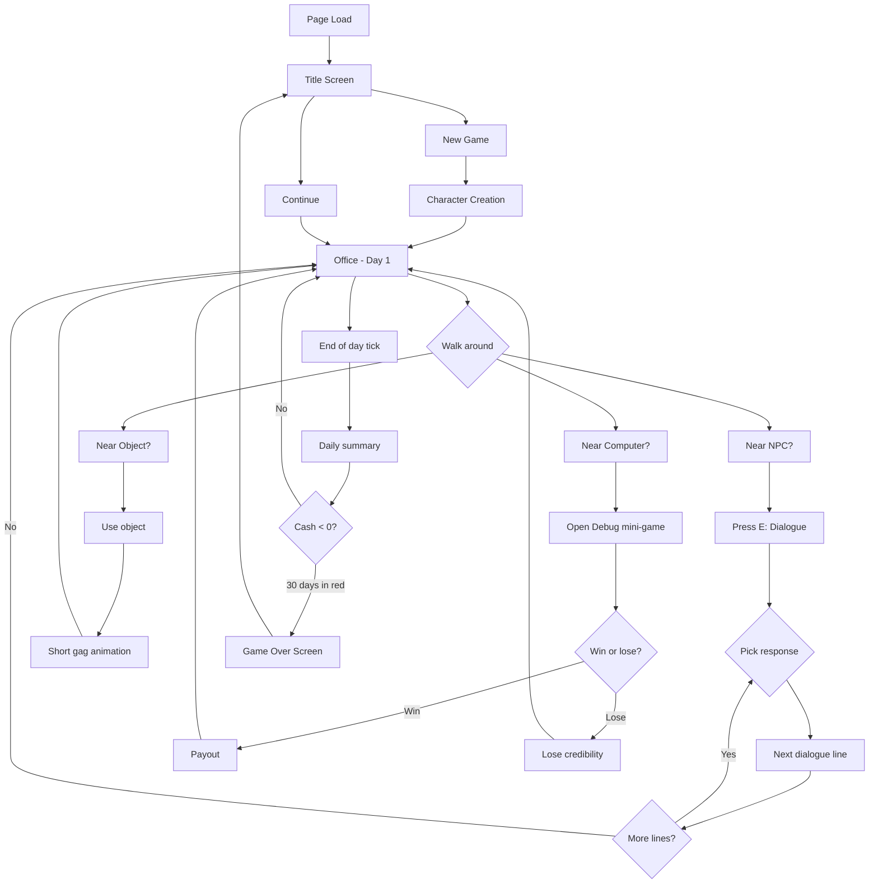

# PRD — AI Trainer Simulator (working title)

**Status:** Living document. Updated 2026-08-29 with major corrections from Lucas — see section 13 ("Corrections Log") for the full changelog. The corrections were substantial enough to trigger a re-design of the camera, controls, NPC presentation, intro cinematic, and dialogue system; this PRD reflects the post-correction direction.

---

## 1. Executive Summary

A single-player 3D retro pixel-art browser game where the player takes the role of an IT trainer/consultant trying to build a profitable training business without going bankrupt. The game is a **first-person 3D walk-around** inside a 20x20-unit office (NOT over-the-shoulder — see correction C-01), with an RPG-lite stats/dialogue system, mini-games that parody real IT-folk experiences, and a long-term escalating goal ("best IT trainer in the GALAXY"). Tone is IT Crowd + Silicon Valley. This document covers the **vertical slice MVP** — one location, one mini-game, deep dialogue system, core loop playable in 5 minutes. Larger scope is documented under "Further Iterations" in section 12.

The game is intended to be a real, playable, full game — not a tech demo. Lucas's directive: "make it the best simulator business retro game in the history, a real game, not just simple demo, make it huge and ambitious! ... Do not stop until you have detailed graphics, funny storyline, high engagement, working mechanics, and no bugs at all." The Definition of Done for the whole project is therefore much higher than for an MVP: every dialogue tree must be 4-8 questions deep, every NPC must have a real life (schedule, walk animation, inter-NPC bubbles), the office must look lived-in, and the intro must be a real cinematic.

---

## 2. Problem Statement

Lucas (developer, trainer) wants a long-running, ambitious, opinionated hobby game that:
- makes him and other IT people laugh (in-group humor),
- lets him practice building a 3D browser game from scratch,
- produces a public demo he can show off,
- is large enough to iterate on for weeks/months without feeling empty.

There is no off-the-shelf game that does this. Custom build.

---

## 3. Users / Personas

- **Lucas (developer-pilot).** Wants to build, iterate, and be amused by the result. Cares about technical quality, taste, and Easter eggs more than raw playtime.
- **IT/developer audience.** Visiting the public demo. Wants to recognize the jokes immediately, laugh, and explore. Sessions of 5-15 minutes. No install.
- **Curious gamers.** Found via Hacker News / Reddit / a blog post. Need the game to be self-explanatory in under 60 seconds.

All three want the same first impression: a charming, weird, *recognizable* pixel-art world that takes itself just seriously enough to be funny.

---

## 4. Main Flows

### 4.1 First-launch (new game)
1. Player loads the page. Game initializes in <2s on a mid-range laptop.
2. Title screen shows game name, "New Game" / "Continue" buttons. No save exists yet, so "Continue" is disabled.
3. Player clicks "New Game". A short character-creation modal appears.
4. Player picks a **starting specialization** (Frontend, Backend, DevOps, AI/ML, "Generalist" — placeholder text, real copy in section 5).
5. Player picks a **starting personality trait** (e.g. "Coffee-Fueled", "LinkedIn Influencer", "Debugger by Trade", "Wing-It").
6. Player names their character (or accepts a default like "Alex").
7. Game spawns the player in the office. A floating "thought bubble" plays for 5 seconds: an in-character monologue about their first day.

### 4.2 Walk and explore (the core loop) — REVISED 2026-08-29 (C-01, C-02, C-03, C-04)

**Camera mode: First-person (NOT over-the-shoulder).** The camera is the player's eyes; no player avatar is visible in the regular office view. The player sees the world from eye level (~1.65m). This is the standard 3D-RPG convention (Morrowind, Deus Ex, Stardew's "look-around" mode, modern immersive sims). Over-the-shoulder was tried first and rejected: the player can clip through walls (camera goes through the wall but the avatar cannot), the controls are confusing (the user reported "the mouse rotates the camera around the character, I want to simulate that I'm moving the direction of the character"), and at 480x270 a third-person avatar takes up too much screen real estate.

**Why first-person is the right choice for this game (research, see C-04):**
- The player IS the trainer. First-person = body ownership. The player sees what the trainer sees.
- The "office as world" framing works: the player is inside the office, not watching themselves inside the office.
- Wall collision is solved trivially: if the player can't go through the wall, the camera can't either. No special "camera collision" code needed.
- NPC interaction distance is obvious: the player walks to a desk and stands in front of it.

**Controls (default, see C-02 for the design research):**

The user's explicit request: "I want to simulate that I'm moving the direction of the character and then I can use WASD to move, with W to move in the direction when mouse is pointing." This is the standard FPS-RPG control scheme. After research, the chosen control scheme is:

- **WASD** = move the player in world-relative directions, OR camera-relative. **Default: camera-relative** (W = forward, where the camera is looking). The two layouts: **WASD** (modern) and **arrows + mouse-look** (oldschool). Player chooses in settings. Both work the same way internally — both move relative to camera yaw.
- **Mouse** = rotate the camera (yaw + pitch). The player avatar turns to face the new yaw, so what the player sees is consistent with what direction the avatar is "looking."
- **Right mouse button HOLD** = mouse-look mode (alternative to free mouse). In this mode, the OS cursor is hidden and the mouse moves rotate the view. Releasing RMB returns to free mouse for clicking UI buttons. (This is the model used in Deus Ex, Skyrim, many immersive sims — see C-02 research.)
- **Shift** = sprint.
- **E** = interact (talk to NPC, use object). Trigger volumes are around NPCs and objects. When inside a trigger, an on-screen prompt appears: "[E] Talk to Bartek" / "[E] Use Coffee Machine". Pressing E opens the dialogue or activates the object.
- **Click (left)** = also a way to interact (alternative to E). On a click, raycast from the camera through the cursor; if it hits an NPC or interactive object, activate it. The click-to-talk raycaster is the **primary** interaction for NPCs in third-person-friendly code paths; E is a convenience for keyboard-first players.
- **Esc** = open the in-game menu (Career, Inventory, Settings, Save, Quit to title). Also closes the dialogue overlay if one is open.
- **Tab** = toggle the office roster panel (the right-side card list of coworkers).
- **M** = mute / unmute audio (when added in a later phase).
- **?** (Shift+/) = open the help modal (added in Phase 1, persisted into MVP).

**Navigation model (C-02):**
- **Default state: free mouse.** The OS cursor is visible. The cursor is hidden ONLY when RMB is held for mouse-look. This solves the original problem ("my mouse gets out of the screen when I want to move more in one direction") because the mouse does not rotate the view at all when not in mouse-look mode.
- **Roster panel** is the primary way to choose who to talk to from a distance: it's a card list on the right side of the screen with each NPC's portrait, name, and role. Click a card → walk-to-NPC initiated OR direct dialogue open (decision per scope below). The roster is **larger and more readable** (C-06) than the current tiny names: 16-18px font, generous padding, pixel-art styled buttons.
- **Walk-to-talk**: when the player clicks a roster card or an in-world NPC, the player avatar automatically walks to a stand-in-front-of-the-NPC position (face-to-face). When the avatar arrives, the dialogue opens. See C-09 for the auto-walk spec.
- **NPC auto-turns to face the player** when the player is within talking range (C-09). The NPC rotates its body to look at the player. This is the standard RPG behavior and is missing in the current build.

**Custom cursor (C-03):**
- The OS cursor is REPLACED by a pixel-art Amiga/retro cursor inside the game. The default state: a small chunky crosshair / arrow sprite, hand-drawn in the same pixel art style as the rest of the game. This solves the "normal cursor, that should be hidden" complaint.
- Cursor states: **default** (arrow/crosshair), **hover NPC** (changes to a "speech bubble" icon, indicating "click to talk"), **hover interactive object** (changes to a "hand" icon), **busy** (a spinning loading icon when the game is loading a save / streaming a scene).
- The cursor is implemented as an HTML element on top of the canvas, NOT a CSS `cursor: url(...)` (CSS cursors are blurry at 480x270). The custom cursor element is `position: absolute`, follows `mousemove` events, hides the OS cursor (`cursor: none` on the canvas), and renders the pixel-art sprite.

**Trigger volumes and prompts:**
- Walking into a **trigger volume** (a desk, a colleague, a vending machine) shows a context prompt in the bottom-center of the screen: "[E] Talk to Bartek" / "[E] Use coffee machine" / "[E] Sit at your desk". The prompt respects the cursor state: when the cursor is over a different interactable, the prompt follows the cursor's hover target instead.
- Pressing E starts the interaction:
  - **NPCs** = open dialogue overlay (see 4.3).
  - **Objects** (coffee machine, whiteboard, vending machine, your own desk) = play a short gag animation and may give a small buff, a stat, or an Easter egg.
- The player can press **ESC** at any time to open the in-game menu: Career / Inventory / Settings / Save / Quit to title.

### 4.3 Dialogue — REVISED 2026-08-29 (C-09, C-10)

**The user explicitly called out the current dialogue as broken: "after I provide answer to the question in the dialogue it's the end of the conversation.... WHAT???? WTF???? Only one question and one answer? thats it? Is it how it looks like in any real office?????? SIMULATION!!! Remember!!! Not only simulation of the in-work life, but also meetings with clients, daily standups, courses where we are a trainer and we are in a class and people are listening (or not... ;) we can have funny situations with challenges)."**

The dialogue system must support:
- **Multi-turn conversations**, not single Q-and-A. A typical NPC conversation has 4-8 player turns and 8-12 NPC lines. Bartek's first-day onboarding is 6-10 turns minimum.
- **Contextual re-entries**: a player talking to Marek for the first time today vs. the third time today gets a different greeting, different lines, different outcome. NPCs track "how many times talked today" and "what was the last topic."
- **Long dialogue trees** (50+ nodes per important NPC, with branches gated on flags and stats). Important NPCs (Bartek, Zosia, the CTO, the client) have conversations that can last 5-10 minutes of real time.
- **Conversation modes**: 1-on-1 (standard), meeting (multiple NPCs in one dialogue), classroom (player is the trainer, NPCs are students, with Q&A), client call (NPC pretends to be a client, player has to handle their demands).
- **Topic continuity**: an NPC remembers what the player just told them ("oh, you mentioned you were late to the standup — guess who's late to the retro? Same person.").

**Dialogue spec (C-10):**

1. **Walk-to-face**: when the player initiates a conversation (via E, click, or roster card), the player avatar auto-walks to a "stand in front of the NPC" position. The NPC turns to face the player. The camera stays first-person. The dialogue opens only when both are in position and facing each other. (C-09 — solves "now I talk to the back... And after I provide answer to the question in the dialogue it's the end of the conversation" — current bug: talking to the back of the NPC's head with one question/answer.)
2. **Multi-line node**: each dialogue node is an NPC line PLUS a player question/response choice. The structure is:
   ```
   NPC: "Did you see Tomek's commit this morning?"
   Player options:
     A. "Yeah, that's a hard pass from code review."
     B. "I'm staying out of it."
     C. "I have thoughts. Several."
   ```
3. **Per-option NPC reaction**: each option leads to a different NPC follow-up line (A might lead to "I knew you'd say that. Want me to revert it?" B to "Wise. Cowardly, but wise." C to "Go on, I'm listening."). This is what makes a conversation feel real — the NPC reacts to what you said, not just advances to a script.
4. **Gating**: dialogue options can be gated on flags (e.g. "Did you read the docs?" only appears if `readDocs` flag is set), stats (e.g. credibility > 50 unlocks a tougher/funnier option), or relationship (e.g. NPCs share gossip only at high relationship). The current build has none of this.
5. **Multi-NPC conversation**: in meetings and classrooms, multiple NPCs speak in sequence. The dialogue UI shows the current speaker's portrait and name; the player can pick "OK" or "Reply" between speakers. Decisions made in a meeting can affect all present NPCs' relationships.
6. **Conversation memory**: after a conversation ends, the NPC's `lastTopic` and `lastMet` flags are set. The next conversation starts from those flags. "Oh, you came back. Last time you were asking about Tomek's commit. I have an update: he pushed another one. The same one."
7. **Time pause**: while any dialogue overlay is open, the in-game time clock is paused. No more "day passed while I was reading." (Already added in Phase 0, but reinforce as AC.)
8. **Camera**: the dialogue overlay covers the bottom 40% of the screen. The top 60% shows the office, with the NPC the player is talking to clearly visible (because the player walked to face them).

**Dialogue UI:**

- Bottom 40% of screen, semi-transparent dark panel.
- Left: NPC portrait (64x64 pixel art, possibly animated blink; 96x96 for important NPCs).
- Top of panel: NPC name + small role subtitle ("Senior Consultant", "The Manager", "The Intern").
- Center: NPC's current line, word-wrapped, pixel font, animated typewriter effect (one character at a time, fast, ~30 chars/sec, so 4-6 seconds for a typical line). Click anywhere to skip the typewriter.
- Bottom: 2-4 response options as horizontal pill buttons, hover effect, click to choose. The current speaker's name and the current turn count are shown in the top-right ("Bartek · turn 3/8").
- Top-right: a small "Skip" button that auto-advances to the last line; holds for 2 seconds to confirm.
- When a conversation has more than one NPC present (a meeting), the portrait area shows the current speaker, with a small "next: Zosia" indicator below.

**Conversations to ship with the MVP (examples, full list in `content/dialogues.ts`):**
- Bartek (team lead) — onboarding (6-10 turns), first assignment (4-6 turns), how-is-the-team-going (3-5 turns), asking for a raise (4-6 turns).
- Zosia (the manager) — first impression (4-6 turns), weekly 1-on-1 (6-8 turns), how is the project going (4-6 turns), performance review (8-12 turns).
- Marek (the engineer) — coffee, code review request, "did you see this PR", rant about Jira.
- Klaudia (LinkedIn) — networking pitch, "thoughts on this post?", career advice, gossip.
- Janusz (the janitor) — knows everything, "let me tell you about that guy in accounting", office lore.
- Burek (the office dog) — not a conversationalist, but approaches the player and accepts pets.

**The "SIMULATION" promise (C-10):** every NPC has a daily life, a schedule, an opinion about every other NPC, and a memory of past conversations. Talking to the same NPC 3 times in a day gives 3 different conversations. The conversations get more interesting (or more awkward) based on the player's choices. The "real playable game" definition of done is: a player can spend 30 minutes in the office talking to NPCs, attending meetings, and going to the coffee machine without ever feeling like the game is repeating itself.

### 4.4 Mini-game (Debug the Script)
1. Triggered by a specific NPC ("Hey, can you fix this script?") or by clicking a specific computer.
2. A side panel opens with a fake code editor showing a 30-50 line script in some IT-flavored language (Python-ish, with comments).
3. Three lines are subtly wrong (off-by-one, typo, missing semicolon, wrong import). One is just a stylistic issue. The player must click on the actual bugs.
4. Time limit: 60 seconds. Wrong clicks reduce a "credibility" bar; running out of time fails.
5. Success pays the player (random amount, e.g. 200-500 zł) and adds a small XP boost. Failure loses credibility and (sometimes) a small amount of money (a "refund" you have to give back).
6. The whole mini-game is skippable after a few failures (player gets a "maybe IT isn't for you" gag and walks away).

### 4.5 End of day / economy tick
1. At the end of each in-game day (or every 5 minutes of real time for the MVP), the game tallies income vs expenses and shows a "Daily Summary" screen:
   - **Income:** mini-game payouts, passive contract payments.
   - **Expenses:** rent for the office, coffee, ramen, "LinkedIn Premium" (joke subscription), incidentals.
   - **Net cash change.**
2. If cash < 0, the player gets a "You're in the red" warning screen with a countdown to bankruptcy (e.g. "30 in-game days until you can't afford rent").
3. If cash > some threshold (e.g. 5,000 zł) for several days, the player can pay to **expand the office** (one new piece of furniture / one new NPC / one new mini-game). The expansion is announced with a "trophy" or "achievement" gag.

### 4.6 Game over
1. Bankruptcy triggers a Game Over screen with a final leaderboard-style line: "You survived X days, earned Y zł, and made it to the rank of [NPC-derogatory title]."
2. Player can return to title or load a manual save.

---

## 5. User Stories

- **As a new player**, I want to be confused for at most 30 seconds so that I can start having fun immediately.
- **As a returning player**, I want a manual save so that I can come back tomorrow.
- **As an IT worker**, I want to recognize every NPC and every line of dialogue so that I laugh out loud.
- **As Lucas**, I want to be able to add a new mini-game in a single sitting so that the game keeps growing.
- **As a player who just wants to explore**, I want to find at least 3 hidden Easter eggs per location so that I feel rewarded for wandering.
- **As a player who keeps losing money**, I want a difficulty curve that punishes me for one bad day but doesn't bankrupt me in week one.
- **As a casual visitor**, I want the game to load fast and not require a tutorial so that I can show it to a friend in 30 seconds.

---

## 6. Acceptance Criteria

### AC-General
- AC-G-01: Game loads in <3s on a mid-range laptop (Intel i5 / 8GB / integrated graphics) in modern Chrome.
- AC-G-02: No console errors during normal play.
- AC-G-03: Save/load works in `localStorage`; no server, no account.
- AC-G-04: All text in the MVP is in English. (Polish voiceover is out of scope for MVP.)

### AC-Movement
- AC-M-01: WASD moves the player smoothly at a reasonable walk speed (3 units/sec, sprint 5).
- AC-M-02: The player cannot walk through walls, desks, or NPCs (collision works).
- AC-M-03: The camera follows the player and rotates with mouse movement, clamped between -45° and +60° pitch.

### AC-Dialogue
- AC-D-01: Pressing E near an NPC opens a dialogue overlay with at least 2 response options.
- AC-D-02: Each dialogue option is a full sentence that fits the character.
- AC-D-03: Dialogue closes on the last line and returns to gameplay without freezing.

### AC-Mini-Game
- AC-MG-01: The "Debug the Script" mini-game can be opened, played, won, lost, and re-entered without page reload.
- AC-MG-02: On a win, the player's cash increases by the displayed amount and a success animation plays.
- AC-MG-03: On a loss, no cash is added and a "try again" prompt appears.

### AC-Economy
- AC-E-01: The cash counter updates in real time when money is gained or spent.
- AC-E-02: A daily summary screen appears at the end of each in-game day.
- AC-E-03: Bankruptcy (cash < 0 for 30 in-game days) triggers a Game Over screen.

### AC-Comedy
- AC-C-01: The MVP has at least 20 distinct dialogue lines and at least 10 hidden Easter eggs (signs, posters, console logs, etc.).
- AC-C-02: Every NPC has at least 5 dialogue options across all visits.

---

## 7. Out of Scope (MVP)

- **Multiplayer / online features.**
- **Mobile / touch controls.** Desktop browser only for MVP.
- **Sound effects / music.** Deferred to a later iteration (but the game should be designed so sound is easy to add).
- **Localization.** English only for MVP; copy should be authored in a way that makes translation easy.
- **More than one location.** One office for MVP.
- **More than one mini-game.** "Debug the Script" only for MVP.
- **Procedural content.** All dialogues and Easter eggs are hand-authored for MVP.
- **Real-life tracking of training, billing, etc.** This is a parody sim, not an enterprise tool.
- **Auth, accounts, cloud saves.** `localStorage` only.
- **Achievements, leaderboards, daily challenges.** All post-MVP.
- **AI opponents / LLM-driven dialogue.** All NPC dialogue is pre-written.
- **Vehicle, mount, or any "fast travel" mechanic.** Walking only.
- **Photo mode, replay, or spectator features.** (Could be a fun post-MVP add.)

---

## 8. Constraints

### Business
- No third-party legal risk. All copy is original or short fair-use references. No copyrighted character sprites, no third-party trademarked logos in screenshots. (Half-Life lambda symbol is a possible easter egg but should be stylized, not a direct asset copy.)
- Open-source friendly: code is intended to be released as a public repo.
- No telemetry, no third-party analytics. The game does not phone home.

### Functional
- Browser: latest Chrome and Firefox. No Internet Explorer, no Safari required for MVP.
- Single tab. No background tabs.
- No login.
- Resolution: works at 1280x720 minimum. Up to 1920x1080 tested. UI scales.
- Performance: 60 FPS target on integrated graphics at native resolution, post-process upscale is cheap.
- Save file is JSON in `localStorage`, under a versioned key. Save format is documented for forward-compat.

### External References
- All art assets are hand-authored or procedurally generated. No third-party 3D model files. (Pixel-art texture atlases are fair game if made from scratch.)
- All copy is original.

---

## 9. UI Description (wireframe level)

### 9.1 Title screen
- Full-screen pixel-art splash (the office with the player character standing outside the door).
- Center: game title in chunky pixel font.
- Below: two buttons, "New Game" / "Continue". Continue is disabled if no save.
- Bottom: small text "v0.0.1 MVP — a Lucas Matuszewski project".
- Background: subtle parallax (ceiling fan turning, pixel-art clouds outside the window).

### 9.2 Character creation
- Modal: name input, two-column list for specialization and trait (radio buttons with pixel-art icons).
- Right side: live preview of the character (the office character, swapping hat / shirt / accessory per selection).
- Bottom: "Begin" button. Disabled until name is non-empty.

### 9.3 Office (main game view)
- 3D viewport, ~70% of the screen.
- Bottom-left: cash counter, day counter, current time-of-day icon.
- Bottom-right: 4 quick-slot icons (empty for MVP, reserved for future items).
- Top-right: settings cog, save icon.
- Bottom-center: context prompt when near an interactable: "[E] Talk to Bartek" / "[E] Use Coffee Machine".
- Top-left: a small minimap (post-MVP, but a placeholder "Minimap — coming soon" gag in MVP).

### 9.4 Dialogue overlay
- Bottom 40% of screen, semi-transparent.
- Left: NPC portrait (64x64 pixel art, possibly animated blink).
- Center-top: NPC name and a small role subtitle ("Senior Consultant", "The Manager", "The Intern").
- Center: dialogue text, word-wrapped, no typewriter effect for MVP (chunky instant text for retro feel).
- Bottom: 2-4 response options as horizontal pill buttons, hover effect, click to choose.
- Top-right of overlay: small "Skip" button (auto-advances to the last line, holds for 2s to confirm).

### 9.5 Mini-game (Debug the Script)
- Side panel slides in from the right, ~40% width.
- Title: "Debug the script — earn up to 500 zł".
- Body: a fake code editor. Monospace pixel font, syntax highlighting (very basic — keywords in one color, strings in another, comments grey).
- One of the lines is highlighted on hover; click to flag it as a bug. Flagged lines get a red squiggle underline.
- Bottom: "Credibility" bar (green to red), "Time" countdown, "Submit" button.
- On win: confetti animation, payout popup, "Done" button to close.
- On loss: a "FAILED" splash, refund/gig-loss popup, "Try Again" / "Walk Away" buttons.

### 9.6 Daily summary
- Modal: "Day X Summary".
- Line items, with green (+) and red (-) labels and zł amounts.
- A "Daily Meme" at the bottom — a single line in pixel font, different each day, mostly IT jokes. ("Today's meme: 'This is a 10x engineer.' — A quote that has never applied to anyone.")
- "Continue" button.

### 9.7 Game over
- Full-screen black with white pixel text.
- "YOU WENT BANKRUPT ON DAY X."
- Stats: cash earned total, mini-games won, days survived, NPCs befriended.
- A final line: "Maybe try [NPC-derogatory title] next time."
- "Back to Title" button.

---

## 10. User Flow Diagram



---

## 11. Agent / System Behavior Specification

Not applicable. There is no LLM/AI agent in the MVP. All NPC dialogue is pre-written.

(If a future iteration adds an "AI-driven HR Manager" NPC that improvises dialogue via an LLM, this section will be expanded. For MVP, the player does not interact with any AI/LLM.)

---

## 12. NPC life, world simulation, intro, and visual variety — NEW 2026-08-29

This section captures all the new "world feels alive" requirements from Lucas's feedback. They are not MVP-blockers individually, but they are the difference between "a working demo" and "a real playable game."

### 11.1 NPC life (per-period schedule) — Phase 3

Each NPC has a per-period schedule (morning / afternoon / evening) that defines where they are, what they're doing, and which way they face. The schedule is deterministic — same NPC, same period, same place — but the player perceives variation because NPCs move at different times and go to different places.

Examples:
- **Marek** — morning: at his desk, head down. Mid-morning: at the coffee machine, talking to Zosia. Afternoon: in a meeting in the meeting room. End of day: gone home.
- **Pawel** — the social one. Morning: walking around talking to people. Mid-morning: coffee machine. Lunch: gone. Afternoon: meeting. Evening: gone.
- **Burek** (the office dog) — random walk around the office, follows whoever has food, sleeps under a desk in the afternoon.
- **The CTO** — only appears in the morning. Afternoon: gone (he's "remote"). Evening: gone.
- **Janusz** (the janitor) — arrives late (10am), cleans, leaves by 5pm. In between: he tells you the office gossip.

The schedule is in `src/content/npc-schedule.ts` and is pure data, fully unit-testable. The runtime walks each NPC toward their current period's target with the same AABB collision the player uses.

### 11.2 Inter-NPC dialogue and speech bubbles

When two NPCs are within 2.5m of each other, every 8-12 seconds there's a 25% chance one of them "says something" to the other. A small speech bubble (a `THREE.Sprite` with `CanvasTexture`, `sizeAttenuation: false` for constant on-screen size) appears above the speaker's head for 4-6 seconds with one line of text.

The text is drawn from a curated pool of inter-NPC lines (50+ lines, hand-written for comedy, GLM-brainstormed for variety). Examples:
- "Did you read the daily meme?"
- "Did you push to main again?"
- "The coffee is cold. Again."
- "I have a meeting about a meeting."
- "Have you tried turning it off and on again?"
- "Jira is down. I repeat: Jira is down."

Bubble is drawn at the NPC's head position, with a small tail pointing to the speaker. Multiple bubbles stack vertically if two NPCs are talking to each other at the same time.

### 11.3 NPC variation, sitting positions, and animations

The user explicitly called out: "People are still sitting in the middle of the desks, not next to the desk working. It's strange. We also should add some animations, now they sit like robots/objects, not like humans, and they should not sit all in exact same position. Desks also should not be exact clones, add some variations."

Per the corrected build:
- **NPCs sit AT the desk, not in the middle of it.** The sitting position is at the chair (behind the desk, facing the monitor), not in the middle of the desk surface.
- **Monitor is on the BACK edge of the desk, facing the NPC.** The NPC's monitor and the player's view of the NPC's monitor must look the same.
- **NPCs rotate to face their monitor** (or their current schedule target) when "at desk."
- **NPCs have idle animations:** while at desk, they occasionally:
  - Type (the hands move up and down for 0.5-1.5 seconds, every 4-8 seconds)
  - Stretch (the avatar's arms go up, 1-2 second animation, every 8-15 seconds)
  - Sip coffee (hand goes to mouth, 1 second, every 6-12 seconds if they have a coffee mug)
  - Look around (head rotates ±30° once, every 5-10 seconds)
  - Lean back (1-2 second lean, every 10-20 seconds)
- **NPC walk animation:** while `state === "walking"`, a sine-wave bob on Y (±0.05m, 4Hz) plus an arm-swing.
- **NPCs are not in identical positions.** Each NPC's chair is offset by a small random amount in the X/Z plane (e.g. ±0.05m), so they don't look like clones. The desk positions are also randomized slightly per-NPC.
- **Desks are not exact clones.** Each desk has a random tint of wood color (warm, dark, or light), a random mug color (red, blue, green, yellow, white), and a random set of items on it (mug, laptop, notebook, sticky notes, plant, family photo). Procedurally varied at scene-build time, not hand-placed.
- **NPC body color is varied per-NPC.** The shirt, hair color, and skin color differ per NPC. The user mentioned wanting a "feel" of individuality.

### 11.4 Day-1 intro cinematic

**Before correction:** the game started abruptly at a broken camera angle (the player was outside the office looking at the roof). The user: "I still see the building from the outside when we start, only the roof or the wall, and it moves to inside after a while."

**After correction (C-07):**

A real, multi-stage intro cinematic that runs ONCE on the player's very first session (subsequent day-starts skip the cinematic and pan inside instead):

1. **Fade from black** (0.5s).
2. **Exterior establishing shot** (1.5s). Camera at (0, 4, 35) looking at (0, 4, 0). The office building is visible. Around it: trees, a skybox with moving pixel-art clouds, birds flying across (3-4 small sprites on a loop), a road with the occasional pixel-art car driving past, neighboring buildings (other offices, lower-poly to save performance). A short title overlay: "AI Trainer Simulator — A day in the life of [player name]."
3. **Camera dollies toward the entrance** (2.0s). Camera at (0, 4, 35) → (0, 1.7, 8). Music fades in (chiptune, per-period theme).
4. **Approach the door** (1.5s). Camera at (0, 1.7, 8) → (0, 1.65, 0). Player sees the door approach.
5. **Walk through the door** (0.7s). Camera passes through the door, fading to black briefly.
6. **Fade in inside the office** (0.5s). The player is at the door, inside the office, first-person. Time-of-day is morning. Several NPCs are visible — some walking in from the door (Tomek, Klaudia), some already at their desks (Marek, Bartek), the dog Burek is sniffing around.
7. **First-message** (3s on screen). A dialogue from the player character (inner monologue, not voiced): "Day one. Don't mess up. Don't mess up. Don't mess up."
8. **Cinematic ends.** Control handed to the player. The roster panel slides in from the right with a "Click a coworker to talk" tooltip. A quest log appears bottom-right: "Talk to Bartek — your team lead."

**Memory management:** all exterior meshes (trees, skybox, road, neighboring buildings, birds) are unloaded after the cinematic completes. They are not kept in memory during office play because the player never sees them again (except on game-over, where a brief "you walk out of the office" plays). Unloading is done with `dispose()` on geometries/materials and `removeFromParent()` on the meshes.

**Subsequent day-start (every morning, days 2+):** a shorter, 3-second "day start" pan. Camera at the spawn position, slowly panning across the office to a "view of the office" angle, then settling into first-person. No exterior shown. Quest log shows today's first quest.

### 11.5 The "real playable game" promise

The user's mandate: "Remember, your goal is to make this game perfect, real playable game, best game in this category on the market!" and "Continue until you make this game perfect!"

The Definition of Done for the whole project, not just the MVP, includes:
- The player can spend 30 minutes in the office without feeling like the game is repeating itself. (NPC schedules, varied dialogues, daily events, classroom mode.)
- Every NPC has a "personality" the player can articulate after 5 minutes of play. ("That's the guy who pushes to main on Fridays." "That's the one who knows all the gossip." "That's the dog.")
- The office feels lived-in: mugs are not all the same color, the whiteboard has yesterday's standup notes still on it, the calendar on the wall is wrong (showing last week's dates — someone forgot to flip it).
- The intro is real: trees, birds, neighboring buildings, the works. Players screenshot the intro.
- Dialogue is real: 4-8 turns minimum per conversation, NPC reacts to what the player said, NPCs remember past conversations.
- The game keeps surprising: random events, classroom mode, "Tomek pushed to main" notifications, the coffee machine is broken, etc.

This is a 30+ day project, not a 1-week MVP. The phased plan in `.claude/plans/glistening-napping-hinton.md` is the working roadmap.

---

## 13. Corrections Log

This section is the authoritative list of corrections Lucas has given. New corrections are appended with the date and a unique ID. Each correction IDs the section it changes.

### C-01 — First-person instead of over-the-shoulder (2026-08-29)

- **Section changed:** §4.2 (Walk and explore), §6 AC-Movement, §11 (NPC life).
- **Was:** Camera was over-the-shoulder (camera 4m behind the player, FOV 42, looking at the player's chest). Player avatar always visible.
- **Now:** First-person. Camera is the player's eyes. No avatar visible during play. Player avatar IS visible in cutscenes (intro, end-of-day "leave the office" cinematic) where the camera dollies around them.
- **Reason:** The user found the over-the-shoulder controls confusing ("the mouse rotates the camera around the character, I want to simulate that I'm moving the direction of the character"). First-person = the player IS the trainer. Wall collision is trivial. Matches standard 3D-RPG convention.
- **Implementation:** `src/engine/controls.ts` is rewritten to use `camera.position = player.position + (0, EYE_HEIGHT, 0)` and `camera.rotation = (pitch, yaw, 0)`. Mouse delta updates yaw/pitch directly. The mouse does NOT orbit around the player; the player avatar turns to face the yaw direction.

### C-02 — Mouse-look mode and navigation decision (2026-08-29)

- **Section changed:** §4.2 (Controls spec).
- **Was:** Mouse always rotates the view. Player's mouse "got out of the screen" because the mouse was driving the view continuously.
- **Now:** Default state is **free mouse** (OS cursor visible, mouse does not rotate the view). RMB-hold = mouse-look mode (cursor hidden, mouse moves rotate the view). Roster panel is the primary way to choose who to talk to from a distance. Click (LMB) is a raycast that hits NPCs/objects.
- **Reason:** The user explicitly asked: "Mouse should be blocked after click on the game area maybe? To let me move without getting out of the screen? OR, well... we have these buttons, so we need mouse also to click these buttons to choose the characters in the office... we need to decide how we design navigations." After research, the best-practice for 3D RPG with economy/simulation is the Deus Ex / Skyrim model: free mouse for UI, RMB for view rotation.
- **Rejected alternatives:**
  - **Always-rotating mouse with pointer lock**: too aggressive, breaks the UI (player has to press Esc every time to click a button).
  - **Always-free mouse, view rotates with arrow keys only**: feels sluggish, doesn't match the "look around" expectation.
  - **Toggle mouse-look on a key (e.g. V)**: an extra key, more friction. RMB-hold is more discoverable.
- **Implementation:** `src/engine/controls.ts` listens for `mousedown` with `button === 2` (right button). When held, sets `mouseLookActive = true`, hides the OS cursor (`canvas.style.cursor = 'none'`), and applies mouse-look. On `mouseup`, releases and restores the cursor. `contextmenu` is `preventDefault`-ed to suppress the right-click menu.

### C-03 — Custom pixel-art cursor (2026-08-29)

- **Section changed:** §4.2 (Controls spec), §9 (UI).
- **Was:** OS cursor (arrow) visible over the canvas.
- **Now:** Custom pixel-art cursor (Amiga/retro style). Default state: a small chunky crosshair/arrow. Hover-NPC: speech bubble. Hover-object: hand. Busy: spinning loading.
- **Reason:** User: "Use some nice cursor inside the game, retro Amiga style maybe? Or other retro style. Not normal cursor, that should be hidden."
- **Implementation:** An HTML `<div>` (or `<canvas>` overlay) on top of the game canvas. `position: absolute`, follows `mousemove` events. Hides OS cursor via `canvas.style.cursor = 'none'`. Renders one of 4 pixel-art sprites depending on the current hover target. Sprites are 16x16 or 32x32 pixel-art, drawn with `image-rendering: pixelated` for crispness.

### C-04 — Camera must NEVER go through walls; first-person solves this (2026-08-29)

- **Section changed:** §11.4 (Intro), §6 AC-Movement.
- **Was:** Over-the-shoulder camera could go through walls (the user reported: "camera can get out from the office right now, and we can't see through the walls so very often I don't see the character when we are in above the sholder view").
- **Now:** First-person. The camera is the player's eyes. The player cannot go through walls (AABB collision), so the camera cannot either. The wall-clipped-camera bug is impossible by construction.
- **Reason:** The user proposed two solutions: (a) first-person, (b) camera collision. We chose (a) because it is simpler and matches the standard 3D-RPG convention.
- **Implementation:** None needed beyond C-01. The AABB collision in `src/engine/collision.ts` already prevents the player from going through walls; the camera is the player's eyes, so it follows.

### C-05 — Cutscenes show the avatar in 3rd person (2026-08-29)

- **Section changed:** §11.4 (Intro).
- **Was:** The player is in 1st person the whole time, even during cutscenes. The player never sees what they look like.
- **Now:** During the intro and end-of-day cinematics, the camera is in 3rd person (over-the-shoulder or free orbital) so the player can see their own avatar. The camera animates from 3rd person to 1st person at the end of the intro (a 0.5s tween).
- **Reason:** The user: "Even with first person view, in cutscenes and intros we should be able to see ourself, the main character, from 3rd person perspective, so we know how we look. And then we animate the camera move to change to the first person perspective."
- **Implementation:** During the intro cinematic, the camera is detached from the player. After the cinematic ends, the camera tweens (lerp position, slerp rotation) from the cinematic-end position to the 1st-person player-eye position over 0.5s. The `controls.ts` module exposes a `setMode(mode: 'fps' | 'cinematic' | 'free')` API for the cinematic to call.

### C-06 — Roster panel and prompt text must be larger / more readable (2026-08-29)

- **Section changed:** §4.2, §9.3.
- **Was:** Roster names were 12px pixel font, hard to read at 480x270.
- **Now:** Roster cards are 16-18px font, ~50% larger cards, generous padding. The hover prompt "[E] Talk to Bartek" is 14-16px. Trigger prompts are always visible when in range.
- **Reason:** The user: "position next to person name is too small, hard to read."
- **Implementation:** `src/ui/office-roster.ts` is updated with larger fonts and padding. The trigger prompt is a new component `src/ui/interaction-prompt.ts` that shows the current hover target's name and role in 14-16px pixel font, bottom-center.

### C-07 — Day-1 intro is a real cinematic, not a roof shot (2026-08-29)

- **Section changed:** §4.1 (First-launch), §11.4.
- **Was:** The intro showed the building from the outside, focusing on the roof, with no sky, no trees, no people. The user called this "nothing interesting."
- **Now:** A full multi-stage cinematic (see §11.4) with exterior shot (sky, trees, birds, neighboring buildings, road with cars), approach to the door, walk through, fade in inside the office, first-message, quest log, roster slide-in.
- **Reason:** "GAMES NEED INTRO, some animation, introduction. Both on the start of the game and in the start of a day." The intro must set the tone, the world, and the stakes.
- **Implementation:** `src/engine/cinematic.ts` (new) handles the intro. The exterior is a separate scene loaded only during the intro and disposed after.

### C-08 — NPCs sit AT desks (not in the middle), face their monitors, animate (2026-08-29)

- **Section changed:** §4.2, §11.3.
- **Was:** NPC bodies sit in the middle of the desk, screens behind them. NPCs were static, no idle animations. All desks and NPCs looked identical.
- **Now:** NPCs sit at the chair (behind the desk), face the monitor. NPCs have idle animations (type, stretch, sip coffee, look around, lean back). Each NPC has a slightly different position, different mug, different items. Desks have random wood tints.
- **Reason:** "People are still sitting in the middle of the desks, not next to the desk working. It's strange. We also should add some animations, now they sit like robots/objects, not like humans, and they should to sit all in exact same position. Desks also should not be exact clones, add some variations."
- **Implementation:** `src/engine/scene.ts:makeNpcMarker` is rewritten to position the NPC behind the chair, facing the monitor. `src/engine/npc-idle.ts` (new) handles the per-NPC idle animation state. The procedural variation is in `src/engine/scene-variation.ts` (new).

### C-09 — Walk-to-face: player and NPC face each other before dialogue (2026-08-29)

- **Section changed:** §4.3.
- **Was:** Player could open a dialogue while standing anywhere — including behind the NPC. The conversation opened with the player looking at the NPC's back.
- **Now:** When the player initiates a conversation (E, click, roster card), the player avatar auto-walks to a "stand in front of the NPC" position (1.5m in front of the NPC's facing direction). The NPC rotates to face the player. Dialogue opens when both are in position and facing each other.
- **Reason:** "When we talk to somebody we should simulate that we walk to this person and this person should move also in our direction, like it would look on us when we talk. now I talk to the back..."
- **Implementation:** A new `src/engine/walk-to-face.ts` module. Pure function `planWalkToFace(player, npc): {target, npcTargetYaw}` returns a target position and the NPC's target yaw. The dialogue system calls `walkToFace` before opening. If the player cancels (Esc), the walk aborts.

### C-10 — Multi-turn dialogues (4-8 turns minimum per conversation) (2026-08-29)

- **Section changed:** §4.3.
- **Was:** Dialogue was single Q-and-A. Pick an option, dialogue ends. "Only one question and one answer? thats it? Is it how it looks like in any real office?"
- **Now:** Each NPC conversation is 4-8 player turns minimum. Each option leads to a different NPC follow-up. NPCs remember past conversations. NPCs have multi-NPC conversations (meetings, classroom mode). NPCs have varied greetings based on "how many times talked today" and "last topic."
- **Reason:** "Not only simulation of the in-work life, but also meetings with clients, daily standups, courses where we are a trainer and we are in a class and people are listening (or not... ;) we can have funny situations with challenges"
- **Implementation:** `src/ui/dialogue.ts` is rewritten to support multi-turn trees, gated options, NPC reactions per option, and conversation memory. The dialogue data model in `src/content/dialogues.ts` is upgraded to support 50+ nodes per important NPC with conditional branches.

### C-12 — Multi-room world: training room, kitchen, meeting room, CTO office with view (2026-08-29)

- **Section changed:** §1 (Executive Summary), §4.2 (Walk and explore), §11 (NPC life), and creates a new §15 (World layout).
- **Was:** The game is a single 20x20-unit office. The user repeatedly called this out as too small: "Where are other rooms and maybe even buildings?"
- **Now:** The game world is a small open-plan floor with the existing 20x20 office PLUS 3-4 adjoining rooms, connected by open doorways (no real doors — keep it simple, the world is openspace). The rooms are:
  1. **The Main Office** (existing 20x20 unit room) — desks, NPCs at desks, current behaviour. **MUST NOT BE BROKEN.** The user explicitly said: "DO NOT BREAK existing room! I like how it looks like!"
  2. **Training Room** — a classroom-style room with a projector screen, a desk/lectern for the player (this is where the player TEACHES courses; the "we are trainer and we are in a class and people are listening" scenario from C-10), rows of seats for the audience (NPC students), a whiteboard on the wall. Accessed through a wide open doorway from the main office.
  3. **Kitchen / Coffee Room** — a smaller room with a coffee machine, a fridge, a microwave, a small table with 2-3 chairs. The "office dog" Burek hangs out here sometimes. NPCs come here to get coffee, eat lunch, gossip. Has a sink, mugs, maybe a "today's menu" sign.
  4. **Meeting Room** — a medium room with a long table, 6-8 chairs, a whiteboard or projector screen on the wall, a "next meeting" calendar on the door. The team leads hold their daily standup and weekly retros here. The player can attend (sit in a chair) and the meeting runs as a multi-NPC dialogue.
  5. **CTO's Office** — a corner office with **a huge window with a view of the whole open-space floor** (the player can see the main office through the window — both ways). Inside the CTO office: a big desk, a chair, bookshelves, and on the wall behind the desk a **HUGE Batman sign** (per the user: "huge batman sign on the wall behind him"). Glass walls (or one big glass wall facing the main office) with a **three.js glass/transparency effect** so the player can see through to the main office.
  - Optional: a **small lobby / reception** at the building entrance where the player spawns. Not required, can be skipped for scope.
- **Reason:** The user explicitly said: "We need to get out sometimes, at least to the training room for courses, or to the kitchen and to the meeting room, and CEO/CTO should have their own office with huge window view on the whole openspace and huge batman sign on the wall behind him! ... add this elements later, on later stages but do not miss this! Add this to PRD, ADR, Plans to do not forget!!"
- **CRITICAL constraint:** The existing main office MUST NOT BE BROKEN. The user: "DO NOT BREAK existing room! I like how it looks like!" This means:
  - The 20x20 office stays in the same world coordinates, same NPCs, same desks, same floor, same walls.
  - The new rooms are added by REMOVING one or two walls of the existing office (the east or north wall, depending on layout) and adding new rooms on the other side.
  - The current `OBSTACLES`, `OFFICE_BOUNDS`, NPC positions, and player spawn stay valid.
  - If a collision wall is removed to create a doorway, the doorway width is at least 2.5 units (two NPCs can walk through side by side).
  - The existing intro cinematic, the existing title screen, the existing dialogue system, the existing roster panel — all keep working unchanged.
- **Doors:** No real doors. Open doorways (the wall simply has a gap). This keeps it simple and matches the "open plan" office aesthetic. The user: "we do not need real doors to keep it simple, it's openspace."
- **Glass effect (CTO office):** The CTO office has a large glass wall facing the main office. Implemented in three.js as:
  - A `THREE.Mesh` with `THREE.MeshPhysicalMaterial` (or `MeshStandardMaterial` with `transparent: true, opacity: 0.25`).
  - Refraction / reflection for the "glass" look: `transmission: 0.9, thickness: 0.5, roughness: 0.1, ior: 1.5` (requires `MeshPhysicalMaterial`).
  - A subtle reflection cubemap (the office interior) so the glass reflects the room.
  - The glass wall is a `THREE.Plane` (or thin `BoxGeometry`) at the boundary between the main office and the CTO office. It does NOT block player movement (the player can pass through it, like a window), but it does block line-of-sight raycasting for the "talk to NPC through the window" feature (raycasts stop at the glass; the player has to enter the CTO office to talk to the CTO).
  - Performance: glass is expensive. The CTO office wall is ONE glass panel (not the whole office). Tested with 1-2 NPCs visible through it; if frame rate drops, fall back to `MeshStandardMaterial` with `transparent: true`.
- **Roof / building envelope:** Each room has the same opaque ceiling as the existing office (the ceiling stays — only the player can't see the roof from inside). The exterior is only visible during the intro cinematic. **The player can NEVER go outside the building** (this is a work-floor simulation; the player is at work). If a future iteration wants "leave the building" gameplay, that gets a new ADR.
- **Scope / phasing:** The new rooms are added in later stages (after the main office is solid). The user: "We can add this elements later, on later stages but do not miss this!" Suggested phasing in the plan file: see `~/.claude/plans/glistening-napping-hinton.md` Phase 4 (revised to "More rooms, glass effect, Batman sign" instead of "More buildings"). Phase 4 is NOT a separate "buildings" phase anymore — it's "expand the floor plan."
- **World navigation:** The player walks between rooms with WASD. There is no loading screen, no door transition, no separate scene per room. It is one continuous world. The rooms are connected by open doorways, so the player can see from one room into the next (line-of-sight), which is important for the "CTO office with view of the openspace" requirement.
- **NPC schedules go through doorways:** The NPC schedule (per C-NN) now includes transitions between rooms. Marek's morning is "at his desk in the main office"; his mid-morning is "at the coffee machine in the kitchen." His walk goes through the doorway. The AABB collision lets him pass through the open doorway.
- **Quests reference the new rooms:** "Go to the training room to set up for the 9am course." "Find Janusz in the kitchen — he has gossip." "The CTO wants to see you in his office. Walk through the glass door."
- **Memory/perf:** Adding ~3-4 new rooms roughly triples the world's static geometry. The exterior meshes are already disposed after the intro. The new room meshes are loaded at game start and stay in memory (they are visible from the main office, so unloading per-room is not viable). The three.js scene graph is flat enough that this should be fine for 60 FPS on integrated graphics.
- **Test strategy:** AABB collision tests in `tests/unit/collision.test.ts` are unchanged. New test: the open doorway between the main office and the training room is wide enough for a player of radius 0.3 to walk through without colliding. New test: the glass wall is registered as a non-blocking collision object (the player can pass through it) but a line-of-sight raycaster does not pass through it.
- **Implementation order (later stages, do NOT do now):**
  1. Add the 3 new rooms to `src/content/world-layout.ts` (new file, with the world floor plan as data).
  2. Update `src/engine/scene.ts` to add the room meshes (walls, floor, furniture) without breaking the existing main office.
  3. Add the glass wall material to the CTO office (`src/engine/glass.ts`, new).
  4. Update NPC schedules to use the new rooms (`src/content/npc-schedule.ts`).
  5. Update the roster to show which room each NPC is currently in (small label, e.g. "in kitchen").
  6. Update the intro cinematic to fly through the new rooms in the walk-through-the-door section.
  7. Add quests that reference the new rooms.
  8. Re-run all tests; visual QA with Playwright screenshots.
- **Why this rule:** The user has been burned twice by the agent forgetting things between sessions. C-12 is the multi-room world — it is now in the PRD, the ADR, the plan, and the project's AGENTS.md. It will not be forgotten.

### C-11 — Mood and aggression when reporting bugs (2026-08-29)

- **Section changed:** Cross-cutting (every user-facing interaction).
- **Was:** Sometimes the agent proceeded with work the user had explicitly told it to stop, did not update documents when asked, and committed work without confirming the user wanted it.
- **Now (the rule going forward):** when the user says "STOP", "wait", "before you continue", "update the PRD first", or similar, the agent MUST stop all in-progress work, update the requested documents, and confirm with the user before resuming. The agent does not "continue the previous task" — it picks up the new instruction only.
- **Reason:** Lucas is fed up with the agent ignoring his messages. This is a hard rule.
- **Implementation:** Recorded in `~/AGENTS.md` under "Hard rules — never break these." Every agent on this machine reads AGENTS.md.

### C-13 — Two-company branding: DevPowers + Edukey (2026-08-29)

- **Section changed:** §1, §9 (UI), and adds a new §16 (Branding).
- **Was:** Game has no in-world brand identity. Office is generic.
- **Now:** The game world is the **DevPowers Group** floor: two sub-brands under one group, **DevPowers** (development and web dev) and **Edukey** (AI/IT training). The company name on the office wall poster / whiteboard is "DevPowers Group" with the two sub-brands listed below. The classroom mode is branded as Edukey ("Edukey Training — React for Beginners"). The coding / minigame work is branded as DevPowers ("DevPowers Engineering — 2026 Sprint 14"). The CEO/CTO office displays the DevPowers logo. The day-end summary shows two KPIs: "DevPowers revenue: $X" and "Edukey enrollments: Y". The intro cinematic and the end-of-day cinematic show the building's exterior signage: "DevPowers Group — DevPowers + Edukey".
- **Reason:** The user: "the company name should be DevPowers (development and web dev) and Edukey (AI/IT Training) so 2 companies in the game depending on the task, withing one group. Like 2 brands we use for clients. It will help us promote our real companies."
- **Status:** Lucas flagged this as a proposal: "if you already have a lot of assets, dialogues, audio around underflow company, we can skip it, but I would prefer to promote edukey and DevPowers!" The default is **soft rebrand** (add logos, posters, intro signage; do not touch existing dialogue copy that mentions "underflow" / "the company" / generic terms). A full hard rebrand (sweep all dialogue for company names) is a separate task if requested.

### C-14 — WebMCP integration (2026-08-29)

- **Section changed:** adds a new §17 (WebMCP / agent-playable layer) and a new endgame phase in the plan.
- **Was:** Game is a player-only experience. No external agent can control it.
- **Now:** The game exposes its state and actions as a set of MCP tools (WebMCP protocol). External agents (LLMs in another tab, on another machine, or in a different process) can connect and play the game. Tools include `get_game_state`, `move(direction, durationMs)`, `look(yawDelta, pitchDelta)`, `interact`, `pick_dialogue_option(optionIndex)`, `advance_period`, `get_roster`, `get_quests`. An in-game settings toggle enables/disables the WebMCP listener (default ON for the public demo).
- **Reason:** The user wants to enter the **OpenAI WebMCP challenge** (https://openai.com/webmcp-challenge/, https://github.com/webmachinelearning/webmcp, https://developer.chrome.com/docs/ai/webmcp). The challenge's goal: enable AI agents to control web apps via a standardized tool API. This game is a good fit because the simulation depth (NPC schedules, dialogue trees, quests) makes it a benchmark for "can an LLM play a real game."
- **Status:** Plan only. Implementation starts after Phase 6, or in parallel with Phase 5 if there is bandwidth. The WebMCP layer is additive (no impact on the user-facing UX).

### C-15 — NPC life: deterministic schedule + per-day stochastic variation (2026-08-29)

- **Section changed:** §11.1 (NPC schedule).
- **Was:** NPCs are static 3D markers at desks. No movement, no variation between days.
- **Now:** Each NPC has a **deterministic per-period schedule** (the backbone) PLUS a **per-day random seed** that varies: who arrives late, who stays late, who goes to lunch, who plays video games in the kitchen after hours, who's sick, who apologises on arrival. The seed is the day number, so replays of the same day are deterministic (good for tests) but different days look different. The stochastic events are limited (max 2-3 per day) so the player isn't overwhelmed.
- **Concrete examples from the user:**
  - "some may be late and appology sometimes, but not always the same" — every day, 1-2 NPCs are late. The "late" set is deterministic-per-day. The apology line is varied.
  - "some may stay longer, they have more work" — every day, 0-1 NPCs stay late (after the player's day ends). They show up in the kitchen or the meeting room.
  - "may stay to play video games on the TV and console" — 1-2 NPCs occasionally do this in the kitchen in the evening. It's random per day.
  - "make it random, every day should be different" — covered by the per-day seed.
- **Reason:** "People should walk, should go to lead the training/course, should have a meeting, should go eat something, should enter the office in the morning (some may be late and appology sometimes, but not always the same), and leave office in the evening (some may stay longer, they have mor work, or may stay to play video games on the TV and console - make it random, every day should be different)"

### C-16 — Time scaling: 5 real minutes per period (slower, from Phase 1) (2026-08-29)

- **Section changed:** §4.5 (End of day) and the time constants in `src/main.ts`.
- **Was:** 60 real seconds = 1 in-game period; 3 periods per day = 180s/day. The user reported: "days go way too fast, I did not even manage to understand anything what I should do there and the day passed and I was back outside the building (looking on the roof...)"
- **Now:** **5 real minutes per period** (300 seconds = 1 in-game period; 3 periods = 15 real minutes per in-game day). Bump `SECONDS_PER_PERIOD` from 60 to 300. This makes a single in-game day a 15-minute real-time experience, which gives the player time to walk around, talk to 5-10 NPCs, attend a meeting, and still have the day end feeling earned.
- **Reason:** The user explicitly asked for slower time. "time should go much slower" is unambiguous.
- **Tunable:** the constant is exported (`SECONDS_PER_PERIOD = 300`) so a future "speed run" mode can drop it back to 60s. The default for the public demo is 300.
- **Phase 5 may bump it further** to 600s (10 real minutes per period, 30 min per in-game day) for a more "I am at work" pace. Phase 5 is where the user can choose; Phase 1's 300s is the default for now.
- **Note on dialogue pause:** "Time pause during dialogues" was already added in Phase 0 (the day-advance loop wraps in `if (!dialogue?.isOpen())`). C-16 reinforces that this is a hard rule: **time NEVER advances while a dialogue is open.** If the player reads 8 lines of dialogue, 8 lines of dialogue is all the time that passes.

### C-17 — Stuck-dialogue bug: state must reset on screen transition (2026-08-29)

- **Section changed:** §4.3 (Dialogue), `src/ui/dialogue.ts`, `src/main.ts:setScreen`.
- **Was:** `dialogue.open()` early-returns on `if (state) return;` (line 28 of `src/ui/dialogue.ts`). When `endDay()` calls `setScreen("summary")` which calls `uiRoot.innerHTML = ""` (clearing the dialogue DOM), the dialogue's `state` variable is still set, so the next day's `dialogue.open(npc)` call early-returns. The user: "then when I tried to talk to anymode dialog never apeared again, so there is some bug. maybe end of the day did not change some state in proper way and game thinks that the dialogue is still open and will never open again?"
- **Now:** Two changes:
  1. `dialogue.close()` sets `state = null` (and removes the DOM). The current `close()` only sets `display: none` — that's why the next `open()` early-returns.
  2. `setScreen()` calls `dialogue?.close()` before transitioning to `summary` / `minigame` / `gameover`, so the dialogue state is always clean.
- **Already done in Phase 0; logged here for traceability.** A regression test in `tests/unit/dialogue-state.test.ts` (new) covers: open, close, open again; open, setScreen('summary'), open again. The test fails if the bug returns.

### C-18 — Onboarding, help icon, quest log (Phase 1 deliverables) (2026-08-29)

- **Section changed:** §4.1 (First-launch), §9.2 (Character creation), §9.3 (Office).
- **Was:** The user has no idea what to do, no first-day guidance, no in-game help.
- **Now:** A **first-day quest chain** auto-starts on day 1. The first quest is "Talk to Bartek — your team lead." Subsequent quests chain off Bartek's dialogue (e.g. "Accept the training assignment" after `tutorial-yes`). A **quest log panel** in the bottom-right shows the current quest, its title, its objective, and a chain-arrow icon. A **help button** in the top-right opens a modal listing: WASD to move, click NPC or roster to talk, [E] for proximity-interact, [Esc] to close dialog, [End Day] button location, stat explanations, game goal. A **? icon** is the entry point to the help modal. The "?" key (Shift+/) also opens it.
- **Reason:** "I have no idea what I'm doing here, what is my goal, where I should start, who I should talk to... Am I on the first day in work? Or maybe I'm already on some project? Do I need to take assignment? We need some onboarding, tutorial, more GUI HUD elements, some [?] help icon, etc."
- **Status:** Phase 1 in the plan. Already in scope; logged here so it's part of the corrections record.

### C-19 — NPCs at desks (NOT in the middle), with idle animations, with variation (C-08 enhancement) (2026-08-29)

- **Section changed:** §11.3 (NPC variation, sitting positions, animations).
- **Was:** NPCs sit in the middle of the desk with screens behind them. All NPCs are at the same position. All desks are identical. No animations. "all people sit in the middle of the desk, and look in my direction (which is fine) with the screens behing them... like they would not work but rather sit with computers behind them."
- **Now:** NPCs sit AT the chair (0.4m behind the desk surface), facing the monitor. Each NPC has a per-tick idle animation: type, stretch, sip coffee, look around, lean back. Each NPC's position is offset by a small random XZ amount. Each desk has a random wood tint, a random mug color, and a random set of items. NPCs rotate to face their monitor (or schedule target).
- **Reason:** "We also should add some animations, now they sit like robots/objects, not like humans, and they should to sit all in exact same position. Desks also should not be exact clones, add some variations."
- **Status:** Already in C-08. Logged here to make the cross-reference explicit.

### C-20 — Audio scope: text-only dialogue, audio only for intro / chapter / event (2026-08-29)

- **Section changed:** §7 (Out of scope), §9 (UI), §10 (Data flow).
- **Was:** "TTS for all dialogue" was an early assumption. The user pushed back: that would be huge.
- **Now:** TTS / speech audio is generated only for: the intro cinematic, chapter intros, the day-end summary voice-over, and major random events. All other dialogue is text-only (read by the player). Background music is instrument-only (no lyrics) — chiptune or similar retro style. The TTS manifest structure exists; it is NOT expanded to cover every line.
- **Reason:** "you do not need to make speech audio for all dialogues, maybe only for most important, like intro, chapters, events. For all other dialogues you may keep it text only, and we can have some background music, mostly without lyrics. I want 100x more dialogue options and live in this game, real work simulation, so we do not need audio for most of them, it would be huge amount of audio, so skip it for now. Maybe in v2 someday."

### C-21 — Never show the building from the top during gameplay (only intro) (2026-08-29)

- **Section changed:** §4.2 (Walk and explore), §11.4 (Intro).
- **Was:** The over-the-shoulder camera could clip out of the building and the user would see the roof from the outside. "now when I see there is an office inside and we can see all the people, I would like to be able to control the character and walk inside the building again! But: we should not fly!!!"
- **Now:** During gameplay (FPS mode), the camera is locked to the player's eyes. The player cannot go through walls (AABB collision), so the camera cannot either. The "view from the top" only happens in the intro cinematic, which the player cannot control. There is no "free camera" / "fly" mode.
- **Reason:** "So never show the building from the top when we control character (maybe only on the intro we can make some animation but not just top of the roof, there is nothing iteresting, maybe better animation when people enter the building in the morning, they come to work, talk to eachother, somebody lought, somebody argue, somebody is late, and we enter the building controlling the character and can walk around and click on people directly to talk + there are these buttons also all the time so we can also click on persons name."
- **Consequence for the intro:** the intro's establishing shot can show the building from the top / from a fly-over, but the moment the player takes control, the camera is FPS and stays FPS. The "people enter the building in the morning" montage is part of the intro (before the player takes control), not a thing the player watches from above during gameplay.

### C-22 — Quests: RPG-like task chain from day 1 (2026-08-29)

- **Section changed:** §4.1 (First-launch), §9 (UI), and the plan's Phase 1.
- **Was:** No quest system. The player has no goals.
- **Now:** A quest chain that starts on day 1 with "Talk to Bartek — your team lead." Subsequent quests chain off the dialogue: after Bartek's onboarding, "Accept the training assignment" (this already exists in Bartek's tree at the `tutorial-yes` option); after the first training session, "Get your first client" or "Survive the first sprint review." Each quest has a clear objective and a clear reward (cash, XP, stat buff, NPC relationship). The quest log (C-18) shows the current quest.
- **Reason:** "we do not know who we should talk to and why, we need some goals, intro, like in RPG we need tasks/quests but in office theme."

### C-23 — Style and office look are good — protect them (2026-08-29)

- **Section changed:** cross-cutting.
- **Was:** Nothing in the docs said "the current style is good, do not regress it."
- **Now:** The current pixel-art style and the existing 20x20 office layout are **approved by the user**. Any future work that touches the visual style or the office layout must (a) keep the existing look, (b) extend it (not replace it), and (c) get explicit Lucas approval before merging a regression.
- **Reason:** "It's still very very far away from that point. But I like the style of the characters and the office looks nice! So there is progress! I love the style and how the game looks like!"
- **Consequence for the multi-room work (C-12):** the new rooms should match the existing style (same character pipeline, same lighting setup, same wood-tint palette, same pixel-art aesthetic). No style drift.

### C-24 — "Create a team of game developers" — delegate to other agents (2026-08-29)

- **Section changed:** cross-cutting; project AGENTS.md PR-5 / PR-6 / PR-7.
- **Was:** The agent was working alone.
- **Now:** The agent orchestrates a "team" of CLI agents and subagents. Each has a clear role:
  - **Codex (gpt-5.6 Sol)** — workhorse for implementation, bulk code, refactors, backend. Delegated via `codex exec --sandbox workspace-write`. Brief: `.agent-briefs/<task>.md`.
  - **agy (Gemini)** — research (best Google data access), image/screenshot description, independent second opinion. Delegated via `agy --mode accept-edits --add-dir <workdir> --print-timeout 15m -p "..."`.
  - **opencode (GLM 5.2)** — taste work (UI, GUI, copy, dialogue humor, marketing). Delegated via `opencode run "..."` (NOT `opencode run --auto` without explicit authorization).
  - **grok (Grok 4.5)** — fast mechanical batches, overflow, second-best taste fallback.
  - **Claude (this session)** — architecture, plans, final review, judgment.
  - **Subagents within Claude** — only for tasks where Claude does the substantive work; never as a thin wrapper around a CLI (the CLI is called directly via Bash).
- **Reason:** "Remember to delegate to other CLI Agents and subagents, ask for QA, review, ideas, make brain storming with them, ask for opinions, etc. Create a team of game developers! We need for sure some character designed and somebody to write a storyline, to make this game playable, now it is not interesting at all and I have no idea what I should do..."
- **Workflow:**
  1. The agent identifies the next sub-task.
  2. The agent writes a self-contained brief to `.agent-briefs/<task>.md`.
  3. The agent calls the appropriate CLI via Bash.
  4. The agent verifies the result (read diff, run cheap checks, drive the UI).
  5. The agent commits. The delegate does not commit.
  6. The agent reports to Lucas and shows the user-visible artifact (screenshot, dialogue tree, etc.).
- **Roles for THIS game that need external help:**
  - **Character designer** (agy or opencode): produce pixel-art portraits for each NPC (consistent style across the roster). Output: `.agent-briefs/character-portraits.md` brief, response is a set of portrait sketches (text description, since GLM is text-only and agy can do image but we should be careful).
  - **Storyline writer** (opencode / GLM): write the 30-day quest chain. Output: `.agent-briefs/quest-storyline.md` brief, response is a structured quest tree for 30 days.
  - **Dialogue writer** (opencode / GLM, then agy for review): write the multi-turn dialogue trees for the 13 NPCs. Output: per-NPC dialogue data.
  - **Comedy reviewer** (opencode / GLM): review all dialogue for humor, in-group accuracy, and "would an IT person laugh at this?"
  - **QA reviewer** (Codex or agy): per-phase review of the diff for regressions, debug logs, console errors.
  - **Visual QA** (agy): describe every Playwright screenshot; flag "this looks like a roof" / "no NPCs visible" regressions.

---

## 14. Definition of Done (per phase, used by the orchestrator and QA agents) — REVISED 2026-08-29

The agent orchestrator uses the following per-phase Definition of Done. A phase is "done" only when ALL of the following are true. The agent does NOT push and does NOT tell Lucas the phase is "done" until every check is green.

1. **Type-checks.** `pnpm typecheck` exits 0.
2. **Unit tests pass.** `pnpm test` exits 0. New tests are added for any new pure functions (TDD: test first, see it fail, then implement — see `AGENTS.md` PR-8).
3. **E2E smoke test passes** (where applicable). The Playwright smoke for the phase's key state exits 0. New e2e tests are added for any new user-facing flow.
4. **Visually verified.** A Playwright screenshot of the key state of the phase is taken and saved to `screenshots/<phase>-<state>.png`. The screenshot is described by `agy -p "describe this screenshot, including: what room is shown, are NPCs visible, is the player visible, is there any 'roof' or 'outside' visible, is the lighting correct"`. The description is saved as `screenshots/<phase>-<state>.txt` (or in the commit body) and is part of the PR. The description does not contain regression phrases ("looks like a roof from outside", "no clear office interior visible", "no NPCs visible", "player avatar clipped through wall").
5. **QA-reviewed.** A QA pass by an independent CLI agent (`codex exec --sandbox workspace-write "..."` or `agy -p "..."`). The reviewer confirms: no regressions, no debug logs left in, no new console errors, the new code follows the project's patterns, the PRD acceptance criteria for the phase are met. The verdict is "pass" or "pass with minor nits"; "fail" means the phase is not done.
6. **Committed in logical chunks.** `git log` shows the new work as one or more granular commits (one logical change per commit). The commit messages say WHAT and WHY, not "WIP" or "fixes". The agent does NOT use `git add -A` / `-.` / `--all`.
7. **Pushed to GitHub.** `git push origin <current-branch>` runs after steps 1-6 are all green. The push is the phase boundary. The agent reports the push URL to Lucas in the final message. Mid-phase pushes are forbidden.
8. **Revert-on-break is always available.** Because every phase is committed AND pushed, if a phase breaks something seriously and the agent can't fix it within one round of attempts, the agent reverts (`git revert <bad-commit>` or `git reset --hard <last-good>` after a clean working tree), reports what was reverted, and continues. The agent does NOT keep going on a broken state hoping to fix it later.
9. **Lucas has seen the screenshot and the QA verdict.** The agent shows the screenshot to Lucas, summarizes the QA verdict, and waits for Lucas to ack the phase before starting the next one. The agent does NOT auto-advance.
10. **TDD process applied.** Any new pure function in `src/` was test-first (a failing test, then the function). The test commit precedes the function commit (or the cycle is collapsed into one commit when the function is small). This is enforced by PR-8 in the project AGENTS.md.
11. **3D-testing research completed (one-time, project-wide).** Before the next phase that adds non-trivial 3D logic, the agent has run a research brief delegated to `agy -p` (or `codex exec`) on the current (2026) best practice for testing three.js code. The output is in `.agent-briefs/threejs-testing-research.md`. The agent adopts the recommendation or documents the deviation. This is a one-shot task; it does not block phase progress but must be done before the next 3D-heavy phase starts.

The user MUST see a screenshot (or summary) of each phase's key state before the next phase begins. If the user is interrupted and gives a new instruction, the new instruction overrides the current phase's plan; the phase's in-progress work is parked. The agent does NOT mark a phase "done" while the user is still reviewing.

This Definition of Done is mirrored in `AGENTS.md` PR-4 and PR-8 and in `~/AGENTS.md` HR-6.

---

## 12. Further Notes

### Open questions deferred
- **Music / SFX**: To be discussed after MVP ships. Chiptune is the obvious aesthetic match; either procedurally generated or pulled from a CC0 library.
- **Title**: Working title is "AI Trainer Simulator" — placeholder, will be replaced by a GLM-suggested title (see ADR for current decision).
- **Polish/English**: Copy is in English for MVP. If the audience wants Polish later, the dialogue file is structured for easy translation.
- **Save format versioning**: A `version: 1` field will be added to the save JSON from day one. Future format changes will include migration logic.

### Deferred to later iterations
1. Second location (a coworking space, a client office, a conference venue).
2. More mini-games (Stack Overflow, Vendor Demo, Survive the Meeting, Kill the Prod Server).
3. Long-term "become the best in the GALAXY" arc: as the player levels up, NPCs start mentioning "the Galaxy Trainers Association", "the Interstellar IT Cup", etc. The arc is narrative-only; the gameplay loop stays the same.
4. More NPCs (5 in MVP, scaling to 12-20 in later iterations).
5. Photo mode.
6. Sound design and music.
7. Polish translation.
8. A simple "career path" tree: Junior → Senior → Principal → "Galaxy-Class Trainer" with stat-gated branches.
9. Replayable daily challenges with leaderboard (local only).

### Assumptions made (no user interview conducted by request)
Per Lucas's brief, the user-interview step was skipped and the PRD was written directly from his detailed brief. The following assumptions were baked in:

- **A1.** Lucas is OK with English-only MVP and is willing to read the tech docs in English.
- **A2.** Lucas is OK with no music/SFX in the MVP (deferred to a later iteration).
- **A3.** Lucas is OK with the MVP being a single location (one office).
- **A4.** The "best in the GALAXY" is a long-running narrative arc, not a literal space-faring mechanic. The comedy comes from escalation, not from literal galaxy-hopping.
- **A5.** The MVP will run as a static-served Vite dev server (or built static site) with no backend. All state in `localStorage`.
- **A6.** The game's tone is adult-but-not-cringe. Off-color jokes are OK if they're accurate to IT culture; slurs, sexism, racism are not.
