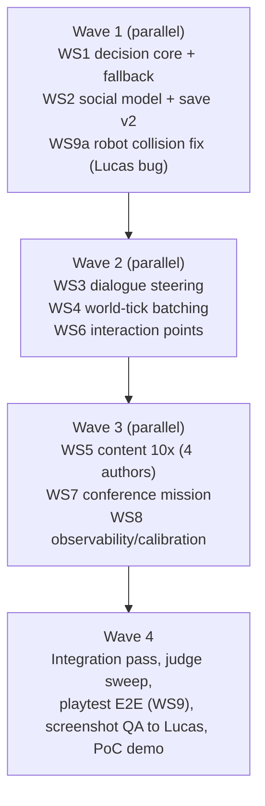

# Parallel Implementation Plan — Jev Steering PoC (branch `feat/jev-npc-decision-steering`)

**Date:** 2026-09-28 · **Inputs:** PRD v2 (C-75) + ADR-0009 (D-45…D-57) ·
**Execution vehicle:** ZCode multi-subagent runs — GLM implementer subagents, GLM
judge/reviewer subagents, QA helpers; orchestrator is this ZCode session (Lucas
instructed: "Use GLM models and subagents in ZCode"). **Nothing is pushed** (PR-4 +
C-74/C-75 local-only mandate); implementers never commit (PR-7) — the orchestrator
verifies and commits granularly, bumping `vYYYY.MM.DD-NN` per commit (PR-13).

---

## 1. Ground rules for every subagent

1. Briefs go to `.agent-briefs/<task>.md` (PR-6): self-contained, exact files,
   definition of done, "Do not commit / Do not push" at the bottom.
2. **File ownership is disjoint** (matrix below) — no two concurrent workers touch
   the same file. Shared interfaces (decision client, content types) land in Wave 1
   *before* dependents start.
3. TDD per PR-8/PR-11: failing test first for every pure function and data file;
   mutation check before the orchestrator commits.
4. Every worker returns: changed-file list, test output, and any deviations from
   the brief. The orchestrator runs `pnpm typecheck && pnpm test`, inspects the
   diff, and only then commits.
5. Judges (review subagents) get the brief + diff and return a pass/fail verdict
   with findings; PR-4 requires an independent QA verdict before a phase counts as
   done. Visual QA stays with Lucas via the PR-2 screenshot loop.

## 2. Wave plan

- **Wave 1** — plumbing only, no visible behavior change; `?jev=off` proves TAC-01.
- **Wave 2** — mechanics become steerable; content schema lands here so Wave 3
  authors have stable types.
- **Wave 3** — the big parallel expansion (content authors are the widest fan-out)
  plus the mission; observability runs continuously from Wave 1.
- **Wave 4** — integration: full-suite green, judge sweep across all workstreams,
  Playwright screenshot set + vision-model descriptions for Lucas, demo notes.

## 3. Workstreams

### WS1 — Decision core & invisible fallback (Wave 1) — 1 implementer
**Scope (ADR §3.1–3.8, D-45/46/47/56):** `DecisionClient` interface + OpenRouter
adapter (pinned `typesafe/jev-1.13`, timeout, 429/529 backoff) + fake client +
unconfigured client + key provider (proxy URL / BYO localStorage / none) +
`FallbackRegistry` wrapping the legacy pickers + first steered wrapper (morning
greetings, lowest risk) + `?jev=off|shadow` URL modes.
**Owns:** `src/jev/*` (new), `src/engine/morning-greeting wrapper touchpoint`,
`tests/unit/jev/*`.
**Done:** fallback-equivalence test green (TAC-01); shadow log rows visible; fake
client covers happy/timeout/malformed/unknown-id/partial/low-confidence.

### WS2 — Social model & save v2 (Wave 1) — 1 implementer
**Scope (D-50/51):** OCEAN profiles data (15 NPCs, authored values + archetype
seeds for the pair matrix), relationship matrix (105 pairs), mood valence/energy
with hourly decay, ±5 clamped delta reducer actions, Heider triad detection,
reciprocity summary helper, save schema v2 + v1 migration, worldDiary ring buffer.
**Owns:** `src/game/social.ts` (new), `src/game/state.ts`, `src/types.ts`,
`src/content/npc-profiles.ts` (new), `tests/unit/game/*`.
**Done:** round-trip + migration tests; clamp/decay/triad table tests; matrix
serialized size < 10 KB (TAC-05).

### WS3 — Dialogue steering (Wave 2) — 1 implementer
**Scope (D-45/52):** content schema v2 (`replyCandidates`, option metadata,
relationship bands), migration of the existing 48 trees into the schema, wrappers
for reply selection / option curation (≤4) / tree opening, per-pick relDelta
application, `NpcMemory` consumption from persisted state (WS2).
**Owns:** `src/content/dialogue-schema.ts` (new), `src/content/dialogues*.ts`
(schema migration only), `src/ui/dialogue.ts` (curation), `src/main.ts`
(openDialogueWith replacement), `tests/unit/content/*`.
**Done:** AC-01..05 pass with fake client; legacy replies byte-identical when
`?jev=off`.

### WS4 — World-tick batching (Wave 2) — 1 implementer
**Scope (D-48/49/56):** world projector + candidate builder (pure), answer
validator (per-subject), world-tick scheduler (6 s in-game cadence + period
transitions, single-flight, 700 ms budget, projection-hash cache), wrappers for
chatter exchange / greetings / destinations.
**Owns:** `src/engine/world-tick.ts` (new), `src/game/projection.ts` (new),
`src/engine/chatter.ts` + `src/content/npc-schedule.ts` (call-site replacement
only), `tests/unit/engine/*`.
**Done:** TAC-02/03/04; partial-batch test; with fake latency injected, fallback
path identical to legacy picks.

### WS5 — Content expansion 10× (Wave 3) — 4 author subagents + 1 judge
**Scope (AC-27/28, D-52):** per-NPC-group authoring into disjoint new files:
- **Author A:** bartek, klaudia, marek, zosia — trees, replyCandidate pools,
  personal arcs, jokes, miseries.
- **Author B:** pawel, kasia, tomek, ania — same + lunch-chatter pools.
- **Author C:** janusz, grazyna, maciek, przemek (+ burek lines) — same + office
  chatter exchanges referencing events.
- **Author D:** dawid, renata arcs + **argument pools** (per pair-class),
  **conference question pools** (hard questions per topic), audience murmur/applause
  lines, morning/evening pool extensions for all NPCs.
All drafts authored in the game's ironic tone; GLM drafts are reviewed by the
author judge for character consistency (PR-5 taste work), then shape-tested.
**Owns:** `src/content/dialogues/<npc>.ts` files (new per group), `pool files per
group`, `tests/unit/content/volume.test.ts` (shared, orchestrator-run).
**Done:** volume test ≥10× baseline (AC-27) with zero shape violations; tone judge
verdict pass.

### WS6 — Interaction points (Wave 2) — 1 implementer
**Scope (D-53, AC-20..22):** interaction-point registry (coffee machine, printer,
whiteboard minimum), prompts, fault state (printer jam) + repair interaction, sfx
ids wired into the existing audio manifest, NPC purposeful-use schedule overrides.
**Owns:** `src/engine/interaction-points.ts` (new), `src/ui/prompt.ts` touch,
`src/audio/manifest.ts` additions, `tests/unit/engine/interactions/*`.
**Done:** jsdom prompt tests; e2e: player fixes printer → Renata errand resumes.

### WS7 — Conference mission (Wave 3) — 1 implementer (+ Author D pools)
**Scope (D-54, AC-23..26):** mission definition + prep card, speech state machine
(talking points → plant question → options → audience score → reactions), audience
crowd (seated background NPCs reusing mesh factory; gesture/walk reactions),
mission results card, outcome effects via existing systems.
**Owns:** `src/game/mission.ts` (new), `src/ui/mission.ts` (new),
`src/engine/audience.ts` (new), `tests/unit/game/mission/*`, Playwright e2e.
**Done:** e2e start→results green; two different answer paths produce different
sequences (AC-26).

### WS8 — Observability & calibration (continuous, Wave 1→4) — 1 implementer
**Scope (D-55, AC-30):** decision ring buffer, debug panel (rows + deltas +
fallback flag), shadow-mode comparison logging, labeled evaluation datasets per
surface and the `evaluate.mjs` calibration run; TAC-09.
**Owns:** `src/ui/debug-panel.ts` (new), `src/jev/decision-log.ts`, `tests/eval/*`
(datasets), no game-loop file ownership.
**Done:** panel off by default; shadow dataset results recorded in Beads `sacs-xtma.13`.

### WS9a — Companion-robot collision & NPC avoidance fix (Wave 1) — 1 implementer
**Scope (Lucas bug, 2026-09-28, Beads `sacs-xtma.16`):** the WebMCP companion robot
walks through desks/props as if they were air, and NPCs neither avoid it nor react
to it. Give the robot the same collision treatment as every other walking actor:
include its body in the obstacle set for its own pathing (it must route around
furniture like NPCs do) and make it visible to NPC avoidance and path planning
(NPCs must not walk through it; a blocked NPC replays its existing escape/replan
behavior). No new engine subsystem — reuse the existing AABB collision and
path/avoidance passes.
**Owns:** `src/webmcp/*` robot movement files, `src/engine/collision.ts`,
`src/engine/npc-controller.ts` (avoidance pass only), `tests/unit/engine/*` for
these files.
**Done:** unit tests assert the robot's planned path never intersects a furniture
AABB; an NPC whose path crosses the robot replans; Playwright e2e where the robot
crosses the office without clipping a desk and a nearby NPC routes around it.

### WS9 — Playable E2E harness: the game is tested by PLAYING it (Wave 1 tooling, used every wave after)
**Scope (Lucas mandate, 2026-09-28: "you must find a way to test this game e2e by
playing it — the ONLY way to make this game high quality and playable"):** a
repeatable agent playtest loop, not just input-simulation smoke tests:
- **Driver:** Playwright (dev server 5173 per PR-13: kill zombie servers, read the
  version footer/console line and assert they match).
- **Two play styles:** (a) *human-like* — synthetic keyboard/mouse events (WASD,
  E, dialogue keys) through the real controls; (b) *agent-like* — drive the
  existing WebMCP tool registry from the page (the 24 registered tools are the
  game's own agent API; the playtester acts as the agent: get_state, walk, talk,
  pick options, advance time).
- **Artifacts:** every playtest writes screenshots + a structured
  playtest-log (decisions taken, anomalies, console errors) into `playtests/`
  (**gitignored** — Lucas, 2026-09-28: screens live in the repo but never
  committed).
- **Playtester role (GLM subagent + vision):** runs the game for N in-game
  minutes from the title screen, follows quests, talks to NPCs, uses the world,
  then writes a bug report (severity + reproduction + screenshot refs) judging
  *logic and real-world simulation feel*, not just "no crash". This is how bugs
  like WS9a's robot clipping get found before Lucas finds them.
**Owns:** `tests/e2e/play.spec.ts` + `tests/e2e/playtest-helpers.ts`, `playtests/`
(gitignored), `.gitignore` entry.
**Done:** `pnpm test:e2e` includes one full autonomous playthrough asserting: day
advances, a dialogue completes, a quest progresses, zero console errors; a
playtest run leaves the artifact set in `playtests/<timestamp>/`.

## 4. Judge / QA topology (per PR-4.6, PR-7)

| Role | When | Model (ZCode subagent) | Checks |
|---|---|---|---|
| Code judge (per workstream) | after each implementer finishes | GLM (independent context) | diff vs brief, scope creep, test quality incl. mutation-check evidence, PR-11 naming |
| Tone/content judge (WS5) | per author batch | GLM | character consistency, game's ironic tone, no placeholder slop, lore accuracy vs `npcs.ts` |
| QA helper | per wave | GLM + Playwright CLI | fresh dev server (kill zombies first, PR-13), version footer matches console, screenshots to `screenshots/` |
| Playtester (WS9) | per wave from Wave 2 | GLM agent + vision | *plays* the game via real controls + WebMCP tools for N in-game minutes; judges logic and real-world simulation feel; writes severity-ranked bug reports with screenshots into `playtests/` |
| Vision description | per PR-2 gate | vision-capable model per AGENTS.md PR-5 | describes screenshot; regression phrases block the phase |
| Orchestrator (this session) | always | session model | verify → granular commits → version bump → Beads notes; Lucas is the final visual QA |

Escalation rule: any judge FAIL ⇒ work returns to the implementer with findings;
two consecutive fails ⇒ orchestrator re-briefs or reverts (PR-4 revert rule).

## 5. Execution checklist (orchestrator, on Lucas's "go")

1. Create `.agent-briefs/` files for Wave 1 (WS1, WS2, WS9a) — self-contained, with the
   ADR/PRD excerpts each worker needs.
2. Launch Wave 1 implementers as parallel GLM subagents (background), collect
   results, verify (`pnpm typecheck && pnpm test`), commit granularly with version
   bumps, run code judges. WS9 (playable E2E harness) lands in Wave 1 so every
   later wave is playtested.
3. Repeat for Wave 2/3 with the same verify→commit→judge loop; QA helper takes the
   per-phase screenshots, the playtester runs a full playtest per wave (WS9
   artifacts + bug report); PR-2 gate with Lucas at each wave boundary.
4. Wave 4: full judge sweep + calibration readout + screenshot set + autonomous
   playtest report + PoC demo notes; update Beads `sacs-xtma.13/.14/.15/.16`;
   report push URL = none (local-only until Lucas approves).

## 6. Risk register (PoC)

| Risk | Mitigation |
|---|---|
| 10× content is the long pole | Wave 3 fan-out with disjoint files; volume test tracks progress; mission/question pools can ship after dialogue pools |
| Whole-tick request latency gates ambient life | 700 ms budget + per-subject fallback + D-48 measurement to split per domain |
| Content quality drift (AI-assisted drafting) | tone judge + shape tests + human review before commit; nothing auto-merges |
| Save migration breaks existing saves | v1 fixtures in tests; migration is Wave 1-blocked until green |
| Key leakage | key hygiene tests (string-absence), `.env*` gitignored (C-74), BYO stored in localStorage only |
